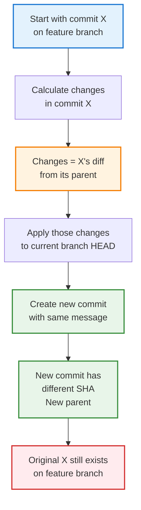
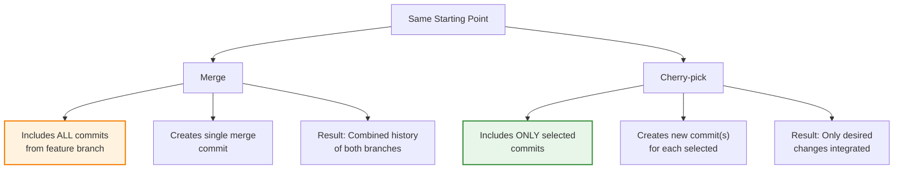
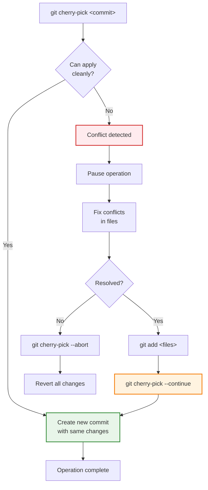
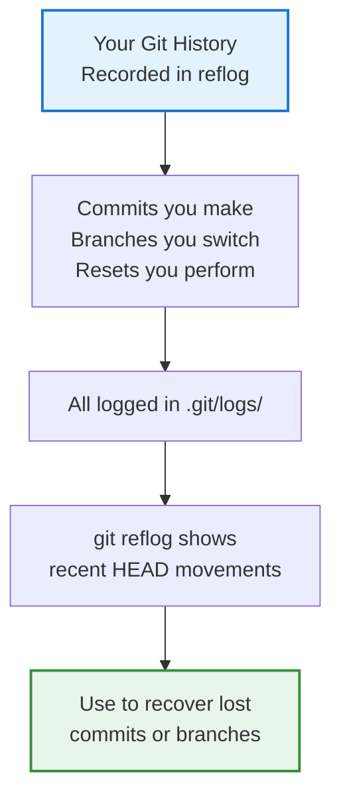
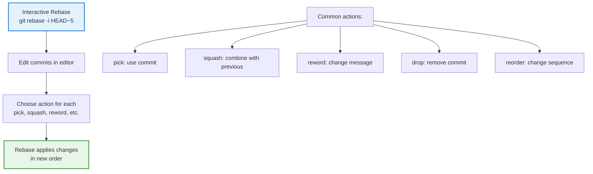
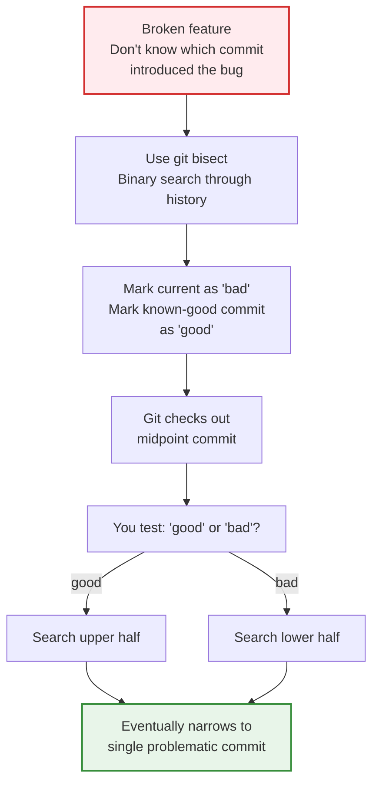
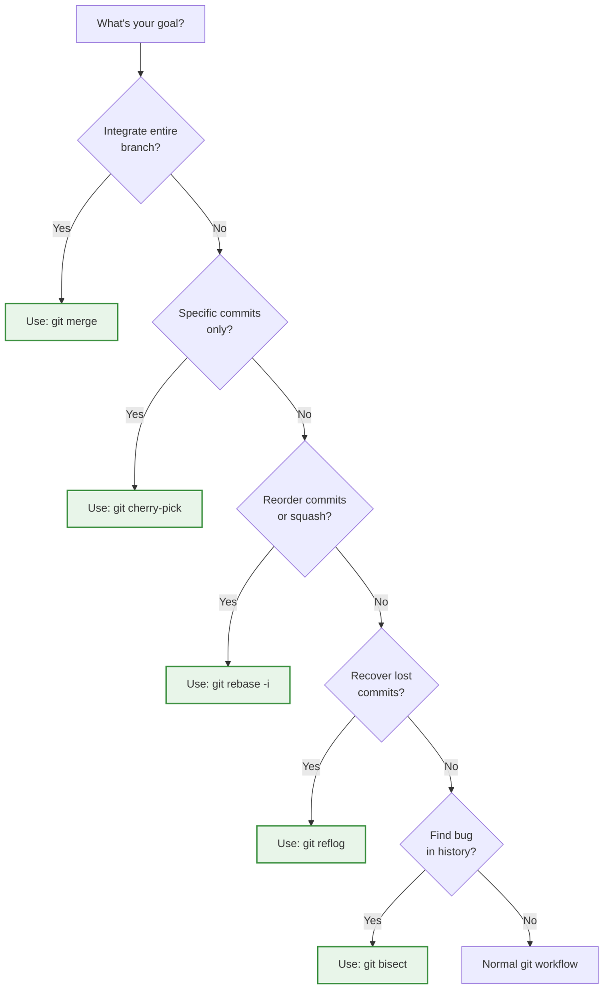

# Cherry-pick & Advanced Git Operations: Selective Commits & Power Tools Guide

## Overview

Cherry-pick allows you to apply specific commits to your current branch without merging entire branches. Combined with other advanced operations like reflog, bisect, and rebase --interactive, you gain surgical precision over your Git history. These tools solve complex scenarios where standard merge/rebase aren't quite right.

### Why Cherry-pick & Advanced Operations Matter

Cherry-pick bridges the gap between all-or-nothing merges and complete history rewrites. It lets you selectively integrate changes, backport fixes to older release branches, and recover lost commits. Advanced operations provide solutions for debugging, history cleanup, and complex integrations that normal workflows can't handle.

**Key Benefits:**
- **Selective integration**: Apply only the commits you need without full merge
- **Backporting**: Apply fixes to multiple release branches efficiently
- **Conflict resolution**: Handle single commits more easily than full merges
- **History recovery**: Find and restore lost commits with reflog
- **Debugging**: Identify problem commits with bisect
- **History cleanup**: Rewrite history with interactive rebase
- **Precision**: Exact control over what gets integrated

### Main Use Cases

1. **Backporting fixes**: Apply a bug fix to release/v1.0 that was fixed in main
2. **Selective features**: Include one feature from a branch without others
3. **Cross-team collaboration**: Pull specific commits from another team's work
4. **Release branch updates**: Move hotfixes from main to release branches
5. **Lost commit recovery**: Find and restore commits removed by accident
6. **Bug identification**: Binary search through history to find problem introduction
7. **History squashing**: Combine multiple commits into one before pushing
8. **Commit reorganization**: Reorder, edit, or combine commits
9. **Extracting work**: Move commits from wrong branch to correct one
10. **Experimental cleanup**: Test changes then clean up history before sharing

---

## 1. Cherry-pick: Core Concepts

### What Is Cherry-pick?

Cherry-pick applies a specific commit (or commits) from one branch to another. Unlike merge which integrates an entire branch history, cherry-pick takes just the commit's changes and creates a new commit on your current branch.

```
Original History:
main:     A - B - C - D - E
feature:      B - X - Y - Z

After cherry-pick commit X to main:
main:     A - B - C - D - E - X'
```

The `X'` is a new commit with the same changes as `X` but a different SHA and parent commit.

### How Cherry-pick Works Internally



### Cherry-pick vs Merge: Visual Comparison



### Exit Codes and Behavior

Cherry-pick operations return exit codes that indicate success/failure:
- **0**: Success - commit applied cleanly
- **1**: Conflict - changes conflict; requires resolution
- **2**: Error - operation failed (detached HEAD, invalid commit, etc.)

### Basic Cherry-pick Syntax

```bash
# Apply single commit
git cherry-pick <commit-sha>

# Apply multiple commits
git cherry-pick <commit1> <commit2> <commit3>

# Apply range of commits
git cherry-pick <commit1>..<commit2>  # Excludes commit1
git cherry-pick <commit1>^..<commit2> # Includes commit1

# Apply and edit commit message
git cherry-pick -e <commit-sha>

# Continue after resolving conflicts
git cherry-pick --continue

# Abort operation
git cherry-pick --abort
```

---

## 2. Cherry-pick Operations: Step-by-Step

### Basic Cherry-pick: Single Commit

```bash
# Scenario: Fix bug on main, need to backport to release/v1.0

# 1. See what commit fixed the bug on main
git log main --oneline | grep "Fix: null pointer"
# Output: a1b2c3d Fix: null pointer exception

# 2. Switch to release branch
git checkout release/v1.0

# 3. Cherry-pick the fix
git cherry-pick a1b2c3d

# Result: New commit on release/v1.0 with same changes
# But new SHA (because different parent)

# 4. Push the fix
git push origin release/v1.0
```

### Cherry-picking Multiple Commits

```bash
# Apply consecutive commits
git cherry-pick a1b2c3d..f9e8d7c

# This includes all commits from a1b2c3d through f9e8d7c
# Excludes a1b2c3d itself; includes f9e8d7c

# Include starting commit too
git cherry-pick a1b2c3d^..f9e8d7c

# Non-consecutive commits
git cherry-pick a1b2c3d e5d4c3b x9y8z7w

# Interactively choose commits
git cherry-pick a1b2c3d --no-commit  # Don't auto-commit
# Review changes
git status
git commit -m "Applied fix from a1b2c3d"
```

### Handling Conflicts During Cherry-pick

```bash
# Start cherry-pick
git cherry-pick a1b2c3d

# If conflicts occur:
# Edit conflicted files
nano src/auth.js

# After fixing conflicts
git add src/auth.js

# Continue cherry-pick
git cherry-pick --continue

# Or abort if it went wrong
git cherry-pick --abort  # Reverts everything
```

### Cherry-pick Workflow Diagram



### Cherry-pick Options

```bash
# --no-commit: Don't auto-commit, let you review
git cherry-pick a1b2c3d --no-commit
git diff --cached  # Review changes
git commit -m "Custom message"

# -e / --edit: Edit commit message
git cherry-pick a1b2c3d -e
# Editor opens to modify message

# -n / --no-commit: Combine multiple into one commit
git cherry-pick a1b2c3d b2c3d4e c3d4e5f --no-commit
git commit -m "Applied multiple fixes"

# -x: Add cherry-pick reference to message
git cherry-pick a1b2c3d -x
# Message becomes: "Original message\n(cherry picked from commit a1b2c3d)"

# -s / --signoff: Add Signed-off-by line
git cherry-pick a1b2c3d -s
# Adds: "Signed-off-by: Your Name <email>"
```

---

## 3. Advanced Cherry-pick Scenarios

### Scenario: Backporting Hotfix to Multiple Releases

```bash
# Bug found in main, need to fix in main and two old releases

# 1. Create and commit fix on main
git checkout main
# ... fix bug ...
git add .
git commit -m "Fix: Critical security issue in auth"
git log -1 --oneline  # Output: a1b2c3d Fix: Critical security issue

# 2. Backport to release/v2.0
git checkout release/v2.0
git cherry-pick a1b2c3d
# If conflicts occur, resolve them
git add .
git cherry-pick --continue
git push origin release/v2.0

# 3. Backport to release/v1.5
git checkout release/v1.5
git cherry-pick a1b2c3d
# Same conflict resolution if needed
git push origin release/v1.5

# Result: Fix applied to all three branches
# Each has own commit SHA but same changes
```

### Scenario: Selective Feature Integration

**Problem:** Feature branch has 5 commits, but only 2 of them are ready. Other 3 need more work.

```bash
# Feature branch: feature/payments
# Commits: A (setup), B (cards), C (paypal), D (validation), E (tests)
# Ready: A, B, D
# Not ready: C (buggy), E (incomplete)

# 1. See commits on feature branch
git log feature/payments --oneline
# a1b2c3d (Setup payment infrastructure)
# b2c3d4e (Add credit card processing)
# c3d4e5f (Add PayPal integration) ← SKIP
# d4e5f6g (Add payment validation)
# e5f6g7h (Add payment tests)

# 2. Cherry-pick only ready commits
git checkout main
git cherry-pick a1b2c3d       # Setup ✓
git cherry-pick b2c3d4e       # Cards ✓
# Skip c3d4e5f (PayPal - not ready)
git cherry-pick d4e5f6g       # Validation ✓
# Skip e5f6g7h (Tests - incomplete)

# 3. Push selective changes
git push origin main

# 4. Later when other commits are ready
git cherry-pick c3d4e5f  # Add PayPal when ready
git cherry-pick e5f6g7h  # Add tests when ready
```

### Scenario: Extracting Commits from Wrong Branch

**Problem:** Developer worked on feature/auth but realizes work belongs in feature/database.

```bash
# feature/auth has commits: A, B, X, Y, Z
# X, Y, Z are actually database work and shouldn't be here

# Solution: Cherry-pick the database commits to correct branch

# 1. Get commit SHAs for X, Y, Z
git log feature/auth --oneline
# x1y2z3a (Add database schema)
# y2z3a4b (Add connection pooling)
# z3a4b5c (Add query optimization)

# 2. Create feature/database
git checkout -b feature/database

# 3. Cherry-pick the database commits
git cherry-pick x1y2z3a y2z3a4b z3a4b5c

# 4. Return to feature/auth and remove those commits
git checkout feature/auth
git rebase -i HEAD~5  # Interactive rebase to remove X, Y, Z

# 5. Both branches now have correct commits
```

### Scenario: Partial Commit Application

```bash
# Sometimes you want changes from a commit, but not all of them

# Method: Cherry-pick without committing, then edit
git cherry-pick a1b2c3d --no-commit

# Review what changed
git diff --cached

# Unstage unwanted files
git reset HEAD unwanted-file.js

# Revert unwanted file
git checkout -- unwanted-file.js

# Commit only desired changes
git commit -m "Applied partial changes from a1b2c3d"
```

---

## 4. Advanced Git Operations: Beyond Cherry-pick

### Git Reflog: Recovering Lost Commits



**Reflog in Practice:**

```bash
# Accidentally reset commits
git reset --hard HEAD~3
# Oops! Those 3 commits are lost!

# See what you've done
git reflog
# Output:
# a1b2c3d HEAD@{0}: reset: moving to HEAD~3
# x9y8z7w HEAD@{1}: commit: Important feature
# y8z7w6v HEAD@{2}: commit: Another fix
# z7w6v5u HEAD@{3}: commit: Critical commit

# Recover by checking out that ref
git checkout x9y8z7w

# Or reset back to it
git reset --hard x9y8z7w

# Create branch from recovered state
git checkout -b recovered-branch x9y8z7w
```

### Interactive Rebase: Reorganizing Commits



**Interactive Rebase Example:**

```bash
# Last 5 commits are messy: A, B, B-fix, C, C-fix
# Want to squash: A, B+B-fix, C+C-fix

git rebase -i HEAD~5

# Editor opens with:
# pick a1b2c3d Commit A
# pick b2c3d4e Commit B
# pick c3d4e5f Fix for B
# pick d4e5f6g Commit C
# pick e5f6g7h Fix for C

# Change to:
# pick a1b2c3d Commit A
# pick b2c3d4e Commit B
# squash c3d4e5f Fix for B       ← combines with B
# pick d4e5f6g Commit C
# squash e5f6g7h Fix for C       ← combines with C

# Result: 3 commits instead of 5, with clean history
```

### Git Bisect: Binary Search for Bugs



**Bisect in Practice:**

```bash
# Feature broke somewhere between A and Z
# Know A works, Z doesn't

# 1. Start bisect
git bisect start

# 2. Mark current as bad
git bisect bad

# 3. Mark known-good commit
git bisect good a1b2c3d

# Git checks out midpoint
# Output: "Bisecting: 50 revisions left to test"

# 4. Test this commit
npm test

# 5. Tell bisect result
git bisect good    # If this commit is fine
# or
git bisect bad     # If this commit is broken

# 6. Git continues binary search
# Each step: checks midpoint, you test

# Eventually:
# Output: "x9y8z7w is the first bad commit"

# 7. See what changed in that commit
git show x9y8z7w

# 8. Exit bisect
git bisect reset
```

### Git Reflog Branches: Finding "Lost" Branches

```bash
# Deleted a branch accidentally
git branch -D important-feature
# Now it's gone!

# Find it in reflog
git reflog

# Shows: a1b2c3d HEAD@{0}: branch: Created from ...
#        x9y8z7w HEAD@{5}: branch: important-feature ...

# Recover it
git checkout -b important-feature x9y8z7w
# Branch restored!
```

---

## 5. Practical Advanced Operations

### Cherry-pick with Conflict Resolution

```bash
# Complex backport scenario
git cherry-pick feature/api..main  # Apply range

# Conflicts detected
# File: src/database.js

# 1. See conflict markers
cat src/database.js
# <<<<<<< HEAD
# version 1 code
# =======
# version 2 code
# >>>>>>> cherry-pick

# 2. Edit to resolve
nano src/database.js
# Keep both versions or choose one

# 3. Stage resolved file
git add src/database.js

# 4. Continue
git cherry-pick --continue

# If more conflicts: repeat
# If no more commits: done!
```

### Rebase with Cherry-pick

```bash
# Combine rebase workflow with cherry-pick
# Scenario: Rebase main on latest upstream, then cherry-pick specific work

# 1. Rebase on upstream
git rebase upstream/main

# 2. If your work is newer
git cherry-pick upstream/feature/new-api

# 3. Result: Your branch rebased on upstream/main plus new feature

# Useful in: fork-based workflows where you rebase your work on upstream
# then cherry-pick additions from other contributors
```

### Squashing Commits Before Push

```bash
# Before PR review, clean up commits
# History: A (typo fix), B (typo fix), C (actual feature), D (format), E (feature)

git rebase -i HEAD~5

# Change to:
# pick a1b2c3d A
# squash b2c3d4e B      ← Combine typos
# pick c3d4e5f C
# squash d4e5f6g D      ← Combine formats
# squash e5f6g7h E      ← Combine feature work

# Result: 3 clean commits representing the actual work
```

---

## 6. Real-World Scenario 1: Production Hotfix Workflow

**Situation:** Critical bug in production (release/v3.2). Fix is developed and tested on main. Need to apply to v3.2 and v3.1 release branches.

**Setup:**
```
main:          ... - A1 - A2 - FIX - A3 - ...
release/v3.2:  ... - B1 - B2 - B3
release/v3.1:  ... - C1 - C2 - C3
```

**Implementation:**

```bash
# 1. Find the fix commit on main
git log main --oneline | grep "Fix: Critical bug"
# Output: x1y2z3a Fix: Critical bug in payment processing

# 2. Apply to release/v3.2
git checkout release/v3.2
git cherry-pick x1y2z3a

# If conflicts (due to code differences in v3.2):
# Fix conflicts manually
git add .
git cherry-pick --continue

# Test the fix
npm test
git push origin release/v3.2

# 3. Apply to release/v3.1
git checkout release/v3.1
git cherry-pick x1y2z3a

# Resolve conflicts if needed
git add .
git cherry-pick --continue

# Test
npm test
git push origin release/v3.1

# 4. Create releases with fixes
git tag -a v3.2.1 -m "Hotfix: Critical payment bug"
git tag -a v3.1.2 -m "Hotfix: Critical payment bug"
git push origin --tags
```

**Result:**
- Fix applied to all three branches
- Production immediately gets fix
- Both older versions get backported fix
- Minimal code duplication (same fix, different SHAs)

---

## 7. Real-World Scenario 2: Extracting Commits to New Branch

**Situation:** Developer worked on main but should have created feature branch first. Now need to move 5 commits to feature branch without losing work.

**Initial State:**
```
main: ... - A1 - A2 - WORK1 - WORK2 - WORK3 - WORK4 - WORK5
      where A1, A2 are before the work started
```

**Solution:**

```bash
# 1. See the commits
git log main --oneline -10
# a1b2c3d (HEAD) Commit 5 of work
# b2c3d4e Commit 4 of work
# c3d4e5f Commit 3 of work
# d4e5f6g Commit 2 of work
# e5f6g7h Commit 1 of work
# f6g7h8i Previous commit before work

# 2. Create feature branch from base of work
git checkout -b feature/new-stuff f6g7h8i

# 3. Cherry-pick all work commits
git cherry-pick e5f6g7h..a1b2c3d

# 4. Reset main to before the work
git checkout main
git reset --hard f6g7h8i

# 5. Merge feature branch back to main for integration
git merge feature/new-stuff

# Result:
# main: ... - A1 - A2 - WORK1 - WORK2 - WORK3 - WORK4 - WORK5
# feature/new-stuff: same commits
# Work properly isolated but integrated
```

---

## 8. Real-World Scenario 3: Debugging with Bisect

**Situation:** Tests were passing 20 commits ago. Something introduced a bug. Need to find which commit broke things.

**Discovery Process:**

```bash
# 1. Know tests pass at specific tag
git tag -l | grep release
# release/v2.0, release/v1.9, etc.

# 2. Start bisect
git bisect start
git bisect bad HEAD        # Current is broken
git bisect good release/v2.0  # v2.0 works

# Git checks out midpoint
# Output: Bisecting: 10 revisions left to test
# Checkout: commit abc...

# 3. Run tests
npm test

# 4. Test results
# Output: FAIL - so this commit is bad

git bisect bad
# Output: Bisecting: 5 revisions left to test

# 5. Continue with next midpoint
npm test

# Tests pass! 
git bisect good
# Continues narrowing

# 6. Eventually: "xyz is the first bad commit"
git show xyz
# See exactly what changed

# 7. Exit bisect
git bisect reset

# 8. Share findings with team
# "Commit xyz introduced the bug, specifically the change to auth.js"
```

---

## 9. Advanced Git Internals

### How Cherry-pick Calculates Changes

```bash
# Cherry-pick uses 3-way merge internally:

# For commit: A -> B -> C (want to cherry-pick C)

# 1. Common ancestor (merge base): A
# 2. Source version (what changed): C
# 3. Target version (current HEAD)

# Calculate diff:
# Old (in A): version 1
# New (in C): version 2
# Apply "version 1 → version 2" to current HEAD

# If current HEAD also changed from version 1 → version 1.5
# Result: Merge conflict (can't auto-combine)
```

### Empty Commits and Cherry-pick

```bash
# Cherry-picking empty commits
git cherry-pick a1b2c3d

# If the commit is empty (no changes)
# Output: "The commit a1b2c3d is empty, nothing to do"

# Keep the empty commit anyway
git cherry-pick a1b2c3d --allow-empty

# Useful for: preserving commit messages/context even without code changes
```

---

## 10. Interview Prep & Practice Questions

### Question 1: Cherry-pick vs Merge

**Q:** When would you use cherry-pick instead of merge?

**A:** Use cherry-pick when:
- You only want specific commits from a branch, not all
- Backporting fixes to release branches
- Integrating work from another team's branch selectively
- Moving commits between branches
- You need precise control over which changes integrate

Use merge when:
- Integrating an entire branch's work
- Completing a feature branch
- Combining histories you want to preserve

**Example:** Bug fix on main needed in v1.0, v1.1, v2.0 release branches → cherry-pick the fix to each.

---

### Question 2: Cherry-pick Conflicts

**Q:** How do you handle conflicts when cherry-picking multiple commits?

**A:** 
```bash
git cherry-pick a1b2c3d b2c3d4e c3d4e5f

# First conflict encountered:
# Resolve it manually
git add resolved-file.js

# Continue to next commit
git cherry-pick --continue

# If next commit also conflicts:
# Resolve that one too
git add another-file.js
git cherry-pick --continue

# All conflicts resolved or no more commits:
# Operation completes automatically
```

**Key:** Cherry-pick pauses on each conflicting commit, allowing targeted resolution.

---

### Question 3: Recovering Lost Commits

**Q:** You accidentally deleted a branch with important commits. How do you recover it?

**A:** Use git reflog:
```bash
# See what happened
git reflog

# Find the commit that was on the deleted branch
git checkout -b recovered-branch <commit-sha>

# Or if you see the branch ref:
git checkout -b recovered-branch <branch-ref>
```

**Key:** Everything in Git is recoverable through reflog—shows all HEAD movements and branch operations.

---

### Question 4: Interactive Rebase

**Q:** How would you clean up 5 messy commits (typos, formatting, actual feature) into 2 clean ones?

**A:**
```bash
git rebase -i HEAD~5

# Editor shows all 5 commits
# Use 'squash' to combine:
# pick   a1b2c3d  Feature work
# squash b2c3d4e  Typo fix
# squash c3d4e5f  Format fix
# pick   d4e5f6g  More feature
# squash e5f6g7h  Test fix

# Result: 2 clean commits with combined work
```

**Use cases:** Cleaning up PR history before merging, preparing commits for review.

---

### Question 5: Bisect for Bug Investigation

**Q:** Tests pass 20 commits ago, fail now. How would you find the problematic commit?

**A:** Use git bisect—binary search through commits:
```bash
git bisect start
git bisect bad HEAD          # Current broken
git bisect good <good-commit>  # Known good

# Bisect checks out midpoint
# You test: git bisect good/bad

# Repeats until: "commit X is first bad"
```

**Advantage:** Logarithmic search. 20 commits requires ~5 tests instead of 20.

---

### Question 6: Squashing vs Rebasing

**Q:** What's the difference between squashing commits and rebasing?

**A:**
- **Squashing**: Combines multiple commits into one. Uses `git rebase -i` with `squash`.
- **Rebasing**: Replays commits on new base. Changes parent/ancestry.

**Squashing example:**
```
Before: A - B - C - D (4 commits)
After:  A - X (1 commit with all changes from B, C, D)
```

**Rebasing example:**
```
Before: feature based on origin/main (which moved)
After:  feature commits replayed on new origin/main
```

---

### Question 7: Cherry-pick in Fork Workflow

**Q:** You're working on a fork. How would you selectively integrate commits from upstream?

**A:**
```bash
# Add upstream
git remote add upstream https://...
git fetch upstream

# See upstream commits
git log upstream/main --oneline

# Cherry-pick specific ones
git cherry-pick <upstream-commit-sha>

# Or range
git cherry-pick upstream/main~5..upstream/main

# This lets you integrate specific upstream work without full merge
```

---

### Question 8: Handling Cherry-pick with Files

**Q:** You cherry-picked a commit but only want some of the file changes. How do you handle that?

**A:**
```bash
# Cherry-pick without committing
git cherry-pick <commit> --no-commit

# Review changes
git diff --cached

# Unstage unwanted files
git reset HEAD unwanted-file.js

# Restore them to original state
git checkout -- unwanted-file.js

# Commit only the changes you want
git commit -m "Partial cherry-pick from <commit>"
```

---

## 11. Troubleshooting Common Issues

### Issue: Cherry-pick Fails with "dirty working directory"

**Problem:** `error: Your local changes to X would be overwritten by merge`

**Solution:**
```bash
# Stash your work
git stash

# Now cherry-pick
git cherry-pick <commit>

# Restore your work
git stash pop

# Or commit your changes first
git add .
git commit -m "WIP: current work"
git cherry-pick <commit>
```

---

### Issue: Cannot Cherry-pick Merge Commits

**Problem:** Trying to cherry-pick a merge commit doesn't work right.

**Solution:**
```bash
# Merge commits have two parents
# Specify which parent to use
git cherry-pick -m 1 <merge-commit>
# -m 1: use first parent line

git cherry-pick -m 2 <merge-commit>
# -m 2: use second parent line
```

---

### Issue: Bisect Gets Stuck

**Problem:** Can't determine good/bad on a specific commit.

**Solution:**
```bash
# Mark as untestable and skip
git bisect skip

# Bisect continues with nearby commits
# Might find the bug without testing every commit
```

---

### Issue: Lost Commits Not in Reflog

**Problem:** Reflog shows nothing useful; commits seem permanently lost.

**Solution:**
```bash
# Reflog only keeps ~90 days by default
# Use fsck to find all unreachable commits
git fsck --lost-found

# Shows all commits not reachable from branches
git log HEAD@{reflog_last_item}

# Or search for commits by message
git log --all --grep="keyword" --oneline

# Recover if found
git checkout -b recovered <commit-sha>
```

---

## 12. Best Practices & Anti-Patterns

### ✅ Cherry-pick Best Practices

```mermaid
graph TB
    A["Cherry-pick Best Practices"] --> B["✅ Use for targeted backports"]
    A --> C["✅ Add -x flag for traceability"]
    A --> D["✅ Test after cherry-picking"]
    A --> E["✅ Document reason in messages"]
    A --> F["✅ Review conflicts carefully"]
    A --> G["✅ Prefer rebase for local branches"]
    
    H["❌ Anti-Patterns"] --> H1["Don't cherry-pick entire branches"]
    H --> H2["Don't use for shared branches"]
    H --> H3["Don't ignore conflicts"]
    H --> H4["Don't cherry-pick without testing"]
    H --> H5["Don't mix cherry-pick and merge"]
    
    style B fill:#E8F5E9,stroke:#388E3C,stroke-width:2px
    style C fill:#E8F5E9,stroke:#388E3C,stroke-width:2px
    style D fill:#E8F5E9,stroke:#388E3C,stroke-width:2px
    style E fill:#E8F5E9,stroke:#388E3C,stroke-width:2px
    style F fill:#E8F5E9,stroke:#388E3C,stroke-width:2px
    style G fill:#E8F5E9,stroke:#388E3C,stroke-width:2px
    style H1 fill:#FFEBEE,stroke:#D32F2F,stroke-width:2px
    style H2 fill:#FFEBEE,stroke:#D32F2F,stroke-width:2px
    style H3 fill:#FFEBEE,stroke:#D32F2F,stroke-width:2px
    style H4 fill:#FFEBEE,stroke:#D32F2F,stroke-width:2px
    style H5 fill:#FFEBEE,stroke:#D32F2F,stroke-width:2px
```



### Recommended Workflow

```bash
# Safe cherry-pick workflow:

# 1. Create feature branch (don't work directly on target)
git checkout -b backport/v1.0 release/v1.0

# 2. Cherry-pick the commit
git cherry-pick -x <commit>  # -x adds reference

# 3. Test thoroughly
npm test

# 4. Review changes
git log -p -1

# 5. Only then push
git push origin backport/v1.0

# 6. Create PR for review before merge
```

### When NOT to Cherry-pick

- ❌ Cherry-picking entire feature branches (use merge instead)
- ❌ Cherry-picking frequently between shared branches (causes divergence)
- ❌ Cherry-picking without testing
- ❌ Cherry-picking merge commits (use `-m` flag or avoid)
- ❌ Cherry-picking large refactorings (causes more conflicts)

---

## 13. Quick Reference & Command Cheatsheet

### Cherry-pick Commands

```bash
# Basic
git cherry-pick <commit>
git cherry-pick <commit1> <commit2> <commit3>
git cherry-pick <commit1>..<commit2>

# With options
git cherry-pick <commit> --no-commit
git cherry-pick <commit> -e  # Edit message
git cherry-pick <commit> -x  # Add cherry-pick reference
git cherry-pick <commit> -s  # Add sign-off

# Handling conflicts
git cherry-pick --continue
git cherry-pick --abort
git cherry-pick --quit     # Stop but keep changes

# Merge commits
git cherry-pick -m 1 <merge-commit>
```

### Advanced Operations

```bash
# Reflog
git reflog
git reflog show
git checkout <reflog-ref>
git reset --hard <reflog-ref>

# Interactive rebase
git rebase -i HEAD~5
git rebase -i <commit>^
git rebase --continue
git rebase --abort

# Bisect
git bisect start
git bisect bad <commit>
git bisect good <commit>
git bisect reset
git bisect skip

# History viewing
git log --oneline --graph --all
git log -p <commit>
git show <commit>
```

### Decision Tree



### Common Scenarios Quick Guide

| Scenario | Command |
|----------|---------|
| Backport fix to release | `git cherry-pick -x <commit>` |
| Clean up messy commits | `git rebase -i HEAD~5` |
| Recover deleted branch | `git reflog` then `git checkout -b` |
| Find breaking commit | `git bisect start` ... `git bisect good/bad` |
| Move commits to new branch | Create branch, cherry-pick, reset original |
| Apply some changes from commit | `git cherry-pick --no-commit` then edit |
| Squash into previous | `git rebase -i` use `squash` |

---

## 14. Advanced Operation Combinations

### Cherry-pick + Interactive Rebase

```bash
# Cherry-pick multiple commits then clean them up

# 1. Cherry-pick range
git cherry-pick a1b2c3d..f9e8d7c

# If multiple conflicts, continue
git cherry-pick --continue  # Multiple times

# 2. Rebase interactively to squash
git rebase -i origin/main

# 3. Squash messy picks into logical commits
# Editor:
# pick a... (cherry-picked 1)
# squash b... (cherry-picked 2)
# squash c... (cherry-picked 3)

# Result: Clean history with squashed changes
```

### Bisect + Cherry-pick Recovery

```bash
# Find bad commit with bisect, then extract

# 1. Bisect to find problem
git bisect start
git bisect bad HEAD
git bisect good <good-commit>
# ... binary search ...
# "xyz is first bad"

# 2. See what changed in bad commit
git show xyz

# 3. Create hotfix branch
git checkout -b hotfix/<issue>

# 4. Cherry-pick the bad commit (or revert it)
git cherry-pick --no-commit xyz
# Edit to remove the bad change
git commit -m "Fix for issue introduced in xyz"
```

---

## 15. Summary & Key Takeaways

### Core Skills

1. **Cherry-pick**: Apply specific commits selectively
2. **Interactive Rebase**: Reorganize and clean commits
3. **Reflog**: Recover lost commits and branches
4. **Bisect**: Find problematic commits efficiently
5. **Conflict Resolution**: Handle merges during any operation

### Remember

- **Cherry-pick** creates new commits (same changes, different SHA)
- **Rebase** replays commits on new base (rewrites history)
- **Reflog** is your safety net (everything is recoverable)
- **Bisect** uses binary search (efficient debugging)
- **Interactive Rebase** gives precise history control

### Workflow Pattern

```
Cherry-pick specific commits → Test → Clean up with rebase → Push
```

---

*Last Updated: January 2026 | Comprehensive Cherry-pick & Advanced Git Operations Guide*
