# Code Review Best Practices: Quality & Collaboration Guide

## Overview

Code review is the practice of having peers examine code before it's merged into the main codebase. Effective code reviews catch bugs, improve design, share knowledge, and maintain standards. Understanding how to conduct productive reviews—both as a reviewer and author—is essential for high-quality software development. Code review culture transforms teams from individual contributors to collaborative problem-solvers.

### Why It Matters
- **Bug prevention** - Catch issues before production
- **Knowledge sharing** - Learn from peer code
- **Design improvement** - Catch architectural problems
- **Standard enforcement** - Maintain codebase consistency
- **Team growth** - Mentoring through feedback
- **Risk reduction** - Multiple eyes catch mistakes
- **Document decisions** - Comments explain "why"
- **Accountability** - Distributed ownership

### Main Use Cases
- Reviewing pull requests before merge
- Providing constructive feedback
- Improving code quality standards
- Catching bugs and security issues
- Onboarding new team members
- Mentoring junior developers
- Enforcing architectural decisions
- Building collaborative culture

---

## 1. Core Concepts & Fundamentals

### Code Review Purpose & Goals

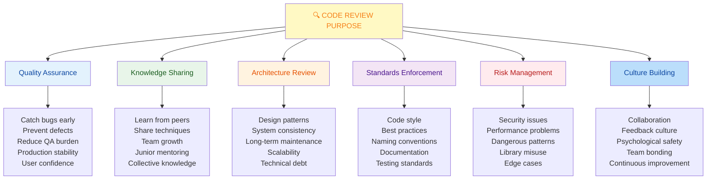

### Types of Code Reviews

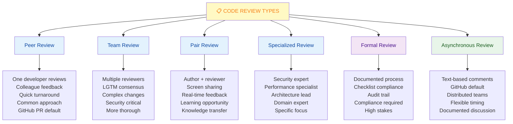

### Code Review Workflow

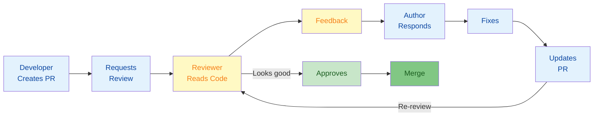

### What to Review

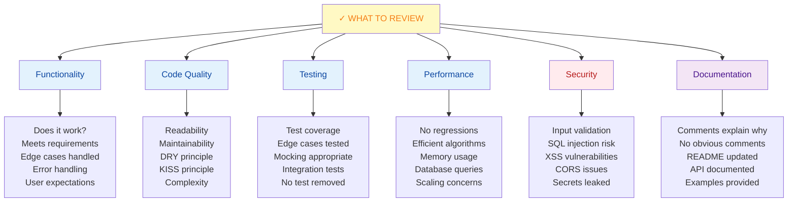

---

## 2. Being an Effective Reviewer

### Reviewer Responsibilities

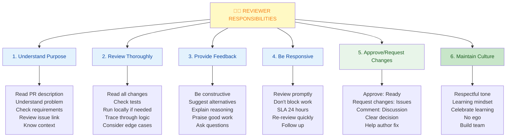

### Comment Types & Examples

```yaml
COMMENT TYPES:

1. Blocking Issues (Must fix)
   Pattern: "This is a bug. [reason]"
   Example: "This will cause null pointer exception
             when user field is empty. Must handle."
   Action: Request changes
   Fix: Clear, testable requirement

2. Suggestions (Nice to improve)
   Pattern: "Consider [alternative]. Reason: [why]"
   Example: "Consider using Set instead of Array
             for O(1) lookup. Performance: O(n) → O(1)"
   Action: Comment or request (depends on impact)
   Fix: Clear improvement path

3. Questions (Understand intent)
   Pattern: "Why [decision]? Could [alternative]?"
   Example: "Why query database twice? Could use
             JOIN to fetch both in one query?"
   Action: Comment (usually)
   Fix: Clarification, may find issue

4. Praise (Recognize good work)
   Pattern: "Great [specific thing]!"
   Example: "Great refactoring! Much more readable."
   Action: Comment
   Fix: None, encouragement

5. Nitpick (Style/minor)
   Pattern: "Nit: [minor improvement]"
   Example: "Nit: Variable naming inconsistent
             (camelCase vs snake_case)"
   Action: Comment or ignore if not critical
   Fix: Minor, can batch with fixes

6. Context (Explain reasoning)
   Pattern: "This is important because [reason]"
   Example: "This is important because we avoid
             logging in this module (performance)."
   Action: Comment
   Fix: Educational, no fix needed
```

### How to Write Good Comments

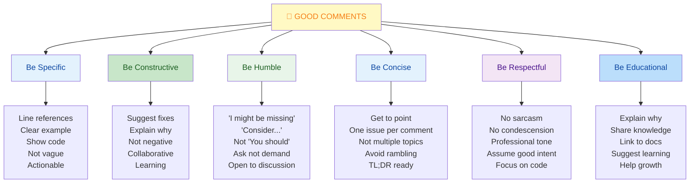

### Red Flags as Reviewer

```yaml
Security Red Flags:
  ✗ User input not validated
  ✗ SQL concatenation (injection risk)
  ✗ Hardcoded credentials
  ✗ Debug logs with sensitive data
  ✗ CORS origins too permissive
  ✗ Encryption without validation
  ✗ Missing rate limiting on API

Performance Red Flags:
  ✗ N+1 query problem
  ✗ Unbounded loops
  ✗ Large data without pagination
  ✗ Synchronous calls in async
  ✗ Repeated database queries
  ✗ Large memory allocations
  ✗ Inefficient algorithms

Design Red Flags:
  ✗ Very long methods (>100 lines)
  ✗ Many parameters (>5)
  ✗ Deep nesting (>3 levels)
  ✗ Duplicated code
  ✗ Comments instead of refactoring
  ✗ Magic numbers without constants
  ✗ Circular dependencies

Testing Red Flags:
  ✗ No tests for new code
  ✗ Tests that always pass
  ✗ Mocks everything
  ✗ No edge case coverage
  ✗ Test names unclear
  ✗ Brittle tests (fragile)
  ✗ Tests removed without reason

Behavioral Red Flags:
  ✗ Major changes in 1 commit
  ✗ Unrelated changes mixed in
  ✗ No description/context
  ✗ Merge conflicts not resolved
  ✗ CI/tests failing
  ✗ Reviewers waiting >3 days
  ✗ Arguments in comments
```

---

## 3. Being a Good Code Author

### Preparing Code for Review

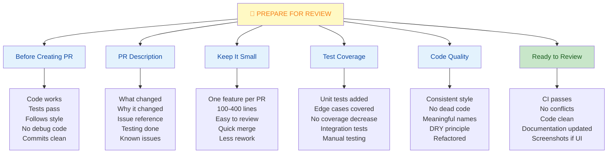

### Writing Great PR Descriptions

```yaml
PR Description Template:

## What
[One sentence: what changed]

Example: "Add dark mode toggle to settings"

## Why
[Why is this change needed?]

Example: "Users requested dark mode for eye comfort.
          Improves accessibility at night."

## How
[How did you solve it?]

Example: "Added theme preference to user model.
          CSS variables for light/dark themes.
          System preference detection."

## Testing
[How was this tested?]

Example: "- Manual testing on Chrome, Firefox, Safari
          - Dark mode toggle tested
          - System preference detection tested
          - Unit tests added (95% coverage)
          - No visual regressions"

## Related
[Issue references, links, etc]

Example: "Closes #234
          Related to #123
          See design: figma-link"

## Checklist
- [ ] Tests pass
- [ ] Coverage maintained
- [ ] Documentation updated
- [ ] No breaking changes
- [ ] Screenshots (if UI change)
- [ ] Backwards compatible

REAL EXAMPLE:
─────────────────────────────

What: Implement user authentication with JWT

Why: Users requested secure login. API currently
     exposed without authentication. Security issue.

How: 
- Added JWT token generation on login
- Login endpoint validates credentials
- Protected endpoints check JWT validity
- Refresh token mechanism for long sessions
- Database migration for token storage

Testing:
- Login endpoint tested (valid/invalid credentials)
- Protected endpoints test JWT validation
- Token expiration tested
- Refresh token tested
- Integration tests with real DB
- Manual testing with frontend
- Coverage: 92%

Related: Closes #456, Security audit #234

Breaking Changes: None
Migration: Users log in automatically (session preserved)
```

### Responding to Feedback

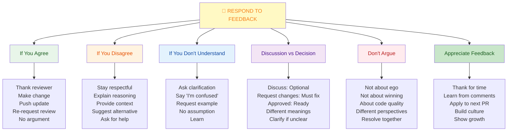

---

## 4. Code Review Culture

### Building a Strong Review Culture

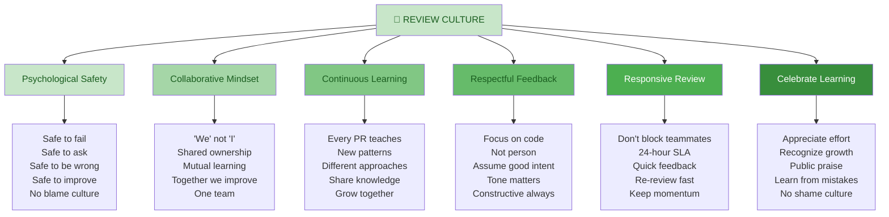

### Common Pitfalls

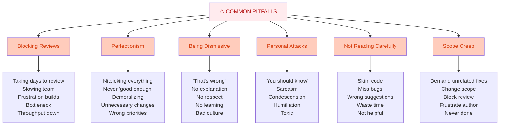

---

## 5. Quick Cheatsheet

### Reviewer Checklist

```yaml
BEFORE REVIEWING:
  ☐ Understand PR description
  ☐ Check issue reference
  ☐ Know requirements
  ☐ Clear on scope
  ☐ CI status green

DURING REVIEW:
  ☐ Read all code changes
  ☐ Check test coverage
  ☐ Look for bugs
  ☐ Review edge cases
  ☐ Check security
  ☐ Verify performance
  ☐ Check design
  ☐ Run locally if needed

COMMENTING:
  ☐ Be specific (line refs)
  ☐ Be constructive
  ☐ Be humble
  ☐ Explain reasoning
  ☐ Suggest alternatives
  ☐ Ask questions
  ☐ Praise good code

AFTER REVIEW:
  ☐ Approve or request changes
  ☐ Clear decision stated
  ☐ Be responsive to replies
  ☐ Re-review updates
  ☐ Approve when fixed

TONE CHECKLIST:
  ☐ Respectful language
  ☐ No sarcasm
  ☐ Assume good intent
  ☐ Professional tone
  ☐ Focused on code
  ☐ Collaborative

Common Review Comments:
  "Can you explain why you chose [approach]?"
  "This might have [issue]. Consider [fix]."
  "Great refactoring! Much clearer now."
  "This looks good, but one concern: [issue]."
  "Nit: Inconsistent naming (camelCase vs snake_case)"
  "Nice! I learned something new from this approach."
```

### Author Checklist

```yaml
BEFORE CREATING PR:
  ☐ Code works locally
  ☐ All tests pass
  ☐ CI passes
  ☐ Code follows style guide
  ☐ No debug code/console logs
  ☐ No dead code
  ☐ Meaningful commits
  ☐ Focused changes

PR DESCRIPTION:
  ☐ Clear title
  ☐ What changed
  ☐ Why it changed
  ☐ How you tested it
  ☐ Issue reference
  ☐ Screenshots (if UI)
  ☐ Known issues/limitations
  ☐ Breaking changes noted

CODE QUALITY:
  ☐ No conflicts
  ☐ Tests for new code
  ☐ Coverage maintained
  ☐ Documentation updated
  ☐ No unnecessary changes
  ☐ DRY principle followed
  ☐ Functions under 50 lines
  ☐ Proper error handling

SIZE:
  ☐ PR < 400 lines
  ☐ Focused scope
  ☐ One feature per PR
  ☐ Easy to review
  ☐ Not mega-PR

RESPONDING TO FEEDBACK:
  ☐ Thank reviewer
  ☐ Address all comments
  ☐ Push new commits
  ☐ Re-request review
  ☐ Respond to discussions
  ☐ Stay professional
  ☐ Ask for clarification
  ☐ Don't get defensive

Best Practices:
  "Thank you for catching that!"
  "Great suggestion, let me implement it."
  "I see your point. Let me fix that."
  "I'm not sure I understand - can you clarify?"
  "I'll implement your suggestion in the next commit."
```

---

## 6. Real-World Scenarios

### Scenario 1: Reviewing Complex Algorithm Change

**Situation:** Senior developer submits optimization PR with complex algorithm

**Reviewer Approach:**

```
STEP 1: UNDERSTAND PURPOSE
PR Title: "Optimize: Binary search O(n) → O(log n)"
PR Description: "Replaced linear search with binary 
                search in sort utility. Improves performance 
                by 40% for large datasets."

STEP 2: CHECK TESTS
- Original tests still pass ✓
- New tests for edge cases ✓
- Large dataset test added ✓
- Performance benchmark added ✓

STEP 3: REVIEW CODE CAREFULLY
Read algorithm line by line:
- Understand binary search logic
- Check boundary conditions
- Verify initialization
- Check loop termination
- Verify return values

STEP 4: IDENTIFY ISSUES
Found: Boundary case when array empty
Found: Off-by-one error in middle calculation
Found: No validation of input array

STEP 5: WRITE COMMENTS
Comment 1 (Blocking):
"There's an off-by-one error on line 45:
  mid = (left + right) / 2
Should be:
  mid = left + (right - left) / 2
This prevents integer overflow in large arrays.
Impacts: Arrays with >2B elements"

Comment 2 (Blocking):
"What if array is empty? Line 20 assumes size > 0.
Suggest: Add guard clause at start of function."

Comment 3 (Suggestion):
"Consider adding comment explaining the binary search 
logic. Future maintainers might not understand the math.
Example: 'We halve search space each iteration'"

Comment 4 (Praise):
"Great optimization! This brings search from O(n) to 
O(log n) which is significant for large datasets."

STEP 6: REQUEST CHANGES
Status: "Requesting Changes"
Message: "Two blocking issues found:
         1. Off-by-one error in mid calculation
         2. Missing empty array validation
         Good algorithm, just needs these fixes."

STEP 7: WAIT FOR FIXES
Author makes changes:
- Fixes off-by-one
- Adds empty array check
- Adds comment explaining logic
- Pushes new commit

STEP 8: RE-REVIEW
Looks good now!
- All issues fixed
- Tests updated
- Code comments clear

STEP 9: APPROVE
Status: "Approved"
Message: "Looks great! Thanks for the optimization 
         and for being responsive to feedback."

RESULT:
✓ Code quality improved
✓ Bugs caught before production
✓ Knowledge shared
✓ Author learned
✓ Team improved
```

---

### Scenario 2: Reviewing Junior Developer's First PR

**Situation:** New team member submits first PR, some issues

**Reviewer Approach (Encouraging):**

```
STEP 1: UNDERSTAND CONTEXT
First PR from junior developer
Simple feature: Add user name validation
Goal: Help them succeed, not gatekeep

STEP 2: PRAISE FIRST
Comment: "Thanks for the PR! I appreciate you tackling 
         this feature. Let me give some feedback to help."

STEP 3: IDENTIFY LEARNING OPPORTUNITIES
Issue 1: Name validation incomplete
  - Doesn't check min length
  - Doesn't check max length
  - Allows special characters

Issue 2: No edge case tests
  - Empty string test missing
  - Special characters test missing
  - Long string test missing

Issue 3: Error message not user-friendly
  - Technical message instead of clear feedback

STEP 4: EXPLAIN, DON'T JUST COMPLAIN
Comment 1:
"Good start on name validation! One thing to consider:
we should also validate length:
  - Min 2 characters (people often have short names)
  - Max 100 characters (database limit)
Could look like:
  function validateName(name) {
    if (!name || name.length < 2) return false;
    if (name.length > 100) return false;
    return true;
  }
Good practice: Validate all input dimensions 
(length, format, content)"

Comment 2:
"Nice test for valid names! To make it more robust, 
consider edge cases:
- Empty string: ''
- Too long: 'A'.repeat(200)
- Special chars: 'John@#$'
This helps catch bugs later. Here's an example:
  test('rejects empty name', () => { ... })"

Comment 3:
"Error message tip: Instead of 'Invalid input', 
tell user HOW to fix it:
  'Name must be 2-100 characters'
Users understand what to do next. Much better UX."

STEP 5: LEARNING MOMENT
Comment 4:
"Great PR overall! A tip for next time:
Test edge cases when writing tests. Common ones:
- Empty values
- Min/max boundaries
- Invalid types
This prevents bugs and shows you think deeply about code.
Want me to send a link about test design?"

STEP 6: PROVIDE CLEAR ACTION ITEMS
Message: "A few small improvements to make:
         1. Add min/max length validation
         2. Add edge case tests (see examples above)
         3. Improve error message clarity
         These are common patterns in our codebase.
         Ask if any questions!"

STEP 7: QUICK TURNAROUND
Review again when fixed - show you care
Celebrate their improvements

STEP 8: APPROVE
"Perfect! This is how we want validations done.
Nice work on the fixes and testing. Approved!"

STEP 9: MENTOR
After merge:
"Great first PR! Keep this approach for validation—
it's solid. Next time, let me know if you want pairing 
on complex features. Happy to help!"

RESULT:
✓ Junior dev succeeds
✓ Code quality good
✓ Team member engaged
✓ Culture: Supportive
✓ They'll contribute more
✓ Knowledge shared
```

---

### Scenario 3: Handling Disagreement

**Situation:** Reviewer and author disagree on approach

**Handling It Well:**

```
AUTHOR: Implements feature using approach A
REVIEWER: Thinks approach B is better

REVIEWER COMMENT (Poor):
"You should use approach B. That's the right way."
❌ Dismissive, not collaborative

REVIEWER COMMENT (Good):
"I might be missing context here. Why did you choose 
approach A over approach B?

Both could work, but approach B might be better because:
- Easier to test
- Consistent with codebase pattern
- Better performance (though minor)

But I might be missing something. What's the reasoning 
for approach A? Happy to learn."

✓ Asks instead of tells
✓ Explains thinking
✓ Open to other views
✓ Shows respect

AUTHOR RESPONSE (Poor):
"I chose A because it's simpler. That's my way."
❌ Defensive, ends discussion

AUTHOR RESPONSE (Good):
"Good point about approach B. I chose A because:
- I was more familiar with it
- Seemed simpler initially
- But you're right about testing

Would approach B look like this? [code sample]
I'm open to switching if that's the team pattern.
What would you recommend?"

✓ Acknowledges feedback
✓ Explains thinking
✓ Shows willingness to change
✓ Collaborates

RESOLUTION:
Reviewer: "Both work, but yes, let's use B. It's 
          consistent. This discussion was helpful—
          thanks for explaining your thinking."

Author: "Thanks for pushing me to think deeper. 
        I'll remember B for next time."

RESULT:
✓ Agreement reached
✓ Code improves
✓ Both learned
✓ Relationship strong
✓ Culture built

KEY: Not about winning, about being right together
```

---

## 7. Best Practices & Anti-Patterns

### Code Review Best Practices

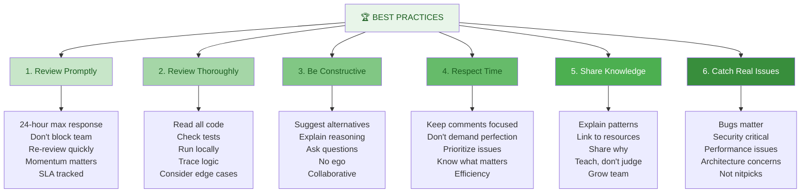

### Anti-Patterns to Avoid

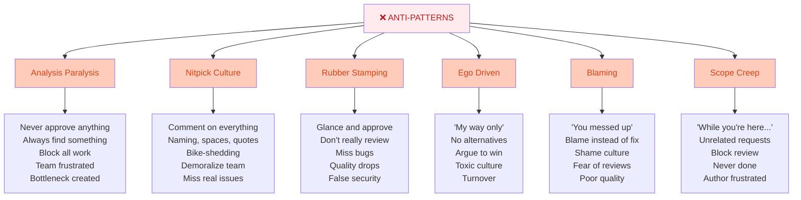

---

## 8. Summary & Key Takeaways

### Essential Principles

✅ **Reviews catch bugs early** - Prevent production issues  
✅ **Psychological safety required** - Safe to be vulnerable  
✅ **Constructive feedback** - Suggest, don't demand  
✅ **Respectful tone** - Professional always  
✅ **Responsive reviews** - Don't block teammates  
✅ **Share knowledge** - Team grows together  
✅ **Small PRs better** - Easier to review, faster merge  
✅ **Focus on substance** - Catch real issues first  

### Code Review Dos & Don'ts

| Do | Don't |
|----|-------|
| **Ask questions** | Demand answers |
| **Suggest alternatives** | Insist on one way |
| **Be specific** | Be vague |
| **Be timely** | Sit on reviews |
| **Praise good work** | Only criticize |
| **Assume good intent** | Assume incompetence |
| **Focus on code** | Attack person |
| **Explain why** | Just say no |
| **Small, focused** | Mega reviews |
| **Response SLA** | Disappear for weeks |

---

## 9. Interview & Exam Prep

### Common Interview Questions

**Q1: What makes a good code review?**
> A good code review is timely (within 24 hours), thorough (checks functionality, tests, design, security), and constructive (suggests alternatives, explains reasoning). It balances catching real issues with respecting the author's time. It maintains respectful tone and focuses on code, not the person. Good reviews catch bugs, share knowledge, and build team culture.

**Q2: How do you handle disagreement in a code review?**
> Stay respectful and assume good intent. Explain your reasoning clearly with specific examples. Ask questions to understand the author's perspective. Both approaches might be valid—discuss tradeoffs. If significant disagreement, escalate to lead/architect. Focus on the best solution for the codebase, not winning the argument.

**Q3: What should you focus on when reviewing code?**
> Prioritize: bugs and logic errors (blocking), security vulnerabilities (critical), performance issues (important), design and architecture (good to improve), style and nitpicks (lowest priority). Distinguish between must-fix and nice-to-have. Comment on real issues that affect production quality, not formatting preferences.

**Q4: How do you review code from a junior developer?**
> Be encouraging and educational. Start by praising what they did well. Explain issues clearly with examples of better approaches. Link to resources so they can learn. Ask questions to help them discover issues themselves. Provide specific guidance, not vague criticism. Celebrate their growth and progress.

**Q5: What's the ideal PR size for review?**
> 100-400 lines of code is ideal. Smaller PRs (50-100 lines) review very quickly. Larger PRs (500+ lines) are hard to review thoroughly and likely review quality suffers. Size signals scope: small focused changes are easier to review, understand, test, and revert if needed. Prefer many small PRs to few mega-PRs.

**Q6: How do you balance quality with throughput?**
> Don't approve code you're uncomfortable with to speed things up—quality matters. But also don't block perfect PRs waiting for perfection. Focus on real issues: bugs, security, performance, design. Let nitpicks go. Aim to review within 24 hours. Trust your team. Balance is critical.

**Q7: Describe a time you gave difficult feedback in code review.**
> [Story structure]: "A senior dev had a performance issue I caught. I was nervous to critique them. I framed it as a question: 'This might have N+1 query issue, correct?' They said 'Good catch!' and we discussed the fix together. We both learned. It showed that good feedback is collaborative, not judgmental."

**Q8: How do you build a strong code review culture?**
> Model the behavior you want: review promptly, be respectful, give constructive feedback. Celebrate learning and improvement. Make it safe to fail—no blame culture. Treat reviews as investment in team growth, not gatekeeping. Respond quickly to reviewers. Appreciate feedback gracefully. Build trust over time.

### Practice Scenarios

**Scenario A:** You find a subtle bug in code. How do you comment?

Poor: "This is wrong."
Good: "I think there's a subtle bug here. When X happens, line 45 will throw null pointer. Could this case occur? If so, we should add validation."

Explanation: Shows the specific issue, explains the impact, suggests a fix, asks clarifying questions. Constructive, not dismissive.

**Scenario B:** Code is ugly but works. What do you do?

Options:
1. Approve and move on (throughput)
2. Demand refactor (quality)
3. Balance: "This works! One suggestion for next PR: refactor this method. It's a bit complex. Would benefit from extracting helper. Not blocking this PR though."

Good approach: Recognize it works, suggest improvement for next iteration, don't block.

**Scenario C:** Author gets defensive about feedback. How do you respond?

Don't: Argue back or escalate
Do: "I might be missing context here. Help me understand why you chose this approach. I'm not saying it's wrong—just want to learn."

This: Backs off, shows respect, opens dialogue, focuses on learning not winning.

---

## 10. Troubleshooting Common Issues

### Issue: Reviews Taking Days

**Problem:** PR waiting for review, blocking work

**Solutions:**

```bash
1. Check Review SLA
   Team should have SLA (24 hours standard)
   Discuss if not met

2. Identify Bottleneck
   One reviewer unavailable?
   Code too complex?
   Understaffed?
   Different reason for each

3. Solutions:

   A) Pair Reviewers
   - Not just one person reviewing
   - Distribute load
   - Knowledge sharing
   - Backup if unavailable

   B) Automate What Possible
   - Linters catch style
   - Tests catch bugs
   - CI catches issues
   - Humans review logic

   C) Small PRs Default
   - Easier to review
   - Faster turnaround
   - Less blocking
   - Better quality

   D) Request Explicitly
   - Tag specific reviewers
   - Set expectation
   - Use notifications
   - Follow up respectfully

4. Process Improvement
   - Track SLA metrics
   - Discuss if missing
   - Adjust process
   - Rotate reviewers
```

### Issue: Too Many Comments / Perfectionism

**Problem:** Reviews are overwhelming, nothing ever good enough

**Solutions:**

```bash
1. Distinguish Levels
   - BLOCKING: Must fix (bugs, security)
   - SHOULD: Should improve (design, perf)
   - NICE: Nice to have (style, nits)
   
   Only BLOCKING blocks approval

2. Prioritize
   - Real bugs first
   - Architecture second
   - Style last
   - Don't comment on everything

3. Communicate
   - Label issues: "nit: naming"
   - Say "not blocking"
   - Mark as suggestions
   - Help prioritize

4. Know When Good Enough
   - Perfect is enemy of done
   - Ship > perfect
   - Iterate, improve
   - Don't block on nice-to-have

5. Set Expectations
   - Team alignment on standards
   - Code style guide
   - Architecture patterns
   - What really matters
   
   Before: Clear guidelines
   During: Apply consistently
   After: Feedback expected
```

### Issue: Defensive Author / Bad Feedback Reception

**Problem:** Author gets angry/defensive at comments

**Solutions:**

```bash
1. Check Your Comments
   Are you being respectful?
   Are you asking or demanding?
   Are you assuming good intent?
   Could tone be better?
   
   Usually reviewer issue—improve tone

2. If Reviewer Was Respectful
   Author might be:
   - Having bad day
   - Insecure about code
   - Stressed deadline
   - Didn't understand
   - Communication issue

3. Actions:

   A) Offline Discussion
   - Not in PR comments
   - Chat or call
   - Explain intent
   - Listen to concerns
   - Human connection

   B) Clarify
   - Not criticism of person
   - About code quality
   - Help improve together
   - Learning opportunity
   - No judgment

   C) Learn
   - What triggered reaction?
   - How to give better feedback?
   - Timing issue?
   - Tone issue?
   - Wording issue?

4. Team Level
   - Build psychological safety
   - Model good responses
   - Celebrate learning
   - No blame culture
   - Trust building
```

### Issue: Bugs Still Getting Through

**Problem:** Approved code has bugs, review didn't catch them

**Solutions:**

```bash
1. Root Cause
   - Reviewer didn't check edge cases?
   - Complex logic not fully understood?
   - No local testing?
   - Incomplete tests?
   - Racing through review?

2. Immediate
   - Fix bug ASAP
   - Don't blame reviewer
   - Learn from it
   - Document lesson

3. Process Improvement

   A) Better Review Checklist
   - Edge cases always
   - Boundary conditions
   - Error handling
   - Run locally
   - Manual testing

   B) Improve Tests
   - Better coverage
   - Edge case tests
   - Integration tests
   - No mock blindness

   C) Review Standards
   - Complex code needs pairing
   - Critical code needs double review
   - Algorithm changes need verification
   - Pair when unsure

   D) Team Training
   - How to review carefully
   - What to look for
   - Edge case thinking
   - Testing best practices

4. Trust, Don't Shame
   - Reviewer tried their best
   - Code review isn't perfect
   - Bugs happen
   - Learn together
   - Improve process
```

---

## 11. Visual Summary

### Complete Code Review Cycle

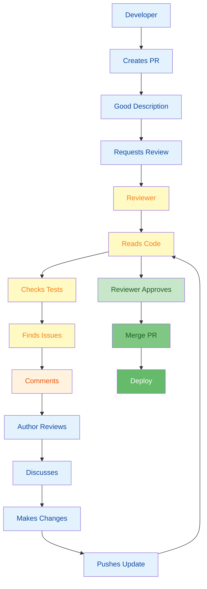

---

## 12. Code Review Reference

### Review Checklist for Different Change Types

```yaml
BUG FIX REVIEW:
  ☐ Understand the bug (root cause)
  ☐ Verify fix actually solves it
  ☐ Check for side effects
  ☐ Test added to prevent regression
  ☐ Performance impact checked
  ☐ No over-engineering of fix
  ☐ Minimal scope (only fix, no refactor)

FEATURE REVIEW:
  ☐ Meets requirements
  ☐ Good test coverage (>90%)
  ☐ Edge cases handled
  ☐ Error handling present
  ☐ Documentation updated
  ☐ Breaking changes noted
  ☐ Performance acceptable
  ☐ No unnecessary complexity

REFACTOR REVIEW:
  ☐ No functional changes
  ☐ Tests still pass
  ☐ Readability improved
  ☐ No performance regression
  ☐ Motivation documented
  ☐ Scope is focused
  ☐ Not mixed with features

PERFORMANCE REVIEW:
  ☐ Measurements shown
  ☐ Before/after data
  ☐ Benchmark included
  ☐ No accuracy lost
  ☐ No security trade-off
  ☐ Scalability considered
  ☐ Alternative approaches considered

SECURITY REVIEW:
  ☐ Input validation present
  ☐ No SQL injection risk
  ☐ No XSS risk
  ☐ Credentials not hardcoded
  ☐ Secrets not logged
  ☐ CORS properly configured
  ☐ Authentication verified
  ☐ Authorization checked

API REVIEW:
  ☐ Endpoint consistent with others
  ☐ Method correct (GET/POST/etc)
  ☐ Status codes correct
  ☐ Documentation complete
  ☐ Backwards compatible
  ☐ Versioning strategy clear
  ☐ Error responses defined

DATABASE REVIEW:
  ☐ Migration tested
  ☐ Backward compatible
  ☐ Indexes added if needed
  ☐ Performance impact checked
  ☐ Rollback plan exists
  ☐ Data integrity verified
  ☐ No data loss
```

### Comment Starters

```yaml
Good Starters for Different Situations:

Asking for Understanding:
  "Can you help me understand why...?"
  "I might be missing something, but..."
  "Walk me through the logic here?"
  "Help me trace through when X happens"

Making Suggestions:
  "Consider using X because..."
  "Might Y be better here? Reason: Z"
  "What if we refactored this as...?"
  "Have you thought about using...?"

Explaining Concerns:
  "I'm concerned about X because..."
  "This might cause Y in scenario Z"
  "There could be a bug when..."
  "Performance might be affected because..."

Praising Work:
  "Great refactoring! Much clearer now."
  "I like how you handled X"
  "Excellent test coverage!"
  "Nice use of Y pattern here"

Requesting Changes:
  "This needs to be fixed: [specific issue]"
  "Let's adjust this: [reason]"
  "We need to address X before merging"
  "Could we add X for completeness?"

Clarifying Tone:
  "Not blocking this, but..."
  "This is a nit, not critical..."
  "One more thing to consider..."
  "Don't need to change this, but..."

Wrapping Up:
  "Looks good! Approving this now."
  "Once you address these, looks mergeable."
  "Great work! Just needs these small fixes."
  "Thank you for the thorough PR!"
```

---

## 13. Code Review Metrics & Improvement

### Measuring Code Review Health

```yaml
Key Metrics:

Review Turnaround:
  Ideal: < 24 hours
  Good: < 48 hours
  Concerning: > 72 hours
  Track: Average time to first review
  Impact: Team throughput, morale

Review Depth:
  Track: Comments per PR
  Track: Issues found
  Track: Bugs caught before production
  Track: Security issues caught
  Impact: Quality vs speed balance

Approval Rate:
  Track: % approved vs requested changes
  High: > 80% approved first time
  Low: < 50% approved first time
  Balance: Some rejection is good
  Impact: Standards enforcement

Collaboration:
  Track: Discussion length
  Track: Respectful tone
  Track: Knowledge sharing
  Track: Learning moments
  Impact: Culture, team growth

Diversity:
  Track: Review distribution
  Track: New reviewers
  Track: Cross-team reviews
  Track: No single bottleneck
  Impact: Knowledge spread, resilience

Problems to Watch:

  High rejection rate?
    → Unclear standards
    → Perfectionism
    → Poor communication

  Slow reviews?
    → Understaffed
    → Bottleneck person
    → Review too hard
    → Process overhead

  No discussion?
    → Rubber stamping
    → No quality focus
    → Disconnected team

  Poor tone?
    → Toxic culture
    → Burnout
    → Turnover risk
    → Intervention needed
```

---

**Last Updated:** January 7, 2026  
**Difficulty Level:** Intermediate to Advanced  
**Prerequisites:** Git experience, collaboration in teams, pull request familiarity
