# Git Hooks & Automation: Streamline Your Workflow Guide

## Overview

Git hooks are scripts that automatically execute at key moments during your Git workflow. They empower you to enforce standards, prevent mistakes, run tests, and automate repetitive tasks without manual intervention.

### Why Git Hooks Matter

Git hooks eliminate manual steps by automating code quality checks before commits happen. They catch bugs early, enforce team standards, and ensure consistency across repositories. Instead of discovering issues during code review, hooks intercept problems at the source. They're essential for teams that value quality and consistency.

**Key Benefits:**
- **Early problem detection**: Catch issues before they enter the repository
- **Consistency enforcement**: Ensure all code follows team standards automatically
- **Time savings**: Eliminate manual verification steps and repetitive tasks
- **Quality gates**: Prevent commits that don't meet your criteria
- **Workflow automation**: Trigger processes without manual intervention
- **Team alignment**: Enforce practices across all developers
- **Learning tool**: Hooks teach developers about best practices through immediate feedback

### Main Use Cases

1. **Pre-commit validation**: Run linters, formatters, and type checkers on staged changes
2. **Commit message enforcement**: Validate commit messages follow conventional commits format
3. **Preventing secrets**: Block commits containing API keys, passwords, or sensitive data
4. **Running tests**: Execute unit tests before allowing commits to proceed
5. **Code style enforcement**: Auto-format code or reject commits with style violations
6. **Branch protection**: Enforce branch naming conventions and prevent certain pushes
7. **Notification systems**: Alert team members when specific actions occur
8. **CI/CD triggering**: Automatically start build pipelines on push
9. **Database migrations**: Run migrations automatically when pulled
10. **Deployment automation**: Trigger deployments based on branch or tag patterns

---

## 1. Git Hooks: Core Concepts

### What Are Git Hooks?

Git hooks are shell scripts that execute automatically at specific points in the Git workflow. They live in your `.git/hooks/` directory and run without user intervention. When a Git event occurs (commit, push, merge, etc.), the corresponding hook runs, and you can program it to perform any action you need.

### Hook Execution Flow

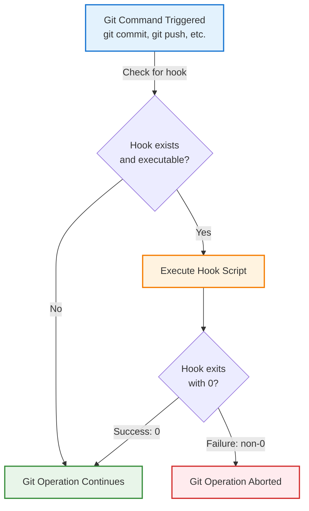

### Exit Codes Control Flow

Hooks use exit codes to control whether Git operations proceed:
- **Exit 0**: Hook succeeded; Git operation continues
- **Non-zero exit**: Hook failed; Git operation is blocked
- **No hook**: Git operation proceeds normally

### Hook Execution Environment

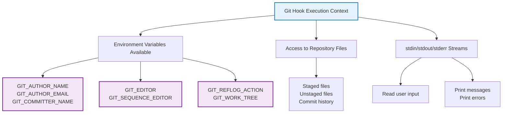

### Local vs Global vs System Hooks

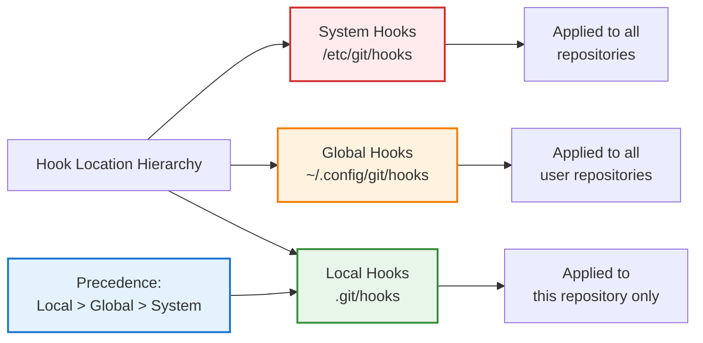

### Hook Script Structure

```bash
#!/bin/bash
# Hook scripts follow this basic pattern

# 1. Get information about what's happening
BRANCH_NAME=$(git rev-parse --abbrev-ref HEAD)

# 2. Validate or perform actions
if [[ $BRANCH_NAME == "main" ]]; then
    echo "Cannot commit to main branch"
    exit 1
fi

# 3. Exit with appropriate code
exit 0
```

---

## 2. Available Git Hooks: Complete Reference

### Client-Side Hooks (Most Common)

```mermaid
graph TB
    A["Client-Side Hooks<br/>(Local Machine)"] --> B["Commit Hooks"]
    A --> C["Email Hooks"]
    A --> D["Merge Hooks"]
    A --> E["Push Hooks"]
    
    B --> B1["pre-commit: Before commit created"]
    B --> B2["prepare-commit-msg: Before editor opens"]
    B --> B3["commit-msg: After message entered"]
    B --> B4["post-commit: After commit created"]
    
    C --> C1["applypatch-msg: Before applying patch"]
    C --> C2["pre-applypatch: Before applying patch changes"]
    C --> C3["post-applypatch: After patch applied"]
    
    D --> D1["pre-merge-commit: Before merge commit"]
    D --> D2["post-merge: After merge completes"]
    D --> D3["post-rewrite: After rebasing/amending"]
    
    E --> E1["pre-push: Before pushing to remote"]
    E --> E2["post-checkout: After checkout"]
    E --> E3["pre-rebase/post-rebase: Rebase events"]
    
    style A fill:#E3F2FD,stroke:#1976D2,stroke-width:2px
    style B1 fill:#F3E5F5,stroke:#7B1FA2,stroke-width:1.5px
    style B2 fill:#F3E5F5,stroke:#7B1FA2,stroke-width:1.5px
    style B3 fill:#F3E5F5,stroke:#7B1FA2,stroke-width:1.5px
    style B4 fill:#F3E5F5,stroke:#7B1FA2,stroke-width:1.5px
```

### Server-Side Hooks

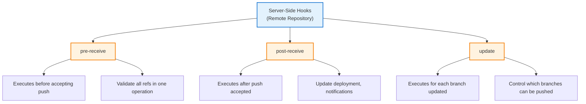

### Hook Execution Timeline

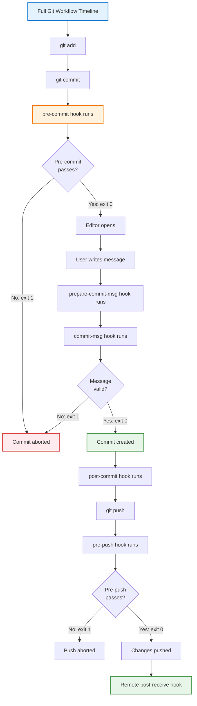

### Hook Parameters and Access

| Hook | Parameters | Has stdin | Common Use Cases |
|------|-----------|-----------|------------------|
| pre-commit | None | No | Lint, format, run tests on staged files |
| prepare-commit-msg | Commit type, SHA-1, source | Yes | Auto-complete commit messages, add prefixes |
| commit-msg | Message file path | No | Validate commit message format |
| post-commit | None | No | Send notifications, update issue tracker |
| pre-push | Remote name, remote URL | stdin: refs | Prevent pushing to wrong branch, final validation |
| post-merge | Was squash merge | No | Update dependencies, rebuild artifacts |

---

## 3. Setting Up Git Hooks: Step-by-Step

### Creating Your First Hook

```bash
# 1. Navigate to repository
cd my-project

# 2. Create hooks directory (already exists in .git/hooks/)
cd .git/hooks

# 3. Create hook file
cat > pre-commit << 'EOF'
#!/bin/bash
echo "Running pre-commit hook..."
exit 0
EOF

# 4. Make it executable
chmod +x pre-commit

# 5. Test it by making a commit
cd ../../
git add .
git commit -m "Test commit"
```

### Common Hook Implementations

**Pre-commit hook for linting:**
```bash
#!/bin/bash
# Run ESLint on staged JavaScript files

STAGED_FILES=$(git diff --cached --name-only --diff-filter=ACM | grep -E '\.(js|ts)x?$')

if [ -z "$STAGED_FILES" ]; then
    exit 0
fi

echo "Linting staged files..."
npx eslint $STAGED_FILES

if [ $? -ne 0 ]; then
    echo "❌ ESLint found errors. Fix them before committing."
    exit 1
fi

exit 0
```

**Commit-msg hook for conventional commits:**
```bash
#!/bin/bash
# Validate commit message follows conventional commits format
# Format: type(scope): subject

COMMIT_MSG=$(cat "$1")

if ! echo "$COMMIT_MSG" | grep -qE '^(feat|fix|docs|style|refactor|test|chore)(\(.+\))?: .{1,}'; then
    echo "❌ Commit message must follow conventional commits format"
    echo "   Format: type(scope): subject"
    echo "   Example: feat(auth): add login functionality"
    exit 1
fi

exit 0
```

**Pre-push hook for branch protection:**
```bash
#!/bin/bash
# Prevent direct pushes to main/master branches

BRANCH=$(git rev-parse --abbrev-ref HEAD)
PROTECTED_BRANCHES="^(main|master|develop)$"

if [[ $BRANCH =~ $PROTECTED_BRANCHES ]]; then
    echo "❌ Cannot push directly to protected branch: $BRANCH"
    echo "   Create a feature branch instead"
    exit 1
fi

exit 0
```

### Installation Strategies

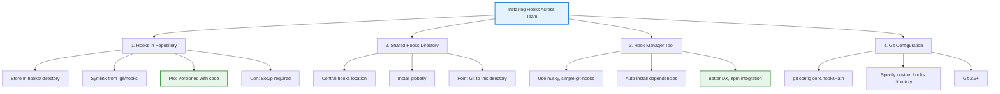

---

## 4. Popular Hook Automation Tools

### Husky: The Industry Standard

Husky makes managing Git hooks easier by providing a user-friendly interface and npm integration. It automatically installs hooks when you run `npm install`.

```bash
# Installation
npm install husky --save-dev
npx husky install

# Add a pre-commit hook
npx husky add .husky/pre-commit "npm run lint"

# Add a commit-msg hook
npx husky add .husky/commit-msg 'npx --no -- commitlint --edit "$1"'

# Verify hooks are in place
ls -la .husky/
```

**Husky Workflow:**
```
git commit
    ↓
.husky/pre-commit runs
    ↓
npm run lint executes
    ↓
Linting passes/fails
    ↓
Commit allowed or blocked
```

### Other Tool Options

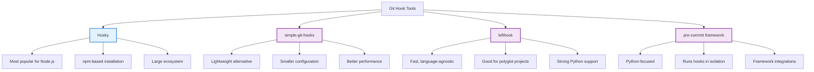

### Commitlint: Enforce Commit Messages

Commitlint validates that commit messages follow a specific format (usually Conventional Commits).

```bash
# Install
npm install --save-dev @commitlint/config-conventional @commitlint/cli

# Create config
echo "export default { extends: ['@commitlint/config-conventional'] };" > commitlint.config.js

# Setup hook
npx husky add .husky/commit-msg 'npx --no -- commitlint --edit "$1"'

# Test it
git commit -m "invalid commit"  # ❌ Fails
git commit -m "feat: add feature"  # ✅ Passes
```

### Lint-staged: Run Linters on Staged Files

Instead of running linters on all files, lint-staged runs them only on staged files, making hooks faster.

```bash
# Install
npm install --save-dev lint-staged

# Create config in package.json
{
  "lint-staged": {
    "*.{js,ts}": "eslint --fix",
    "*.md": "prettier --write"
  }
}

# Add hook
npx husky add .husky/pre-commit "npx lint-staged"
```

---

## 5. Real-World Hook Scenarios

### Scenario 1: Preventing Secrets in Commits

**Problem:** Developer accidentally commits an API key to the repository.

**Solution with Hook:**
```bash
#!/bin/bash
# .husky/pre-commit - Prevent secrets

PATTERNS=(
  "-----BEGIN.*PRIVATE KEY-----"
  "api[_-]?key"
  "secret[_-]?key"
  "password.*="
  "aws_access_key_id"
)

for pattern in "${PATTERNS[@]}"; do
    if git diff --cached -i --grep="$pattern"; then
        echo "❌ Potential secret detected. Review changes before committing."
        exit 1
    fi
done

exit 0
```

**Outcome:** Developer gets immediate warning, secret never reaches repository.

---

### Scenario 2: Enforcing Code Quality Checks

**Problem:** Team wants to prevent commits with linting errors or test failures.

**Setup:**
```json
{
  "husky": {
    "hooks": {
      "pre-commit": "lint-staged",
      "commit-msg": "commitlint -E HUSKY_GIT_PARAMS"
    }
  },
  "lint-staged": {
    "*.ts": ["eslint --fix", "prettier --write"],
    "*.test.ts": ["jest --bail --findRelatedTests"]
  }
}
```

**Hook Execution:**
```
git commit
    ↓
pre-commit hook runs lint-staged
    ↓
Files linted and formatted automatically
    ↓
Tests run on modified files
    ↓
If all pass: commit proceeds
    ↓
commit-msg hook validates message format
    ↓
Commit created successfully
```

---

### Scenario 3: Automating Branch-Based Workflows

**Problem:** Team uses release branches; direct pushes to main should be prevented.

**pre-push hook:**
```bash
#!/bin/bash
# Prevent pushes to protected branches except via PR

BRANCH=$(git rev-parse --abbrev-ref HEAD)
REMOTE=$1
PROTECTED="main|master|develop|release"

if [[ $BRANCH =~ $PROTECTED ]]; then
    echo "❌ Protected branch detected: $BRANCH"
    echo "   You must use a Pull Request to merge changes"
    echo ""
    echo "   Steps:"
    echo "   1. Push your feature branch: git push origin $(git branch --show-current)"
    echo "   2. Create a Pull Request on GitHub"
    echo "   3. Get it reviewed and merged"
    exit 1
fi

exit 0
```

**Outcome:** Developers automatically prevented from bypassing code review.

---

### Scenario 4: Running Tests Before Push

**Problem:** Developer pushes code with failing tests, breaking CI/CD pipeline.

**pre-push hook:**
```bash
#!/bin/bash
# Run tests before allowing push

echo "Running tests before push..."
npm test -- --ci --coverage

if [ $? -ne 0 ]; then
    echo "❌ Tests failed. Fix them before pushing."
    exit 1
fi

echo "✅ All tests passed. Push allowed."
exit 0
```

**Outcome:** Only tested code reaches the repository.

---

### Scenario 5: Automatic Changelog Updates

**Problem:** Team forgets to update CHANGELOG on every release.

**post-commit hook for release branches:**
```bash
#!/bin/bash
# Auto-generate changelog entries

BRANCH=$(git rev-parse --abbrev-ref HEAD)
COMMIT_MSG=$(git log -1 --pretty=%B)

if [[ $BRANCH == release/* ]]; then
    VERSION=$(echo $BRANCH | sed 's/release\///')
    ENTRY="## [$VERSION] - $(date +%Y-%m-%d)\n$COMMIT_MSG"
    echo -e "$ENTRY\n$(cat CHANGELOG.md)" > CHANGELOG.md
    echo "✅ Updated CHANGELOG.md"
fi

exit 0
```

---

## 6. Advanced Hook Patterns

### Conditional Hooks Based on File Changes

```bash
#!/bin/bash
# Run different checks based on what changed

CHANGED_FILES=$(git diff --cached --name-only)

# If package.json changed, verify lockfile is updated
if echo "$CHANGED_FILES" | grep -q "package.json"; then
    if ! echo "$CHANGED_FILES" | grep -q "package-lock.json"; then
        echo "❌ package.json changed but package-lock.json wasn't updated"
        exit 1
    fi
fi

# If migrations exist, verify they're versioned
if echo "$CHANGED_FILES" | grep -q "migrations/"; then
    # Add versioning check here
    echo "✅ Migrations are properly versioned"
fi

exit 0
```

### Skipping Hooks When Necessary

```bash
# Skip pre-commit hook (emergency only!)
git commit --no-verify -m "Emergency fix"

# Equivalent
HUSKY=0 git commit -m "Skip hooks"

# Or with git config
git commit -c 'core.hooksPath=/dev/null' -m "No hooks"
```

### Parallel Hook Execution

```bash
#!/bin/bash
# Run multiple checks in parallel for speed

lint_check() {
    npx eslint src/ || return 1
}

test_check() {
    npm test -- --ci || return 1
}

format_check() {
    npx prettier --check src/ || return 1
}

# Run all in parallel
lint_check &
test_check &
format_check &

# Wait for all to complete
wait $!

if [ $? -ne 0 ]; then
    echo "❌ One or more checks failed"
    exit 1
fi

exit 0
```

### Dynamic Hook Configuration

```bash
#!/bin/bash
# Different hooks based on environment

if [ "$NODE_ENV" = "development" ]; then
    # Run full test suite in dev
    npm test
elif [ "$NODE_ENV" = "ci" ]; then
    # Run only fast checks in CI
    npm run lint
fi

exit 0
```

---

## 7. Troubleshooting Git Hooks

### Problem: Hook Not Running

**Diagnosis:**
```bash
# Check if hook exists
ls -la .git/hooks/pre-commit

# Check if executable
stat -c "%A" .git/hooks/pre-commit
```

**Solutions:**
```bash
# Make sure it's executable
chmod +x .git/hooks/pre-commit

# Check shebang is correct
head -n 1 .git/hooks/pre-commit  # Should be #!/bin/bash

# Test hook manually
./.git/hooks/pre-commit

# Check for hook manager interference
which husky
git config core.hooksPath
```

---

### Problem: Hook Blocking Legitimate Commits

**Issue:** Hook is too strict, preventing valid commits.

**Solution: Add Escape Hatch**
```bash
#!/bin/bash
# Allow bypass for specific commits

if [ -f ".no-hook" ]; then
    exit 0
fi

# Your checks here
npm run lint

exit $?
```

**Usage:**
```bash
touch .no-hook
git commit -m "Hotfix"  # Hook bypassed
rm .no-hook
```

---

### Problem: Inconsistent Hook Behavior Across Team

**Issue:** Hooks work locally but not for other developers.

**Solution: Ensure Global Setup**
```bash
# Create shared hooks directory
mkdir ~/git-hooks
# Copy hooks there
cp .git/hooks/pre-commit ~/git-hooks/

# Configure globally
git config --global core.hooksPath ~/git-hooks

# Verify
git config --global core.hooksPath
```

---

### Problem: Slow Hook Execution

**Solution: Optimize**
```bash
#!/bin/bash
# Fast hook - only check staged files

# Get only staged JS files
STAGED=$(git diff --cached --name-only | grep '\.js$')

if [ -z "$STAGED" ]; then
    echo "No JS files to check"
    exit 0
fi

# Run linter only on staged files
npx eslint $STAGED

exit $?
```

---

### Problem: Hook Requires User Input

**Solution: Provide Clear Prompts**
```bash
#!/bin/bash
# Interactive hook

read -p "Running expensive test? (y/n) " -n 1 -r
echo

if [[ $REPLY =~ ^[Yy]$ ]]; then
    npm test
else
    echo "⏭️  Skipping tests"
fi

exit 0
```

---

## 8. Best Practices for Git Hooks

### ✅ Do's

```mermaid
graph TB
    A["Git Hook Best Practices"] --> B["Keep hooks fast"]
    A --> C["Make hooks idempotent"]
    A --> D["Provide clear feedback"]
    A --> E["Document every hook"]
    A --> F["Version control hooks"]
    A --> G["Make them optional"]
    A --> H["Test hook logic"]
    
    B --> B1["Fast hooks < 5 seconds total"]
    B --> B2["Don't block developer flow"]
    
    C --> C1["Safe to run multiple times"]
    C --> C2["Same result each time"]
    
    D --> D1["Show success/failure clearly"]
    D --> D2["Explain why it failed"]
    D --> D3["Suggest fixes"]
    
    E --> E1["Document in README"]
    E --> E2["Include examples"]
    
    F --> F1["Commit to .git/hooks"]
    F --> F2["Or use tool like husky"]
    
    G --> G1["Allow HUSKY=0 bypass"]
    G --> G2["Document when to bypass"]
    
    H --> H1["Test locally first"]
    H --> H2["Test across platforms"]
    
    style A fill:#E3F2FD,stroke:#1976D2,stroke-width:2px
    style B fill:#E8F5E9,stroke:#388E3C,stroke-width:2px
```

### ❌ Don'ts

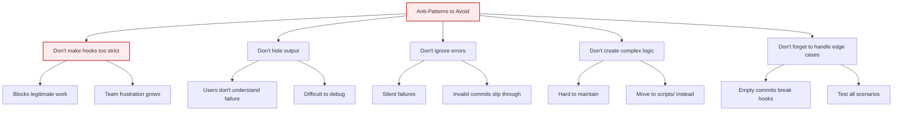

### Performance Considerations

```bash
#!/bin/bash
# Optimize for speed

# ✅ Good: Check only what changed
CHANGED=$(git diff --cached --name-only)

# ❌ Bad: Lint entire repository
npx eslint .

# ✅ Good: Lint only changed files  
npx eslint $CHANGED

# ✅ Good: Run in parallel where possible
npm run lint & npm run typecheck &
wait

# ✅ Good: Cache results between runs
if [ -f ".lint-cache" ]; then
    use_cached_results
fi
```

---

## 9. Common Hook Implementations Reference

### Complete Pre-Commit Setup

```bash
#!/bin/bash
# Comprehensive pre-commit hook

set -e  # Exit on first error

echo "🔍 Pre-commit checks starting..."

# 1. Check for secrets
echo "   → Checking for secrets..."
npx detect-secrets scan --baseline .secrets.baseline

# 2. Lint code
echo "   → Linting code..."
npx eslint --fix src/

# 3. Format code
echo "   → Formatting code..."
npx prettier --write src/

# 4. Type check
echo "   → Type checking..."
npx tsc --noEmit

# 5. Run tests on changed files
echo "   → Running tests..."
npm test -- --onlyChanged

# 6. Add modified files back
git add .

echo "✅ All checks passed!"
exit 0
```

### Complete Pre-Push Setup

```bash
#!/bin/bash
# Comprehensive pre-push hook

BRANCH=$(git rev-parse --abbrev-ref HEAD)
REMOTE=$1

echo "🚀 Pre-push validation..."

# Prevent push to protected branches
PROTECTED="^(main|master|develop)$"
if [[ $BRANCH =~ $PROTECTED ]]; then
    echo "❌ Cannot push to $BRANCH. Use Pull Request instead."
    exit 1
fi

# Run full test suite
echo "   → Running full test suite..."
npm test -- --coverage

if [ $? -ne 0 ]; then
    echo "❌ Tests failed"
    exit 1
fi

# Check for uncommitted changes
if ! git diff-index --quiet HEAD --; then
    echo "❌ Uncommitted changes detected"
    exit 1
fi

echo "✅ Ready to push!"
exit 0
```

---

## 10. Integration with CI/CD

### GitHub Actions Integration

```yaml
# .github/workflows/lint.yml
name: Lint & Test

on: [push, pull_request]

jobs:
  lint:
    runs-on: ubuntu-latest
    steps:
      - uses: actions/checkout@v2
      - uses: actions/setup-node@v2
        with:
          node-version: '18'
      
      - run: npm install
      - run: npx eslint src/
      - run: npm test
      - run: npx commitlint --from HEAD~1
```

### Server-Side Hooks for CI

```bash
#!/bin/bash
# .git/hooks/post-receive (on server)

# Automatically trigger CI when code is pushed
while read oldrev newrev refname; do
    if [ "$refname" = "refs/heads/main" ]; then
        curl -X POST \
            -H "Authorization: Bearer $CI_TOKEN" \
            "https://ci.example.com/build?branch=main"
    fi
done
```

### Workflow Diagram

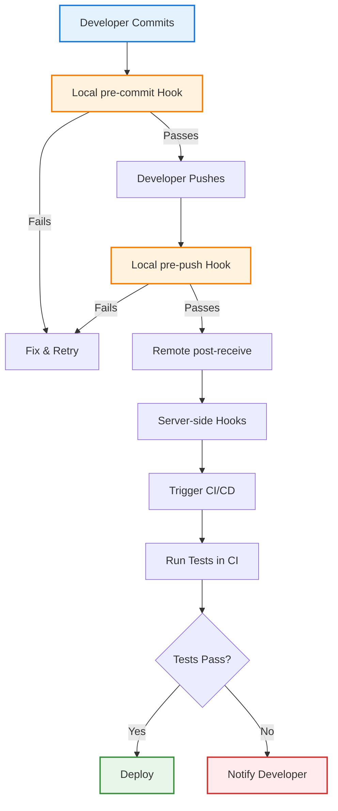

---

## 11. Interview Prep & Practice Questions

### Question 1: Explain Git Hooks

**Q:** What are Git hooks and when would you use them?

**A:** Git hooks are automated scripts that execute at specific points in the Git workflow. They're triggered by Git events like committing, pushing, or merging. You'd use them to:
- Enforce coding standards before commits
- Run tests automatically
- Prevent secrets from being committed
- Validate commit messages
- Trigger CI/CD pipelines
- Update documentation automatically

**Example:** A pre-commit hook running linters ensures no code style violations reach the repository.

---

### Question 2: Difference Between pre-commit and pre-push

**Q:** What's the difference between pre-commit and pre-push hooks? When would you use each?

**A:** 
- **pre-commit**: Runs locally before commit is created. Best for fast checks (linting, formatting, type checking) that should catch errors immediately.
- **pre-push**: Runs locally before pushing to remote. Best for expensive operations (running full test suite) that validate the entire change set.

**Example Scenario:** Use pre-commit for linting (fast feedback), use pre-push to ensure all tests pass before pushing to shared repository.

---

### Question 3: How to Make Hooks Team-Friendly

**Q:** How would you distribute Git hooks across a team while keeping them maintainable?

**A:** Three approaches:
1. **Version in repository**: Store in `./hooks` directory with symlinks in `.git/hooks`
2. **Use hook manager**: Husky handles installation via npm, ensuring consistency
3. **Configure globally**: Use `git config core.hooksPath` for all repositories

**Best Practice:** Use Husky for teams. It auto-installs hooks when developers run `npm install`, reduces setup friction, and integrates with npm scripts.

---

### Question 4: Handling Hook Failures

**Q:** How would you handle a situation where a hook is blocking valid commits?

**A:** 
```bash
# 1. Immediate bypass for emergency
HUSKY=0 git commit -m "Emergency fix"

# 2. Long-term fix
- Review hook logic
- Make it less strict or more intelligent
- Add exceptions for valid edge cases
- Update team documentation
- Rotate hook for review by team
```

**Key:** Communicate with team about hook changes to prevent future blocks.

---

### Question 5: Optimizing Slow Hooks

**Q:** Your pre-commit hook is taking 30 seconds and developers are frustrated. How would you optimize it?

**A:**
```bash
# ✅ Solutions:
1. Check only staged files instead of whole repository
2. Run checks in parallel instead of sequentially
3. Cache results between runs
4. Move expensive operations to pre-push or CI
5. Profile hooks to find bottlenecks

# Example: Only lint changed files
STAGED=$(git diff --cached --name-only)
npx eslint $STAGED  # Fast!

# vs
npx eslint .        # Slow - entire repo
```

---

### Question 6: Hook Security Considerations

**Q:** What are security risks with Git hooks?

**A:** 
- **Secret injection**: Hooks could expose credentials in error messages
- **Privilege escalation**: Hooks run with user permissions; could modify system
- **Supply chain attack**: Malicious hooks in public repo could compromise developers' machines
- **Performance DoS**: Slow hooks could make Git unusable

**Mitigation:**
- Never commit API keys in error messages
- Review hook code thoroughly
- Use established tool like Husky (audited community)
- Document what each hook does
- Allow developers to bypass with warnings

---

### Question 7: Monorepo Hook Challenges

**Q:** You're in a monorepo with multiple packages. How would you structure hooks to only run checks on changed packages?

**A:**
```bash
#!/bin/bash
# Only lint packages that changed

CHANGED_PACKAGES=$(git diff --cached --name-only | cut -d'/' -f1 | sort -u)

for package in $CHANGED_PACKAGES; do
    if [ -d "packages/$package" ]; then
        echo "Linting $package..."
        npx eslint packages/$package/
    fi
done

exit 0
```

---

### Question 8: Pre-Push Hook for Preventing Force Push

**Q:** How would you prevent `git push --force` while still allowing it on specific branches?

**A:**
```bash
#!/bin/bash
# Prevent force push except on feature branches

BRANCH=$(git rev-parse --abbrev-ref HEAD)

# Allow force push on feature branches only
if [[ ! $BRANCH =~ ^(feature|bugfix|experiment)/ ]]; then
    if [ "$GIT_PUSH_OPTION_0" = "force" ]; then
        echo "❌ Force push not allowed on $BRANCH"
        echo "   Use force push only on feature branches"
        exit 1
    fi
fi

exit 0
```

---

## 12. Troubleshooting & Common Issues

### Issue: Hooks Not Running

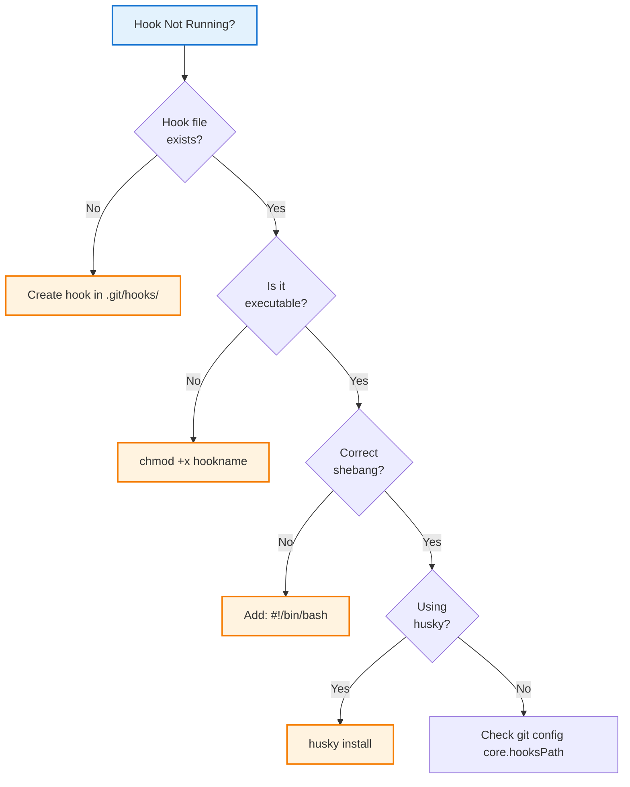

**Checklist:**
- [ ] Hook file exists in `.git/hooks/` or configured directory
- [ ] Hook is executable: `chmod +x hookname`
- [ ] Correct shebang: `#!/bin/bash` on first line
- [ ] Git 2.9+ for custom hooks path
- [ ] Hook manager (husky, lefthook) is installed
- [ ] No Git GUI interfering (some GUIs skip hooks)

### Issue: Hook Works Locally but Not in CI

**Solution:**
```bash
#!/bin/bash
# Make hooks CI-aware

if [ -z "$CI" ]; then
    # Running locally - enforce strict checks
    npm test -- --coverage
else
    # Running in CI - faster checks
    npm test -- --onlyChanged
fi

exit 0
```

### Issue: Different Behavior Across Operating Systems

**Solution:**
```bash
#!/bin/bash
# Cross-platform compatibility

OS=$(uname -s)

if [[ "$OS" == "Darwin" ]]; then
    # macOS specific
    sed_cmd="sed -i ''"
elif [[ "$OS" == "Linux" ]]; then
    # Linux specific
    sed_cmd="sed -i"
fi

$sed_cmd 's/old/new/g' file.txt
```

---

## 13. Visual Summary & Quick Reference

### Hook Execution Decision Tree

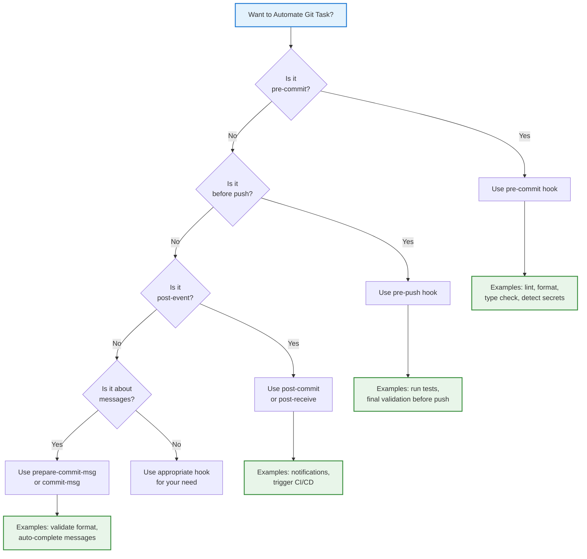

### Common Hook Commands

```bash
# List available hooks
ls -la .git/hooks/

# Create hook
cat > .git/hooks/pre-commit << 'EOF'
#!/bin/bash
echo "Hook running"
exit 0
EOF

# Make executable
chmod +x .git/hooks/pre-commit

# Test hook manually
./.git/hooks/pre-commit

# Skip hooks (emergency)
git commit --no-verify

# Bypass with HUSKY
HUSKY=0 git commit -m "message"

# Install husky
npm install husky
npx husky install

# Add hook with husky
npx husky add .husky/pre-commit "npm run lint"

# Check hook path
git config core.hooksPath
```

### Hook Performance Baseline

| Hook | Target Time | Reason |
|------|-----------|--------|
| pre-commit | < 5 seconds | Developer shouldn't wait long |
| prepare-commit-msg | < 1 second | Runs before editor opens |
| commit-msg | < 1 second | Fast validation |
| post-commit | < 5 seconds | Doesn't block commit |
| pre-push | < 30 seconds | More expensive checks OK |

### Quick Setup Checklist

- [ ] Identify what you want to automate
- [ ] Choose appropriate hook type
- [ ] Write hook script
- [ ] Make script executable: `chmod +x`
- [ ] Test locally: run hook manually
- [ ] Add to `.git/hooks/` or use husky
- [ ] Document hook in README
- [ ] Test with team
- [ ] Allow bypass for emergencies
- [ ] Monitor for performance issues

---

## 14. Additional Resources & References

### Official Documentation
- [Git Hooks Documentation](https://git-scm.com/docs/githooks)
- [Git Configuration](https://git-scm.com/docs/git-config)
- [Git Environment Variables](https://git-scm.com/book/en/v2/Git-Internals-Environment-Variables)

### Popular Tools
- [Husky](https://typicode.github.io/husky/) - Git hooks for Node.js
- [Commitlint](https://commitlint.js.org/) - Lint commit messages
- [Lint-staged](https://github.com/okonet/lint-staged) - Run linters on staged files
- [Lefthhook](https://lefthook.github.io/) - Fast Git hooks framework
- [pre-commit](https://pre-commit.com/) - Python-based framework

### Related Topics
- Conventional Commits for message standardization
- GitHub Actions for CI/CD integration
- Git configuration and aliases
- Development workflow optimization
- Code quality tools (ESLint, Prettier, TypeScript)

### Key Takeaways

**Git hooks are powerful automation tools that:**
1. Enforce standards automatically before code enters repository
2. Catch bugs early through pre-commit validation
3. Improve developer experience through immediate feedback
4. Enable complex workflows without manual steps
5. Integrate seamlessly with CI/CD pipelines

**Best approach:** Start with pre-commit linting/formatting, add pre-push tests, use tool like Husky for team distribution. Always prioritize developer experience—fast, helpful hooks earn team adoption.

---

*Last Updated: January 2026 | Comprehensive Git Hooks & Automation Guide*
