# Git Rebasing vs Merging: Complete Strategy Guide

## Overview

Rebasing and merging are two fundamental Git workflow strategies to integrate changes from one branch into another. Both accomplish the same goal—combining code—but they do it differently, affecting your project history, collaboration patterns, and workflow efficiency.

### Why It Matters
- **Project history clarity** - Clean vs detailed commit history
- **Collaboration impact** - How it affects team workflows
- **Debugging capability** - Using `git bisect` and `git blame` effectively
- **Feature tracking** - Connecting features to specific commits
- **Performance** - Repository size and clone times
- **Integration complexity** - Rebasing shared branches can cause problems

### Main Use Cases
- Integrating feature branches into main/develop
- Updating feature branches with latest main changes
- Maintaining clean vs detailed project history
- Working with different team collaboration models
- Handling both local and shared branches

---

## 1. Core Concepts & Fundamentals

### What is Merge?

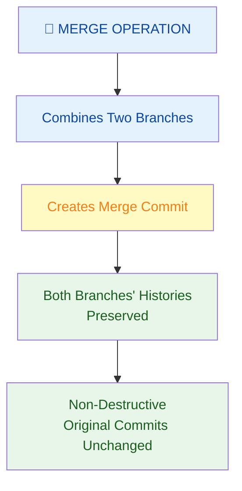

**Definition:** Merge integrates changes from two branches by creating a new **merge commit** that ties together both branch histories.

**Characteristics:**
- ✅ Non-destructive operation
- ✅ Creates special merge commit (2 parents)
- ✅ Preserves complete history of both branches
- ✅ Easy to revert (one commit)
- ⚠️ Can create complex history graph
- ⚠️ Harder to read commit timeline

### What is Rebase?

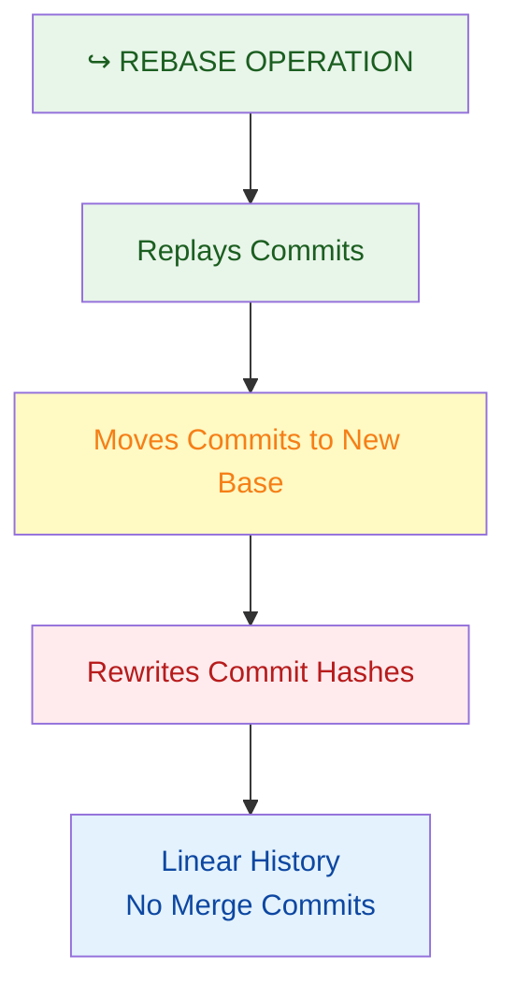

**Definition:** Rebase replays your commits on top of another branch, rewriting project history to create a **linear timeline**.

**Characteristics:**
- ✅ Clean, linear history
- ✅ No merge commits
- ✅ Easy to understand commit timeline
- ✅ Smaller repository size
- ⚠️ Rewrites commit hashes (destructive)
- ⚠️ Can't revert individual rebased commits easily
- ⚠️ Dangerous on shared branches

---

## 2. Visual Comparison: Merge vs Rebase

### The Scenario

```
main branch:     A -- B -- C
                 
feature branch:        B -- D -- E
                       
Goal: Integrate feature branch into main
```

### Merge Result

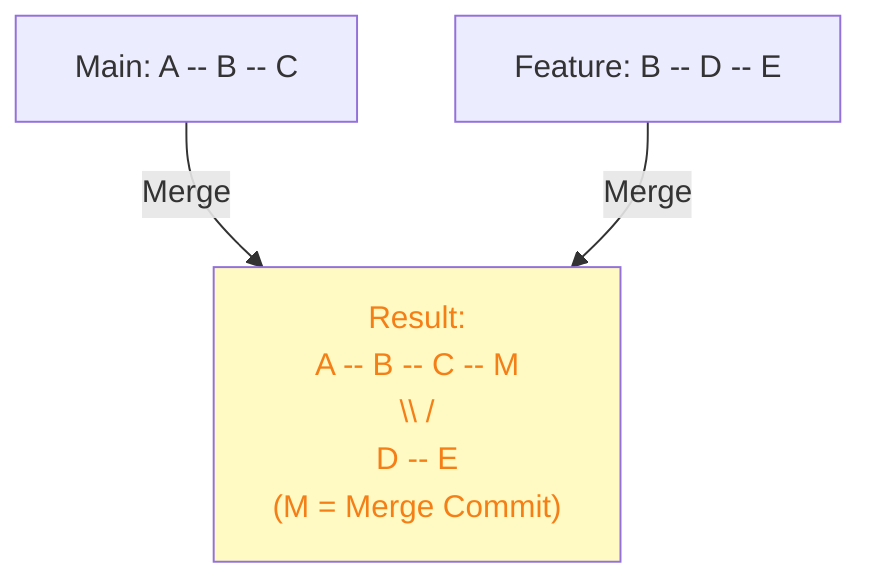

**Visual Timeline (Merge):**
```
        A - B - C
         \   \
          D - E - M (merge commit)
            \   /
```

### Rebase Result

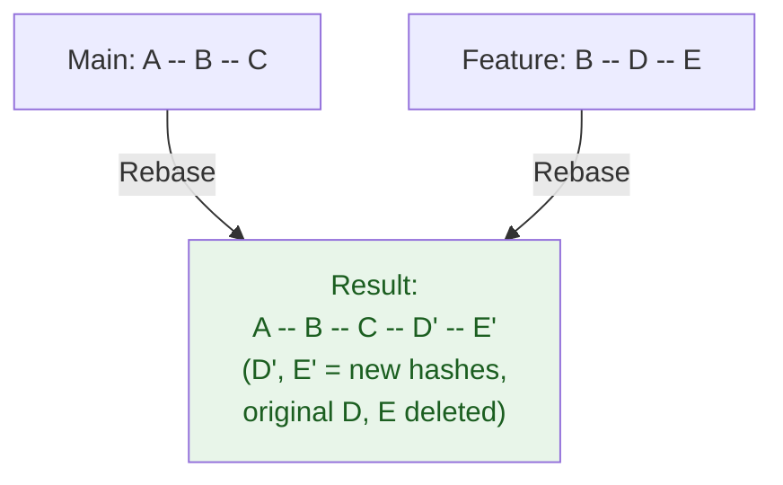

**Visual Timeline (Rebase):**
```
A - B - C - D' - E'
        (linear)
```

### Side-by-Side Comparison

| Aspect | Merge | Rebase |
|--------|-------|--------|
| **Commit History** | Preserves both branches | Rewrites to linear |
| **Merge Commit** | Creates new commit | No extra commit |
| **History Graph** | Complex (branching) | Simple (linear) |
| **Revertability** | Easy (one commit) | Hard (multiple commits) |
| **Commit Hashes** | Unchanged | Rewritten |
| **Safe on Public** | Yes | ⚠️ No |
| **Readability** | Shows branch structure | Easier timeline |
| **Blame/Bisect** | Clear parent relationships | Linear to follow |
| **Collaboration** | Good for team features | Better for local work |
| **Learning Curve** | Easy | Intermediate |

---

## 3. Merge in Depth

### How Merge Works

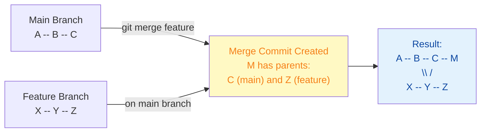

### Types of Merges

#### Fast-Forward Merge

**When it happens:** Feature branch is directly ahead of main, no diverging history

```
Before:
main:     A -- B -- C
feature:        C -- D -- E

After (Fast-Forward):
main:     A -- B -- C -- D -- E
feature:  A -- B -- C -- D -- E
(no merge commit created)
```

**Command:**
```bash
git checkout main
git merge feature
# Result: main pointer moves to E (fast-forward)
```

#### 3-Way Merge

**When it happens:** Both branches have new commits (diverged)

```
Before:
main:     A -- B -- C -- F
feature:        C -- D -- E

After (3-Way Merge):
main:     A -- B -- C -- F -- M (merge commit)
               \\   /
                D -- E
```

**Command:**
```bash
git checkout main
git merge feature
# Creates merge commit M
```

### Merge Commit Details

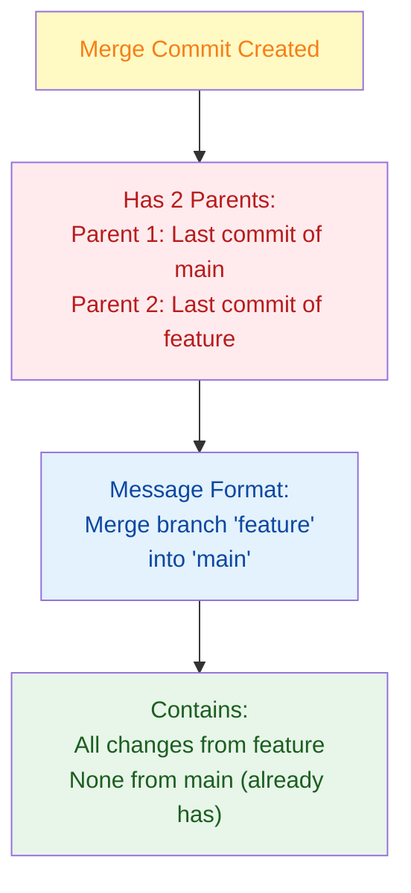

---

## 4. Rebase in Depth

### How Rebase Works

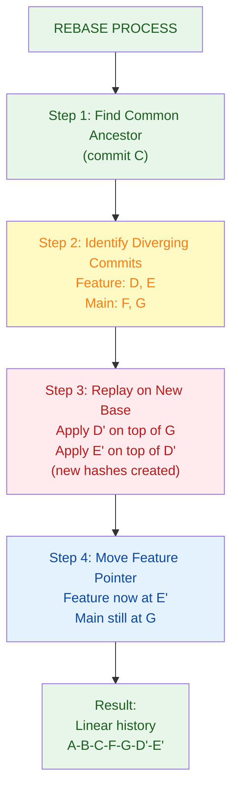

### Before and After Rebase

**Before:**
```
main:     A -- B -- C -- F -- G
feature:        C -- D -- E
(diverged at C)
```

**Command:**
```bash
git checkout feature
git rebase main
```

**After:**
```
main:     A -- B -- C -- F -- G
feature:                  D' -- E'
(rebased on top of G)
```

### Interactive Rebase

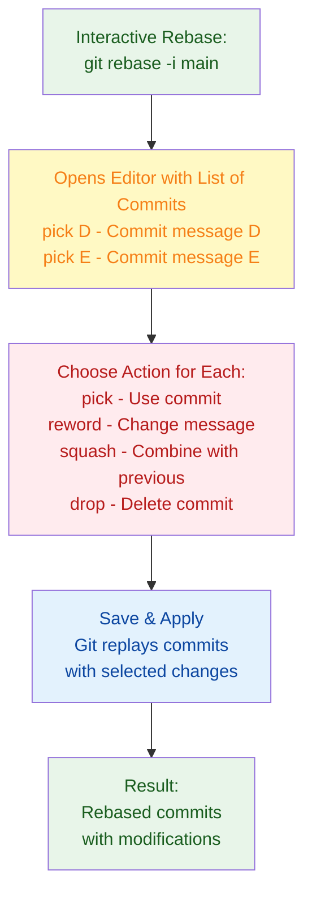

---

## 5. Detailed Comparison Scenarios

### Scenario Analysis: Project History

**Merge Approach:**
```
A -- B -- C -- F -- G
 \             \ /
  D -------- E -- M (merge commit)
  
Result: Complex graph, shows feature development
```

**Rebase Approach:**
```
A -- B -- C -- F -- G -- D' -- E'

Result: Linear timeline, feature appears after main
```

**Which is Better?**
- **Merge:** Better shows actual development workflow
- **Rebase:** Better for understanding feature sequence

### Scenario Analysis: Debugging

#### Using git blame (Who changed what?)

```
Merge approach:
Line 50: Commit D | "Added user validation" | John
         Clearly shows John made the change on feature branch

Rebase approach:
Line 50: Commit D' | "Added user validation" | John
         Also clear, but D' is different hash than original D
```

#### Using git bisect (Where did bug appear?)

```
Merge approach:
Can search through merge commit
- Search in main's history
- Search in feature's history
- Merge commit itself

Rebase approach:
Linear search easier
- Single timeline to bisect through
- Fewer commits to test
- Cleaner process
```

---

## 6. When to Use Merge

### Use Merge When:

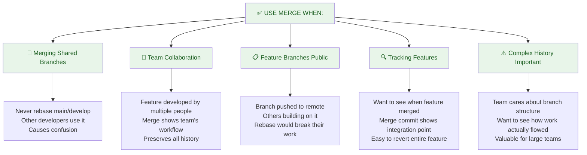

### Merge Command Examples

```bash
# Basic merge
git checkout main
git merge feature-branch

# Merge with custom message
git merge feature-branch -m "Merge: added user authentication"

# Create merge commit even if fast-forward possible
git merge --no-ff feature-branch
(forces merge commit for consistency)

# View merge strategy
git merge --no-commit feature-branch
(review changes before finalizing)
```

---

## 7. When to Use Rebase

### Use Rebase When:

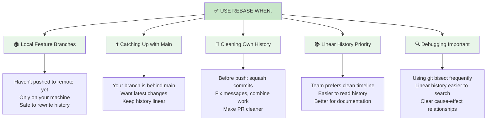

### Rebase Command Examples

```bash
# Simple rebase
git checkout feature-branch
git rebase main

# Interactive rebase (squash/reword commits)
git rebase -i main
(opens editor to modify commits)

# Continue after resolving conflicts
git rebase --continue

# Abort if something goes wrong
git rebase --abort

# Rebase and merge (creates one commit)
git checkout main
git rebase --interactive feature-branch
git merge --ff-only feature-branch
```

---

## 8. Quick Cheatsheet

### Decision Tree

```
Starting point: Need to integrate two branches
│
├─► Is the target branch (main/develop) shared with team?
│   ├─► YES → Use MERGE (never rebase shared branches)
│   └─► NO → Continue...
│
├─► Has this branch been pushed to remote?
│   ├─► YES → Use MERGE (rebasing breaks others' work)
│   └─► NO → Continue...
│
├─► Do you want to clean up commits first?
│   ├─► YES → Use REBASE (interactive: squash/reword)
│   └─► NO → Continue...
│
├─► Does team prefer clean linear history?
│   ├─► YES → Use REBASE (then merge with --ff-only)
│   └─► NO → Continue...
│
└─► Default: MERGE (safer, clearer for teams)
```

### Common Commands

| Task | Merge | Rebase |
|------|-------|--------|
| **Integrate branch** | `git merge feature` | `git rebase main` |
| **Update from main** | `git merge origin/main` | `git rebase origin/main` |
| **Clean before PR** | `git merge --squash` | `git rebase -i main` |
| **Continue after conflict** | `git commit` | `git rebase --continue` |
| **Abort process** | `git merge --abort` | `git rebase --abort` |
| **After rebase, merge** | N/A | `git merge --ff-only feature` |

### Command Comparison Table

```bash
# Merge approach
git checkout main
git merge feature
git push origin main

# Rebase approach (cleaner local history)
git checkout feature
git rebase main          # Clean up feature history
git checkout main
git merge --ff-only feature  # Fast-forward merge
git push origin main

# Result: Same feature in main, but different history
```

---

## 9. Real-World Scenarios

### Scenario 1: Team Feature Development

**Situation:** 3 developers working on authentication feature

**Setup:**
```
main: V1.0 released
team-auth branch: Created, worked on by 3 people
```

**Timeline:**
```
Day 1: Alice creates team-auth branch
Day 2: Bob pushes his changes to team-auth
Day 3: Carol pushes her changes to team-auth
Day 4: Feature ready, merge into main
```

**Code Flow:**
```
main:              V1.0 --------- M (merged)
                      \       /
team-auth:              A--B--C
            (created by Alice, extended by Bob, Carol)
```

**Why Merge:**
```
✅ Branch is shared/public (multiple developers)
✅ Shows teamwork and collaboration
✅ Easy to revert entire feature if needed
✅ Clear integration point
✅ Safer than rebasing shared work
```

**Command:**
```bash
git checkout main
git merge team-auth -m "Merge: authentication module from team-auth"
# Creates merge commit showing team's work
```

---

### Scenario 2: Personal Feature Branch Cleanup

**Situation:** You're working on a feature locally, commits are messy

**Setup:**
```
Your local commits:
- "WIP: started auth"
- "Debug: fixed import"
- "More auth logic"
- "Fix typo"
- "Refactor: final auth"
```

**Goal:** Clean up before creating PR

**Rebase to the rescue:**

```bash
git checkout feature-auth
git rebase -i main

# Interactive editor shows:
pick abc1234 WIP: started auth
pick def5678 Debug: fixed import
pick ghi9012 More auth logic
pick jkl3456 Fix typo
pick mno7890 Refactor: final auth

# Change to:
pick abc1234 WIP: started auth
squash def5678 Debug: fixed import
squash ghi9012 More auth logic
squash jkl3456 Fix typo
squash mno7890 Refactor: final auth

# Result: Single clean commit "WIP: started auth"
# (with all changes combined)
```

**Then merge cleanly:**
```bash
git checkout main
git merge --ff-only feature-auth
# Linear history, one commit added
```

**Why Rebase:**
```
✅ Local branch only (not shared)
✅ Cleans up messy commit history
✅ Creates professional PR
✅ Easier to review
✅ Cleaner project history
```

---

### Scenario 3: Catching Up with Main

**Situation:** Feature branch is 3 days old, main has new commits

**Setup:**
```
You started feature-payments on Monday
Tuesday: Others merged UI improvements into main
Now Wednesday: Your feature needs latest code
```

**The Branches:**
```
main:            A--B--C [Mon]--D--E [Tue]--F [Wed]
feature-payments:   B--X--Y--Z [Mon-Tue]
                    (behind by commits D, E, F)
```

**Merge Approach:**
```bash
git checkout feature-payments
git merge main

# Result:
main:              A--B--C--D--E--F
feature-payments:      B--X--Y--Z--M (merge commit)
                            \___/
```

**Rebase Approach:**
```bash
git checkout feature-payments
git rebase main

# Result:
main:              A--B--C--D--E--F
feature-payments:              D'--E'--F'--X'--Y'--Z'
                    (your commits replayed on top)
```

**Why Rebase Here:**
```
✅ Your branch not shared (local)
✅ Want to stay on top of latest main
✅ Cleaner history for final merge
✅ Easier to test with latest code
✅ No merge commit noise
```

**Command:**
```bash
git checkout feature-payments
git rebase main

# If conflicts:
# ... fix conflicts ...
git add .
git rebase --continue

# Verify it works
npm test

git checkout main
git merge --ff-only feature-payments
# Fast-forward merge to main
```

---

### Scenario 4: Large Team with Strict History

**Situation:** Large enterprise with strict commit history requirements

**Setup:**
```
main branch: Highly scrutinized
Every commit must be meaningful
Company audits commit history

Feature branches: Multiple teams, hundreds per year
```

**Process:**

**Step 1: Work on feature (local)**
```bash
git checkout main
git checkout -b feature/new-dashboard

# Make commits (might be messy)
git commit -m "WIP: dashboard layout"
git commit -m "Debug: CSS issue"
git commit -m "Add dashboard to main"
```

**Step 2: Clean up before PR (rebase)**
```bash
git rebase -i main

# Editor shows messy commits
# Change to:
pick abc1234 WIP: dashboard layout
reword def5678 Debug: CSS issue    -> "Fix CSS grid alignment"
squash ghi9012 Add dashboard to main

# Result: 2 clean commits with good messages
```

**Step 3: Code review (PR created)**
```
Pull request shows:
- 2 commits
- Clear, descriptive messages
- Proper history trail
```

**Step 4: Merge after approval**
```bash
git checkout main
git merge --no-ff feature/new-dashboard
# Creates merge commit (shows integration)
# --no-ff ensures merge commit even if fast-forward possible
```

**Why This Approach:**
```
✅ Rebase cleans local messy history
✅ Merge shows integration point
✅ Final main history is clean and meaningful
✅ Audit trail is clear
✅ Team standard is satisfied
```

---

## 10. Best Practices

### The Golden Rules

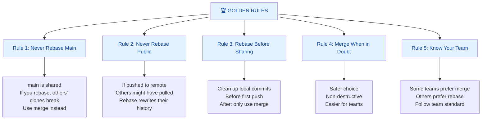

### Safe Rebasing Checklist

Before rebasing, verify:

```
✅ Is this branch local only?
   (git branch -v shows no [origin/...])

✅ Have I pushed this branch?
   (If yes, STOP - use merge instead)

✅ Are others working on this branch?
   (If yes, STOP - use merge instead)

✅ Is this the target branch (main)?
   (If yes, STOP - never rebase main)

✅ Have I made a backup?
   (git branch backup-branch-name)

✅ Do I understand the consequences?
   (Commits will be rewritten)
```

### Common Practices by Team Size

| Team Size | Preferred | Reason |
|-----------|-----------|--------|
| **1 Person** | Rebase (cleaner) | No one else affected, can safely rewrite |
| **2-3 People** | Merge (safer) | Easier collaboration, less coordination |
| **Small Team** | Team choice | Document preference, stick with it |
| **Large Enterprise** | Hybrid | Rebase local → Merge to main |

---

## 11. Hybrid Approach (Best Practice)

### The Recommended Workflow

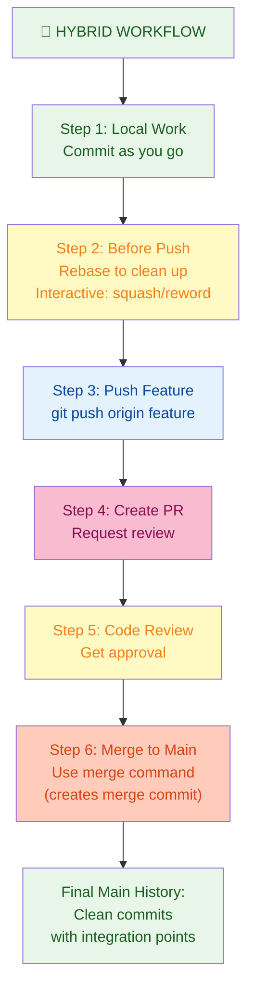

### Complete Example

```bash
# 1. Start feature
git checkout -b feature/user-profiles

# 2. Make commits (might be messy)
git commit -m "WIP: profile page"
git commit -m "Debug: avatar loading"
git commit -m "Add profile endpoints"
git commit -m "Fix API response"

# 3. Before pushing, clean up (REBASE)
git rebase -i main
# Squash debug commits, reword messages
# Result: 2 clean commits

# 4. Push to remote
git push origin feature/user-profiles

# 5. Create PR on GitHub
# Request review

# 6. After approval, merge (MERGE)
git checkout main
git pull origin main
git merge --no-ff feature/user-profiles
git push origin main

# Result:
# - Rebase cleaned up feature history
# - Merge shows integration point
# - Main has clean, meaningful history
```

---

## 12. Summary & Key Takeaways

### What You Should Know

✅ **Merge** - Non-destructive, creates merge commit, shows branch history  
✅ **Rebase** - Rewrites history, linear timeline, clean history  
✅ **Never rebase shared/public branches** - Will break others' work  
✅ **Rebase before push** - Clean up local commits before sharing  
✅ **Merge after push** - Safe way to integrate into shared branches  
✅ **Hybrid is best** - Rebase local, merge to main  
✅ **Know your team** - Follow team standards  
✅ **When in doubt, merge** - Safer, easier, less risk  

### Merge vs Rebase Quick Reference

| Criteria | Use Merge | Use Rebase |
|----------|-----------|-----------|
| Branch is shared | ✅ | ❌ |
| Already pushed | ✅ | ❌ |
| Is main/develop | ✅ | ❌ |
| Local only | ✅ | ✅ |
| Want clean history | ✅ | ✅✅ |
| Want branch trail | ✅✅ | ✅ |
| New to Git | ✅ | ❌ |
| Cleaning up commits | ⚠️ | ✅ |

---

## 13. Interview & Exam Prep

### Common Interview Questions

**Q1: What's the difference between merge and rebase?**
> Merge combines two branches by creating a merge commit with two parents, preserving both branch histories. Rebase replays one branch's commits on top of another, rewriting history to create a linear timeline. Merge is non-destructive; rebase rewrites commit hashes.

**Q2: When should you never rebase?**
> Never rebase branches that are shared with others or have been pushed to remote. Rebasing rewrites commit hashes, which breaks the work of anyone who has pulled those commits. Only rebase local branches before first push.

**Q3: What's the advantage of rebase?**
> Rebase creates a clean, linear project history that's easier to read and understand. It avoids merge commit clutter and makes debugging with `git bisect` simpler. It's ideal for maintaining a clean main branch history.

**Q4: What's the advantage of merge?**
> Merge is non-destructive and preserves the complete history of how work actually flowed. It's safer for team collaboration, easier to revert (one commit), and doesn't rewrite history. It clearly shows when features were integrated.

**Q5: What's interactive rebase and when do you use it?**
> Interactive rebase (`git rebase -i`) lets you modify commits while rebasing. You can squash multiple commits into one, reword commit messages, reorder commits, or delete commits. Use it on local branches before pushing to create a clean, meaningful commit history.

**Q6: Explain the hybrid workflow**
> The hybrid approach rebases local branches to clean up messy commits, then merges to main to preserve integration history. This combines rebase's clean history with merge's safety. It's the best practice for most teams.

**Q7: What happens if you accidentally rebase a shared branch?**
> The commits get rewritten with new hashes, breaking the work of anyone who pulled them. To fix it, the team must coordinate using `git reflog` to recover the original commits, or rebase again to the old commits. This is why shared branches should only use merge.

**Q8: How do you recover from a bad rebase?**
> Use `git reflog` to find the commit before rebase, then `git reset --hard <commit>` to restore. If changes were already pushed, you'd need to create a new commit that undoes the rebase (revert the merge).

### Practice Scenarios

**Scenario A:** You rebased main by accident. What do you do?
- Answer: Use `git reflog` to find the original commit, `git reset --hard` to restore, inform team to re-pull

**Scenario B:** Team wants clean history but collaborates heavily. Which strategy?
- Answer: Hybrid approach - rebase local branches, merge to main to show integration

**Scenario C:** When would you use `git merge --squash`?
- Answer: When integrating a feature with many commits but want main to show only one combined commit (instead of merge commit)

---

## 14. Troubleshooting

### Issue: Rebase Conflicts

**Problem:** You're rebasing and conflicts appear

**Solution:**
```bash
# 1. Fix conflicts in the file
# 2. Stage the resolved file
git add filename

# 3. Continue rebasing (not commit!)
git rebase --continue

# If conflicts in next commit, repeat
# After all commits replayed, rebase completes

# If you want to stop
git rebase --abort
```

### Issue: Rebase Goes Wrong

**Problem:** After rebase, history looks wrong or commits are missing

**Solution:**
```bash
# Undo the rebase
git reflog
# Find commit before rebase

git reset --hard <commit-before-rebase>
# History restored to before rebase attempt
```

### Issue: Can't Merge After Rebase

**Problem:** After rebasing, merge doesn't work as expected

**Solution:**
```bash
# Use fast-forward only merge
git checkout main
git merge --ff-only feature-branch
# If this fails, you probably rebase wrong branch

# Or force merge (creates commit even if fast-forward)
git merge --no-ff feature-branch
```

### Issue: Rebased Commits Appear Twice

**Problem:** After rebase and merge, see duplicate commits in history

**Likely cause:** Used merge instead of fast-forward after rebase

**Solution:**
```bash
# Use fast-forward merge only
git merge --ff-only feature-branch

# Verify result
git log --oneline --graph
# Should show linear history
```

---

## 15. Visual Summary

### Complete Comparison Flow

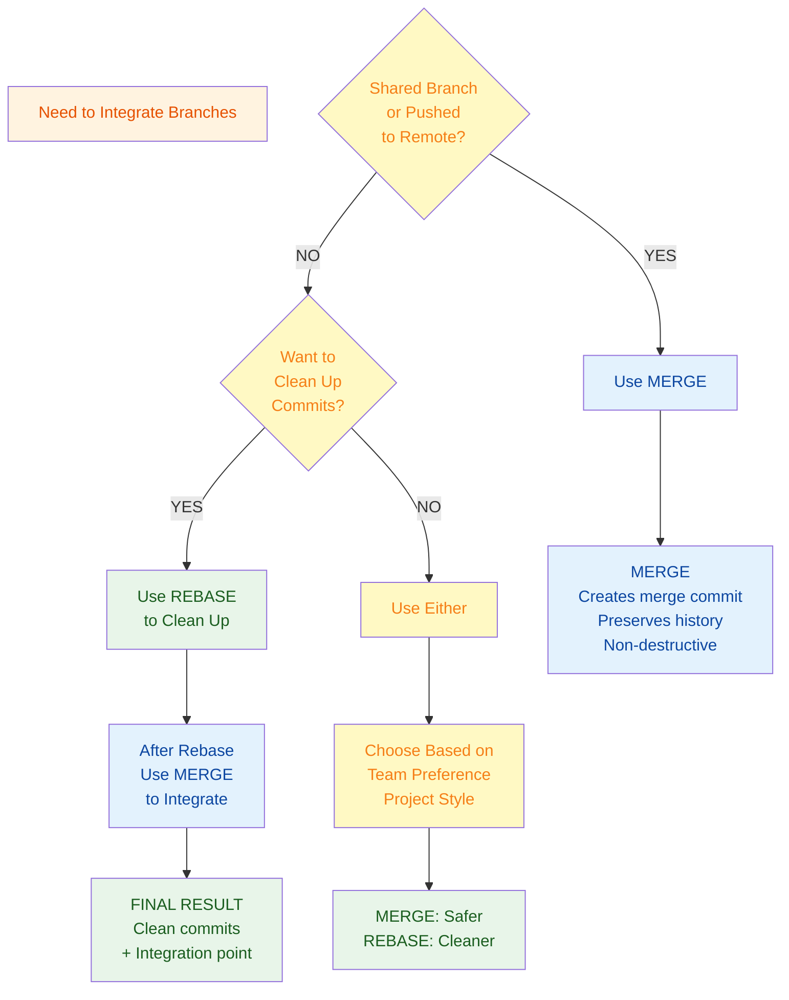

---

**Last Updated:** January 6, 2026  
**Difficulty Level:** Intermediate  
**Prerequisites:** Understanding of Git basics, branches, and commits
