# Git Stashing & Temporary Changes: Save Work in Progress Guide

## Overview

Git stashing is a powerful feature that allows you to temporarily save changes without committing them. Stashes let you switch branches with uncommitted work, clean your working directory, and come back to work later. Understanding stashing is essential for efficient Git workflows, especially when context-switching or handling unexpected work interruptions.

### Why It Matters
- **Switch branches safely** - Save work without committing incomplete features
- **Context switching** - Handle urgent bugs while preserving work-in-progress
- **Clean working directory** - Keep workspace tidy without losing changes
- **Temporary experiments** - Try ideas without cluttering commit history
- **Organize work** - Multiple stashes for different tasks
- **Avoid messy commits** - Don't commit incomplete work
- **Preserve work** - Never lose changes, only temporarily hide them
- **Parallel development** - Work on multiple features simultaneously

### Main Use Cases
- Switching branches while having uncommitted changes
- Creating clean working directory for urgent tasks
- Saving experimental code for later review
- Handling merge conflicts without committing
- Organizing partial work across multiple stashes
- Cleaning up before pull/rebase operations
- Backing up work before risky operations
- Managing incomplete features during sprint changes

---

## 1. Core Concepts & Fundamentals

### Git Stashing Overview

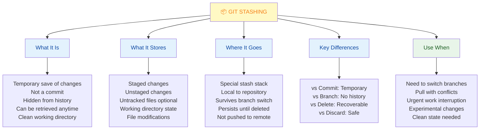

### Stashing vs Other Git Operations

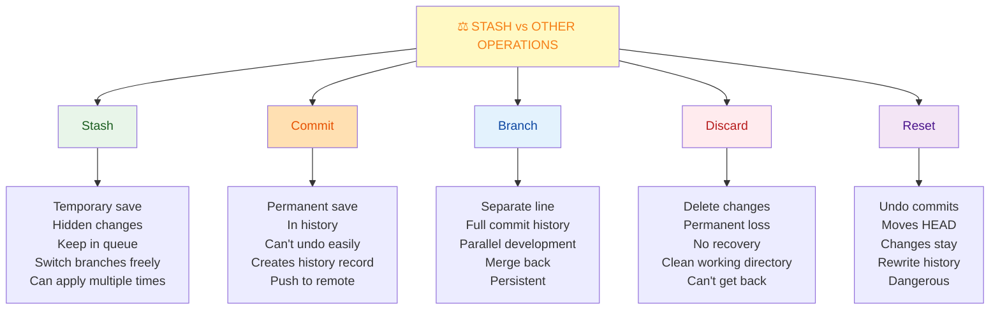

### Stash Stack Structure

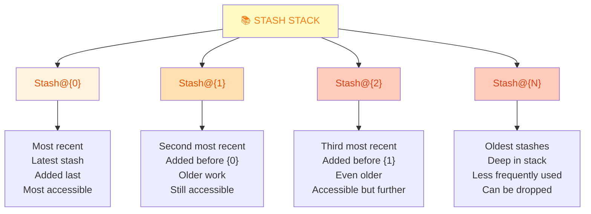

### Stash Workflow

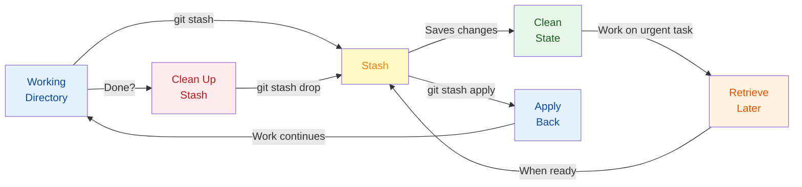

---

## 2. Basic Stashing Operations

### Stash Your Changes

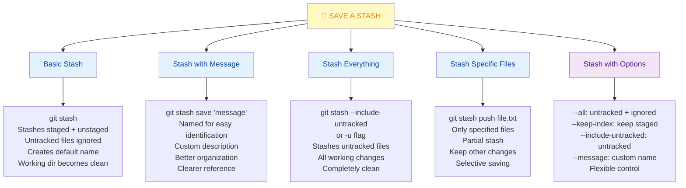

### View Stash List

```bash
# List all stashes
git stash list

Output:
stash@{0}: WIP on main: 1a2b3c4 Add feature X
stash@{1}: WIP on main: 1a2b3c4 Fix bug Y
stash@{2}: WIP on feature-branch: abc1234 Work in progress
stash@{3}: On dev: xyz9876 Experimental code

# Show stash details
git stash show                    # Shows latest stash summary
git stash show stash@{1}          # Shows specific stash
git stash show -p stash@{0}       # Full diff of stash
git stash show -p --stat          # Statistics view

# Search in stashes
git stash list | grep "pattern"   # Find by message
git stash show -p | grep "code"   # Find by content
```

### Retrieve Stashed Work

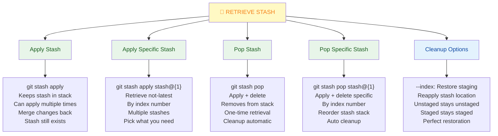

### Delete Stashes

```bash
# Drop specific stash
git stash drop stash@{0}          # Delete latest stash
git stash drop stash@{2}          # Delete specific stash

# Drop all stashes
git stash clear                   # WARNING: Deletes all stashes!

# Verify before deleting
git stash show -p stash@{0}       # Review before drop
git stash list                    # See what you have

# Common workflow
git stash show stash@{0}          # Check summary
git stash show -p stash@{0}       # See full diff
git stash pop stash@{0}           # Apply if good
# OR
git stash drop stash@{0}          # Delete if not needed
```

---

## 3. Advanced Stashing Features

### Creating Stash Branches

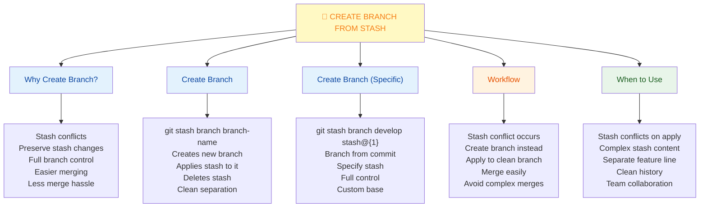

### Partial Stash with Patches

```bash
# Interactive stash selection
git stash push --patch             # Choose hunks to stash
git stash push -p                  # Short form
# Shows: Stash this hunk? [y,n,q,a,d,e,?]
# y = stash this hunk
# n = don't stash this hunk
# q = quit (stash selected)
# a = stash this and all remaining
# d = don't stash this or remaining
# e = manually edit hunk
# ? = help

# Example workflow
git stash push -p                  # Interactive select
# Select feature A hunks: y
# Skip feature B hunks: n
# Quit: q
# Result: Only feature A stashed

# File-specific stash
git stash push src/app.js          # Stash only app.js
git stash push src/*.js            # Stash all .js files
git stash push -p src/app.js       # Interactive select in app.js
```

### Combining Stashes

```bash
# View stash content
git stash show -p stash@{0} > patch.diff

# Combine stashes into one
git stash show -p stash@{0} > combine.patch
git stash show -p stash@{1} >> combine.patch
git stash drop stash@{0}
git stash drop stash@{1}
git apply combine.patch            # Reapply combined

# Or manually apply multiple
git stash apply stash@{0}          # Apply first
git stash apply stash@{1}          # Apply second
git stash apply stash@{2}          # Apply third
# Merge all changes together
```

### Advanced Stash Workflows

```yaml
Stash Naming Convention:
  Pattern: stash save "feature-type: description"
  
  Examples:
    "feature: add user authentication"
    "bugfix: fix null pointer in handler"
    "refactor: improve performance"
    "experiment: test new library"
    "wip: incomplete feature"

Workflow Best Practices:
  1. Use descriptive messages
  2. Review stash before pop
  3. Drop after applying
  4. Use branches for conflicts
  5. Keep stash list short
  6. Name related stashes together

Stash for Different Scenarios:
  
  Urgent Interrupt:
    git stash save "wip: feature X"
    # Fix urgent bug
    git stash pop
  
  Experimental Code:
    git stash save "experiment: test Y"
    # Try something
    git stash show -p
    git stash drop
  
  Multiple Features:
    git stash save "feature: auth system"
    git stash save "feature: database schema"
    # Work on both stashes
    git stash pop  # Apply in reverse order
  
  Clean Before Pull:
    git stash save "wip: incomplete work"
    git pull
    git stash pop
```

---

## 4. Stashing Workflows & Best Practices

### Complete Stashing Workflow

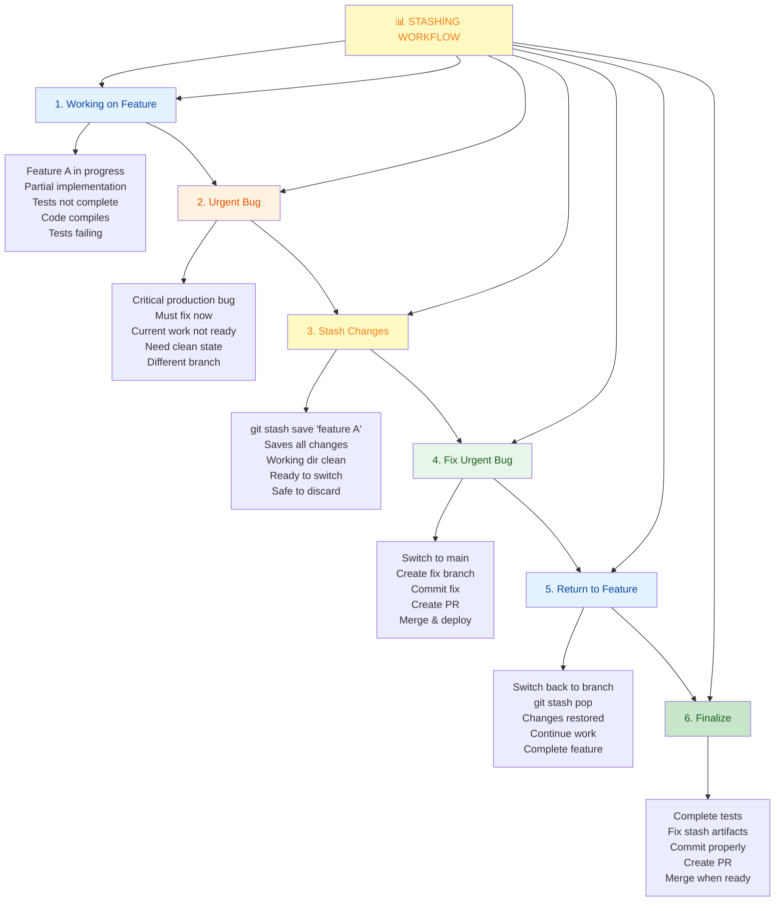

### Handling Stash Conflicts

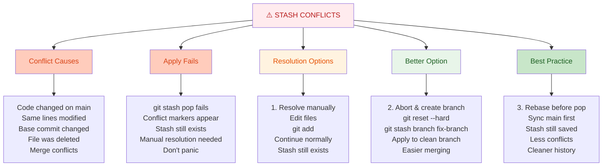

### Stash Best Practices

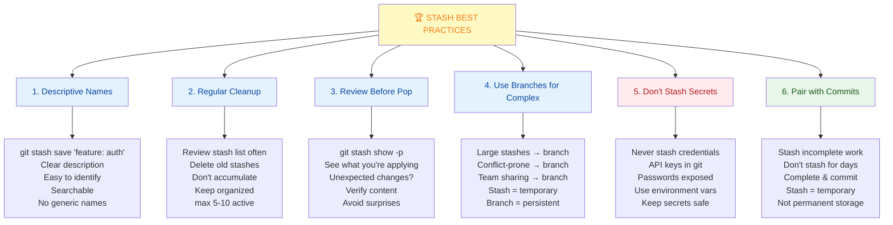

---

## 5. Quick Cheatsheet

### Essential Stash Commands

```bash
# Save work
git stash                          # Save all changes
git stash save "message"           # Named stash
git stash push file.txt            # Specific file
git stash push -p                  # Interactive select
git stash push -u                  # Include untracked
git stash push --all               # Include ignored

# View stashes
git stash list                     # List all
git stash show                     # Latest summary
git stash show -p                  # Latest full diff
git stash show -p stash@{1}        # Specific stash
git stash show --stat              # Statistics

# Retrieve work
git stash apply                    # Apply latest
git stash apply stash@{1}          # Apply specific
git stash pop                      # Apply + delete
git stash pop stash@{2}            # Pop specific

# Manage stashes
git stash drop stash@{0}           # Delete one
git stash clear                    # Delete all
git stash branch new-branch        # Create branch
git stash branch new stash@{1}     # From specific

# Advanced
git stash list --oneline           # Compact view
git stash list -p                  # With full diffs
git stash list | grep pattern      # Search
git diff stash@{0}                 # Compare to working
git diff stash@{0} stash@{1}       # Compare stashes
```

### Common Stash Scenarios

```bash
# Scenario 1: Interrupted Work
git stash save "wip: feature X"    # Save progress
git checkout bugfix-branch         # Switch to fix
# Fix bug and commit
git checkout feature-branch        # Back to feature
git stash pop                      # Restore work

# Scenario 2: Clean Before Pull
git stash                          # Save changes
git pull                           # Get latest
git stash pop                      # Restore

# Scenario 3: Multiple Stashes
git stash save "feature A"         # Stash 1
git stash save "feature B"         # Stash 2
git stash save "experiment C"      # Stash 3
git stash list                     # See all
git stash pop stash@{1}            # Apply feature B

# Scenario 4: Conflict Resolution
git stash pop                      # Conflicts!
# Resolve conflicts manually
git add .
# Changes are now staged (no auto-commit with pop)
git commit -m "Merge stash"
# OR
git reset --hard
git stash branch conflict-fix      # Better approach

# Scenario 5: Partial Stash
git stash push -p                  # Select hunks
# y = stash this chunk
# n = skip this chunk
# q = quit and stash

# Scenario 6: Experimental Code
git stash save "experiment: test X"
# Try something risky
git stash show -p stash@{0}        # See what you did
# Good idea?
git stash pop                      # Yes, apply it
# Bad idea?
git stash drop stash@{0}           # No, discard it
```

---

## 6. Real-World Scenarios

### Scenario 1: Urgent Production Bug During Feature Work

**Situation:** Building feature, production bug reported, need to fix now

**Before (Without Stash):**
- Commit incomplete work (messy history)
- Lose changes trying to switch
- Merge conflicts when fixing
- Complicated undo process

**With Stash:**

```bash
# On feature-branch, 30% done with feature
$ git status
On branch feature-auth-system
Changes not staged for commit:
  modified:   src/auth.js
  modified:   src/user.js
  modified:   src/config.js

# Save work with name
$ git stash save "wip: auth system - user model"
Saved working directory and index state on feature-auth-system: wip: auth system

# Verify clean
$ git status
nothing to commit, working tree clean

# Fix urgent bug
$ git checkout main
$ git pull
$ git checkout -b hotfix/critical-bug

# Fix bug, test, commit
$ git add .
$ git commit -m "Fix: Critical authentication bypass"
$ git push origin hotfix/critical-bug
# Create PR, get approved, merge

# Return to feature work
$ git checkout feature-auth-system
$ git stash pop
Updated src/auth.js, src/user.js, src/config.js

# Continue where left off
$ git status
Changes not staged for commit:
  modified:   src/auth.js
  modified:   src/user.js
  modified:   src/config.js
```

**Result:**
- ✅ Clean switch to fix bug
- ✅ No messy commits
- ✅ Work preserved exactly
- ✅ Continued seamlessly

---

### Scenario 2: Working with Multiple Features in Parallel

**Situation:** Juggling 3 features in different states

**Setup:**

```bash
# Feature 1: Starting
$ git checkout -b feature/dark-mode
$ git stash save "feature: dark-mode - UI components"
# ~20% complete, testing needed

# Feature 2: Middle of work
$ git checkout -b feature/notifications
$ git stash save "feature: notifications - backend API"
# ~50% complete, needs integration testing

# Feature 3: Bug investigation
$ git checkout -b bugfix/performance
$ git stash save "bugfix: performance - database query"
# ~70% complete, ready to commit

# View all stashes
$ git stash list
stash@{0}: On bugfix/performance: bugfix: performance - database query
stash@{1}: On feature/notifications: feature: notifications - backend API
stash@{2}: On feature/dark-mode: feature: dark-mode - UI components
```

**Working through them:**

```bash
# Work on Performance Bug (almost done)
$ git checkout bugfix/performance
$ git stash pop stash@{0}
# Finish and commit
$ git add .
$ git commit -m "Perf: Optimize database queries"
$ git push origin bugfix/performance
# Create PR

# Work on Notifications (needs testing)
$ git checkout feature/notifications
$ git stash pop stash@{1}
# Run integration tests
$ npm test
# Need to fix something
$ git stash save "feature: notifications - api fixes"
# Make fixes, test, commit
$ git add .
$ git commit -m "Feature: Complete notifications API"

# Work on Dark Mode (start fresh)
$ git checkout feature/dark-mode
$ git stash pop stash@{2}
# Continue UI work
# Add more components
$ git add .
$ git commit -m "Feature: Dark mode UI components"

# Result: 3 features progressed, stash used to organize
```

**Benefit:**
- ✅ Clear organization across features
- ✅ Easy to context-switch
- ✅ Named stashes for clarity
- ✅ Work never lost
- ✅ Clean commit history

---

### Scenario 3: Stash Conflict & Resolution

**Situation:** Stashed work conflicts with changes on main branch

**The Problem:**

```bash
# 2 weeks ago, stashed work
$ git stash save "feature: new endpoint"

# Meanwhile, main branch changed same files
$ git pull
# Updated: src/api.js

# Try to apply stash
$ git stash pop
CONFLICT (content): Merge conflict in src/api.js
# Stash applied with conflicts!

$ git status
On branch main
Changes by merge:
  both modified:   src/api.js

Unmerged paths:
  (use "git add/rm <paths>..." to resolve)
  both modified:   src/api.js
```

**Solution 1: Manual Resolve**

```bash
# View conflict
$ cat src/api.js
<<<<<<< Updated upstream
  // New endpoint added on main
  app.post('/api/users', handler)
=======
  // Your endpoint from stash
  app.post('/api/v2/users', handler)
>>>>>>> Stashed changes

# Edit file to resolve
# Keep both endpoints if needed
$ nano src/api.js

# Mark resolved
$ git add src/api.js
$ git commit -m "Merge: Resolve stash conflict with main"
```

**Solution 2: Create Branch (Recommended)**

```bash
# Abort current apply
$ git reset --hard HEAD

# Create branch from stash instead
$ git stash branch feature-endpoint main
# Creates new branch from main
# Applies stash to it
# Deletes stash
# Much cleaner!

# Now merge or handle separately
$ git checkout main
$ git merge feature-endpoint
# Or keep feature-endpoint as separate branch
```

**Best Practice: Rebase Before Pop**

```bash
# When returning to stash after time
$ git stash list
stash@{0}: On feature: new endpoint

# Check main has new changes
$ git log main --oneline -5

# Rebase your branch on new main
$ git rebase main

# Now safe to pop
$ git stash pop
# Fewer/no conflicts
```

**Result:**
- ✅ Conflicts resolved cleanly
- ✅ No messy merge commits
- ✅ History preserved
- ✅ Work intact

---

## 7. Best Practices & Anti-Patterns

### Stashing Best Practices

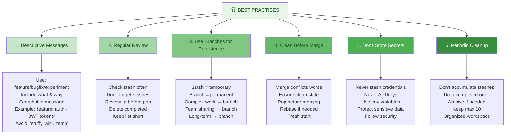

### Anti-Patterns to Avoid

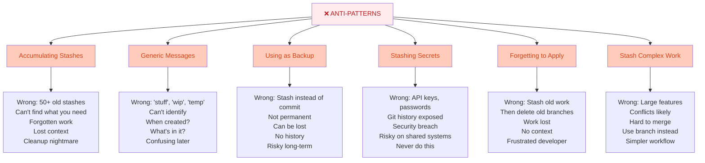

---

## 8. Summary & Key Takeaways

### What You Should Know

✅ **Stash saves changes temporarily** - Without committing  
✅ **Access via git stash** - Push/pop work on demand  
✅ **Keeps history clean** - No messy WIP commits  
✅ **Multiple stashes** - Stack your work, access by index  
✅ **Review before pop** - Use `git stash show -p`  
✅ **Use descriptive names** - Easy identification  
✅ **Create branches for conflicts** - `git stash branch`  
✅ **Clean up regularly** - Don't accumulate old stashes  

### When to Use Stash vs Branch

| Situation | Use Stash | Use Branch | Why |
|-----------|-----------|-----------|-----|
| **Quick temp save** | ✅ | ❌ | Stash lighter |
| **Team sharing** | ❌ | ✅ | Branch persistent |
| **Long-term work** | ❌ | ✅ | Stash temporary |
| **Urgent interrupt** | ✅ | ❌ | Fast cleanup |
| **Complex feature** | ❌ | ✅ | Less conflict |
| **Experimental code** | ✅ | ❌ | Quick discard |
| **Stash conflicts** | ❌ | ✅ | Use branch instead |

---

## 9. Interview & Exam Prep

### Common Interview Questions

**Q1: What is git stash and when would you use it?**
> Git stash temporarily saves your uncommitted changes without creating a commit. You'd use it when you need to switch branches but have incomplete work, or when you need a clean working directory for operations like pull/rebase. It's safer than discarding changes but cleaner than committing incomplete work.

**Q2: Explain the difference between `git stash apply` and `git stash pop`.**
> Both apply stashed changes back to your working directory. `apply` leaves the stash in the stack (can apply multiple times), while `pop` applies and immediately deletes the stash. Use `apply` if you want to reuse the stash, `pop` for one-time retrieval.

**Q3: How would you handle a conflict when applying a stash?**
> If `git stash pop` results in conflicts, you have several options: manually resolve the conflicts (edit files, git add, git commit), use `git reset --hard` and then `git stash branch new-branch` to apply to a clean branch (recommended), or rebase your branch on the latest main before popping to minimize conflicts.

**Q4: What's the difference between stashing and creating a branch?**
> Stashing is temporary (local only, survives branch switches) and meant for short-term work. Branches are permanent (can be pushed, have history) and meant for persistent development. Use stash for quick context switches, branches for substantial feature work or team collaboration.

**Q5: How would you find a specific stash among many?**
> Use `git stash list` to see all stashes, `git stash list | grep "pattern"` to search by message, or `git stash show -p stash@{index}` to view specific stash content. Best practice: use descriptive messages when stashing (e.g., "feature: auth system") to make finding easier.

**Q6: Can you stash untracked files?**
> By default, `git stash` ignores untracked files. Use `git stash push --include-untracked` (or `-u`) to include untracked files, or `git stash push --all` to include both untracked and ignored files. This is useful for complete working directory snapshots.

**Q7: What happens if you stash, then delete the branch?**
> The stash persists independently of branches. You can still retrieve it using `git stash list` and `git stash pop stash@{index}` even on a different branch. Stashes are local and aren't pushed to remote, so they only exist in your local repository.

**Q8: Describe your experience using stash in a real team scenario.**
> [Personal story structure]: "When working on feature X, a production bug needed urgent fixing. I stashed my incomplete work with a clear message, switched to main, fixed and deployed the bug, then popped my stash to continue the feature. This kept the commit history clean and prevented context-loss."

### Practice Scenarios

**Scenario A:** You stashed work 2 days ago and forgot what was in it. How do you check before applying?

Steps:
1. `git stash list` - See all stashes with messages
2. Find the stash by timestamp and description
3. `git stash show stash@{X}` - See summary of changes
4. `git stash show -p stash@{X}` - See full diff
5. `git stash show -p stash@{X} | grep "pattern"` - Search for specific code
6. Decide: `git stash pop` if good, `git stash drop` if not needed

**Scenario B:** You have 3 active stashes and want to apply the middle one without losing the others.

Steps:
1. `git stash list` - See all three
2. `git stash apply stash@{1}` - Apply middle one (keep in stack)
3. Resolve any conflicts if they occur
4. Continue working with stash still available
5. Later: `git stash drop stash@{1}` when done

**Scenario C:** Your stash pop resulted in conflicts with main. How do you resolve cleanly?

Steps:
1. See conflict markers in files
2. Option 1: Resolve manually (edit files, git add, git commit)
3. Option 2 (better): `git reset --hard`, then `git stash branch fix-branch`, merge the branch
4. Test to ensure no issues
5. Clean up the temporary branch after merge

---

## 10. Troubleshooting Common Issues

### Issue: "Stash pop" Results in Conflicts

**Problem:** `git stash pop` shows merge conflicts, can't apply

**Solutions:**

```bash
1. Check the Conflict
   git status                      # See what's conflicted
   git stash show -p stash@{0}     # Review stash content
   
2. Resolve Manually
   # Edit files with <<<< >>>> markers
   # Keep what you want
   git add .
   git commit -m "Resolve stash conflict"
   # Stash still exists, manually resolved

3. Create Branch Instead (Recommended)
   git reset --hard HEAD           # Abort current apply
   git stash branch conflict-fix   # Apply to new branch
   # Much cleaner, easier to merge

4. Rebase First (Prevention)
   # Before popping stash
   git fetch origin
   git rebase origin/main          # Get latest
   # Now pop has better chance of succeeding
   git stash pop                   # Fewer conflicts

5. Check Base Commit
   git stash show                  # Shows base commit
   git log --oneline -n 1          # Current HEAD
   # If very different, conflicts likely
```

### Issue: Can't Find Your Stash

**Problem:** Too many stashes, forgot what's in it

**Solutions:**

```bash
1. List All Stashes
   git stash list                  # See all with messages
   git stash list --oneline        # Compact view
   git stash list -p               # Show full diffs
   
2. Search in Stashes
   git stash list | grep "pattern" # Search by message
   git stash show -p | grep "code" # Search by content
   git stash show -p stash@{N}     # Check specific
   
3. Better for Future
   git stash save "descriptive message"
   # Not: 'stuff', 'temp', 'wip'
   # Yes: 'feature: auth system', 'bugfix: null pointer'
   
4. Regular Cleanup
   git stash list                  # See what you have
   git stash drop stash@{3}        # Delete old ones
   # Keep only active stashes
```

### Issue: Accidentally Deleted Stash

**Problem:** Used `git stash drop` or `git stash clear` by mistake

**Solutions:**

```bash
1. Try Git Reflog
   git reflog                      # Shows all git actions
   # Look for "stash: on branch..." entries
   # Note the hash
   
2. Recover from Reflog
   git stash apply HASH            # Try to recover
   git stash branch recovery HASH  # Create branch from it
   
3. Check Dangling Objects
   git fsck --lost-found           # Find orphaned commits
   # May find your stash data
   
4. Unfortunately
   If truly lost: No recovery possible
   Lesson: Always review before drop
   Prevention: Use reflog before clear
   
5. Prevention Going Forward
   git stash list                  # Always check first
   git stash show -p stash@{0}     # Review before drop
   # Small extra step prevents disaster
```

### Issue: Stash on Wrong Branch

**Problem:** Stashed on feature-A but need changes on feature-B

**Solutions:**

```bash
1. Simple: Switch and Pop
   git checkout feature-B
   git stash pop stash@{0}         # Apply to correct branch
   # Might have conflicts
   
2. Better: Apply Specific Stash
   git checkout feature-B
   git stash apply stash@{1}       # Apply (not pop)
   # Keep in stack if needed on other branch
   git checkout feature-A
   git stash pop stash@{1}         # Now pop on original
   
3. Create Patch
   git stash show -p stash@{0} > changes.patch
   git checkout feature-B
   git apply changes.patch         # Apply patch
   
4. Prevention
   Always check: git branch
   Verify correct branch before stash
   Use descriptive message showing branch name
   
5. Multiple Copies
   Can apply same stash multiple times
   git checkout feature-B
   git stash apply stash@{0}       # apply (not pop)
   git checkout feature-C
   git stash apply stash@{0}       # apply again
   # Stash still exists until dropped
```

### Issue: Large Stash with Merge Commits

**Problem:** Stashed work has old main merged in, causes complicated merges

**Solutions:**

```bash
1. Create Clean Branch
   git stash branch clean-branch   # Fresh from stash
   # Cleaner than reapplying
   
2. Rebase Stash
   git stash branch temp
   git rebase -i main              # Clean up history
   # Remove merge commits
   # Squash related changes
   git checkout main
   git merge temp                  # Now clean
   
3. Review Before Stashing
   git stash show -p               # Check for merges
   # If messy, clean first
   # Commit instead of stashing
   
4. Prevention
   Keep stash current
   Don't stash weeks of work
   Merge into stash-branch instead
   Commit properly for long-term work
```

---

## 11. Visual Summary

### Stash Workflow Diagram

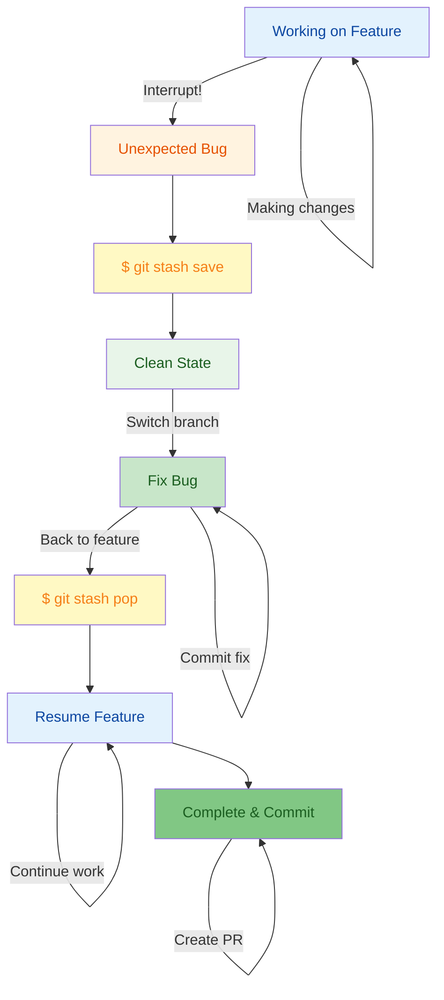

---

## 12. Stashing Reference Guide

### Complete Command Reference

```yaml
BASIC OPERATIONS:
  git stash                         # Save all changes
  git stash save "message"          # Save with name
  git stash list                    # View stashes
  git stash show                    # See latest stash
  git stash show -p                 # Full diff
  git stash apply                   # Apply latest
  git stash pop                     # Apply + delete
  git stash drop                    # Delete stash
  git stash clear                   # Delete all

ADVANCED:
  git stash push FILE               # Specific file
  git stash push -p                 # Interactive select
  git stash push -u                 # Include untracked
  git stash apply --index           # Restore staging
  git stash branch BRANCH           # Create branch
  git stash branch BRANCH STASH     # From specific stash
  git stash pop STASH@{1}           # Pop specific
  git stash show -p STASH@{1}       # View specific

SEARCHING:
  git stash list | grep PATTERN     # Search messages
  git stash show -p | grep CODE     # Search content
  git diff STASH@{0}                # Diff with working
  git diff STASH@{0} STASH@{1}      # Diff between stashes

RECOVERY:
  git reflog                        # Find lost stashes
  git fsck --lost-found             # Find dangling
  git stash apply HASH              # Recover by hash
```

### Quick Decision Tree

```
Need to switch branches?
├─ Incomplete work?
│  ├─ Save temporarily? → git stash
│  └─ Permanent? → git checkout -b new-branch
├─ Clean working dir? → git stash works great
└─ Keep for others? → Create branch instead

Have uncommitted changes?
├─ Want to save? → git stash
├─ Want to commit? → git add; git commit
└─ Want to discard? → git checkout -- file

Stash pop causes conflicts?
├─ Simple conflict? → Resolve manually
├─ Complex conflict? → git stash branch
└─ Prevent next time? → git rebase before pop

Multiple stashes active?
├─ Temporary? → Stash fine
├─ Long-term? → Use branches
└─ Lost track? → Better naming next time

Large/complex stash?
├─ Will cause conflicts? → Create branch
├─ Team needs it? → Create branch
└─ Just temporary? → Stash is fine
```

---

## 13. Stash Quick Reference Card

```yaml
Essential Stashing Guide:

SAVE WORK:
  git stash                    # Quick save
  git stash save "name"        # Named save
  git stash push FILE          # Specific file
  git stash push -p            # Interactive

VIEW WORK:
  git stash list               # See all
  git stash show -p            # Full view
  git stash show -p | grep X   # Search

RESTORE WORK:
  git stash apply              # Keep in stack
  git stash pop                # Apply + delete
  git stash apply STASH@{1}    # Specific stash

MANAGE STASHES:
  git stash drop               # Delete one
  git stash clear              # Delete all
  git stash branch             # Create from stash
  git reflog                   # Find lost stash

BEST PRACTICES:
  ✓ Use descriptive messages
  ✓ Review before applying
  ✓ Regular cleanup
  ✓ Use branches for complex
  ✓ Avoid stashing secrets

AVOID:
  ✗ Generic messages "stuff"
  ✗ Accumulating old stashes
  ✗ Using as backup
  ✗ Stashing credentials
  ✗ Forgetting stashes
```

---

**Last Updated:** January 7, 2026  
**Difficulty Level:** Intermediate  
**Prerequisites:** Git basics, branch experience, commit knowledge
