# Git Tags & Releases: Versioning & Release Management Guide

## Overview

Git tags mark specific points in a repository's history, typically used to identify release versions. Tags are immutable references that distinguish important commits (releases, milestones) from regular development. Understanding tags and releases is essential for version management, distribution, and maintaining clear project history. Releases build on tags by adding metadata, artifacts, and release notes to create comprehensive distribution packages.

### Why It Matters
- **Version tracking** - Identify exact release versions
- **Release management** - Organize and distribute software
- **History navigation** - Jump to specific milestones
- **Semantic versioning** - Follow industry standards
- **Artifact distribution** - Bundle code with binaries
- **Change documentation** - Release notes and changelog
- **Team communication** - What's in each version
- **Rollback capability** - Quickly identify past versions

### Main Use Cases
- Creating release versions (v1.0.0, v2.1.3, etc.)
- Marking significant milestones
- Creating release packages with artifacts
- Generating changelogs and release notes
- Building downloadable distributions
- Tagging stable, tested versions
- Maintaining version history
- Managing multiple release branches

---

## 1. Core Concepts & Fundamentals

### Git Tags Overview

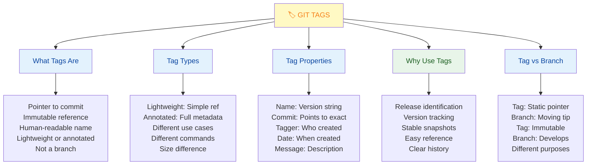

### Tag Types Comparison

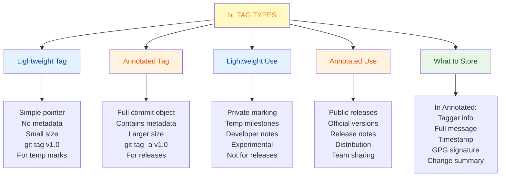

### Semantic Versioning (SemVer)

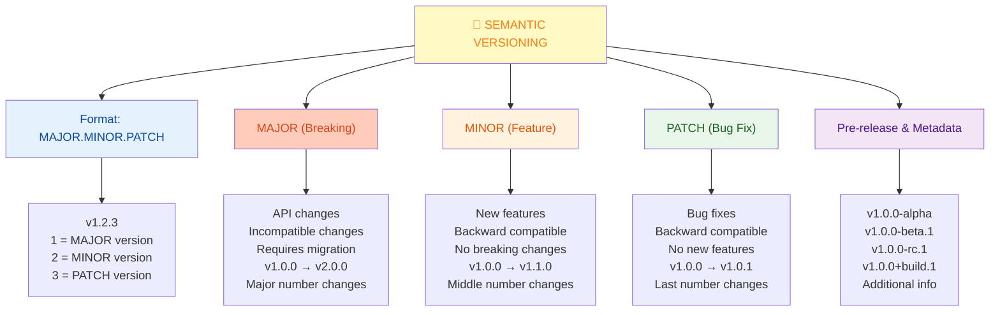

### Releases vs Tags

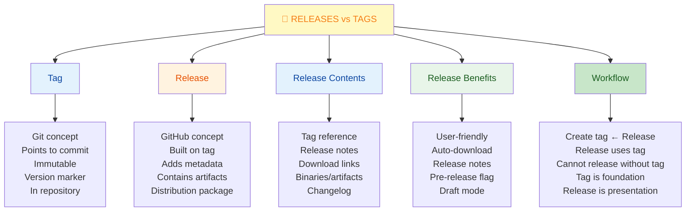

---

## 2. Creating & Managing Tags

### Creating Tags

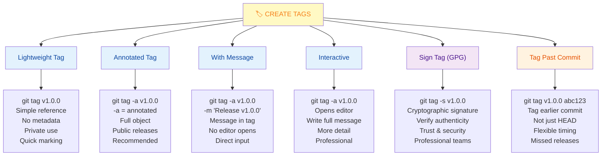

### Viewing & Listing Tags

```bash
# List all tags
git tag                           # Simple list
git tag -l                        # Same as above
git tag -l 'v1.*'                # Filter by pattern
git tag -l 'v1.*' --sort=-version:refname  # Latest first

# List with details
git tag -l -n                     # Show tag messages
git tag -l -n10                   # First 10 lines
git tag -l --format='%(tag) %(taggerdate)'  # Custom format

# Show specific tag
git show v1.0.0                   # Full tag info + commit
git show v1.0.0:file.txt          # File at that tag
git show v1.0.0 --stat            # Statistics

# Compare tags
git diff v1.0.0 v1.1.0            # Changes between
git log v1.0.0..v1.1.0            # Commits between
git log v1.0.0..v1.1.0 --oneline  # Compact view

# Find which tag a commit is in
git tag --contains abc123         # Tags containing commit
git describe --tags               # Nearest tag to HEAD
```

### Pushing Tags

```bash
# Push single tag
git push origin v1.0.0            # Push one tag
git push origin tag v1.0.0        # Explicit tag

# Push all tags
git push origin --tags            # All tags at once
git push origin --follow-tags     # With push (auto)

# Push specific range
git push origin v1.0.0 v1.1.0 v2.0.0

# Delete tag
git tag -d v1.0.0                 # Local delete
git push origin :v1.0.0           # Remote delete
git push origin --delete v1.0.0   # Explicit delete

# Configuration for follow-tags
git config --global push.followTags true
# Automatic with every push
```

### Deleting & Modifying Tags

```bash
# Delete local tag
git tag -d v1.0.0                 # Delete locally

# Delete remote tag
git push origin :refs/tags/v1.0.0 # Old style
git push --delete origin v1.0.0   # Modern style

# Rename tag (create new, delete old)
git tag new-name old-name
git tag -d old-name
git push origin new-name
git push --delete origin old-name

# Check tag before deleting
git show v1.0.0                   # Review tag
git log v1.0.0 -1                 # See commit
git tag -d v1.0.0                 # Delete if sure

# Re-tag (advanced, use carefully)
git tag -f v1.0.0 abc123          # Force update
git push origin -f v1.0.0         # Force push (dangerous!)
# Only do if no one has the tag!
```

---

## 3. Semantic Versioning Details

### Version Numbering Strategy

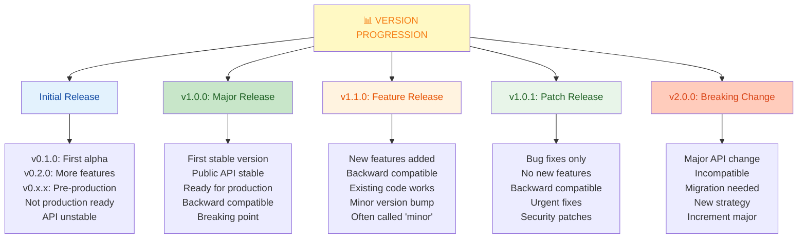

### Pre-release Versions

```yaml
Pre-release Versions:

Alpha (earliest development):
  v1.0.0-alpha
  v1.0.0-alpha.1
  v1.0.0-alpha.2
  Purpose: First testing version
  Status: Very unstable, features incomplete

Beta (feature complete, testing):
  v1.0.0-beta
  v1.0.0-beta.1
  v1.0.0-beta.2
  Purpose: Feature complete, finding bugs
  Status: Mostly stable, API final

Release Candidate (nearly ready):
  v1.0.0-rc1
  v1.0.0-rc2
  Purpose: Final testing before release
  Status: Production-ready except edge cases

Build metadata (additional info):
  v1.0.0+build.1
  v1.0.0-beta.1+20130313144700
  Purpose: Build info, not version
  Status: Ignored in version comparison

Example progression:
  v1.0.0-alpha → v1.0.0-beta → v1.0.0-rc.1 → v1.0.0
  └─ Each is a stable tag you can release
```

---

## 4. GitHub Releases

### Creating Releases

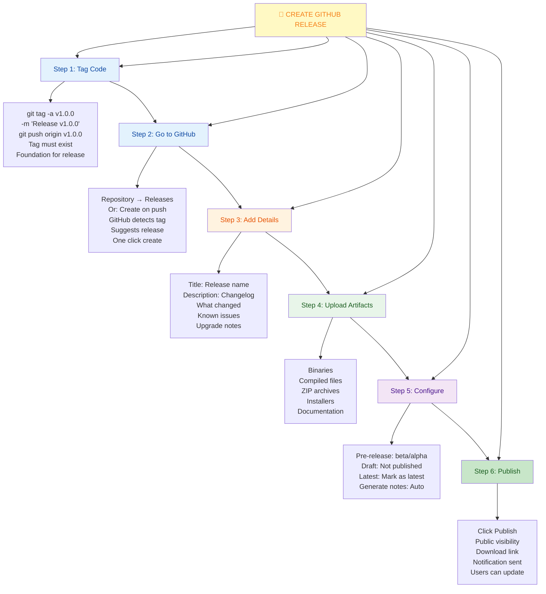

### Release Notes & Changelogs

```yaml
Release Notes Structure:

Title:
  Release v1.2.0: New Dashboard & Performance Improvements
  Clear, descriptive
  What's the highlight?

Summary:
  This release includes the new dashboard interface,
  significant performance improvements, and several
  bug fixes. See highlights below.

What's New (Features):
  - New dashboard with real-time metrics
  - Dark mode support
  - Improved search performance by 40%
  - Export to CSV functionality

Improvements (Changes):
  - Refactored database queries
  - Updated dependencies
  - Improved error messages

Bug Fixes:
  - Fixed null pointer in user profile
  - Fixed memory leak in background worker
  - Fixed typo in help text

Breaking Changes:
  ⚠️ API endpoint /api/v1/users changed to /api/v2/users
  ⚠️ Config format requires migration
  See upgrade guide

Migration Guide:
  For users upgrading from v1.1.x:
  1. Backup your data
  2. Run migration script
  3. Update config file
  See docs/UPGRADE.md

Downloads:
  [macos.zip] | [windows.exe] | [ubuntu.tar.gz]

Contributors:
  Thanks to @user1, @user2 for contributions

---

Changelog Example:
  ## [1.2.0] - 2024-01-15

  ### Added
  - New dashboard feature
  - Dark mode support
  - CSV export

  ### Changed
  - Updated to Node.js 20
  - Improved performance

  ### Fixed
  - Memory leak in worker
  - Null pointer error

  ### Removed
  - Legacy API endpoint

  ### Security
  - Updated dependencies for security
```

### Automated Release Notes

```bash
# GitHub CLI to generate release notes
gh release create v1.2.0 \
  --title "Version 1.2.0: New Features" \
  --generate-release-notes

# Generate from commits since last tag
gh release create v1.2.0 \
  --generate-release-notes \
  --target main

# Upload artifacts
gh release create v1.2.0 \
  --title "v1.2.0" \
  app-v1.2.0.zip \
  app-v1.2.0.exe \
  app-v1.2.0.tar.gz

# Mark as pre-release
gh release create v1.2.0-beta \
  --prerelease \
  --generate-release-notes

# Draft release (not published)
gh release create v1.2.0 \
  --draft \
  --title "Draft: v1.2.0"
```

---

## 5. Tagging & Release Workflows

### Complete Release Workflow

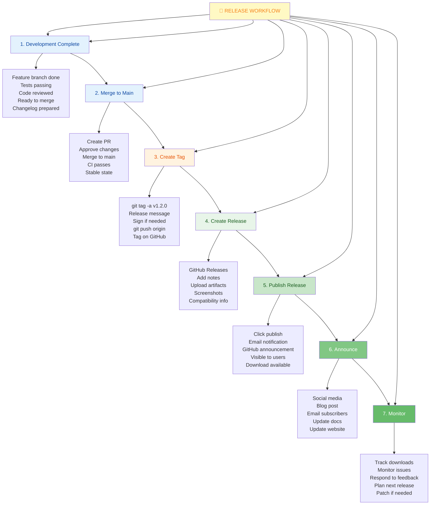

### Versioning Strategy

```yaml
Choosing Version Scheme:

Semantic Versioning (MAJOR.MINOR.PATCH):
  Pros:
    - Widely understood
    - Automatic tooling
    - Clear impact
    - Industry standard
  Cons:
    - v1.0.0 takes time
    - Can't use v10.0.0
    
  Examples: v1.2.3, v2.0.0, v3.1.4

Calendar Versioning (YEAR.MONTH.DAY):
  Pros:
    - Release date clear
    - Always unique
    - Simple scheme
  Cons:
    - Not semantic
    - Can't skip versions
    
  Examples: v2024.01.15, v2024.1.15

Simple Sequential (N):
  Pros:
    - Very simple
    - No confusion
  Cons:
    - No semantic meaning
    - Industry rare
    
  Examples: v1, v2, v3, v100

Hybrid (Common):
  Pattern: v2024.1.3-beta.1
  Year.Quarter.Release.PreRelease
  Combines benefits
  Still semantic

Recommendation:
  Use Semantic Versioning (v1.2.3)
  Industry standard
  Tool support
  Clear communication
```

---

## 6. Quick Cheatsheet

### Essential Tag Commands

```bash
# Create tags
git tag v1.0.0                      # Lightweight
git tag -a v1.0.0                  # Annotated (editor)
git tag -a v1.0.0 -m "Message"    # Annotated (message)
git tag -s v1.0.0                  # Signed (GPG)
git tag v1.0.0 abc123              # Tag past commit

# List tags
git tag                             # All tags
git tag -l 'v1.*'                  # Pattern filter
git tag -l -n                      # With messages
git tag -l --sort=-version:refname # Latest first

# View tag info
git show v1.0.0                    # Full details
git show v1.0.0 --stat             # Statistics
git log v1.0.0 -1                  # Commit info
git tag -l --format='%(tag) %(taggerdate)'

# Push tags
git push origin v1.0.0              # Single tag
git push origin --tags              # All tags
git config push.followTags true     # Auto-push

# Delete tags
git tag -d v1.0.0                  # Local delete
git push --delete origin v1.0.0    # Remote delete

# Compare versions
git diff v1.0.0 v1.1.0             # Between versions
git log v1.0.0..v1.1.0 --oneline   # Commits between

# Releases (GitHub CLI)
gh release create v1.0.0            # Create release
gh release create v1.0.0 --draft    # Draft
gh release create v1.0.0 --prerelease
gh release list                     # List releases
gh release download v1.0.0          # Download artifacts
```

### Common Tagging Patterns

```bash
# Pattern 1: Release Cycle
git tag -a v1.0.0 -m "Release v1.0.0"
git tag -a v1.1.0 -m "Feature release"
git tag -a v1.0.1 -m "Bug fix release"
# Each tag is a release candidate

# Pattern 2: Pre-releases
git tag -a v2.0.0-alpha -m "First alpha"
git tag -a v2.0.0-beta -m "Feature complete"
git tag -a v2.0.0-rc.1 -m "Release candidate"
git tag -a v2.0.0 -m "Stable release"
# Progression toward release

# Pattern 3: Milestone Tags
git tag -a milestone/beta -m "Beta ready"
git tag -a release/2024-Q1 -m "Q1 release"
git tag -a stable/lts -m "Long-term support"
# Organizational tags

# Pattern 4: Multiple Tracks
git tag -a v1.x/latest -m "Latest v1"
git tag -a v2.x/latest -m "Latest v2"
# Support multiple versions
```

---

## 7. Real-World Scenarios

### Scenario 1: First Release of a Project

**Situation:** Project ready for initial v1.0.0 release

**Preparation:**

```bash
# 1. Verify everything works
npm test                           # All tests pass
npm run build                      # Build succeeds

# 2. Update version references
# Update package.json version to 1.0.0
# Update VERSION file if exists
# Update README version references

# 3. Create changelog
# Write CHANGELOG.md with first release
# Section: [1.0.0] - 2024-01-15
# List features, improvements, known issues

# 4. Commit version changes
git add package.json CHANGELOG.md README.md
git commit -m "Bump: Release v1.0.0"

# 5. Create tag
git tag -a v1.0.0 -m "Release v1.0.0

Features:
- Complete user authentication
- Dashboard with metrics
- API v1 stable

Known Issues:
- Performance on large datasets

Contributors:
- @dev1, @dev2"

# 6. Push everything
git push origin main
git push origin v1.0.0

# 7. Create release on GitHub
gh release create v1.0.0 \
  --title "v1.0.0: Initial Release" \
  --notes "See CHANGELOG.md for details"

# 8. Upload artifacts
# Download page shows:
# - Binary for macOS
# - Binary for Windows
# - Binary for Linux
# - Docker image

# 9. Announce
# Blog post about v1.0.0
# Social media announcement
# Email to subscribers
```

**Result:**
- ✅ Clear version mark
- ✅ Published release
- ✅ Downloadable artifacts
- ✅ Complete changelog

---

### Scenario 2: Hotfix Release

**Situation:** Critical bug in v1.0.0, need v1.0.1 patch

**Process:**

```bash
# 1. Create hotfix branch from tag
git checkout -b hotfix/critical-bug v1.0.0
# Based on exact v1.0.0 commit

# 2. Fix the bug
# Edit file with bug
# Minimal change only
$ git diff
- buggy_code();
+ fixed_code();

# 3. Test fix
npm test                           # Must pass

# 4. Update version info
# Update CHANGELOG.md
# Update package.json to 1.0.1

# 5. Commit
git add .
git commit -m "Fix: Critical security issue

This patch fixes a critical SQL injection
vulnerability found in production.

CVE: CVE-2024-12345
Severity: Critical"

# 6. Tag patch version
git tag -a v1.0.1 -m "Patch: v1.0.1 - Security fix"

# 7. Merge back to main
git checkout main
git merge hotfix/critical-bug
git push origin main

# 8. Push tag
git push origin v1.0.1

# 9. Release
gh release create v1.0.1 \
  --title "v1.0.1: Security Patch" \
  --notes "Critical security fix. Update immediately."

# 10. Announce widely
# Email all users
# Social media alert
# Website notice
# Blog post details
```

**Result:**
- ✅ Minimal fix applied
- ✅ Users can upgrade easily
- ✅ Clear release notes
- ✅ Security properly communicated

---

### Scenario 3: Managing Multiple Release Versions

**Situation:** Supporting v1.x and v2.x in parallel

**Structure:**

```
Main Branch (v2.x development)
├─ v2.1.0
├─ v2.0.1
└─ v2.0.0

Maintenance Branch (v1.x support)
├─ v1.5.0
├─ v1.4.1
└─ v1.3.0

Workflow:

1. New Feature in v2
   git checkout main
   git checkout -b feature/new-dashboard
   # Implement and test
   git merge feature/new-dashboard
   git tag -a v2.1.0

2. Bug Fix in v1
   git checkout -b maintenance/v1.x
   git checkout -b hotfix/bug-fix
   # Fix bug
   git merge hotfix/bug-fix
   git tag -a v1.5.0
   # Backport to main if relevant
   git merge maintenance/v1.x -m "Backport: fix"
   git tag -a v2.0.1

3. Release Both
   gh release create v1.5.0
   gh release create v2.0.1
   gh release create v2.1.0

Documentation:
   - v2.x: Latest, active development
   - v1.x: LTS, critical fixes only
   - v0.x: Deprecated, no support

Users:
   - New projects: Use v2.x
   - Existing on v1.x: Can stay or upgrade
   - Security: Patch both if critical
```

**Benefits:**
- ✅ Support existing users
- ✅ Development not blocked
- ✅ Clear upgrade path
- ✅ Maintenance manageable

---

## 8. Best Practices & Anti-Patterns

### Tagging Best Practices

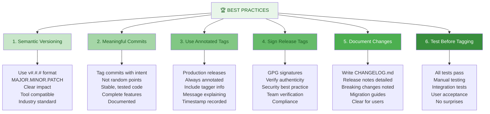

### Anti-Patterns to Avoid

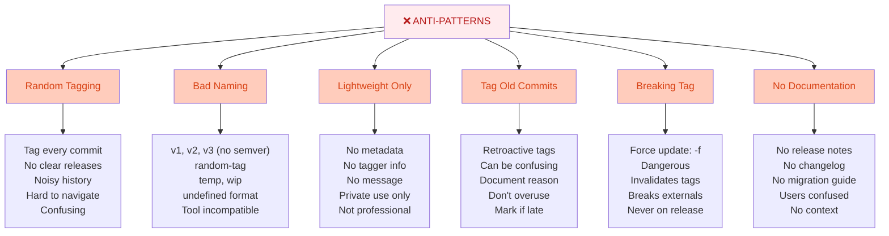

---

## 9. Summary & Key Takeaways

### What You Should Know

✅ **Tags mark important commits** - Version identification  
✅ **Two tag types** - Lightweight (simple) vs Annotated (full metadata)  
✅ **Semantic Versioning** - MAJOR.MINOR.PATCH standard  
✅ **Releases build on tags** - GitHub releases for distribution  
✅ **Immutable references** - Tags never change  
✅ **Public vs private** - Annotated tags for releases  
✅ **Document changes** - CHANGELOG and release notes  
✅ **Sign releases** - GPG signatures for authenticity  

### Tag vs Release vs Branch

| Aspect | Tag | Release | Branch |
|--------|-----|---------|--------|
| **Purpose** | Mark commit | Distribute | Develop |
| **Persistence** | Permanent | Permanent | Moving |
| **Metadata** | Optional | Full | None |
| **Distribution** | Via repo | Download | Via clone |
| **Immutable** | Yes | Yes | No |
| **Public API** | Git | GitHub | Git |
| **Use case** | Versioning | Users | Development |

---

## 10. Interview & Exam Prep

### Common Interview Questions

**Q1: What's the difference between a git tag and a git branch?**
> Tags are immutable pointers to specific commits used for marking versions, while branches are moving references to development lines. Tags are for versioning and releases, branches for parallel development. Tags don't move when you commit; branches do. Tags are meant to be permanent markers; branches evolve.

**Q2: Explain semantic versioning and when to increment each number.**
> Semantic versioning uses MAJOR.MINOR.PATCH format. MAJOR increments for incompatible API changes, MINOR for backward-compatible feature additions, and PATCH for backward-compatible bug fixes. For example, v1.2.3 to v1.3.0 adds features, v1.2.3 to v1.2.4 fixes bugs, v1.2.3 to v2.0.0 makes breaking changes.

**Q3: What are the two types of git tags and when would you use each?**
> Lightweight tags are simple references with no metadata—use them for private marking. Annotated tags store full metadata (tagger, date, message, signature)—use them for official releases. Lightweight tags are quick and temporary; annotated tags are professional and recommended for public releases.

**Q4: How would you create a release from an older commit you forgot to tag?**
> Use `git tag -a v1.0.0 abc123def` to tag the past commit by its hash. Then `git push origin v1.0.0` to push the tag. On GitHub, create a release pointing to that tag. It's valid to tag after the fact, just document why it's late.

**Q5: Describe a workflow for managing hotfixes in released code.**
> Create a hotfix branch from the release tag: `git checkout -b hotfix/bug v1.0.0`. Fix the bug minimally, test, and commit. Tag as v1.0.1 (patch version). Push the tag and create a release. Merge the fix back to main to prevent regression. This keeps hotfixes separate from development.

**Q6: What information should always be in a release?**
> Release notes should include: summary of changes, new features, improvements, bug fixes, known issues, breaking changes with migration guides, and compatible versions. Download links for artifacts, supported platforms, and installation instructions are essential. Contributors should be acknowledged.

**Q7: How do you sign a git tag for security?**
> Use `git tag -s v1.0.0` to sign with GPG. Requires GPG setup and a signing key. Verify signatures with `git verify-tag v1.0.0`. Organizations use signed tags to verify authenticity and track who approved releases. Proves the tag wasn't modified after creation.

**Q8: Explain how you'd manage supporting both v1.x and v2.x simultaneously.**
> Maintain separate maintenance branch for v1.x. Develop new features on main for v2.x. Critical security fixes go to both: fix on v1.x branch, tag v1.x.x, backport to main, tag v2.x.x. Use clear documentation about which version is recommended. Eventually deprecate v1.x with migration guides.

### Practice Scenarios

**Scenario A:** You've been working on features for a month and need to release v2.0.0. Walk through the process.

Steps:
1. Ensure all tests pass locally
2. Update CHANGELOG.md with new features and breaking changes
3. Update version in package.json to 2.0.0
4. Commit with message "Release: v2.0.0"
5. Create annotated tag: `git tag -a v2.0.0 -m "Release v2.0.0"`
6. Push to remote: `git push origin main && git push origin v2.0.0`
7. On GitHub, go to Releases
8. Create release from v2.0.0 tag
9. Add detailed release notes (features, breaking changes, migration guide)
10. Upload artifacts (binaries, distributions)
11. Publish release
12. Announce on social media, blog, email

**Scenario B:** A critical security vulnerability is found in v1.2.0. How would you handle it?

Steps:
1. Create hotfix branch: `git checkout -b hotfix/security v1.2.0`
2. Implement minimal fix for the vulnerability
3. Add test to prevent regression
4. Verify tests pass
5. Update CHANGELOG.md: "SECURITY: Fixed XYZ vulnerability"
6. Commit: `git commit -m "Fix: Security vulnerability"`
7. Create tag: `git tag -a v1.2.1 -m "Patch: v1.2.1 - Security fix"`
8. Push tag
9. Create release with prominent security warning
10. Merge back to main to prevent regression
11. Send urgent notification to all users

**Scenario C:** You realize you forgot to tag v1.5.0 even though it was released. Fix this.

Steps:
1. Find the commit: `git log --oneline | grep "Release 1.5.0"`
2. Note the commit hash (e.g., abc123def)
3. Create tag: `git tag -a v1.5.0 abc123def -m "Release v1.5.0 (tagged retroactively)"`
4. Push tag: `git push origin v1.5.0`
5. On GitHub, create release from tag
6. Add note explaining it's retroactive
7. Ensure future releases are tagged immediately

---

## 11. Troubleshooting Common Issues

### Issue: Tag Already Exists

**Problem:** `git tag v1.0.0` fails because tag already exists

**Solutions:**

```bash
1. Check if Tag Exists
   git tag -l v1.0.0                # See if exists
   git show v1.0.0                  # View details
   
2. Options:

   A) Delete and Recreate
      git tag -d v1.0.0             # Delete locally
      git push --delete origin v1.0.0  # Delete remote
      git tag -a v1.0.0 -m "new"   # Recreate
      git push origin v1.0.0
      # Only if no one pulled the old tag!

   B) Use Different Version
      git tag -a v1.0.1 -m "message"  # Next version
      # Cleaner if not released

   C) Check What's Different
      git show v1.0.0                # Existing tag
      git log HEAD -1                # Current commit
      # Are they the same?
      # If same commit, no problem
      # If different, need to decide

3. Prevention
   git tag -l                        # Check before creating
   Pick version carefully first
```

### Issue: Tag Not Pushed to Remote

**Problem:** Tag exists locally but not on GitHub

**Solutions:**

```bash
1. Check Status
   git tag                           # Local tags
   git ls-remote --tags origin       # Remote tags
   
2. Push Specific Tag
   git push origin v1.0.0            # Single tag
   git push origin --tags            # All tags
   
3. Enable Auto-push
   git config --global push.followTags true
   # Every git push includes tags
   
4. Verify Pushed
   git ls-remote --tags origin | grep v1.0.0
   # Should see tag listed
   
5. Common Mistake
   git push                          # Doesn't push tags
   git push origin                   # Doesn't push tags
   git push origin --tags            # DOES push tags
   # Or enable followTags config
```

### Issue: Deleted Tag But It Still Shows

**Problem:** Tag deleted locally but appears remotely, or vice versa

**Solutions:**

```bash
1. Sync Local and Remote
   # Delete locally, push delete
   git tag -d v1.0.0
   git push --delete origin v1.0.0
   
   # Delete remotely, fetch delete
   git fetch origin
   git tag -d v1.0.0
   
2. Clean Up
   git fetch origin --prune
   # Remove deleted remote tags
   
3. Check Status
   git tag -l | grep v1.0.0          # Local
   git ls-remote --tags origin | grep v1.0.0  # Remote
   # Should match after sync
   
4. Force Sync (if needed)
   git fetch --all --tags --prune
   # Download all, clean old
   # Use carefully
```

### Issue: Tag Points to Wrong Commit

**Problem:** Tag created on wrong commit, need to fix

**Solutions:**

```bash
1. Verify
   git show v1.0.0                   # See tag
   git log --oneline | head -10      # Find correct
   
2. If Not Pushed (Easiest)
   git tag -d v1.0.0
   git tag -a v1.0.0 abc123
   # Recreate on correct commit
   git push origin v1.0.0
   
3. If Already Pushed
   git tag -d v1.0.0
   git push --delete origin v1.0.0
   git tag -a v1.0.0 abc123
   git push origin v1.0.0
   # Delete and recreate
   
4. Force Update (DANGEROUS)
   git tag -f -a v1.0.0 abc123
   git push -f origin v1.0.0
   # Only if no one using the tag!
   # Can break external links
   
5. Create New Version (SAFE)
   git tag -a v1.0.0-fixed abc123
   # Better approach
   # Don't rewrite existing tags
```

### Issue: Release Notes Generation Problems

**Problem:** `--generate-release-notes` produces bad output

**Solutions:**

```bash
1. Enable in Settings
   Repository → Settings
   → Releases → Auto-generated notes
   → Configure templates
   
2. Create PR Labels
   - label: feature
     label_name: Features
   - label: bug
     label_name: Bug Fixes
   - label: breaking-change
     label_name: Breaking Changes
   
   Tool uses labels to categorize
   
3. Manual Notes
   gh release create v1.0.0 \
     --title "Release 1.0.0" \
     --notes "Feature: X
              Bug fix: Y
              Breaking: Z"
   # Write manually if auto is bad
   
4. Template
   Create .github/release.yml:
   
   changelog:
     categories:
       - title: Breaking Changes
         labels:
           - breaking-change
       - title: Features
         labels:
           - enhancement
   
   # Customize output format
```

---

## 12. Visual Summary

### Complete Release Lifecycle

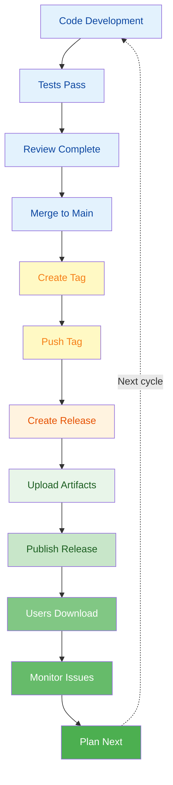

---

## 13. Tags & Releases Reference

### Quick Reference Table

```yaml
Task | Command | Notes
-----|---------|------
List all tags | git tag | Simple list
Filter tags | git tag -l 'v1.*' | Pattern matching
Create lightweight | git tag v1.0.0 | No metadata
Create annotated | git tag -a v1.0.0 | With metadata
Add message | git tag -a v1.0.0 -m "msg" | Short message
Sign tag | git tag -s v1.0.0 | GPG signature
Show tag | git show v1.0.0 | Details + commit
List with messages | git tag -l -n | Shows messages
Tag past commit | git tag v1.0.0 abc123 | Use commit hash
Delete local | git tag -d v1.0.0 | Local only
Delete remote | git push --delete origin v1.0.0 | From GitHub
Push one tag | git push origin v1.0.0 | Single tag
Push all tags | git push origin --tags | All tags at once
Compare versions | git diff v1.0.0 v1.1.0 | See changes
Commits between | git log v1.0.0..v1.1.0 | List commits
Verify signature | git verify-tag v1.0.0 | GPG verification
Create release | gh release create v1.0.0 | GitHub CLI
Create draft | gh release create --draft v1.0.0 | Not published
Pre-release | gh release create --prerelease v1.0.0-beta | Beta flag
Upload artifacts | gh release create v1.0.0 file.zip | With files

Semantic Versioning Examples:
v0.1.0        → Alpha/development version
v1.0.0        → First stable release
v1.1.0        → New features, backward-compatible
v1.0.1        → Bug fix only
v2.0.0        → Breaking changes
v2.0.0-beta   → Pre-release version
v1.0.0+build.1 → Build metadata

Best Practices Checklist:
☑ Use semantic versioning (MAJOR.MINOR.PATCH)
☑ Use annotated tags for releases
☑ Sign important tags with GPG
☑ Write clear release notes
☑ Document breaking changes
☑ Test thoroughly before tagging
☑ Include migration guides if needed
☑ Announce releases to users
☑ Keep CHANGELOG.md updated
☑ Upload artifacts to releases
☑ Set pre-release flag for beta
☑ Mark latest version clearly
```

---

**Last Updated:** January 7, 2026  
**Difficulty Level:** Intermediate  
**Prerequisites:** Git basics, branching experience, repository understanding
