# Git vs GitHub: Complete Comparison Guide

## Overview
Git and GitHub are often confused, but they serve completely different purposes. Understanding the distinction is crucial for effective version control and collaboration.

---

## 1. Git vs GitHub - Fundamental Differences

### Visual Architecture

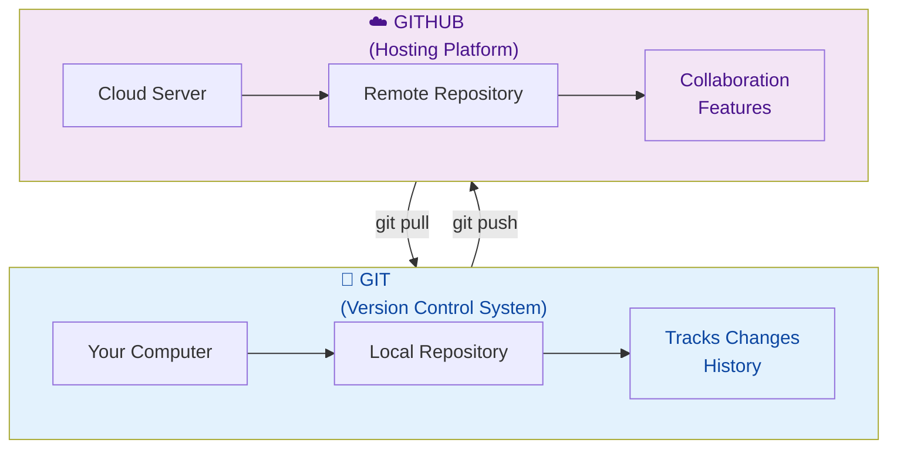

### Head-to-Head Comparison

| Feature | Git | GitHub |
|---------|-----|--------|
| **Type** | Version Control System (VCS) | Web-based hosting platform |
| **Installation** | Download & install locally | Cloud-based, no installation needed |
| **Primary Function** | Track code changes locally | Host repositories online |
| **Created By** | Linus Torvalds (2005) | Founded by Tom Preston-Werner (2008) |
| **Cost** | Free & open-source | Free with premium plans |
| **Command-line** | Yes, fully CLI-based | Web UI + CLI via Git |
| **Local Operation** | Works completely offline | Requires internet connection |
| **Collaboration** | Limited (manual file sharing) | Built-in for teams |
| **PR/Issues** | Not available | Core features |
| **Code Review** | Manual process | Integrated review tools |
| **Access Control** | File-system based | Granular repo-level permissions |
| **CI/CD** | Not built-in | GitHub Actions available |

### Side-by-Side Definition

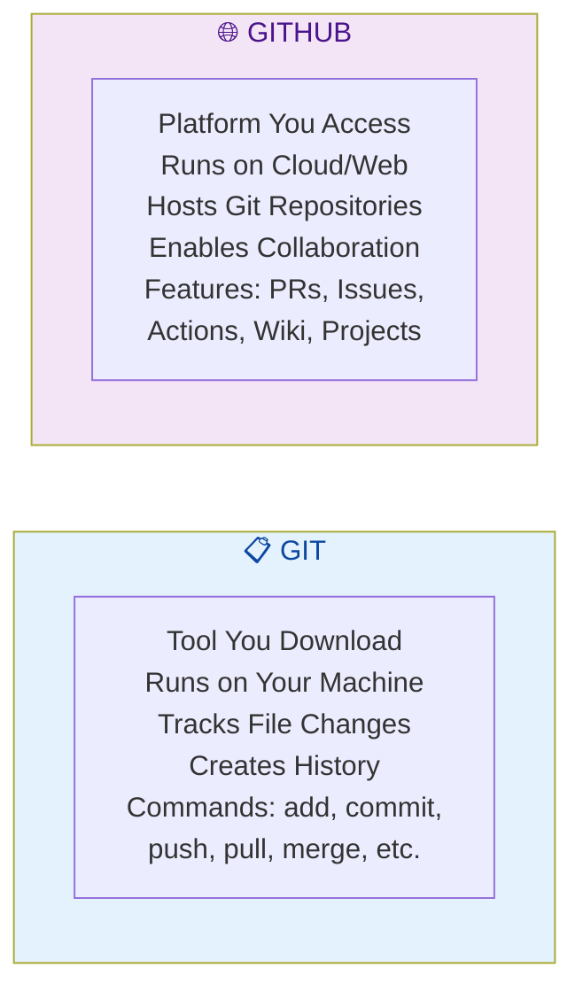

---

## 2. Core Concepts & Relationships

### The Ecosystem

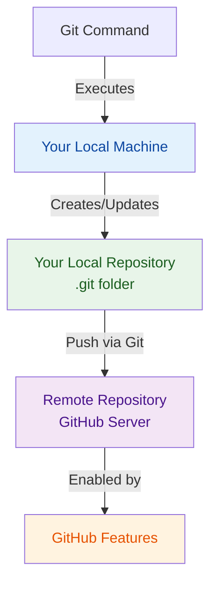

### What Each Handles

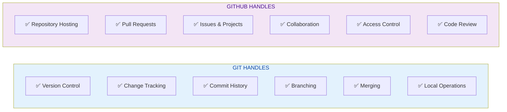

---

## 3. Detailed Breakdown

### What is Git?

**Definition:** Git is a distributed version control system that tracks changes to your code locally.

**Key Characteristics:**
- ✅ **Decentralized** - Works offline, no server needed
- ✅ **Local-first** - Repository stored on your machine
- ✅ **Command-line tool** - Operated via terminal commands
- ✅ **Free & open-source** - Developed by community
- ✅ **Tracks history** - Every change saved with details
- ✅ **Branching support** - Easy to create isolated work branches
- ✅ **Merge capabilities** - Combine branches with conflict detection

**What You Do With Git:**
```bash
git init                 # Start version control
git add .               # Stage changes
git commit -m "msg"     # Save changes with message
git branch feature      # Create new branch
git merge feature       # Combine branches
git log                 # View history
git diff               # See what changed
```

### What is GitHub?

**Definition:** GitHub is a cloud-based platform that hosts Git repositories and enables team collaboration.

**Key Characteristics:**
- ✅ **Cloud-hosted** - Repositories on GitHub servers
- ✅ **Web interface** - Easy-to-use dashboard
- ✅ **Collaboration built-in** - Teams can work together
- ✅ **Social features** - Follow developers, star repos
- ✅ **Pull Requests** - Propose & review changes
- ✅ **Issues tracking** - Bug reports & feature requests
- ✅ **GitHub Actions** - Automated testing & deployment

**What You Do on GitHub:**
```
Create Pull Requests      # Propose changes
Review code              # Comment on changes
Manage Issues            # Track bugs & features
Run Actions              # Automate workflows
Control Access           # Permissions management
Create Wiki              # Documentation
```

---

## 4. Relationship: How They Work Together

### The Complete Workflow

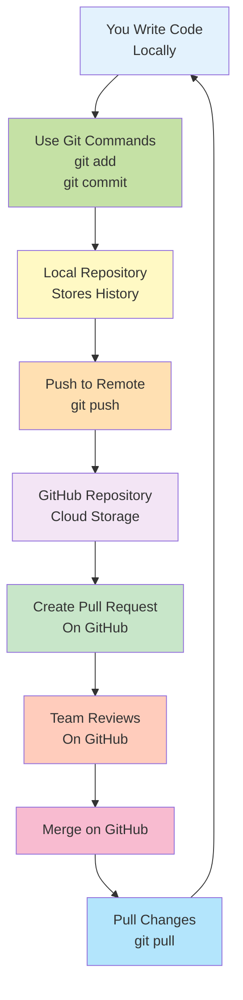

### Without GitHub (Git Alone)

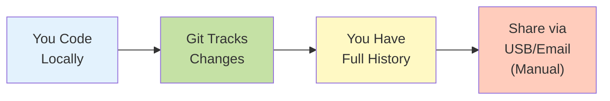

### Without Git (GitHub Alone)

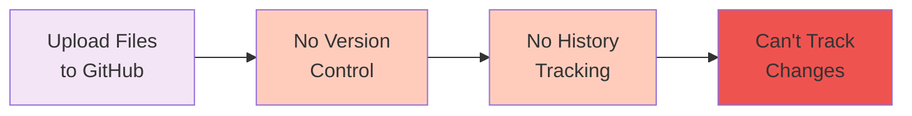

---

## 5. Quick Cheatsheet

### Git Commands (What You Run Locally)

```bash
# SETUP
git config --global user.name "Your Name"
git config --global user.email "email@example.com"
git init                              # Initialize repository

# BASIC WORKFLOW
git add <file>                        # Stage changes
git add .                             # Stage all changes
git commit -m "message"               # Save changes
git status                            # Check status
git log                               # View history
git diff                              # See what changed

# BRANCHING
git branch                            # List branches
git branch feature-name               # Create branch
git checkout feature-name             # Switch branch
git checkout -b feature-name          # Create & switch

# PUSHING & PULLING
git push origin branch-name           # Upload to GitHub
git pull origin branch-name           # Download from GitHub
git fetch origin                      # Get updates (no merge)

# MERGING & UNDOING
git merge feature-name                # Merge branch
git reset HEAD~1                      # Undo last commit
git revert <commit-hash>              # Undo commit (safe)
```

### GitHub Actions (What You Do on Website)

```
Create Pull Request    → Propose changes
Review Changes         → Comment & approve
Merge PR              → Combine to main
Manage Issues         → Track bugs
Create Discussions    → Team conversations
Set Up Actions        → Automate workflows
```

### Decision Tree: Do I Need Git or GitHub?

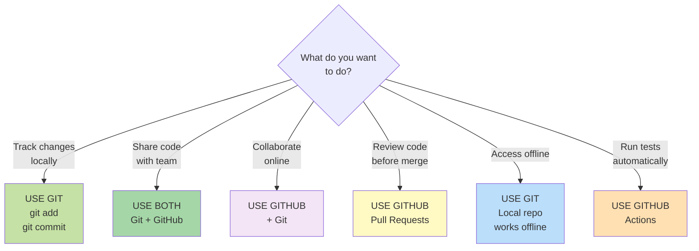

---

## 6. Real-World Scenarios

### Scenario 1: Solo Developer (Just Learning)

**Do you need GitHub?** ❌ No, not necessarily

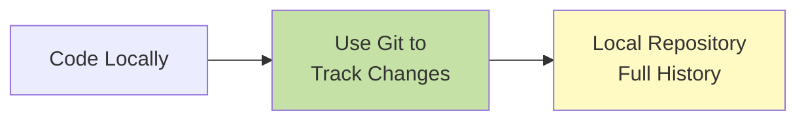

**Best Practice:**
- ✅ Use Git to track your changes
- ✅ Learn Git commands thoroughly
- ✅ GitHub optional for beginners (but recommended to learn)
- ❌ Don't need GitHub features if working alone

**Commands:**
```bash
git init
git add .
git commit -m "Initial commit"
git log  # See all your commits
```

---

### Scenario 2: Team Project (Multiple Developers)

**Do you need GitHub?** ✅ YES, absolutely!

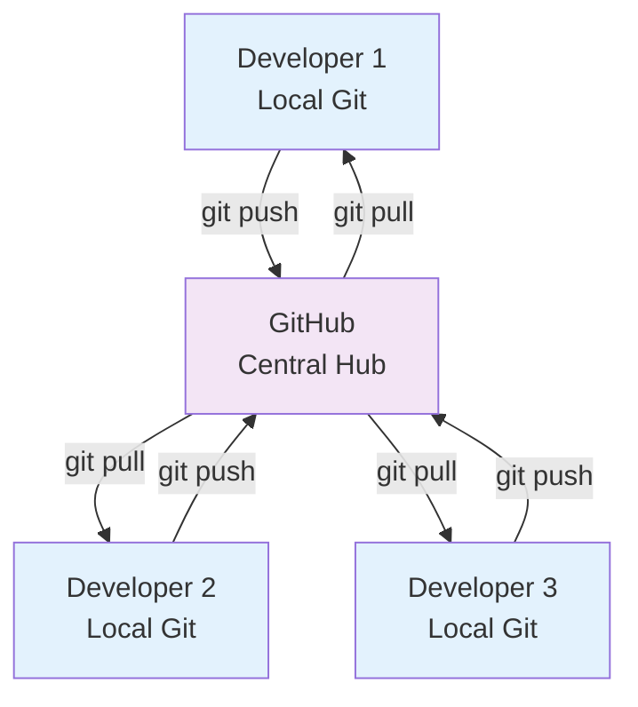

**Best Practice:**
- ✅ Each dev has local Git repo
- ✅ GitHub is central repository
- ✅ Use Pull Requests for code review
- ✅ Merge after approval
- ✅ Everyone pulls latest changes

---

### Scenario 3: Open Source Contribution

**Do you need GitHub?** ✅ YES, essential!

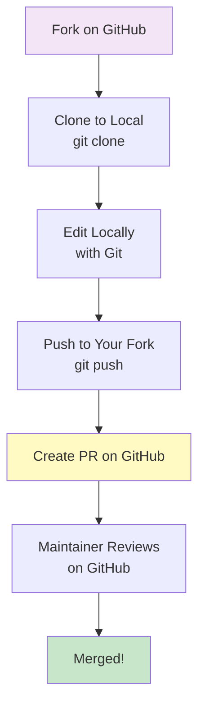

**Best Practice:**
- ✅ Need GitHub to fork & submit PR
- ✅ Use Git locally for coding
- ✅ GitHub handles review process
- ✅ Maintainer controls merging

---

### Scenario 4: Enterprise/Company Project

**Do you need GitHub?** ✅ YES (or GitLab/Bitbucket)

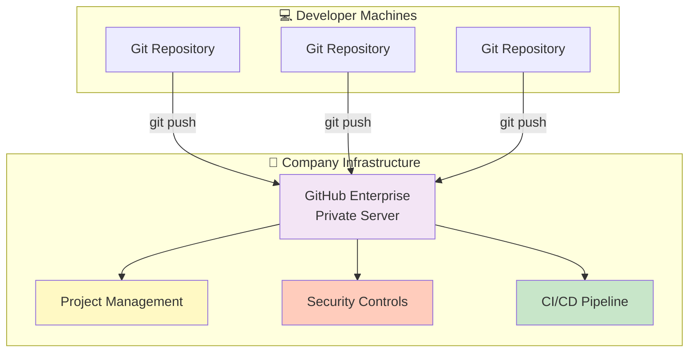

**Best Practice:**
- ✅ GitHub Enterprise for security
- ✅ Git for local development
- ✅ GitHub for code review & approval
- ✅ Automated testing & deployment

---

## 7. Common Misconceptions

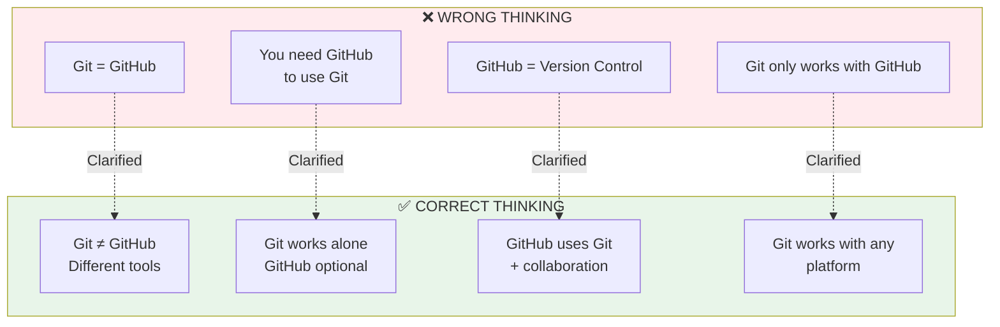

---

## 8. Comparison Table for Different Use Cases

| Use Case | Git Needed | GitHub Needed | Alternative |
|----------|-----------|---------------|-------------|
| **Solo coding** | ✅ Yes | ❌ No | Git only |
| **Team collaboration** | ✅ Yes | ✅ Yes | GitLab, Bitbucket |
| **Open source** | ✅ Yes | ✅ Yes | GitLab, Gitea |
| **Code backup** | ✅ Yes | ✅ Recommended | Any git hosting |
| **Learning Git** | ✅ Yes | ❌ No* | Local repo sufficient |
| **Portfolio/resume** | ✅ Yes | ✅ Yes | Portfolio site |
| **Enterprise** | ✅ Yes | ✅ Yes* | GitHub Enterprise, GitLab |
| **Private projects** | ✅ Yes | ✅ Recommended | Self-hosted Git |

*Recommended for learning purposes, but not technically necessary

---

## 9. Interview & Exam Preparation

### Key Questions & Answers

| Question | Answer | Key Point |
|----------|--------|-----------|
| **What is Git?** | Version control system that tracks file changes locally | It's a tool, not a platform |
| **What is GitHub?** | Cloud platform that hosts Git repositories | It's a service, not a tool |
| **Can you use Git without GitHub?** | Yes, completely. Git works offline on your machine | GitHub is optional |
| **Can you use GitHub without Git?** | No. GitHub relies on Git technology | You need Git to use GitHub |
| **What's the main difference?** | Git = local version control, GitHub = cloud collaboration | Different purposes |
| **Is GitHub only for open source?** | No. Supports private repos and enterprise | Public + private options |
| **What alternatives to GitHub exist?** | GitLab, Bitbucket, Gitea, self-hosted Git | GitHub isn't the only option |
| **Do companies use GitHub?** | Yes, widely adopted. Some use GitLab or self-hosted | Industry standard |
| **What features does GitHub add?** | PRs, Issues, Actions, Projects, Discussions | Collaboration tools |
| **Can Git work offline?** | Yes, all operations work locally | No internet needed for commits |

### Quick Comparison for Exams

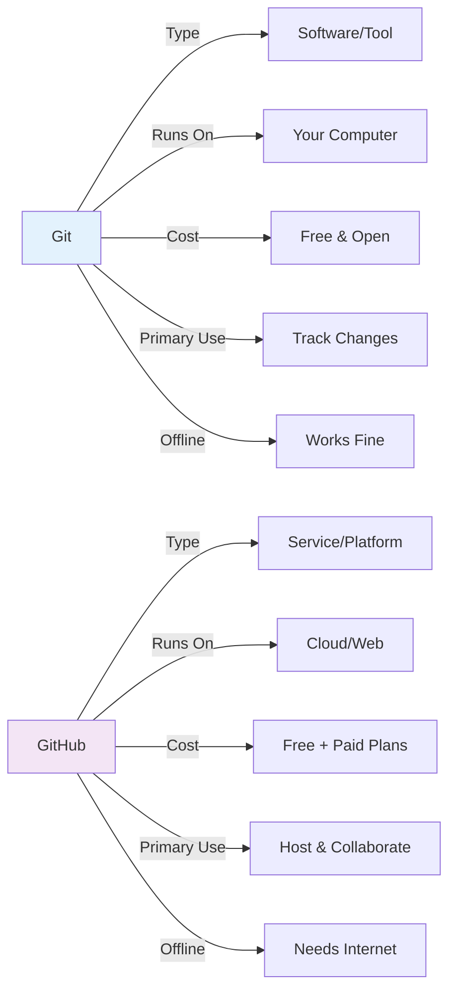

---

## 10. When to Use Git vs GitHub

### Decision Matrix

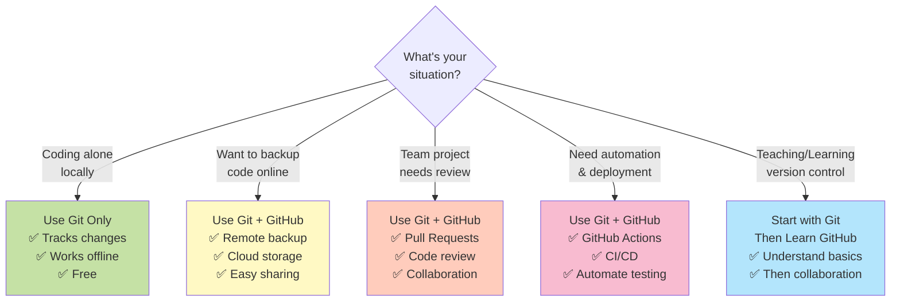

---

## 11. Summary Table

| Aspect | Git | GitHub |
|--------|-----|--------|
| **Installation** | Download & install | No installation needed |
| **Interface** | Command-line | Web + mobile app |
| **Data Storage** | Local `.git` folder | Cloud servers |
| **Offline** | ✅ Fully functional | ❌ No internet access |
| **Change Tracking** | ✅ Core feature | Feature via Git |
| **Pull Requests** | ❌ Not available | ✅ Core feature |
| **Code Review** | Manual | Built-in tools |
| **Team Collaboration** | Limited | ✅ Full features |
| **Cost** | Free & open-source | Free + premium |
| **Use Without Other** | ✅ Yes, alone | ❌ No, needs Git |
| **Learning Curve** | Moderate | Easy (if know Git) |
| **Industry Use** | Universal | Very common |

---

## Key Takeaways

1. **Git is a tool** → Downloads and runs on your computer
2. **GitHub is a platform** → Cloud service that hosts Git repos
3. **You can use Git without GitHub** → But GitHub needs Git
4. **GitHub adds collaboration** → PRs, issues, actions, etc.
5. **Git works offline** → GitHub always needs internet
6. **Start with Git** → Then learn GitHub features
7. **Alternatives exist** → GitLab, Bitbucket, etc.
8. **Both are essential in teams** → Git locally, GitHub remotely

---

**Created:** January 6, 2026
**Status:** Learning Reference Guide
