# Git Workflows: Gitflow, GitHub Flow & Trunk-Based Development Guide

## Overview

Git workflows are structured branching strategies and release processes that teams follow to collaborate effectively. Different workflows suit different team sizes, release cadences, and complexity levels. Understanding which workflow to use transforms chaotic collaboration into disciplined, predictable releases.

### Why Git Workflows Matter

Without a workflow, teams create accidental branching chaos: commits on wrong branches, confusing merge histories, unclear which code is production-ready, and coordination disasters during releases. A good workflow provides a shared mental model, prevents mistakes at scale, and enables smooth deployments. It's the difference between "who broke production?" and "here's exactly how code flows to production."

**Key Benefits:**
- **Clear process**: Everyone knows how code moves from idea to production
- **Release confidence**: Structured releases with predictable quality gates
- **Team coordination**: Prevents the "oops, didn't know you were working on that" conflicts
- **Code review**: Enforces review before code reaches critical branches
- **Hotfix capability**: Quick fixes without disrupting ongoing development
- **Parallel work**: Multiple teams developing features simultaneously
- **History clarity**: Clean, understandable git history
- **Scalability**: Works from solo developers to large teams
- **Rollback safety**: Easy revert if something breaks

### Main Use Cases

1. **Feature development**: Multiple developers building features in parallel
2. **Release management**: Structured releases to production on schedule
3. **Hotfixes**: Emergency fixes to production without disrupting development
4. **Version maintenance**: Supporting multiple versions simultaneously
5. **Code review**: Enforcing peer review before integration
6. **Continuous deployment**: Rapid small deployments frequently
7. **Continuous integration**: Build automation tied to specific branches
8. **Team coordination**: Preventing merge conflicts and coordination issues
9. **Open source**: Managing contributions from external developers
10. **Enterprise compliance**: Audit trails and controlled releases

---

## 1. Git Workflows: Core Concepts

### What Is a Git Workflow?

A Git workflow is a set of rules and conventions for how branches are created, named, used, and merged. It defines:
- Which branches are "special" (protected)
- How feature development happens
- When and how code reaches production
- How hotfixes are handled
- When branches are deleted
- How releases are versioned and tagged

```mermaid
graph TB
    A["Git Workflow Definition"] --> B["Branch Creation Rules"]
    A --> C["Naming Conventions"]
    A --> D["Merge Requirements"]
    A --> E["Release Process"]
    A --> F["Hotfix Procedure"]
    
    B --> B1["When to create branches"]
    B --> B2["From which base branch"]
    B --> B3["How many levels deep"]
    
    C --> C1["Descriptive names"]
    C --> C2["Type prefixes"]
    C --> C3["Slash conventions"]
    
    D --> D1["Code review required"]
    D --> D2["CI/CD passing"]
    D --> D3["Who can approve"]
    
    E --> E1["When to release"]
    E --> E2["Release branch creation"]
    E --> E3["Tagging strategy"]
    
    F --> F1["Emergency fix procedure"]
    F --> F2["Backport to releases"]
    F --> F3["Communication"]
    
    style A fill:#E3F2FD,stroke:#1976D2,stroke-width:2px
    style B fill:#F3E5F5,stroke:#7B1FA2,stroke-width:1.5px
    style C fill:#F3E5F5,stroke:#7B1FA2,stroke-width:1.5px
    style D fill:#F3E5F5,stroke:#7B1FA2,stroke-width:1.5px
```

### Universal Workflow Principles

```mermaid
graph TB
    A["Universal Git Workflow Principles"] --> B["1. Protected Branches"]
    A --> C["2. Feature Isolation"]
    A --> D["3. Code Review"]
    A --> E["4. CI/CD Integration"]
    A --> F["5. Version Tracking"]
    
    B --> B1["main/master never directly committed"]
    B --> B2["Releases clearly marked"]
    B --> B3["History readable and safe"]
    
    C --> C1["Features in separate branches"]
    C --> C2["No interference with others"]
    C --> C3["Easy to abandon if needed"]
    
    D --> D1["Pull requests for review"]
    D --> D2["At least one approval"]
    D --> D3["Conversation recorded"]
    
    E --> E1["Tests run automatically"]
    E --> E2["Deploy to staging first"]
    E --> E3["Production gate before merge"]
    
    F --> F1["Versions clearly marked"]
    F --> F2["Release notes documented"]
    F --> F3["Rollback capability"]
    
    style B1 fill:#E8F5E9,stroke:#388E3C,stroke-width:1.5px
    style C1 fill:#E8F5E9,stroke:#388E3C,stroke-width:1.5px
    style D1 fill:#E8F5E9,stroke:#388E3C,stroke-width:1.5px
    style E1 fill:#E8F5E9,stroke:#388E3C,stroke-width:1.5px
    style F1 fill:#E8F5E9,stroke:#388E3C,stroke-width:1.5px
```

### Workflow Selection Decision

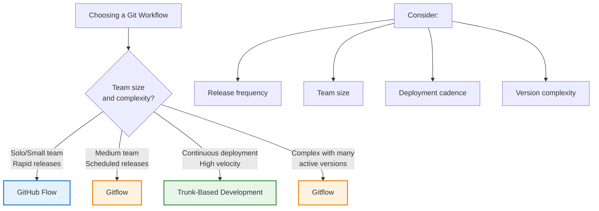

---

## 2. GitHub Flow: Simple & Lightweight

### What Is GitHub Flow?

GitHub Flow is the simplest Git workflow. It has one long-lived branch (`main`) and temporary feature branches. Perfect for continuous deployment and rapid iteration. Popularized by GitHub itself for rapid web application development.

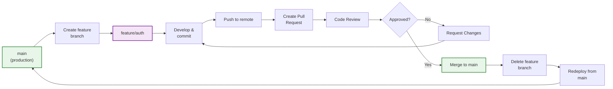

### GitHub Flow Rules

```mermaid
graph TB
    A["GitHub Flow Rules"] --> B["Rule 1: main is deployable"]
    A --> C["Rule 2: Feature branches<br/>from main"]
    A --> D["Rule 3: Descriptive names"]
    A --> E["Rule 4: Pull Request<br/>for review"]
    A --> F["Rule 5: Merge only<br/>after review"]
    A --> G["Rule 6: Deploy & monitor"]
    A --> H["Rule 7: Delete after<br/>merge"]
    
    B --> B1["Can deploy anytime"]
    B --> B2["All tests pass"]
    B --> B3["No broken code"]
    
    C --> C1["git checkout -b<br/>feature/description"]
    
    D --> D1["Clear intent"]
    D --> D2["feature/, bugfix/,<br/>hotfix/ prefixes"]
    
    E --> E1["Create on GitHub"]
    E --> E2["Request review"]
    E --> E3["Link issues"]
    
    F --> F1["Minimum 1 approval"]
    F --> F2["CI/CD passes"]
    F --> F3["Discussions resolved"]
    
    G --> G1["Monitor for issues"]
    G --> G2["Quick rollback if<br/>needed"]
    
    H --> H1["Keep repo clean"]
    H --> H2["Easy to see active<br/>work"]
    
    style A fill:#E3F2FD,stroke:#1976D2,stroke-width:2px
```

### GitHub Flow Step-by-Step

```bash
# 1. Create feature branch from main
git checkout main
git pull origin main
git checkout -b feature/user-authentication

# 2. Make changes and commit
git add src/auth.js
git commit -m "feat: add user authentication"

# 3. Push to remote
git push origin feature/user-authentication

# 4. Create Pull Request (via GitHub UI)
# - Add description
# - Link related issues
# - Request reviewers

# 5. Address review feedback
git add src/auth-test.js
git commit -m "feat: add auth tests"
git push origin feature/user-authentication

# 6. After approval, merge
# (via GitHub UI: "Squash and merge" or "Create merge commit")

# 7. GitHub auto-deletes feature branch
# Or manually:
git checkout main
git pull origin main
git branch -d feature/user-authentication
```

### When to Use GitHub Flow

✅ **Use GitHub Flow for:**
- Small teams (1-10 developers)
- Continuous deployment (multiple times per day)
- Single active version in production
- Web applications with frequent updates
- Open source projects (simplicity attracts contributors)
- Startups (fast iteration over process)

❌ **Don't use for:**
- Multiple production versions
- Scheduled releases (need pre-release testing)
- Large enterprise teams
- Complex release management
- Systems with slow deployment pipeline

---

## 3. Gitflow: Structured Releases

### What Is Gitflow?

Gitflow is a comprehensive branching model for larger projects with scheduled releases. It maintains multiple long-lived branches (`main`, `develop`) and uses release and hotfix branches for specific purposes. Created by Vincent Driessen, it handles complex release scenarios elegantly.

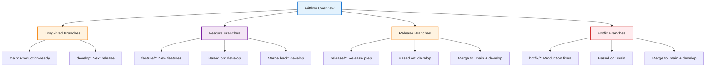

### Gitflow Complete Workflow

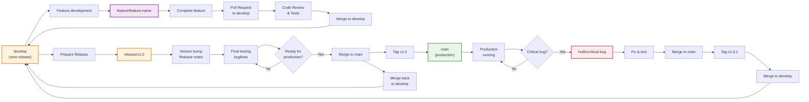

### Gitflow Branch Details

| Branch | Purpose | Created From | Merges Back To | Naming |
|--------|---------|--------------|----------------|--------|
| `main` | Production releases | Never directly | Never (receives merges) | main |
| `develop` | Development integration | Never directly | Never (receives merges) | develop |
| `feature/*` | Feature development | develop | develop | feature/auth, feature/payments |
| `release/*` | Release preparation | develop | main + develop | release/v1.0, release/1.2.3 |
| `hotfix/*` | Production fixes | main | main + develop | hotfix/critical-bug |

### Gitflow Step-by-Step: Feature Development

```bash
# 1. Create feature from develop
git checkout develop
git pull origin develop
git checkout -b feature/user-dashboard

# 2. Develop the feature
git add src/dashboard.js
git commit -m "feat: add user dashboard"
git push origin feature/user-dashboard

# 3. Create PR to develop (not main!)
# GitHub UI: base=develop, compare=feature/user-dashboard

# 4. After approval, merge to develop
git checkout develop
git pull origin develop
git merge --no-ff feature/user-dashboard

# 5. Delete feature branch
git push origin :feature/user-dashboard
```

### Gitflow Step-by-Step: Release Process

```bash
# 1. Create release branch when ready
git checkout develop
git pull origin develop
git checkout -b release/v1.2.0

# 2. Update version numbers
echo "1.2.0" > version.txt
git commit -am "chore: bump version to 1.2.0"

# 3. Final testing and bugfixes only
# (no new features on release branch)

# 4. Create release notes
echo "v1.2.0 Release Notes" > RELEASE_NOTES.md
git add RELEASE_NOTES.md
git commit -m "docs: release notes for v1.2.0"

# 5. Merge to main
git checkout main
git pull origin main
git merge --no-ff release/v1.2.0
git tag -a v1.2.0 -m "Release version 1.2.0"

# 6. Merge back to develop
git checkout develop
git merge --no-ff release/v1.2.0

# 7. Delete release branch
git push origin :release/v1.2.0

# 8. Push everything
git push origin main develop --tags
```

### Gitflow Step-by-Step: Hotfix

```bash
# 1. Critical bug in production v1.2.0
git checkout main
git checkout -b hotfix/critical-auth-bug

# 2. Fix the bug
git add src/auth.js
git commit -m "fix: critical authentication bug"

# 3. Merge to main
git checkout main
git merge --no-ff hotfix/critical-auth-bug
git tag -a v1.2.1 -m "Hotfix: critical auth bug"

# 4. Merge back to develop
git checkout develop
git merge --no-ff hotfix/critical-auth-bug

# 5. Delete hotfix branch
git push origin :hotfix/critical-auth-bug

# 6. Push everything
git push origin main develop --tags
```

### When to Use Gitflow

✅ **Use Gitflow for:**
- Large teams (10+ developers)
- Scheduled releases (quarterly, monthly)
- Multiple production versions
- Complex release management
- Enterprise applications
- Systems requiring quality gates before release

❌ **Don't use for:**
- Continuous deployment
- Small teams
- Simple projects
- Rapid iteration startups
- Systems needing fast feedback cycles

---

## 4. Trunk-Based Development: Continuous Velocity

### What Is Trunk-Based Development?

Trunk-Based Development is an extreme approach where developers work on a single main branch (`main` or `trunk`) or use very short-lived feature branches (< 1 day). It emphasizes continuous integration, small commits, and feature flags instead of branch-based isolation.

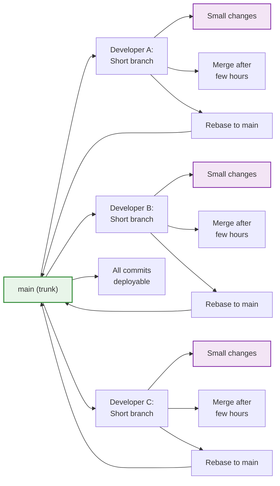

### Trunk-Based Development Principles

```mermaid
graph TB
    A["Trunk-Based Development Principles"] --> B["Small Changes"]
    A --> C["Frequent Integration"]
    A --> D["Continuous Testing"]
    A --> E["Feature Flags"]
    A --> F["Minimal Branching"]
    
    B --> B1["Commits every few hours"]
    B --> B2["One responsibility per commit"]
    B --> B3["Easy to review & revert"]
    
    C --> C1["Push to main daily"]
    C --> C2["No long-lived branches"]
    C --> C3["Catch conflicts early"]
    
    D --> D1["Every commit tested"]
    D --> D2["Automate all checks"]
    D --> D3["Instant feedback"]
    
    E --> E1["Decouple deployment<br/>from release"]
    E --> E2["Deploy incomplete<br/>features (turned off)"]
    E --> E3["Enable for testing"]
    
    F --> F1["Feature branches < 1 day"]
    F --> F2["Or commits directly"]
    F --> F3["main always ready"]
    
    style A fill:#E3F2FD,stroke:#1976D2,stroke-width:2px
    style B1 fill:#E8F5E9,stroke:#388E3C,stroke-width:1.5px
```

### Trunk-Based Development Flow

```bash
# Workflow for developer:

# 1. Pull latest main
git checkout main
git pull origin main

# 2. Create feature branch (but keep it SHORT)
git checkout -b feature/quick-fix

# 3. Make small, focused changes
git add src/utils.js
git commit -m "refactor: simplify utility functions"

# 4. Few more commits (max 2-3)
git add src/index.js
git commit -m "feat: use simplified utils"

# 5. Test locally
npm test

# 6. Very quick peer review
git push origin feature/quick-fix
# Create PR, request review from nearby dev

# 7. Merge immediately after approval (no rebase!)
git checkout main
git pull origin main
git merge --ff-only feature/quick-fix  # Fast-forward only
# Or merge --no-ff if needed

# 8. Push to main
git push origin main

# 9. Delete branch
git branch -d feature/quick-fix

# 10. Deploy immediately
# CI/CD automatically tests and deploys
```

### Feature Flags Pattern

Trunk-Based Development requires feature flags to manage incomplete features:

```javascript
// Example: Feature flag in code
if (featureFlags.newPaymentSystem) {
    // New incomplete feature (deployed but turned off)
    return new PaymentSystemV2().process();
} else {
    // Existing stable code (always active)
    return new PaymentSystemV1().process();
}

// In production, featureFlags.newPaymentSystem = false
// When ready: featureFlags.newPaymentSystem = true
// No code deployment needed for release!
```

### When to Use Trunk-Based Development

✅ **Use Trunk-Based for:**
- Continuous deployment (multiple deploys per day)
- Small teams (< 20 developers)
- High-performing organizations
- Microservices architecture
- Rapid iteration required
- Feature flags available

❌ **Don't use for:**
- Organizations without feature flag infrastructure
- Very large teams (merge conflicts increase)
- Systems requiring pre-release testing period
- Complex release coordination needed
- Teams unfamiliar with continuous integration

---

## 5. Comparing All Three Workflows

### Side-by-Side Comparison

```mermaid
graph TB
    A["GitHub Flow"] --> A1["1 long-lived: main"]
    A --> A2["Feature branches < 1 week"]
    A --> A3["Release on merge to main"]
    A --> A4["No release branches"]
    A --> A5["Hotfixes: direct to main"]
    
    B["Gitflow"] --> B1["2 long-lived: main, develop"]
    B --> B2["Feature branches < 2 weeks"]
    B --> B3["Release branches for prep"]
    B --> B4["Version maintenance branches"]
    B --> B5["Hotfixes: separate branches"]
    
    C["Trunk-Based"] --> C1["1 main, ultra-short branches"]
    C --> C2["Feature branches < 1 day"]
    C --> C3["Deploy with feature flags"]
    C --> C4["No release branches"]
    C --> C5["Hotfixes: via feature flags"]
    
    style A fill:#E3F2FD,stroke:#1976D2,stroke-width:2px
    style B fill:#FFF3E0,stroke:#F57C00,stroke-width:2px
    style C fill:#E8F5E9,stroke:#388E3C,stroke-width:2px
```

### Comparison Table

| Aspect | GitHub Flow | Gitflow | Trunk-Based |
|--------|-------------|---------|-------------|
| **Long-lived branches** | 1 (main) | 2 (main, develop) | 1 (main) |
| **Feature branch lifetime** | < 1 week | 1-2 weeks | < 1 day |
| **Release frequency** | Multiple per day | Scheduled (monthly, quarterly) | Multiple per day |
| **Number of versions** | 1 (current) | Multiple (maintain old versions) | 1 (current) |
| **Complexity** | Simple | Complex | Medium |
| **Team size** | Small (1-10) | Large (10+) | Small-Medium (< 20) |
| **Release process** | Merge to main | Release branch prep | Feature flags |
| **Hotfix process** | Direct to main | Hotfix branch | Feature flag toggle |
| **CI/CD requirement** | Moderate | Moderate-High | Very High |
| **Learning curve** | Easy | Steep | Medium |

### Release Timing Comparison

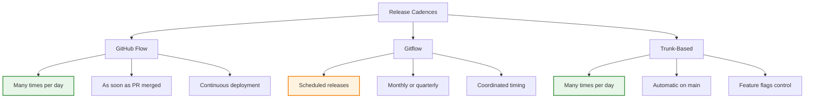

---

## 6. Real-World Scenario 1: GitHub Flow for SaaS Startup

**Situation:** 5-person startup building a SaaS product. Need to deploy daily. Simple product with single version.

**Workflow Setup:**

```bash
# Team decided: GitHub Flow (simple, fast)

# Monday: New feature
git checkout main
git pull origin main
git checkout -b feature/dark-mode

# Develop
git add src/theme.js
git commit -m "feat: add dark mode toggle"
git push origin feature/dark-mode

# Create PR on GitHub
# Another dev reviews: "Looks good!"
# CI/CD passes all tests
# Merge and deploy

# Wednesday: Bug fix
git checkout main
git pull origin main
git checkout -b bugfix/modal-crash

git add src/modal.js
git commit -m "fix: prevent modal crash on mobile"
git push origin bugfix/modal-crash

# Quick review, merge, deploy

# Friday: Three features combined
git checkout main
git pull origin main
git checkout -b feature/stripe-integration

# ... feature development ...
git push origin feature/stripe-integration

# PR review by co-founder
# Merge to main
# Automatic deployment to production
# Team watches metrics for issues
# Works great! GitHub Flow confirmed.
```

**Why It Worked:**
- Simple workflow matched team size
- Daily deployments kept feedback fast
- No complex release management needed
- Everyone understood the process

---

## 7. Real-World Scenario 2: Gitflow for Enterprise Release

**Situation:** Enterprise application. 30 developers. Quarterly releases. Supporting 3 active versions (current, previous, security-fix).

**Workflow Setup:**

```bash
# Team decided: Gitflow (handles complexity)

# Q1 Development (January-March)
# Everyone develops on feature branches from develop

git checkout develop
git checkout -b feature/audit-logging

# ... extensive feature development ...
git push origin feature/audit-logging

# Create PR: base=develop
# Goes through formal review, QA approval
# Merged to develop

# March 25: Prepare Q1 Release (v2.4.0)
git checkout develop
git checkout -b release/v2.4.0

# Version bump
echo "2.4.0" > version.txt
git commit -am "chore: bump to 2.4.0"

# April 1-7: Release testing
# QA tests extensively
# Found issues? Bugfixes on release branch

# April 8: Release is go!
git checkout main
git merge --no-ff release/v2.4.0
git tag -a v2.4.0

# Merge back to develop
git checkout develop
git merge --no-ff release/v2.4.0
git push origin main develop --tags

# But wait! Critical security bug in v2.2.0 (old version)
git checkout main
git log --oneline | grep "v2.2.0"
# Need to patch old version too!

git checkout -b hotfix/security-patch v2.2.0

# Fix security issue
git add src/auth.js
git commit -m "security: patch authentication vulnerability"

# Merge to all supported versions
git checkout v2.2.0  # Detached HEAD, specific tag version
git merge hotfix/security-patch
git tag -a v2.2.1

git checkout v2.3.0
git merge hotfix/security-patch
git tag -a v2.3.1

git checkout main
git merge hotfix/security-patch
git tag -a v2.4.1

# Deploy v2.2.1, v2.3.1, v2.4.1 to customers
```

**Why Gitflow Worked:**
- Handles multiple active versions
- Release branch allowed coordinated testing
- Hotfixes could target specific versions
- Clear separation of concerns
- Enterprise compliance satisfied

---

## 8. Real-World Scenario 3: Trunk-Based for FinTech Microservices

**Situation:** FinTech startup. Microservices architecture. Need to deploy multiple times daily. Small tight-knit team (8 developers).

**Workflow Setup:**

```bash
# Team decided: Trunk-Based Development

# Feature 1: New fraud detection (incomplete)
# Developer A:
git checkout main
git pull origin main
git checkout -b feature/fraud-detection-v2

# Small, focused work
git add src/fraud-detector.ts
git commit -m "feat: add machine learning fraud detection"

# After 2 hours
git add tests/fraud-detector.test.ts
git commit -m "test: add fraud detector tests"

# Code review with teammate (async in Slack)
git push origin feature/fraud-detection-v2
# "Looks good!" approval comes back

# Merge immediately
git checkout main
git merge --ff-only feature/fraud-detection-v2
git push origin main

# CI/CD automatically:
# - Tests all changed code
# - Builds Docker image
# - Deploys to staging
# - Smoke tests pass
# - Deploys to production

# But feature is incomplete! Use feature flags:

// In fraud-detection.ts
const ENABLE_NEW_DETECTOR = features.isEnabled('fraud-detection-v2');

if (ENABLE_NEW_DETECTOR) {
    return newFraudDetector.analyze(transaction);
}
return legacyDetector.analyze(transaction);

# Feature deployed (turned OFF by default)
# Developer A continues with next small change

# Meanwhile, Developer B working on something else
git checkout main
git pull origin main
git checkout -b feature/transaction-batching

# Another small focused change
# Merge after 4 hours of work
# Feature flags protect it

# Developer A tests new fraud detector
# Gradually turns it on: 1% -> 10% -> 50% -> 100%
# Feature is released without a code deployment!

# Throughout the day:
# - 12 commits to main
# - 7 features in progress (feature-flagged)
# - Zero merge conflicts
# - Continuous feedback
```

**Why Trunk-Based Worked:**
- Frequent small merges prevent conflicts
- Feature flags decouple deployment from release
- High-velocity deployment pipeline essential
- Small team can coordinate changes
- High confidence in automated testing required

---

## 9. Hybrid Approaches

### GitHub Flow + Release Branches

Some teams modify GitHub Flow to add release branches when multiple versions need support:

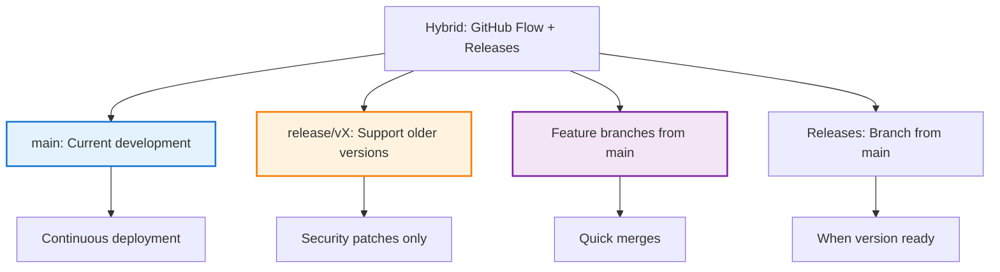

### Trunk-Based + Release Branches

Some organizations use trunk-based development with light release branching:

```bash
# Most work directly on main
# Only create release branches for final polish

# QA testing starts on main
# When ~95% ready, create release branch
git checkout -b release/v2.0

# Final tests, last-minute fixes only
# Then tag and release

# Much simpler than Gitflow, faster than pure trunk
```

---

## 10. Interview Prep & Practice Questions

### Question 1: GitHub Flow Overview

**Q:** Explain GitHub Flow and when you'd use it.

**A:** GitHub Flow is the simplest workflow with one long-lived `main` branch and temporary feature branches. Process:
1. Create feature branch from main
2. Commit changes
3. Open Pull Request for review
4. Merge after approval
5. Deploy from main
6. Delete feature branch

**When to use:** Small teams (< 10), continuous deployment, single active version, web applications.

---

### Question 2: Gitflow Main Branches

**Q:** What are the two main long-lived branches in Gitflow and what's their purpose?

**A:**
- **main**: Production-ready code. Always deployable. Only receives merges from release and hotfix branches.
- **develop**: Integration branch for next release. Never deployed directly. Receives merges from feature, release, and hotfix branches.

The separation allows development to continue while main stays stable for production.

---

### Question 3: Release Management

**Q:** How do you prepare a release in Gitflow?

**A:**
```bash
# 1. Create release branch from develop
git checkout -b release/v1.2.0 develop

# 2. Only version bumps and bugfixes
# (NO new features)

# 3. When ready:
git checkout main
git merge --no-ff release/v1.2.0
git tag -a v1.2.0

# 4. Merge back to develop
git merge --no-ff release/v1.2.0 develop

# This prevents code from develop diverging from main
```

---

### Question 4: Hotfix Process

**Q:** Critical bug found in production. How do you handle it in Gitflow?

**A:**
```bash
# 1. Create hotfix from main
git checkout -b hotfix/critical-bug main

# 2. Fix the bug
git commit -m "fix: critical production bug"

# 3. Merge to both main and develop
git checkout main
git merge --no-ff hotfix/critical-bug
git tag -a v1.2.1  # Bump patch version

git checkout develop
git merge --no-ff hotfix/critical-bug

# This ensures the fix is in both production and next release
```

---

### Question 5: Trunk-Based Development

**Q:** Explain Trunk-Based Development and what makes it different from other workflows.

**A:** Trunk-Based Development keeps developers committing directly to `main` or using extremely short-lived branches (< 1 day). Key differences:
- No long-lived feature branches (prevents divergence)
- Small, frequent commits (easy to revert if needed)
- Feature flags decouple deployment from release
- Requires strong CI/CD and high confidence in tests
- Extreme focus on code quality

**Trade-off:** More process discipline required but faster feedback and fewer merge conflicts.

---

### Question 6: Feature Branches Lifetime

**Q:** How long should feature branches exist in each workflow?

**A:**
- **GitHub Flow**: < 1 week (usually 1-3 days)
- **Gitflow**: 1-2 weeks
- **Trunk-Based**: < 1 day (ideally < 4 hours)

**Rule:** Shorter branches = fewer conflicts and easier reviews. This is why Trunk-Based is so aggressive about branch lifetime.

---

### Question 7: Choosing a Workflow

**Q:** How would you choose between GitHub Flow, Gitflow, and Trunk-Based for your team?

**A:** Consider:
- **Team size**: Larger teams need more structure → Gitflow
- **Release frequency**: Daily deploys → GitHub Flow or Trunk-Based
- **Version complexity**: Multiple active versions → Gitflow
- **Deployment confidence**: Weak CI/CD → Gitflow; Strong → Trunk-Based
- **Organizational maturity**: Startups → GitHub Flow; Enterprises → Gitflow

**Examples:**
- SaaS startup: GitHub Flow (simple, fast)
- Large enterprise: Gitflow (controlled)
- FinTech microservices: Trunk-Based (velocity + safety)

---

### Question 8: Handling Multiple Versions

**Q:** You need to support three versions in production. Which workflow and why?

**A:** **Gitflow is best.**

```
main: v3.0.0 (current)
release/v2.1: Maintenance branch for v2.1
release/v2.0: Security patches only for v2.0

Hotfix workflow:
- Fix in main
- Backport to release/v2.1
- Backport to release/v2.0
- Tag and release each
```

Gitflow's release and hotfix branches handle this elegantly. Other workflows struggle with multiple versions.

---

## 11. Troubleshooting Workflow Issues

### Issue: Merge Conflicts in Feature Branch

**Problem:** Feature branch conflicts with main; painful merges.

**Solution:**
```bash
# 1. Rebase feature on latest main
git checkout feature/new-feature
git fetch origin
git rebase origin/main

# Resolve conflicts as you go
# Smaller commits = easier rebasing

# 2. Force-push to remote
git push origin feature/new-feature --force-with-lease

# 3. In future, sync more frequently
git fetch origin
git rebase origin/main  # Every few commits
```

**Prevention:** In Gitflow, sync with develop regularly. In Trunk-Based, branch lifetime < 1 day.

---

### Issue: Feature Takes Longer Than Expected

**Problem:** Feature branch lives for weeks; becomes hard to merge.

**Solution in GitHub Flow:**
```bash
# 1. Break feature into smaller PRs
# Instead of one big PR, create:
# - PR1: scaffolding/setup
# - PR2: core functionality
# - PR3: edge cases
# - PR4: tests and polish

# Each PR merged separately to main
git checkout feature/part1
# ... minimal changes ...
git push
# Create PR, merge, repeat
```

**Solution in Gitflow:**
```bash
# 1. Merge to develop early
git checkout develop
git merge feature/part1

# 2. Continue feature on new branch
git checkout -b feature/part2 develop

# Breaks large work into manageable pieces
```

---

### Issue: Forgot to Create Feature Branch

**Problem:** Committed directly to main by mistake.

**Solution:**
```bash
# 1. See what you committed
git log main -n 5 --oneline

# 2. Create feature branch from current main
git branch feature/work develop~3

# 3. Reset main to before your commits
git reset --hard origin/main

# 4. Your work is now in feature/work
git checkout feature/work

# 5. Continue development
# Later merge back normally
```

---

### Issue: Hotfix Conflicts with Ongoing Development

**Problem:** In Gitflow, hotfix branch and develop have diverged too much.

**Solution:**
```bash
# 1. Fix on main
git checkout -b hotfix/critical main
# ... fix ...
git merge hotfix/critical main

# 2. Merge to develop carefully
git checkout develop
git fetch origin
git merge --no-ff hotfix/critical

# 3. If conflicts, resolve them
# Conflicts here are okay - shows divergence
git add .
git commit -m "merge: hotfix to develop"

# 4. Continue with develop
git push origin develop
```

**Prevention:** Don't let develop and main diverge too much. Release regularly.

---

## 12. Workflow Best Practices

### Universal Best Practices

```mermaid
graph TB
    A["Universal Workflow Best Practices"] --> B["Protection Rules"]
    A --> C["Naming Conventions"]
    A --> D["Review Process"]
    A --> E["Communication"]
    A --> F["Automation"]
    
    B --> B1["Protect main from<br/>direct commits"]
    B --> B2["Require PR reviews"]
    B --> B3["Require CI pass"]
    B --> B4["Status checks"]
    
    C --> C1["feature/description"]
    C --> C2["bugfix/issue-number"]
    C --> C3["hotfix/critical-issue"]
    
    D --> D1["Minimum 1 approval"]
    D --> D2["Clear review checklist"]
    D --> D3["Respond to feedback"]
    
    E --> E1["Announce major<br/>changes"]
    E --> E2["Link to issues"]
    E --> E3["Release notes"]
    
    F --> F1["CI/CD on every PR"]
    F --> F2["Auto-deploy on merge"]
    F --> F3["Monitoring & alerts"]
    
    style A fill:#E3F2FD,stroke:#1976D2,stroke-width:2px
    style B fill:#E8F5E9,stroke:#388E3C,stroke-width:2px
```

### GitHub Configuration

```yaml
# .github/pull_request_template.md
## Description
[Describe what changed and why]

## Type of Change
- [ ] Bug fix
- [ ] New feature
- [ ] Breaking change

## Testing
- [ ] Manual testing completed
- [ ] All tests passing
- [ ] Edge cases tested

## Checklist
- [ ] Code follows style guidelines
- [ ] Documentation updated
- [ ] No new warnings
```

### Branch Protection Rules

```
Repository Settings > Branches > Branch protection rules

For 'main':
✓ Require pull request reviews (1 approval)
✓ Require status checks (CI/CD must pass)
✓ Require branches to be up to date
✓ Restrict who can push
✓ Require conversation resolution
✓ Auto-delete head branches
```

---

## 13. Quick Reference & Workflow Selector

### Workflow Selection Checklist

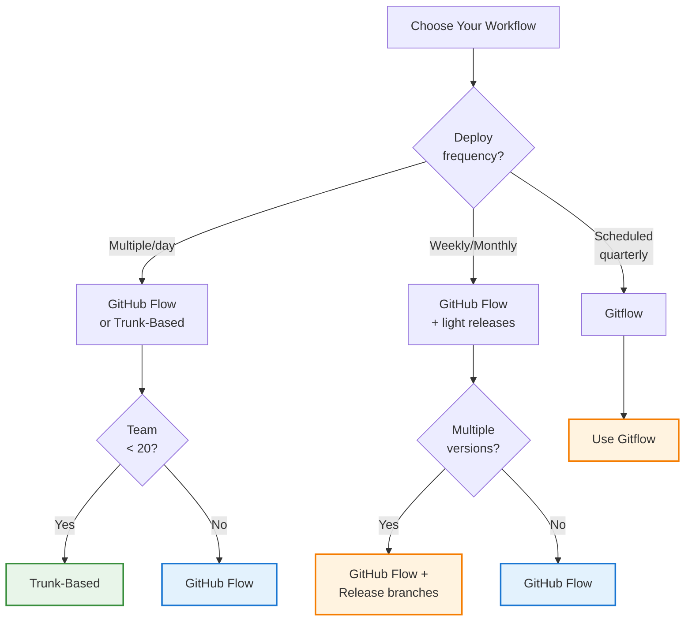

### Commands Cheatsheet

```bash
# GitHub Flow
git checkout -b feature/description
git push -u origin feature/description
# Create PR on GitHub
git checkout main
git pull origin main
git branch -d feature/description

# Gitflow
git checkout develop
git checkout -b feature/description
# ... develop ...
git checkout develop
git merge --no-ff feature/description
git push origin develop

# Release (Gitflow)
git checkout -b release/v1.2.0 develop
# ... version bump & bugfixes ...
git checkout main
git merge --no-ff release/v1.2.0
git tag -a v1.2.0
git checkout develop
git merge --no-ff release/v1.2.0

# Hotfix (Gitflow)
git checkout -b hotfix/critical main
# ... fix ...
git checkout main
git merge --no-ff hotfix/critical
git tag -a v1.2.1
git checkout develop
git merge --no-ff hotfix/critical

# Trunk-Based
git checkout main
git pull origin main
git checkout -b feature/quick-fix
# ... small change ...
git push origin feature/quick-fix
git checkout main
git merge --ff-only feature/quick-fix
git push origin main
```

### Workflow Comparison Quick Ref

| Aspect | GitHub Flow | Gitflow | Trunk-Based |
|--------|-------------|---------|------------|
| **Long-lived branches** | 1 | 2 | 1 |
| **Best for teams** | 1-10 | 10+ | < 20 |
| **Deploy frequency** | Many/day | Scheduled | Many/day |
| **Learning curve** | Easy | Hard | Medium |
| **Process overhead** | Low | High | Low |
| **Branch lifetime** | < 1 week | 1-2 weeks | < 1 day |
| **Merge conflicts** | Medium | High | Low |
| **Release management** | Simple | Complex | Feature flags |
| **Version support** | 1 active | 3+ active | 1 active |

---

## 14. Key Takeaways

### Workflow Impact on Organization

```mermaid
graph TB
    A["Git Workflow Choice Impacts"] --> B["Release Velocity"]
    A --> C["Code Quality"]
    A --> D["Team Happiness"]
    A --> E["Merge Conflicts"]
    A --> F["Deployment Risk"]
    
    G["GitHub Flow"] --> G1["High velocity"]
    G --> G2["Requires strong tests"]
    G --> G3["Simple, clear"]
    G --> G4["Fewer conflicts"]
    G --> G5["Higher risk"]
    
    H["Gitflow"] --> H1["Controlled velocity"]
    H --> H2["Quality gates"]
    H --> H3["Process overhead"]
    H --> H4["More conflicts"]
    H --> H5["Lower risk"]
    
    I["Trunk-Based"] --> I1["Very high velocity"]
    I --> I2["Extreme discipline"]
    I --> I3["Requires skill"]
    I --> I4["Minimal conflicts"]
    I --> I5["Feature flags mitigate"]
    
    style G1 fill:#E3F2FD,stroke:#1976D2,stroke-width:1.5px
    style H1 fill:#FFF3E0,stroke:#F57C00,stroke-width:1.5px
    style I1 fill:#E8F5E9,stroke:#388E3C,stroke-width:1.5px
```

### Final Advice

**Choose based on:**
1. **Team maturity**: New teams → GitHub Flow. Experienced → Gitflow/Trunk-Based.
2. **Release cadence**: Multiple/day → GitHub Flow or Trunk-Based. Scheduled → Gitflow.
3. **Version complexity**: Multiple versions → Gitflow. Single → GitHub Flow/Trunk-Based.
4. **Deployment infrastructure**: Weak CI/CD → Gitflow. Strong → GitHub Flow/Trunk-Based.
5. **Team size**: < 10 → GitHub Flow. 10-50 → Gitflow. < 20 tight-knit → Trunk-Based.

**Remember:** No workflow is perfect. All solve problems. Some create different ones. Choose based on your current constraints, not the ideal workflow.

---

## 15. Additional Resources

### Official Documentation
- [GitHub Flow Documentation](https://guides.github.com/introduction/flow/)
- [Gitflow Original Article](https://nvie.com/posts/a-successful-git-branching-model/)
- [Trunk-Based Development](https://trunkbaseddevelopment.com/)
- [Microsoft: Choosing Git Workflows](https://learn.microsoft.com/en-us/azure/devops/repos/git/git-branching-guidance)

### Related Topics
- CI/CD integration with workflows
- Feature flags implementation
- Code review best practices
- Release management strategies
- Semantic versioning

### Tools & Automation
- GitHub Actions for workflow automation
- GitLab CI/CD pipelines
- Feature flag services (LaunchDarkly, Flagsmith)
- Branch protection automation

---

*Last Updated: January 2026 | Comprehensive Git Workflows Guide*
