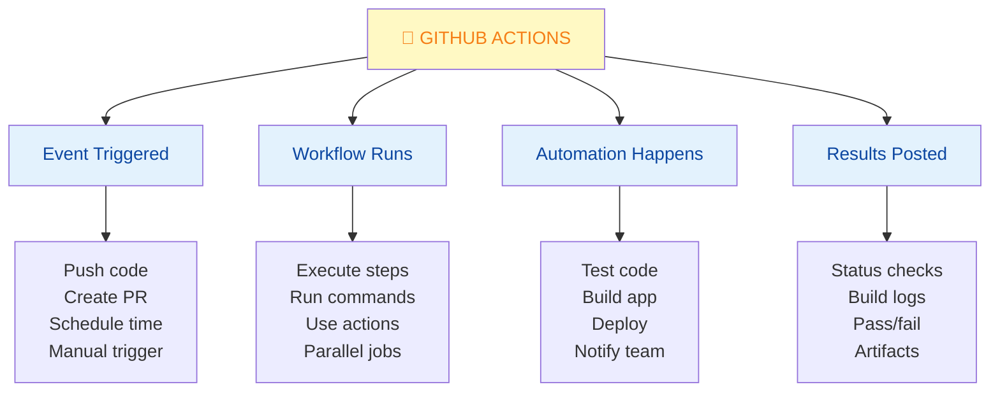
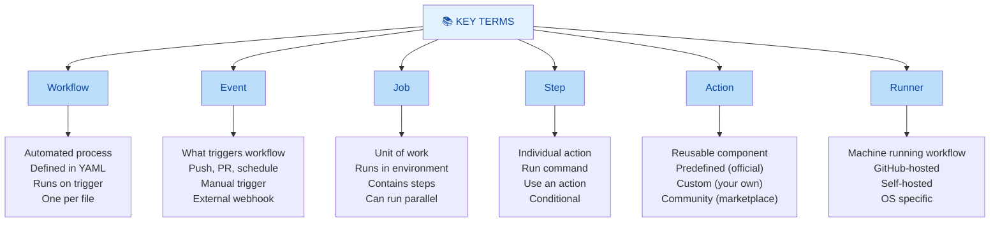
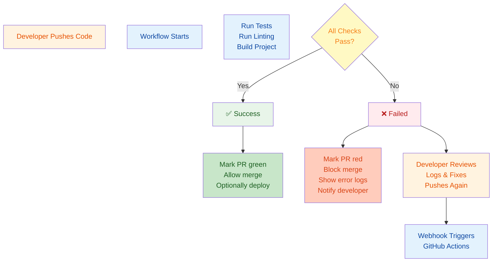
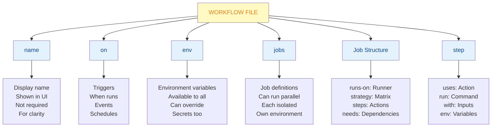
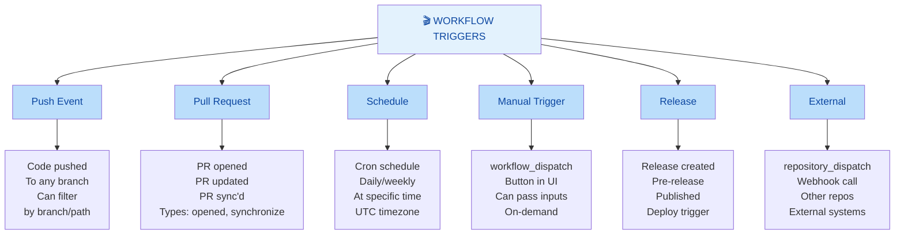
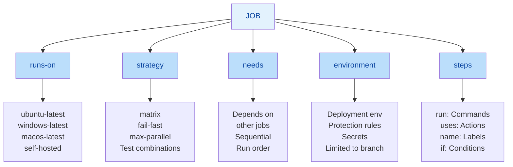
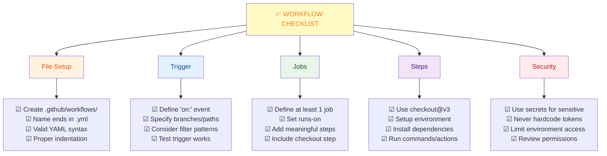
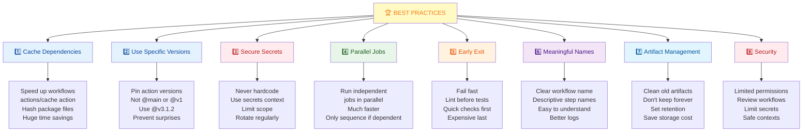
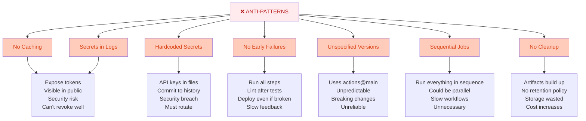
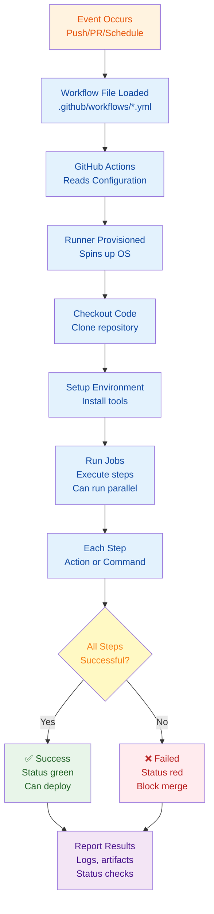

# GitHub Actions & CI/CD: Complete Guide

## Overview

GitHub Actions is GitHub's native automation platform that runs workflows directly in your repository. It enables continuous integration (CI)—automatically testing code changes—and continuous deployment (CD)—automatically deploying to production. No external servers needed; everything happens in GitHub.

### Why It Matters
- **Automated testing** - Run tests on every push/PR
- **Code quality** - Lint, format, and security checks automatically
- **Continuous integration** - Catch bugs before merging
- **Continuous deployment** - Auto-deploy to production
- **Save time** - Eliminate manual, repetitive tasks
- **Consistency** - Same process every time
- **Built-in GitHub** - No external services needed
- **Free for public repos** - Generous free tier

### Main Use Cases
- Running tests on pull requests
- Building and deploying applications
- Publishing packages and releases
- Security scanning and dependency checks
- Code linting and formatting
- Building Docker images
- Running scheduled maintenance tasks
- Automating project management

---

## 1. Core Concepts & Fundamentals

### What Is GitHub Actions?



### GitHub Actions Terminology



### CI/CD Flow with GitHub Actions



---

## 2. Workflow File Structure

### Anatomy of a Workflow File

```yaml
# .github/workflows/test.yml

name: Tests                           # Name shown in GitHub UI
on:                                   # When to trigger
  push:
    branches: [ main, develop ]
  pull_request:
    branches: [ main ]

jobs:                                 # Define jobs
  test:                               # Job name
    runs-on: ubuntu-latest            # Runner OS
    
    strategy:
      matrix:                         # Matrix for multiple configs
        node-version: [16.x, 18.x, 20.x]
    
    steps:                            # Steps within job
      - uses: actions/checkout@v3    # Use action
      - uses: actions/setup-node@v3
        with:
          node-version: ${{ matrix.node-version }}
      
      - name: Install dependencies
        run: npm install              # Run command
      
      - name: Run tests
        run: npm test
      
      - name: Upload coverage
        uses: codecov/codecov-action@v3
```

### Workflow Components Explained



---

## 3. Workflow Triggers & Events

### Common Triggers



### Trigger Examples

```yaml
# Trigger on push
on:
  push:
    branches: [ main, develop ]
    paths: [ 'src/**', 'tests/**' ]  # Only if these change

# Trigger on PR
on:
  pull_request:
    branches: [ main ]
    types: [ opened, synchronize ]

# Schedule (cron)
on:
  schedule:
    - cron: '0 9 * * 1'  # Every Monday at 9 AM UTC

# Manual trigger
on:
  workflow_dispatch:
    inputs:
      environment:
        description: 'Environment to deploy to'
        required: true
        default: 'staging'

# Multiple triggers (any triggers the workflow)
on: [push, pull_request, workflow_dispatch]
```

---

## 4. Jobs, Steps & Actions

### Job Structure



### Job with Matrix Strategy

```yaml
jobs:
  test:
    runs-on: ubuntu-latest
    
    strategy:
      matrix:
        # Creates 6 job combinations
        node-version: [16.x, 18.x, 20.x]
        os: [ubuntu-latest, windows-latest]
    
    steps:
      - uses: actions/checkout@v3
      - uses: actions/setup-node@v3
        with:
          node-version: ${{ matrix.node-version }}
      - run: npm test
```

### Using Actions

```yaml
steps:
  # Use official action (short syntax)
  - uses: actions/checkout@v3
  
  # Use action with inputs
  - uses: actions/setup-node@v3
    with:
      node-version: '18.x'
      cache: 'npm'
  
  # Run shell command
  - run: npm install
  
  # Run multi-line script
  - run: |
      npm install
      npm run build
      npm test
  
  # Conditional step
  - name: Deploy to production
    if: github.ref == 'refs/heads/main' && github.event_name == 'push'
    run: npm run deploy
  
  # Use environment variables
  - run: echo ${{ secrets.DATABASE_URL }}
```

---

## 5. Common Workflow Examples

### Example 1: Test on Push

```yaml
# .github/workflows/test.yml
name: Tests

on:
  push:
    branches: [ main, develop ]
  pull_request:
    branches: [ main ]

jobs:
  test:
    runs-on: ubuntu-latest
    
    steps:
      - uses: actions/checkout@v3
      
      - uses: actions/setup-node@v3
        with:
          node-version: '18.x'
          cache: 'npm'
      
      - run: npm install
      
      - run: npm run lint
      
      - run: npm test
      
      - run: npm run build
```

### Example 2: Build & Deploy

```yaml
# .github/workflows/deploy.yml
name: Deploy

on:
  push:
    branches: [ main ]

jobs:
  build:
    runs-on: ubuntu-latest
    steps:
      - uses: actions/checkout@v3
      
      - uses: actions/setup-node@v3
        with:
          node-version: '18.x'
      
      - run: npm install
      - run: npm run build
      
      - uses: actions/upload-artifact@v3
        with:
          name: build
          path: dist/

  deploy:
    needs: build
    runs-on: ubuntu-latest
    environment: production
    
    steps:
      - uses: actions/download-artifact@v3
        with:
          name: build
      
      - uses: some/deploy-action@v1
        with:
          api-key: ${{ secrets.DEPLOY_API_KEY }}
```

### Example 3: Multi-Language Testing

```yaml
# .github/workflows/matrix-test.yml
name: Test

on: [push, pull_request]

jobs:
  test:
    runs-on: ${{ matrix.os }}
    
    strategy:
      matrix:
        os: [ubuntu-latest, macos-latest, windows-latest]
        node-version: [16.x, 18.x, 20.x]
        exclude:
          # Don't test every combination
          - os: macos-latest
            node-version: 16.x
          - os: windows-latest
            node-version: 16.x
    
    steps:
      - uses: actions/checkout@v3
      - uses: actions/setup-node@v3
        with:
          node-version: ${{ matrix.node-version }}
      - run: npm test
```

### Example 4: Publish Package

```yaml
# .github/workflows/publish.yml
name: Publish

on:
  release:
    types: [published]

jobs:
  publish:
    runs-on: ubuntu-latest
    
    steps:
      - uses: actions/checkout@v3
      
      - uses: actions/setup-node@v3
        with:
          node-version: '18.x'
          registry-url: 'https://registry.npmjs.org'
      
      - run: npm install
      - run: npm run build
      - run: npm publish
        env:
          NODE_AUTH_TOKEN: ${{ secrets.NPM_TOKEN }}
```

---

## 6. Quick Cheatsheet

### Workflow File Checklist



### Common Actions

```yaml
# Checkout code
- uses: actions/checkout@v3

# Setup languages
- uses: actions/setup-node@v3
- uses: actions/setup-python@v4
- uses: actions/setup-go@v4

# Cache dependencies
- uses: actions/cache@v3
  with:
    path: ~/.npm
    key: ${{ runner.os }}-npm-${{ hashFiles('package-lock.json') }}

# Upload/Download artifacts
- uses: actions/upload-artifact@v3
- uses: actions/download-artifact@v3

# Create release
- uses: actions/create-release@v1

# Deploy to GitHub Pages
- uses: peaceiris/actions-gh-pages@v3
```

### Expressions & Variables

```yaml
# GitHub context variables
${{ github.ref }}              # Branch/tag ref
${{ github.event_name }}       # Trigger type
${{ github.repository }}       # owner/repo
${{ github.actor }}            # User who triggered

# Runner context
${{ runner.os }}               # ubuntu, windows, macos
${{ runner.arch }}             # x64, arm64

# Job context
${{ job.status }}              # success, failure, cancelled

# Steps context
${{ steps.step-id.outputs.var }}  # Step outputs

# Secrets
${{ secrets.SECRET_NAME }}     # Access secret

# Environment variables
${{ env.VARIABLE_NAME }}       # Access env var
```

### Conditional Execution

```yaml
steps:
  # Run only on main branch
  - if: github.ref == 'refs/heads/main'
    run: npm run deploy
  
  # Run only on PR
  - if: github.event_name == 'pull_request'
    run: npm test
  
  # Run on success
  - if: success()
    run: echo "Tests passed"
  
  # Run on failure
  - if: failure()
    run: echo "Tests failed"
  
  # Always run
  - if: always()
    run: echo "Cleanup"
```

---

## 7. Real-World Scenarios

### Scenario 1: Node.js Project with Tests & Coverage

```yaml
# .github/workflows/test.yml
name: Test & Coverage

on:
  push:
    branches: [ main, develop ]
  pull_request:
    branches: [ main ]

jobs:
  test:
    runs-on: ubuntu-latest
    
    steps:
      - uses: actions/checkout@v3
      
      - uses: actions/setup-node@v3
        with:
          node-version: '18.x'
          cache: 'npm'
      
      - name: Install dependencies
        run: npm install
      
      - name: Lint code
        run: npm run lint
      
      - name: Run tests
        run: npm test -- --coverage
      
      - name: Upload coverage
        uses: codecov/codecov-action@v3
        with:
          files: ./coverage/lcov.info
      
      - name: Build
        run: npm run build
      
      - name: Upload build artifacts
        if: success()
        uses: actions/upload-artifact@v3
        with:
          name: build
          path: dist/
```

**Result:** On every push/PR:
- Dependencies cached for speed
- Linting checks for code quality
- Tests run with coverage report
- Coverage uploaded to Codecov
- Build artifact generated
- Fails fast if any step fails

---

### Scenario 2: Docker Build & Push

```yaml
# .github/workflows/docker.yml
name: Build Docker Image

on:
  push:
    branches: [ main ]
  release:
    types: [published]

jobs:
  build:
    runs-on: ubuntu-latest
    
    permissions:
      contents: read
      packages: write
    
    steps:
      - uses: actions/checkout@v3
      
      - name: Set up Docker Buildx
        uses: docker/setup-buildx-action@v2
      
      - name: Login to Docker Hub
        uses: docker/login-action@v2
        with:
          username: ${{ secrets.DOCKER_USERNAME }}
          password: ${{ secrets.DOCKER_PASSWORD }}
      
      - name: Build and push
        uses: docker/build-push-action@v4
        with:
          context: .
          push: true
          tags: |
            myrepo/myimage:latest
            myrepo/myimage:${{ github.sha }}
          cache-from: type=gha
          cache-to: type=gha,mode=max
```

**Result:** 
- Docker image built on push to main
- Pushed to Docker Hub with tags
- Caching for faster builds
- Secrets stored safely

---

### Scenario 3: Deploy to Production

```yaml
# .github/workflows/deploy.yml
name: Deploy to Production

on:
  release:
    types: [published]

jobs:
  build:
    runs-on: ubuntu-latest
    outputs:
      artifact-id: ${{ steps.artifact.outputs.id }}
    
    steps:
      - uses: actions/checkout@v3
      - uses: actions/setup-node@v3
        with:
          node-version: '18.x'
      
      - run: npm install
      - run: npm run build
      
      - name: Upload build
        id: artifact
        uses: actions/upload-artifact@v3
        with:
          name: build-${{ github.sha }}
          path: dist/

  deploy:
    needs: build
    runs-on: ubuntu-latest
    environment:
      name: production
      url: https://example.com
    
    steps:
      - uses: actions/download-artifact@v3
        with:
          name: build-${{ github.sha }}
      
      - name: Deploy to AWS
        env:
          AWS_ACCESS_KEY_ID: ${{ secrets.AWS_ACCESS_KEY_ID }}
          AWS_SECRET_ACCESS_KEY: ${{ secrets.AWS_SECRET_ACCESS_KEY }}
        run: |
          aws s3 sync . s3://my-bucket/
          aws cloudfront create-invalidation --distribution-id ${{ secrets.CLOUDFRONT_ID }} --paths "/*"
      
      - name: Notify Slack
        if: success()
        uses: slackapi/slack-github-action@v1
        with:
          webhook-url: ${{ secrets.SLACK_WEBHOOK }}
          payload: |
            {
              "text": "Deployment successful",
              "blocks": [
                {
                  "type": "section",
                  "text": {
                    "type": "mrkdwn",
                    "text": "✅ Production deployed: ${{ github.ref }}"
                  }
                }
              ]
            }
```

**Result:**
- Builds on release creation
- Deploys to S3 when build succeeds
- Invalidates CloudFront cache
- Notifies team via Slack

---

## 8. Best Practices

### GitHub Actions Best Practices



### Anti-Patterns to Avoid



### Caching Best Practices

```yaml
jobs:
  test:
    runs-on: ubuntu-latest
    
    steps:
      - uses: actions/checkout@v3
      
      # Cache for Node.js
      - uses: actions/setup-node@v3
        with:
          node-version: '18.x'
          cache: 'npm'  # Automatic cache with setup-node
      
      # Or manual cache
      - uses: actions/cache@v3
        with:
          path: ~/.npm
          key: ${{ runner.os }}-npm-${{ hashFiles('**/package-lock.json') }}
          restore-keys: ${{ runner.os }}-npm-
      
      - run: npm ci  # Use ci not install (faster, deterministic)
      - run: npm test
```

---

## 9. Summary & Key Takeaways

### What You Should Know

✅ **Workflows automate tasks** - Tests, builds, deployments
✅ **Triggered by events** - Push, PR, schedule, manual
✅ **Jobs run in sequence/parallel** - Control with `needs:`
✅ **Steps are actions or commands** - Modular and reusable
✅ **Cache everything** - Dependencies, build artifacts
✅ **Use secrets safely** - Never hardcode sensitive data
✅ **Matrix for variants** - Test multiple versions
✅ **Fail fast** - Quick checks before expensive ones

### Essential Workflow Pattern

```yaml
on: [push, pull_request]  # When to run

jobs:
  test:
    runs-on: ubuntu-latest  # Environment
    
    steps:
      - uses: actions/checkout@v3
      - uses: actions/setup-node@v3
        with:
          node-version: '18.x'
          cache: 'npm'
      
      - run: npm ci
      - run: npm run lint
      - run: npm test
      - run: npm run build
```

---

## 10. Interview & Exam Prep

### Common Interview Questions

**Q1: What's the difference between CI and CD?**
> CI (Continuous Integration) automatically tests code changes to catch bugs early. CD (Continuous Deployment) automatically deploys tested code to production. CI is about quality; CD is about automation. GitHub Actions can do both.

**Q2: Why should you cache dependencies in workflows?**
> Caching avoids reinstalling dependencies on every run, which can take minutes. Using `actions/cache` or built-in caching with language setup actions dramatically speeds up workflows by storing dependencies between runs.

**Q3: How do you safely use secrets in GitHub Actions?**
> Use repository secrets in Settings → Secrets. Reference with `${{ secrets.NAME }}`. They're encrypted and only decrypted in Actions. Never hardcode secrets in workflow files. They'll be masked in logs.

**Q4: What's the difference between `uses` and `run` in a step?**
> `uses` invokes an action (code to run, can be custom). `run` executes shell commands directly. Actions provide abstraction and reusability; `run` is for simple commands.

**Q5: How do you run jobs in parallel?**
> By default, jobs run in parallel. Use the `needs:` keyword to create sequential dependencies. Example: `needs: [build, test]` means this job waits for both build and test jobs.

**Q6: What's a matrix strategy and why use it?**
> A matrix runs the same job with different combinations of variables (OS, Node version, etc.). Useful for testing across environments. One workflow definition tests 6+ combinations automatically.

**Q7: How do you prevent a step from running if a previous step fails?**
> Use `if: failure()` to run on failure, `if: success()` on success, or `if: always()` regardless. By default, steps stop on failure. Use `continue-on-error: true` to ignore failures.

**Q8: What's the difference between `npm install` and `npm ci` in workflows?**
> `npm install` can update packages. `npm ci` (clean install) uses exact versions from lock file. Use `npm ci` in CI/CD for reproducible builds and faster installation.

### Practice Scenarios

**Scenario A:** Your workflow runs tests, but they're slow. How do you optimize?
- Add `cache: 'npm'` to setup-node action
- Use `npm ci` instead of `npm install`
- Move expensive jobs to parallel where possible
- Add `fail-fast: true` to matrix to stop on first failure

**Scenario B:** You need to deploy only when tests pass. How?
- Make deploy job `needs: test`
- Add condition `if: success()`
- Or workflow runs in order, fails if test fails

**Scenario C:** You accidentally committed a secret. What do you do?
- Rotate the secret immediately
- Remove from git history (git filter-branch)
- Update secret in repository
- The old value is now compromised

---

## 11. Troubleshooting Common Issues

### Issue: Workflow Not Triggering

**Problem:** Workflow file exists but workflow doesn't run

**Debugging Steps:**

```bash
1. Check Workflow File Location
   Must be: .github/workflows/filename.yml
   Not: .github/workflow/ (wrong path)

2. Validate YAML Syntax
   Use online YAML validator
   Check indentation (spaces, not tabs)
   Workflow file itself has syntax errors

3. Check 'on:' Trigger
   on: might be empty or missing
   Branch filter might not match
   Example: main but pushed to develop

4. View Workflow in GitHub
   Actions tab → Workflows
   Click workflow name
   See status/errors

5. Check Git Push
   Workflow file committed? (not just local)
   Pushed to correct branch?
   On default branch?

6. Permissions
   Repository → Settings → Actions
   Check workflow permissions
   Might be disabled
```

### Issue: Workflow Runs Slow

**Problem:** Workflow takes 10+ minutes when should take 2

**Solutions:**

```bash
1. Add Dependency Caching
   - uses: actions/setup-node@v3
     with:
       cache: 'npm'  # Add this!
   
2. Use npm ci not install
   - run: npm ci  # Not npm install

3. Parallelize Jobs
   Run independent jobs in parallel
   Only sequence with needs: if dependent

4. Reorder Steps
   Fast checks first (lint)
   Expensive checks last (tests)
   Fail fast = faster feedback

5. Check Runner Size
   Default is fine for most
   Self-hosted runner might be slow

6. View Job Timeline
   GitHub Actions log shows duration
   Click each step for breakdown
```

### Issue: Secrets Not Working

**Problem:** `${{ secrets.API_KEY }}` shows as empty or error

**Solutions:**

```bash
1. Verify Secret Exists
   Settings → Secrets and variables → Actions
   Check secret name exactly matches

2. Check Secret Scope
   Repository secret (for this repo only)
   Organization secret (for all repos)
   Make sure using correct one

3. Use Correct Syntax
   ${{ secrets.SECRET_NAME }}
   Not ${SECRET_NAME} or $SECRET_NAME
   Case-sensitive!

4. Can't View Secret
   GitHub doesn't show secret values
   Only you can manage, not retrieve

5. Secret Masked in Logs
   When secret appears in logs, masked as ***
   This is correct behavior

6. For Pull Requests
   Secrets available in workflow
   But NOT passed to pull request workflows
   Security feature (fork PRs)
```

### Issue: Permission Denied Error

**Problem:** "Permission denied" or "Access denied"

**Causes & Solutions:**

```bash
1. GitHub Token Permissions
   Repository → Settings → Actions → General
   Workflow permissions: Read/Write needed
   Check "Allow GitHub Actions to create and approve pull requests"

2. Secret Permissions
   Secret only available to selected branches
   Or limited to specific environments

3. GitHub Pages Deploy
   permissions:
     pages: write
     id-token: write
   Add to workflow for Pages deploy

4. Package Registry
   permissions:
       packages: write
   Needed to push packages

5. Example Fix:
   jobs:
     deploy:
       permissions:
         contents: read
         packages: write
       runs-on: ubuntu-latest
```

### Issue: Artifacts Not Uploading

**Problem:** Upload step succeeds but artifact not available

**Solutions:**

```bash
1. Check Upload Action
   - uses: actions/upload-artifact@v3
   Latest version is v3 (not v2)

2. Path Correct
   path: dist/  (must exist after build)
   path: ${{ github.workspace }}/build/

3. Name Specified
   name: my-artifact
   Used later in download step

4. Retention Policy
   Default is 90 days
   Set in workflow:
   retention-days: 30

5. Download in Later Job
   - uses: actions/download-artifact@v3
     with:
       name: my-artifact
       path: ./

6. Check Job Dependencies
   deploy:
     needs: build
   Must wait for build to finish
```

---

## 12. Visual Summary

### GitHub Actions Complete Workflow



---

## 13. Common GitHub Actions Marketplace

### Popular Official Actions

| Action | Use | Example |
|--------|-----|---------|
| **actions/checkout** | Clone repository | `uses: actions/checkout@v3` |
| **actions/setup-node** | Setup Node.js | `uses: actions/setup-node@v3` |
| **actions/setup-python** | Setup Python | `uses: actions/setup-python@v4` |
| **actions/cache** | Cache dependencies | `uses: actions/cache@v3` |
| **actions/upload-artifact** | Save build artifacts | `uses: actions/upload-artifact@v3` |
| **actions/download-artifact** | Retrieve artifacts | `uses: actions/download-artifact@v3` |
| **actions/create-release** | Create GitHub release | `uses: actions/create-release@v1` |

### Popular Third-Party Actions

| Action | Use |
|--------|-----|
| **codecov/codecov-action** | Upload test coverage |
| **docker/build-push-action** | Build & push Docker image |
| **peaceiris/actions-gh-pages** | Deploy to GitHub Pages |
| **actions-rs/cargo** | Run Rust commands |
| **aquasecurity/trivy-action** | Container scanning |
| **super-linter/super-linter** | Lint multiple languages |

---

**Last Updated:** January 7, 2026  
**Difficulty Level:** Beginner to Advanced  
**Prerequisites:** GitHub account, repository knowledge, basic command line
