# GitHub Clone vs Fork: Complete Guide

## Overview

Clone and fork are two fundamental ways to get code from GitHub to your local machine or create your own version of a repository. While they may seem similar, they serve different purposes and have distinct workflows, permission models, and use cases.

### Why It Matters
- **Collaboration model** - How you work with others' code
- **Access control** - Whether you can push directly or submit contributions
- **Project ownership** - Who controls the main repository
- **Contribution workflow** - Open-source vs team development
- **Repository independence** - Keeping your copy synchronized or diverging
- **Learning pathway** - Understanding Git fundamentals

### Main Use Cases
- Contributing to open-source projects (fork)
- Working with team repositories (clone)
- Creating your own version of a project (fork)
- Getting a copy of code to local machine (clone)
- Collaborating with write access (clone)
- Contributing without write access (fork)
- Maintaining independent projects based on another

---

## 1. Core Concepts & Fundamentals

### What is Clone?

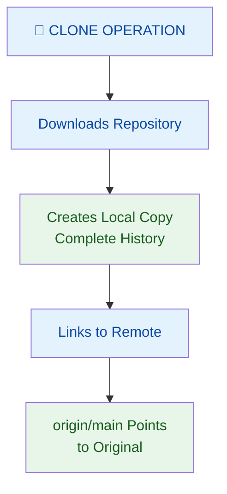

**Definition:** Clone downloads a remote repository to your local machine, creating a complete copy with full history and a connection to the original repository (remote).

**Characteristics:**
- ✅ Downloads entire repository history
- ✅ Creates local working copy
- ✅ Sets up remote tracking
- ✅ Requires push access to contribute back
- ✅ Direct connection to original repo
- ⚠️ Can only clone repositories you have access to
- ⚠️ Push directly to original (if permissions allow)

### What is Fork?

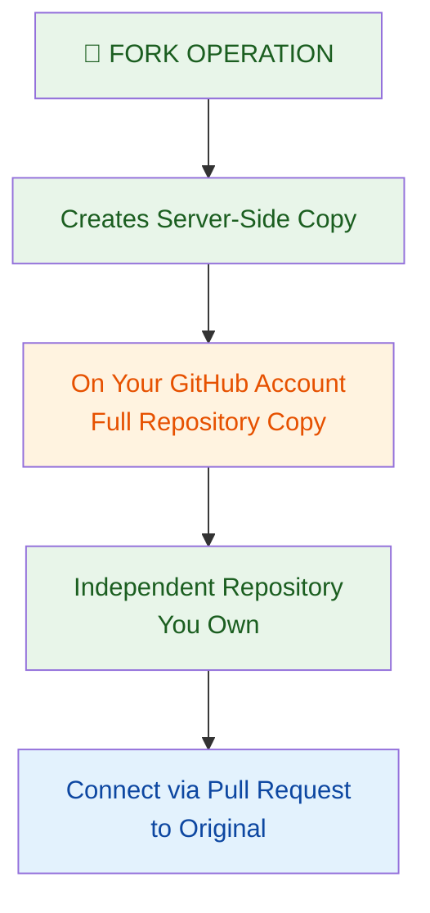

**Definition:** Fork creates a server-side copy of someone else's repository under your GitHub account, giving you ownership and control over it.

**Characteristics:**
- ✅ Creates independent copy on GitHub
- ✅ You own the forked repository
- ✅ Full push access to your fork
- ✅ Can be cloned to local machine
- ✅ Contribute via pull requests
- ✅ Keep your version updated if desired
- ⚠️ Requires GitHub account
- ⚠️ Creates duplicate repositories

---

## 2. Visual Comparison: Clone vs Fork

### The Workflow Difference

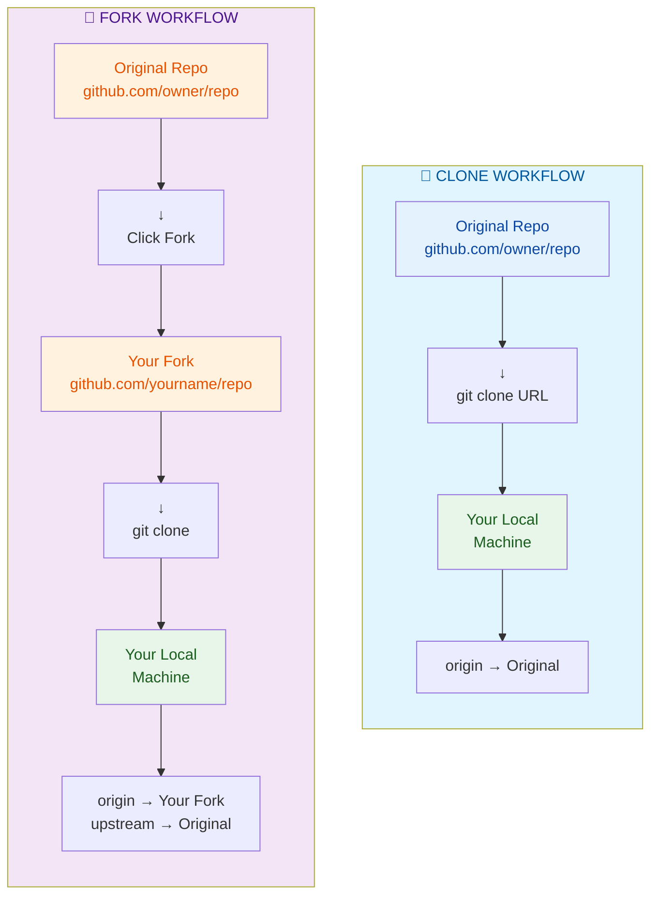

### Side-by-Side Comparison

| Aspect | Clone | Fork |
|--------|-------|------|
| **Location** | Server → Local only | Server (GitHub) + Local |
| **Ownership** | Original repo owner | You own the fork |
| **Server Copy** | No | Yes (on GitHub) |
| **Access Required** | Read or write permission | Public repo (anyone) |
| **Push Access** | Only if you have permission | Full access to your fork |
| **Contribution** | Direct commit + push | Pull request to original |
| **Remote Setup** | Single remote (origin) | Two remotes (origin + upstream) |
| **Use Case** | Team projects, personal repos | Open-source contributions |
| **Independence** | Synced with original | Can diverge from original |
| **Who Can Do It** | Repo members | Anyone (for public repos) |
| **Server Storage** | Original only | Original + Your copy |

### Relationship Diagram

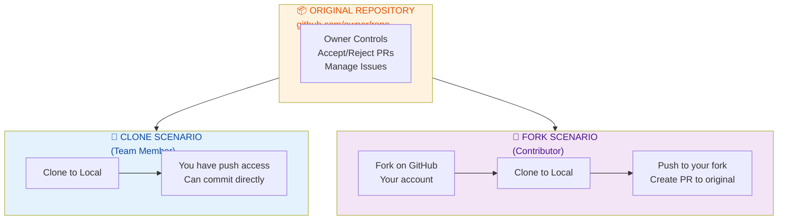

---

## 3. Clone in Depth

### How Clone Works

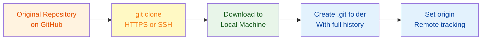

### Clone Commands

```bash
# Clone via HTTPS (easier for beginners)
git clone https://github.com/owner/repository.git

# Clone via SSH (requires SSH key setup)
git clone git@github.com:owner/repository.git

# Clone into specific folder
git clone https://github.com/owner/repository.git my-folder

# Clone with limited history (faster for large repos)
git clone --depth 1 https://github.com/owner/repository.git

# View remotes after clone
git remote -v
# Output:
# origin  https://github.com/owner/repository.git (fetch)
# origin  https://github.com/owner/repository.git (push)
```

### Clone Remote Configuration

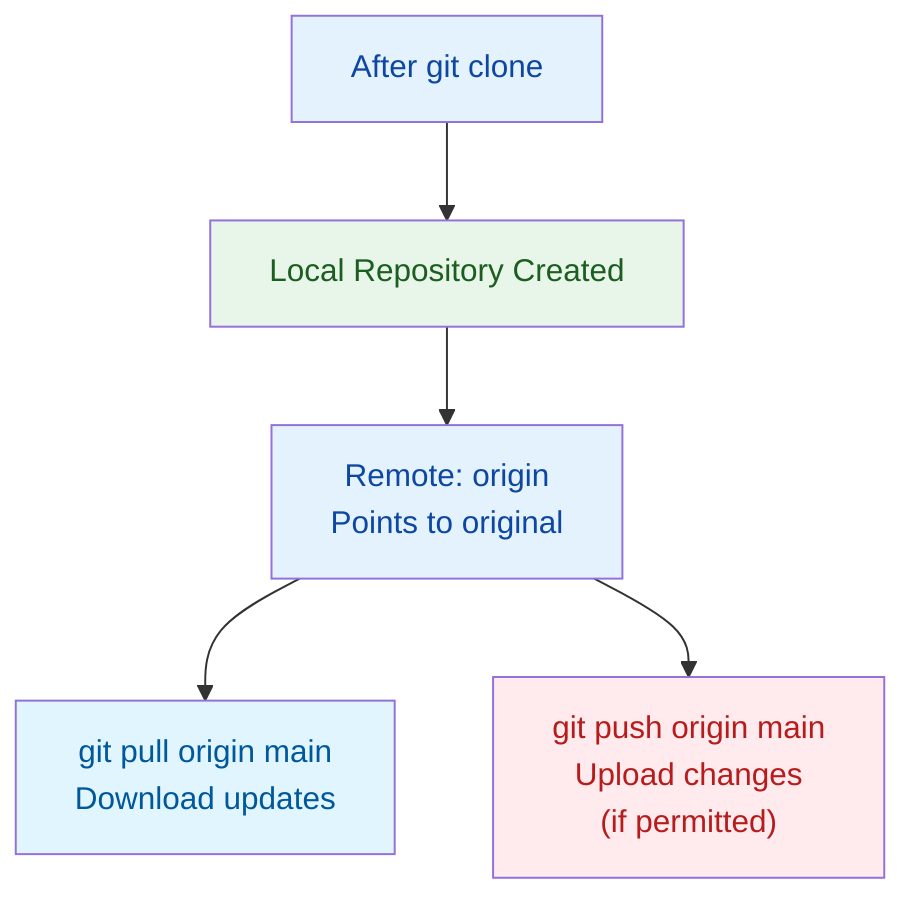

---

## 4. Fork in Depth

### How Fork Works

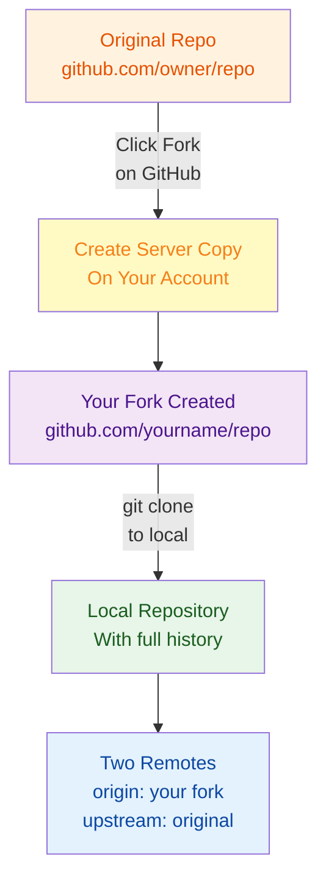

### Fork + Clone Complete Workflow

```bash
# Step 1: Fork on GitHub (GUI only)
# Visit: https://github.com/owner/original-repo
# Click "Fork" button
# Result: Your copy at github.com/yourname/original-repo

# Step 2: Clone your fork to local
git clone https://github.com/yourname/original-repo.git
cd original-repo

# Step 3: Add upstream remote (points to original)
git remote add upstream https://github.com/owner/original-repo.git

# Step 4: Verify remotes
git remote -v
# Output:
# origin    https://github.com/yourname/original-repo.git (fetch)
# origin    https://github.com/yourname/original-repo.git (push)
# upstream  https://github.com/owner/original-repo.git (fetch)
# upstream  https://github.com/owner/original-repo.git (push - read-only)

# Step 5: Create feature branch
git checkout -b fix-bug-123

# Step 6: Make changes, commit
git commit -am "Fix: Resolved bug #123"

# Step 7: Push to your fork
git push origin fix-bug-123

# Step 8: Create Pull Request on GitHub
# Visit: github.com/yourname/original-repo
# Click "New Pull Request"
# Compare: owner/original-repo ← yourname/original-repo
# Submit PR for review
```

### Two-Remote Setup Explained

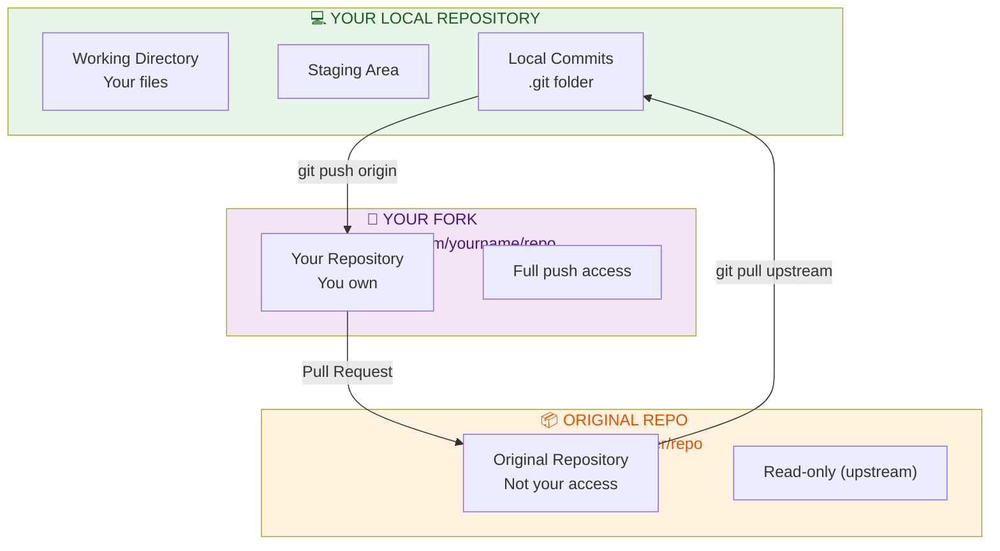

---

## 5. Detailed Comparison Scenarios

### Scenario 1: Permission-Based Decision

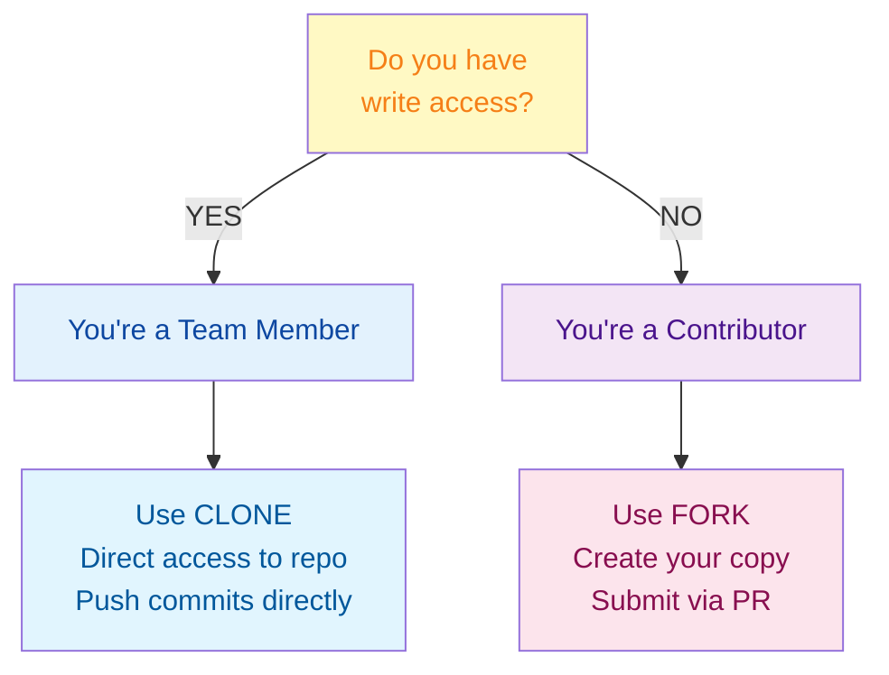

### Scenario 2: Long-Term Maintenance

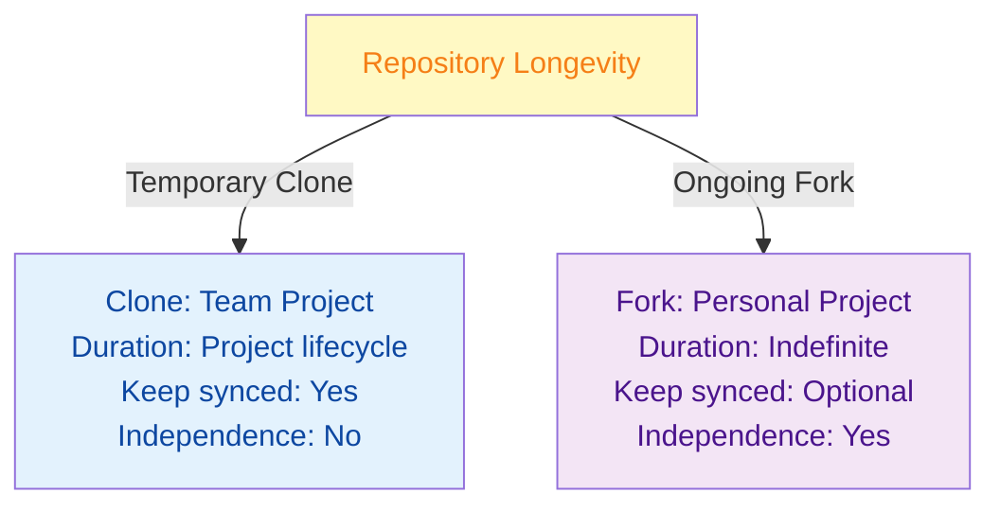

---

## 6. When to Use Clone

### Use Clone When:

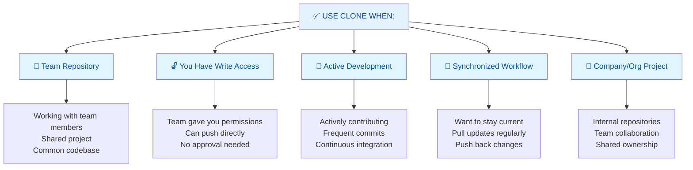

### Clone Command Quick Reference

```bash
# Basic clone
git clone https://github.com/owner/repo.git

# Update local copy
git pull origin main

# Push changes back
git push origin feature-branch

# View remote
git remote -v
```

---

## 7. When to Use Fork

### Use Fork When:

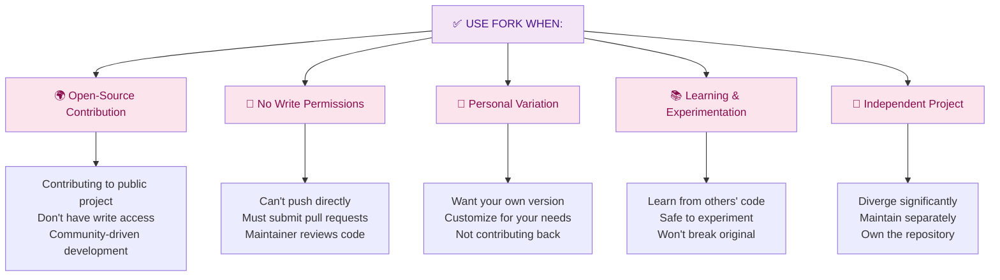

### Fork + Clone Command Quick Reference

```bash
# 1. Fork on GitHub (click button)

# 2. Clone your fork
git clone https://github.com/yourname/repo.git

# 3. Add upstream
git remote add upstream https://github.com/owner/repo.git

# 4. Keep in sync
git fetch upstream
git rebase upstream/main

# 5. Push to your fork
git push origin feature-branch

# 6. Create PR on GitHub
```

---

## 8. Quick Cheatsheet

### Decision Tree

```
Need to contribute to someone's repo?
│
├─► Can you push to repo?
│   ├─► YES → USE CLONE
│   │   └─► git clone + git push
│   │
│   └─► NO → USE FORK
│       └─► Fork + Clone + PR
│
└─► Want your own version?
    ├─► YES → USE FORK
    │   └─► Independent copy
    │
    └─► NO → USE CLONE
        └─► Collaborative copy
```

### Command Comparison

| Task | Clone | Fork |
|------|-------|------|
| **Get code locally** | `git clone URL` | Fork + `git clone URL` |
| **Push changes** | `git push origin branch` | Push to fork, then PR |
| **Update from original** | `git pull origin main` | `git fetch upstream` + `git rebase` |
| **View remotes** | origin only | origin + upstream |
| **Contribute back** | Direct push | Pull request |
| **Create server copy** | No | Yes (via fork) |

### Common Operations

```bash
# CLONE WORKFLOW
git clone https://github.com/owner/repo.git
cd repo
git checkout -b feature
# ... make changes ...
git commit -am "message"
git push origin feature

# FORK WORKFLOW
# 1. Fork on GitHub
git clone https://github.com/yourname/repo.git
cd repo
git remote add upstream https://github.com/owner/repo.git
git checkout -b feature
# ... make changes ...
git commit -am "message"
git push origin feature
# 2. Create PR on GitHub

# SYNC FORK WITH UPSTREAM
git fetch upstream
git rebase upstream/main
git push origin main
```

---

## 9. Real-World Scenarios

### Scenario 1: Open-Source Contribution

**Situation:** You want to fix a bug in a popular open-source project

**Setup:**
```
Original: github.com/torvalds/linux (no write access)
You: Regular developer wanting to contribute
Goal: Submit bug fix via pull request
```

**Process:**

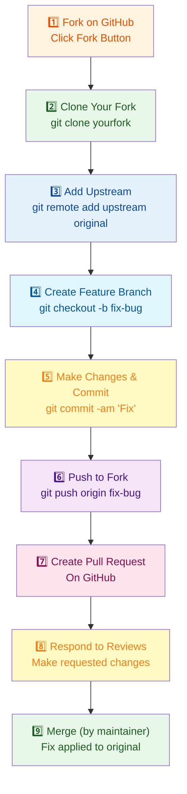

**Commands:**
```bash
# Fork button on github.com/torvalds/linux

git clone https://github.com/yourname/linux.git
cd linux
git remote add upstream https://github.com/torvalds/linux.git

git checkout -b fix-memory-leak
# ... edit files ...
git add .
git commit -m "Fix: memory leak in kernel/sched.c"
git push origin fix-memory-leak

# Create PR on GitHub: yourname:fix-memory-leak → torvalds:main
```

---

### Scenario 2: Team Project Development

**Situation:** You're part of a team developing a company application

**Setup:**
```
Repository: github.com/company/app-backend
Your role: Developer with write access
Goal: Collaborate with team members
```

**Process:**

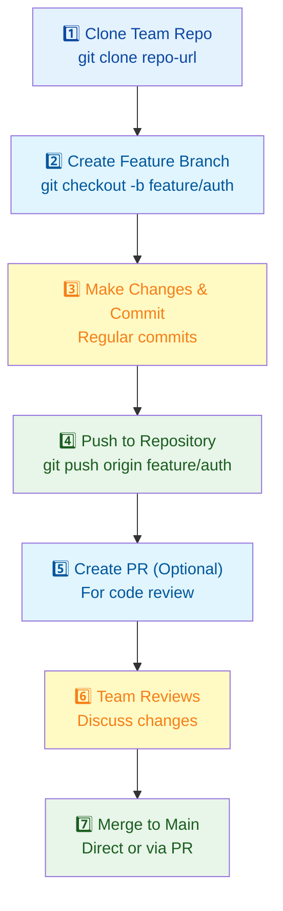

**Commands:**
```bash
git clone https://github.com/company/app-backend.git
cd app-backend

git checkout -b feature/user-authentication
# ... work on authentication ...

git add src/auth/
git commit -m "Add JWT authentication"
git push origin feature/user-authentication

# On GitHub: Create PR for team review
# Team members review and approve
# Merge PR to main branch
```

---

### Scenario 3: Personal Version of Open-Source Project

**Situation:** You want a customized version of a popular framework for your needs

**Setup:**
```
Original: github.com/facebook/react
You: Developer needing customized version
Goal: Maintain your own variant
```

**Process:**

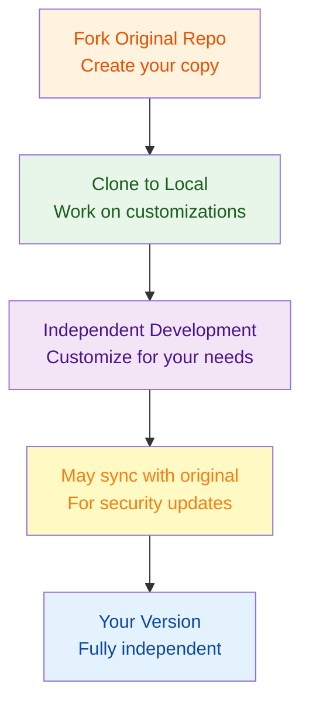

**Commands:**
```bash
# Fork on GitHub

git clone https://github.com/yourname/react.git my-react
cd my-react

# Customize
git checkout -b custom/performance-tweaks
# ... make changes ...
git commit -am "Optimize performance for mobile"
git push origin custom/performance-tweaks

# Optionally sync with upstream for security updates
git remote add upstream https://github.com/facebook/react.git
git fetch upstream
git merge upstream/main
```

---

## 10. Best Practices

### Clone Best Practices

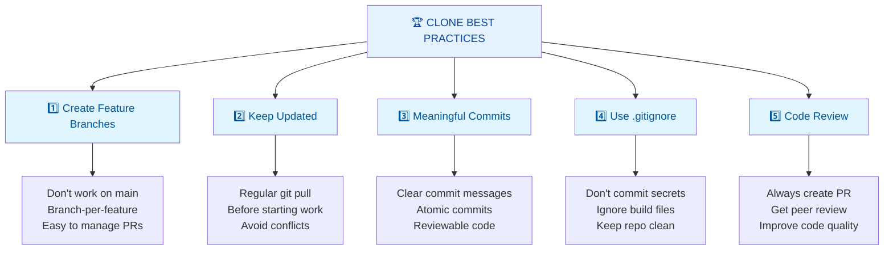

### Fork Best Practices

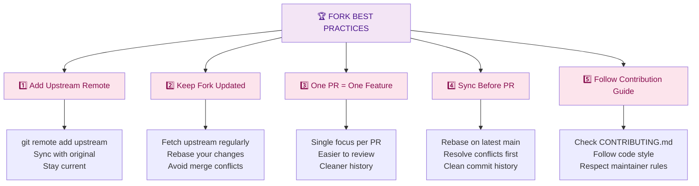

---

## 11. Summary & Key Takeaways

### What You Should Know

✅ **Clone** = Download repo to local machine with direct remote connection  
✅ **Fork** = Create server-side copy on GitHub under your account  
✅ **Clone for teams** with write access, **fork for open-source contributions**  
✅ **Two-remote setup** (origin + upstream) for fork workflow  
✅ **Permission model** determines clone vs fork  
✅ **Pull requests** are the fork workflow's contribution mechanism  
✅ **Syncing** is important for both but different methods  

### Quick Decision Matrix

| Situation | Use |
|-----------|-----|
| Team member with write access | Clone |
| Contributing to open-source | Fork |
| Want to push directly | Clone |
| Want to submit PR | Fork |
| Need approval before merging | Fork |
| Can merge your own code | Clone |
| Experimenting safely | Fork |
| Active team development | Clone |

---

## 12. Interview & Exam Prep

### Common Interview Questions

**Q1: What's the difference between clone and fork?**
> Clone downloads a repository to your local machine with a direct connection to the original (remote). Fork creates a server-side copy on your GitHub account that you own. Clone is used when you have write access; fork is used to contribute without direct access.

**Q2: When would you use fork over clone?**
> Use fork when you don't have write access to a repository, such as contributing to open-source projects. Fork creates your own copy on GitHub, which you can push to freely. Then you submit a pull request to the original repository for the maintainer to review and merge.

**Q3: What are the two remotes in a fork workflow?**
> Origin points to your fork (where you have full push access), and upstream points to the original repository (read-only). This allows you to push your changes to your fork and pull updates from the original repository.

**Q4: How do you keep a fork synchronized with the original?**
> Add the original as upstream remote: `git remote add upstream original-url`. Fetch updates: `git fetch upstream`. Rebase your work: `git rebase upstream/main`. Push to your fork: `git push origin main`.

**Q5: Can you push directly to the original repo after cloning?**
> Only if you have write permissions. Clone just creates a connection; it doesn't grant permissions. If the original repo owner gave you write access, you can push. Otherwise, you need to fork and submit a pull request.

**Q6: What's the purpose of the "upstream" remote in a fork?**
> Upstream points to the original repository. It lets you fetch the latest changes from the original so you can keep your fork synchronized. This is important to stay current with security updates and new features.

**Q7: Why would you keep a fork independent instead of keeping it synced?**
> If you want to maintain your own version of a project with customizations that won't be contributed back. For example, a customized version of a framework for your specific needs, where the original doesn't need your changes.

**Q8: Can you contribute the same changes to both the original and your fork?**
> Yes. You can create a PR to the original repository. If they merge it, the change is in the original. Your fork can then sync with upstream to get the change. Or you can maintain your own version with additional customizations on top.

### Practice Scenarios

**Scenario A:** New team member joins project. Should they clone or fork?
- Answer: Clone, because they're part of the team with write access

**Scenario B:** Developer wants to contribute to Linux kernel. What's first step?
- Answer: Fork the kernel repository, then clone their fork locally, add upstream remote

**Scenario C:** You want your own customized version of Bootstrap CSS. What do you do?
- Answer: Fork Bootstrap, clone your fork, customize independently, no need to sync

---

## 13. Troubleshooting Common Issues

### Issue: Can't Push to Original After Cloning

**Problem:** `fatal: Permission denied` when trying to `git push origin`

**Cause:** You don't have write permissions on the original repository

**Solution:**
```bash
# Option 1: If you should have access, contact owner to add you
# Owner adds you as collaborator on GitHub

# Option 2: Fork the repository
# Then clone your fork and push there
git clone https://github.com/yourname/forked-repo.git
git push origin branch  # Works to your fork
# Then create PR to original
```

### Issue: Forked Repo is Behind Original

**Problem:** Your fork is missing updates from original repository

**Solution:**
```bash
# Add upstream
git remote add upstream https://github.com/owner/original.git

# Fetch updates
git fetch upstream

# Rebase your main on upstream
git checkout main
git rebase upstream/main

# Push rebased main to your fork
git push origin main --force-with-lease
# (be careful with force push)

# OR merge instead of rebase
git merge upstream/main
git push origin main
```

### Issue: Created PR from Main Branch

**Problem:** PR includes unrelated commits from your fork's main branch

**Solution:**
```bash
# Delete your fork's main and recreate from upstream
git fetch upstream
git checkout main
git reset --hard upstream/main
git push origin main --force-with-lease

# Create proper feature branch next time
git checkout -b feature/my-feature upstream/main
# Work here, then push
git push origin feature/my-feature
```

### Issue: Multiple Forks From Same Repo

**Problem:** Confusing which fork is which, may have duplicates

**Solution:**
```bash
# Check what you're cloning
git remote -v
# Shows which origin is which

# For documentation, rename locally
git clone https://github.com/yourname/fork-of-project.git my-project-fork

# Or document in README
# "This fork is based on original at [url]"
```

---

## 14. Visual Summary

### Complete Clone vs Fork Flow

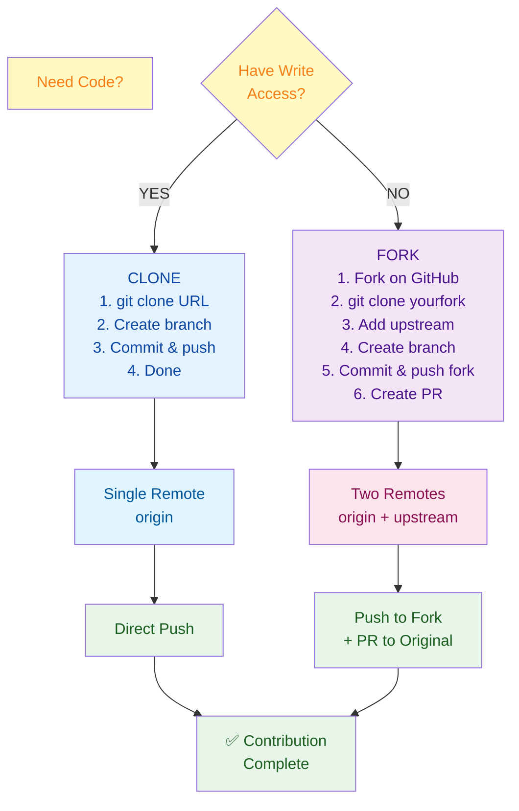

---

**Last Updated:** January 6, 2026  
**Difficulty Level:** Beginner to Intermediate  
**Prerequisites:** Understanding of Git basics, GitHub account, command-line basics
