# GitHub Codespaces: Cloud Development Guide

## Overview

GitHub Codespaces is a cloud-hosted development environment that runs in your browser or local editor. It eliminates the need for local setup—open a repository in Codespaces and start coding immediately with a fully configured environment. Perfect for onboarding, quick fixes, contributing without setup hassle, or developing without powerful hardware.

### Why It Matters
- **No setup time** - Start coding in seconds
- **Consistent environment** - Same setup for all developers
- **Works anywhere** - Browser, VS Code, JetBrains IDEs
- **Powerful hardware** - More specs than typical laptop
- **Pre-configured** - Devcontainers automate setup
- **Easy collaboration** - Share live sessions
- **Lower barrier** - No local installation needed
- **Machine independence** - Chromebook, iPad, lightweight laptop

### Main Use Cases
- Onboarding new developers quickly
- Code review from anywhere
- Contributing without local setup
- Learning new codebases
- Quick hotfixes
- Pair programming sessions
- Mobile development (limited)
- Cross-platform testing

---

## 1. Core Concepts & Fundamentals

### What Is GitHub Codespaces?

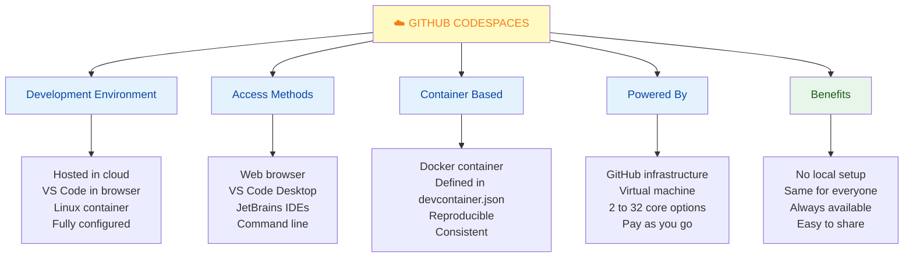

### Codespaces vs Local Development

| Feature | Codespaces | Local |
|---------|-----------|-------|
| **Setup Time** | Minutes | Hours |
| **Consistency** | Perfect | Varies |
| **Hardware Cost** | Pay per hour | One-time |
| **Portability** | Works everywhere | Machine-bound |
| **Offline** | No | Yes |
| **Performance** | Good | Variable |
| **Control** | Limited | Full |
| **Team Onboarding** | Fast | Slow |

### Codespaces Workflow

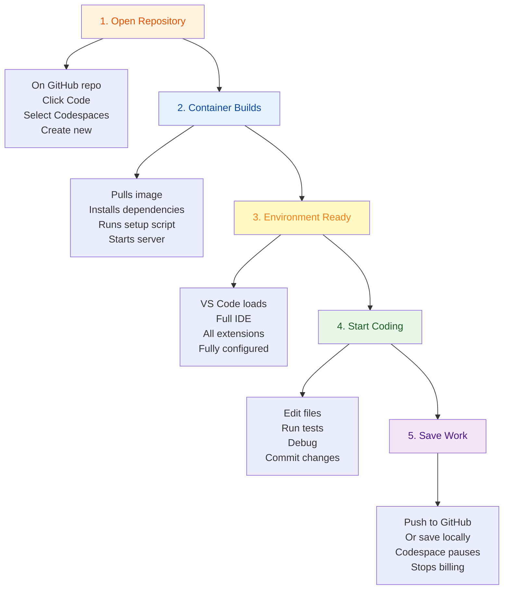

---

## 2. Getting Started with Codespaces

### Creating Your First Codespace

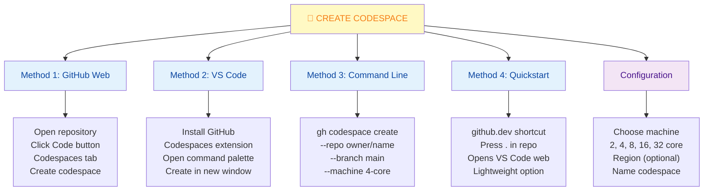

### Step-by-Step: First Codespace

```
1. Go to GitHub.com
   Navigate to your repository

2. Click Code button
   Top right of repo
   Look for green button

3. Click Codespaces tab
   Shows existing codespaces
   Option to create new

4. Click "Create codespace on main"
   Or select different branch

5. Wait for build
   Building... (1-3 minutes)
   Downloads image
   Installs dependencies
   Runs setup scripts

6. VS Code opens
   In browser or desktop
   Ready to code!

7. Start editing files
   Changes auto-save
   Run commands in terminal
   Test your code
```

### Codespaces Settings

```yaml
GitHub Settings → Codespaces

Machine Type:
  - 2-core (default, free tier)
  - 4-core
  - 8-core
  - 16-core
  - 32-core

Idle Timeout: (when to pause)
  - 30 minutes (default)
  - 60 minutes
  - 120 minutes
  - Never

Retention Period: (how long kept)
  - 0 days (deleted immediately)
  - 7 days (default)
  - 30 days
  - 0 days (disabled)

Allowed Regions:
  - US East
  - US West
  - Europe
  - Asia Pacific
  - Auto-select closest
```

---

## 3. Development in Codespaces

### Working in Codespaces

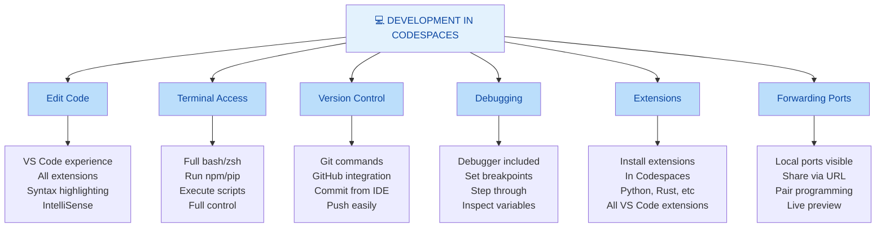

### Keyboard Shortcuts in Codespaces

```bash
# Standard VS Code shortcuts work
Ctrl+` (backtick)     # Toggle terminal
Ctrl+Shift+P          # Command palette
Ctrl+/                # Toggle comment
Ctrl+K Ctrl+C         # Add comment
Ctrl+K Ctrl+U         # Remove comment
Ctrl+Shift+L          # Select all occurrences
Ctrl+D                # Select next occurrence
Ctrl+B                # Toggle sidebar
Ctrl+Shift+E          # Open explorer
Ctrl+Shift+G          # Open source control
Ctrl+Shift+F          # Open search
Ctrl+H                # Replace
```

### Terminal in Codespaces

```bash
# Full bash access like local terminal

# Install dependencies
npm install
pip install -r requirements.txt
apt-get install package

# Run development server
npm run dev
python manage.py runserver
node server.js

# Run tests
npm test
pytest
go test ./...

# Git commands
git status
git commit -m "message"
git push origin branch-name

# Check environment
node --version
python --version
npm --version
which node
```

---

## 4. Devcontainers Configuration

### What Is devcontainer.json?

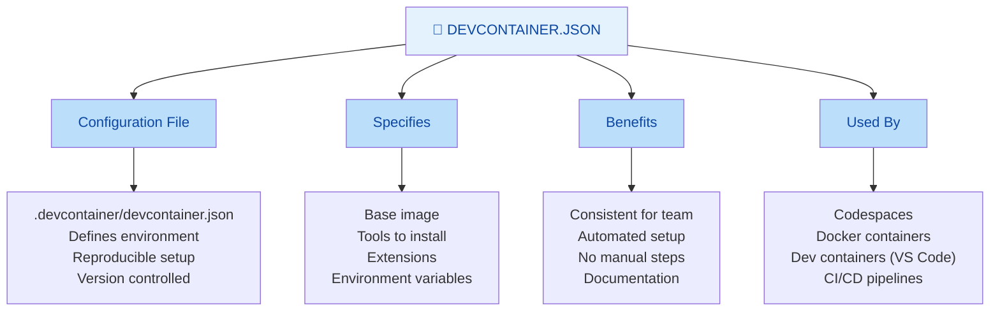

### Basic devcontainer.json Example

```json
{
  "name": "Python Development",
  "image": "mcr.microsoft.com/devcontainers/python:3.11",
  
  "features": {
    "ghcr.io/devcontainers/features/git:latest": {},
    "ghcr.io/devcontainers/features/node:latest": {
      "nodeVersion": "18"
    }
  },
  
  "customizations": {
    "vscode": {
      "extensions": [
        "ms-python.python",
        "ms-python.vscode-pylance",
        "ms-python.debugpy",
        "charliermarsh.ruff",
        "GitHub.copilot"
      ],
      "settings": {
        "python.defaultInterpreterPath": "/usr/local/bin/python",
        "python.linting.enabled": true,
        "python.linting.pylintEnabled": true,
        "python.formatting.provider": "black",
        "[python]": {
          "editor.defaultFormatter": "ms-python.python",
          "editor.formatOnSave": true
        }
      }
    }
  },
  
  "postCreateCommand": "pip install -r requirements.txt && pre-commit install",
  
  "remoteUser": "vscode",
  
  "forwardPorts": [8000, 8001],
  "forwardPortsActivity": {
    "8000": "silent"
  }
}
```

### Node.js devcontainer.json Example

```json
{
  "name": "Node.js Development",
  "image": "mcr.microsoft.com/devcontainers/javascript-node:18",
  
  "features": {
    "ghcr.io/devcontainers/features/git:latest": {}
  },
  
  "customizations": {
    "vscode": {
      "extensions": [
        "dbaeumer.vscode-eslint",
        "esbenp.prettier-vscode",
        "GitHub.copilot",
        "ms-azuretools.vscode-docker"
      ],
      "settings": {
        "editor.formatOnSave": true,
        "editor.defaultFormatter": "esbenp.prettier-vscode",
        "[javascript]": {
          "editor.defaultFormatter": "esbenp.prettier-vscode"
        }
      }
    }
  },
  
  "postCreateCommand": "npm install",
  
  "forwardPorts": [3000, 5000],
  
  "portsAttributes": {
    "3000": {
      "label": "Development Server",
      "onAutoForward": "notify"
    }
  }
}
```

### devcontainer.json Reference

| Property | Purpose |
|----------|---------|
| **image** | Base Docker image to use |
| **features** | Pre-built features (Git, Node, etc.) |
| **customizations.vscode** | VS Code extensions and settings |
| **postCreateCommand** | Script to run after container created |
| **forwardPorts** | Ports to expose from container |
| **remoteUser** | User to run commands as |
| **mounts** | Volumes to mount in container |
| **env** | Environment variables |

---

## 5. Collaboration & Sharing

### Sharing Codespaces

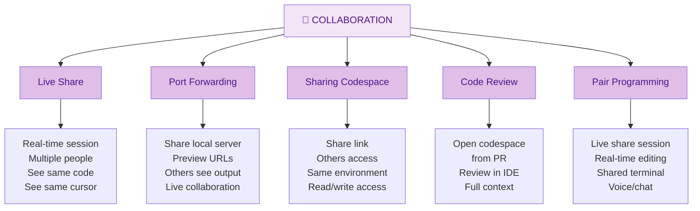

### Live Share in Codespaces

```
Starting Live Share Session:

1. In VS Code (Codespaces)
   Click Share button (top right)
   Or Ctrl+Shift+P: Live Share
   
2. "Start collaboration session"
   Generates invite link
   Copy link
   
3. Send to collaborators
   Via chat, email, etc
   
4. Others join
   Click link
   Can see your code
   Can edit (if allowed)
   
5. Collaborate
   Both editing same file
   See each other's cursors
   Optional: Share terminal
```

### Port Forwarding

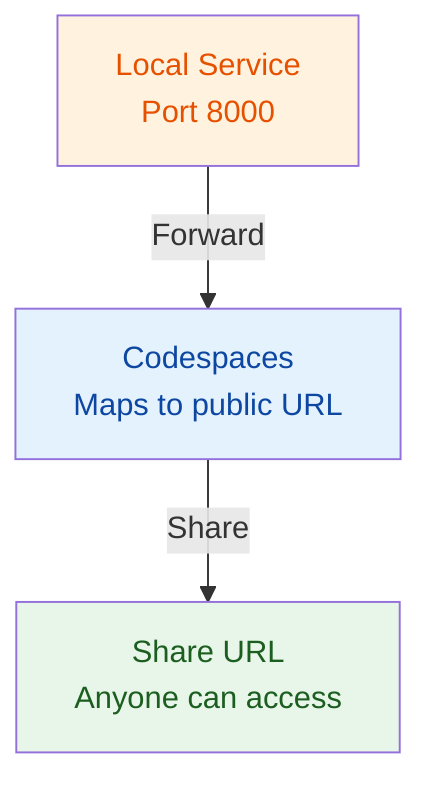

```bash
# Port forwarding setup

# In devcontainer.json
"forwardPorts": [3000, 8000, 5432],

"portsAttributes": {
  "3000": {
    "label": "App Server",
    "onAutoForward": "notify"
  },
  "5432": {
    "label": "Database",
    "onAutoForward": "silent"
  }
}

# Or manual in VS Code
Ctrl+Shift+P: Forward Port
Enter port number
Gets public URL
Can share with others
```

---

## 6. Quick Cheatsheet

### Common Tasks in Codespaces

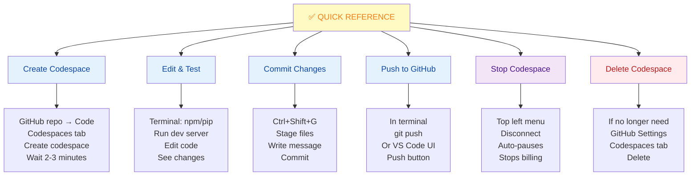

### Useful Commands

```bash
# Check current location
pwd

# List files
ls -la

# View Codespace info
gh codespace list

# Connect existing codespace
gh codespace code --repo owner/repo

# Stop/pause codespace
gh codespace stop

# Delete codespace
gh codespace delete

# View logs
gh codespace logs

# SSH into codespace
gh codespace ssh
```

### Tips & Tricks

| Tip | How |
|-----|-----|
| **Quick open file** | Ctrl+P, type filename |
| **Find in files** | Ctrl+Shift+F |
| **Go to line** | Ctrl+G |
| **Multi-cursor** | Ctrl+D select, Alt+Shift+I for all |
| **Format code** | Shift+Alt+F or Ctrl+Shift+P format |
| **Run task** | Ctrl+Shift+P, Tasks: Run Task |
| **View Outline** | Ctrl+Shift+O |
| **Comment/Uncomment** | Ctrl+/ |

---

## 7. Real-World Scenarios

### Scenario 1: Quick Bug Fix

**Situation:** Bug reported, need to fix immediately without setting up local environment

```
1. Open GitHub Issue
   Contains repository link
   
2. Click ... → Open in Codespaces
   Or Code → Codespaces → Create
   
3. Check out branch (if given)
   git checkout bugfix-branch
   
4. Reproduce bug
   npm run dev
   Test in browser
   Find issue
   
5. Make fix
   Edit file
   Test locally
   
6. Commit & push
   git add .
   git commit -m "Fix: description"
   git push origin bugfix-branch
   
7. Create PR
   GitHub auto-detects push
   Create PR to main
   
8. Disconnect
   Done fixing
   Stop codespace
```

**Time saved:** No local setup (would be 30 min) → Just coding (10 min)

---

### Scenario 2: Code Review in Codespaces

**Situation:** Reviewing PR, want full IDE experience

```
1. Open Pull Request
   See "Open with Codespaces" option
   
2. Create new codespace
   For this PR branch
   
3. Full review environment
   Run tests
   npm test
   
4. Debugging
   Set breakpoints
   Step through code
   Understand logic
   
5. Leave comments
   Make suggestions
   From IDE
   
6. Approve & close
   Codespace auto-deletes
   Saves resources
```

**Benefit:** Full context, can run code, better review quality

---

### Scenario 3: Onboarding New Developer

**Situation:** New team member joining, normally takes days to setup

```
Before (Old Way):
- Days to setup local environment
- Help from team members
- Multiple failed attempts
- Frustration
- Weeks before productive

After (Codespaces):
- First day: Clone repo
- Click "Code" → "Codespaces"
- 3 minutes: Full environment ready
- All dependencies installed
- Same as everyone else
- Can start contributing immediately

devcontainer.json:
{
  "image": "ubuntu:22.04",
  "features": {
    "node": "18",
    "python": "3.11"
  },
  "customizations": {
    "vscode": {
      "extensions": [
        "ms-python.python",
        "dbaeumer.vscode-eslint",
        "GitHub.copilot"
      ]
    }
  },
  "postCreateCommand": "npm install && npm run build"
}
```

**Result:** Weeks of setup → Hours of productivity

---

## 8. Best Practices

### GitHub Codespaces Best Practices

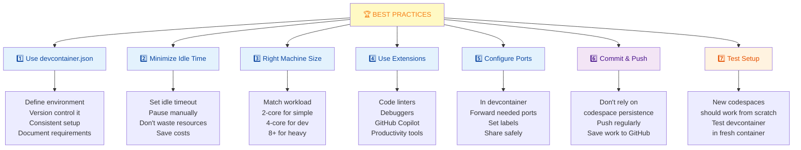

### Anti-Patterns to Avoid

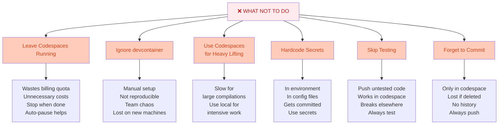

---

## 9. Summary & Key Takeaways

### What You Should Know

✅ **Codespaces is cloud development** - Code in browser or VS Code  
✅ **No setup needed** - Start coding in minutes  
✅ **devcontainer.json defines environment** - Reproducible for all  
✅ **Works in browser or desktop** - Full VS Code experience  
✅ **Pay per minute** - When stopped, no charge  
✅ **Collaboration built-in** - Live share, port forwarding  
✅ **Perfect for onboarding** - New developers productive immediately  
✅ **Machines from 2 to 32 cores** - Choose based on workload  

### Quick Comparison

| Task | Codespaces | Local | Browser Only |
|------|-----------|-------|--------|
| **Setup** | 3 min | 30 min | 1 min |
| **Features** | Full IDE | Full IDE | Limited |
| **Always Available** | ✅ | ❌ | ✅ |
| **Offline** | ❌ | ✅ | ❌ |
| **Cost** | Per minute | One-time | Free |
| **Onboarding** | Excellent | Slow | Easy |

---

## 10. Interview & Exam Prep

### Common Interview Questions

**Q1: What is GitHub Codespaces and what problem does it solve?**
> GitHub Codespaces is a cloud-hosted development environment. It solves the "setup hell" problem—developers can start coding immediately without installing tools, dependencies, or configuring environments. Perfect for onboarding, quick contributions, and cross-platform work.

**Q2: How does devcontainer.json relate to Codespaces?**
> devcontainer.json defines the development environment reproducibly. Codespaces reads it and builds the exact same container for every developer. It's version-controlled, so the whole team has identical setups without manual installation steps.

**Q3: What are the differences between Codespaces, VS Code web, and Local development?**
> VS Code web (github.dev) is lightweight, browser-only, free but limited. Codespaces is full-featured with real terminal, testing, debugging, but costs per minute. Local is offline, no costs, but setup is slow and requires maintenance.

**Q4: How do you share a Codespaces environment with a teammate?**
> Use Live Share for real-time collaboration, or share forwarded ports via generated URLs. You can also let them create their own Codespaces from the same repository—they'll get identical environment from devcontainer.json.

**Q5: When should you use Codespaces vs local development?**
> Use Codespaces for: quick fixes, code reviews, onboarding, cross-platform work, no local hardware. Use Local for: heavy compilation, offline work, long-term development, sensitive/confidential work.

**Q6: How do you optimize Codespaces costs?**
> Set appropriate idle timeout to auto-pause. Choose machine size matching workload (2-core for simple). Delete unused codespaces. Stop when not using. Don't leave running overnight. Use smaller machines for reviews.

**Q7: What can you do in a Codespace that you can't do in VS Code web?**
> Terminal access for full commands. Running and testing code. Debugging with breakpoints. Installing dependencies. Running dev servers. Building projects. Accessing ports. Full computational capability.

**Q8: How do you ensure consistency across team with Codespaces?**
> Commit devcontainer.json to repository. It defines base image, tools, extensions, environment variables, and setup scripts. Everyone creates from same config. No "works on my machine" problems.

### Practice Scenarios

**Scenario A:** Your team onboards 5 new developers monthly. How would Codespaces help?
- Each has same environment from devcontainer.json
- No setup: 3 minutes vs hours
- Same tools, versions, extensions
- Can start contributing day 1
- Cost: ~$2-3 per day per person for Codespaces vs 2-3 days lost productivity
- ROI: Positive

**Scenario B:** You need to review a complex PR. How would Codespaces improve the review?**
- Open PR in Codespaces
- Run tests to verify they pass
- Set breakpoints and debug
- Run full application to see behavior
- Better understanding of changes
- More confident review

**Scenario C:** Your company wants to reduce hardware costs. What's the Codespaces angle?
- No need for powerful local machines
- Chromebook + Codespaces works
- iPad + Codespaces works
- Cloud machine specs adjustable
- Team can use cheaper hardware
- Costs shift to cloud pay-as-you-go

---

## 11. Troubleshooting Common Issues

### Issue: Codespace Takes Too Long to Build

**Problem:** Container building is slow, waiting 10+ minutes

**Solutions:**

```bash
1. Optimize devcontainer.json
   Minimal base image
   Fewer features
   Faster postCreateCommand

2. Use Better Base Image
   Use official image (mcr.microsoft.com)
   Pre-built features faster
   Than custom Dockerfile

3. Reduce Features
   Only include needed
   Remove unused tools
   Each feature adds time

4. Optimize postCreateCommand
   Run in parallel if possible
   Limit installations
   Cache when possible

5. Use Prebuilt Codespace
   Cache in GitHub
   Reduces build time
   Set retention period

6. Choose Correct Region
   Closer region = faster
   GitHub Settings → Regions
   Pick nearest location
```

### Issue: Running Out of Disk Space

**Problem:** Codespace says "disk full"

**Solutions:**

```bash
1. Check Space Usage
   df -h
   See what's using space
   
2. Clean Docker/Node
   docker system prune
   npm cache clean --force
   
3. Remove Build Artifacts
   rm -rf node_modules dist build
   rm -rf .pytest_cache __pycache__
   
4. Large Files
   find . -type f -size +100M
   Delete unnecessary large files
   
5. Logs & Temp
   rm -rf /tmp/*
   rm -rf ~/.cache/*
   Clear logs
   
6. Reduce Retention
   GitHub Settings → Codespaces
   Lower retention period
   Delete old codespaces
```

### Issue: Extensions Not Installing

**Problem:** Specified extensions in devcontainer don't appear

**Solutions:**

```bash
1. Check Extension ID
   marketplace.visualstudio.com
   Copy correct ID
   Format: publisher.extension

2. Validate devcontainer.json
   Check JSON syntax
   Check quotes/commas
   Copy exact extension IDs

3. Try Manual Install
   In Codespaces
   Extensions sidebar
   Search and install
   See if error appears

4. Check Compatibility
   Some extensions not available
   In Codespaces
   Try different extension

5. Clear Cache
   VS Code: Settings Sync
   Turn off and back on
   Re-sync extensions

6. Update devcontainer
   Pull latest devcontainer spec
   Try official examples
   Copy working config
```

### Issue: Can't Commit Changes

**Problem:** Git push fails, auth errors

**Solutions:**

```bash
1. Check Git Config
   git config user.name
   git config user.email
   Set if missing:
   git config --global user.email "your@email.com"
   git config --global user.name "Your Name"

2. GitHub Auth
   Should auto-authenticate
   If not: gh auth login
   Choose GitHub.com
   Select HTTPS
   Authorize

3. SSH Keys
   Codespaces uses gh CLI
   Should work automatically
   Or upload SSH key

4. Check Remote
   git remote -v
   Should show https://github.com/...
   Or git@github.com:...

5. Permissions
   Check repo access
   You have write access?
   Not a fork issue

6. Rate Limiting
   Too many commits?
   Wait a bit
   Or check GitHub status
```

### Issue: Port Not Accessible

**Problem:** Forwarded port shows but can't access

**Solutions:**

```bash
1. Check Service Running
   npm run dev (or your start command)
   Server actually running?
   Check port correct

2. Listen on 0.0.0.0
   localhost → not accessible
   0.0.0.0 → accessible
   Check app config

3. Check devcontainer
   Port in "forwardPorts"?
   Correct port number?
   Need to rebuild

4. Firewall
   Codespaces should allow
   Check GitHub settings
   Port access restricted?

5. Public/Private
   Port visibility setting
   Public: anyone can access
   Private: authenticated only

6. Restart Service
   Stop application
   Check logs for errors
   Restart with correct port
```

---

## 12. Visual Summary

### Codespaces Workflow

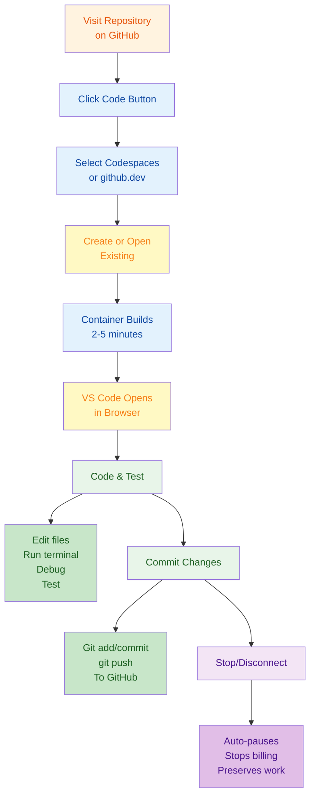

---

## 13. Codespaces Pricing & Quotas

### Pricing Model

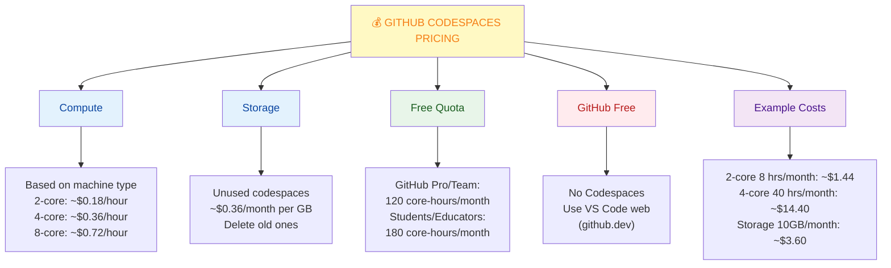

---

**Last Updated:** January 7, 2026  
**Difficulty Level:** Beginner to Intermediate  
**Prerequisites:** GitHub account, basic command line knowledge, familiarity with VS Code
