# GitHub Copilot: AI-Powered Development Guide

## Overview

GitHub Copilot is an AI-powered code completion tool developed by GitHub and OpenAI. It uses machine learning to suggest code snippets, functions, and even entire implementations based on your comments and code context. Copilot learns from billions of lines of public code and helps developers write code faster while learning new patterns.

### Why It Matters
- **Speeds up coding** - Write boilerplate and repetitive code in seconds
- **Learning tool** - Discover new patterns and APIs
- **Reduces errors** - AI suggests tested patterns
- **Less context switching** - Stay in your editor
- **Works with many languages** - Python, JavaScript, TypeScript, Go, Rust, etc.
- **Learns from comments** - Describe what you want in English
- **Improves productivity** - Studies show 55% faster coding
- **Always available** - Integrates into your IDE

### Main Use Cases
- Writing boilerplate code quickly
- Implementing common algorithms
- Learning new libraries and APIs
- Testing and test data generation
- Documentation and comments
- Code refactoring suggestions
- Bug detection and fixes
- Learning programming patterns

---

## 1. Core Concepts & Fundamentals

### What Is GitHub Copilot?

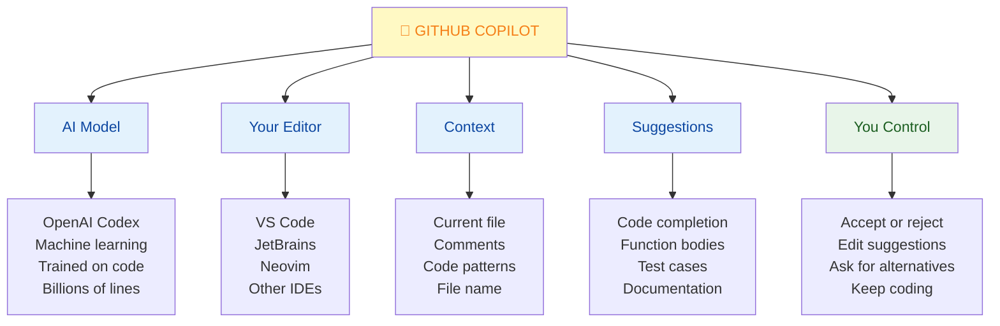

### How GitHub Copilot Works

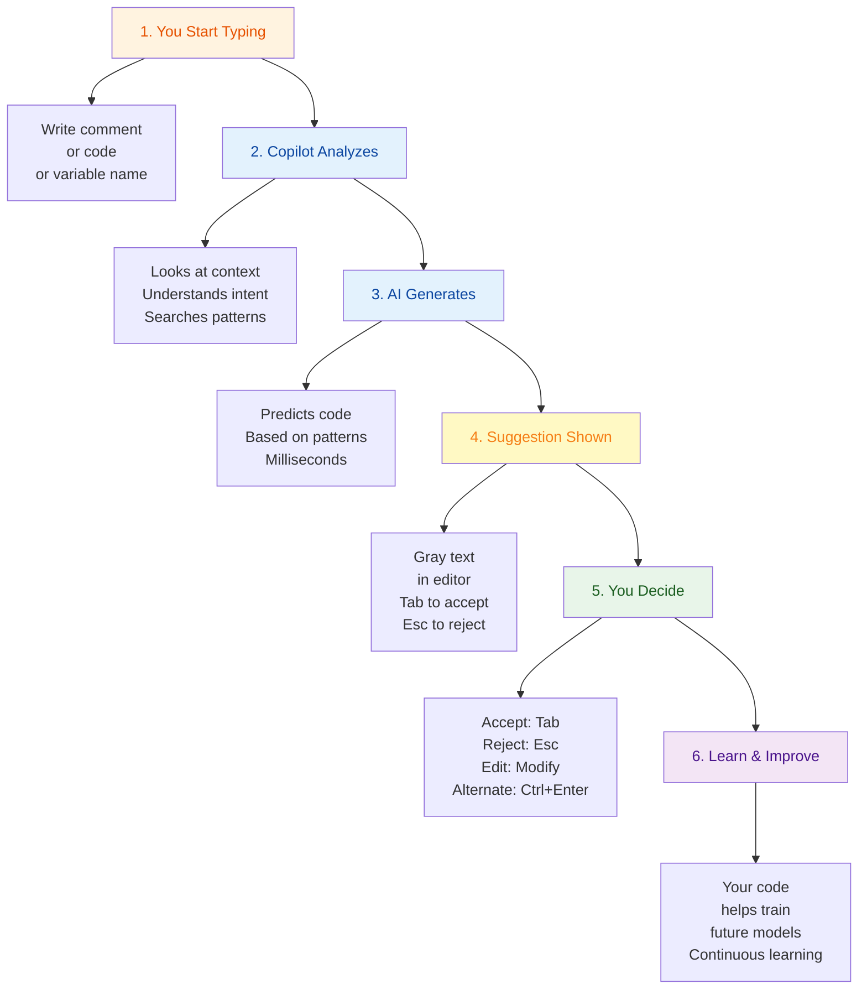

### Copilot Capabilities

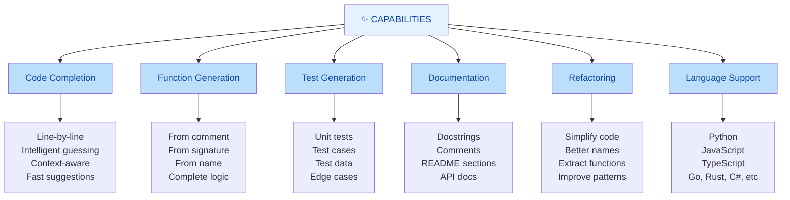

---

## 2. Installation & Setup

### Getting Started with GitHub Copilot

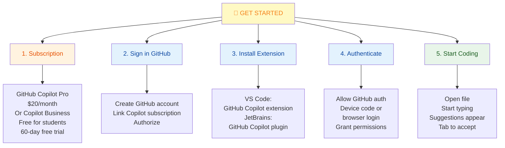

### Installation by IDE

#### VS Code

```
1. Open Extensions (Ctrl+Shift+X / Cmd+Shift+X)
2. Search "GitHub Copilot"
3. Install official extension by GitHub
4. Reload VS Code
5. Sign in with GitHub account
6. Authorize application
```

#### JetBrains IDEs (IntelliJ, PyCharm, etc.)

```
1. Go to Settings → Plugins
2. Search "GitHub Copilot"
3. Install plugin
4. Restart IDE
5. Tools → GitHub Copilot → Login
6. Authenticate with GitHub
```

#### Neovim

```bash
# Using vim-plug
Plug 'github/copilot.vim'

# Then in Neovim
:Copilot setup
# Authenticate with browser
```

### Copilot Settings

```
VS Code: Settings → Extensions → GitHub Copilot

□ Copilot: Enable Copilot
□ Auto Scroll to Top
□ Debounce Milliseconds (0-1000)
□ Inline Suggest: Show Lines
□ Inline Suggest: Count
□ Inline Suggest: Delay
□ Proxy Support
□ Trace
□ Use Experimental Chat: Enable Chat mode
```

---

## 3. Using Copilot Effectively

### Keyboard Shortcuts

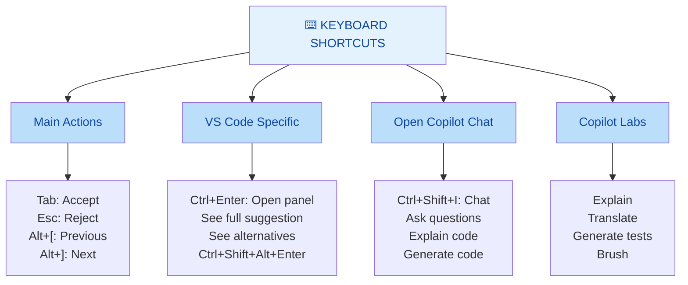

### Best Prompting Techniques

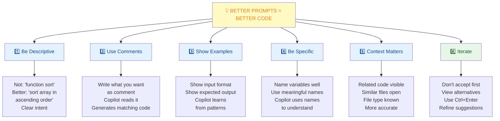

### Examples of Good Prompts

```python
# ❌ Poor prompt (too vague)
# function to process

# ✅ Better prompt (specific)
# function to validate email format
# accepts string parameter
# returns True if valid, False otherwise
def validate_email(email: str) -> bool:
    # Copilot will now generate proper implementation

# ❌ Poor prompt (missing context)
# sort data

# ✅ Better prompt (clear)
# sort list of dictionaries by 'date' key
# in descending order, most recent first
def sort_by_date(events: list[dict]) -> list[dict]:
    # Clear what's expected

# ❌ Poor prompt (incomplete)
# make api call

# ✅ Better prompt (specific)
# fetch user data from https://api.example.com/users
# with authentication header
# return parsed JSON response
def fetch_users(token: str) -> dict:
    # Copilot generates proper request code
```

---

## 4. Copilot for Different Tasks

### Writing Code from Comments

```python
# Example 1: Simple function from comment
# ✅ Copilot reads comment and generates code

# fibonacci sequence up to n terms
def fibonacci(n: int) -> list[int]:
    # Copilot generates the implementation
    if n <= 0:
        return []
    elif n == 1:
        return [0]
    
    result = [0, 1]
    while len(result) < n:
        result.append(result[-1] + result[-2])
    return result

# Example 2: Complex function with clear comment

# Convert markdown to HTML
# Handle headers (# to #####), bold (**), italic (*), links [text](url)
def markdown_to_html(markdown: str) -> str:
    # Copilot provides solid starting implementation
    # with regex patterns and HTML conversion
    ...

# Example 3: API endpoint from description

# GET /api/users/{id} endpoint
# Return user by ID, 404 if not found
@app.get("/api/users/{id}")
def get_user(id: int):
    # Copilot generates Flask/FastAPI handler
    user = database.find_user(id)
    if not user:
        return {"error": "User not found"}, 404
    return user
```

### Generating Tests

```python
def add(a: int, b: int) -> int:
    """Add two numbers"""
    return a + b

# Write below and Copilot helps
class TestMath(unittest.TestCase):
    def test_add_positive(self):
        # Copilot suggests test case
        self.assertEqual(add(2, 3), 5)
    
    def test_add_negative(self):
        # Generates handling of negatives
        self.assertEqual(add(-1, -2), -3)
    
    def test_add_zero(self):
        # Edge cases
        self.assertEqual(add(0, 5), 5)

# Or let Copilot write all tests
# Press Ctrl+Enter to open chat
# "Generate unit tests for this function"
```

### Creating Documentation

```python
def fetch_data(url: str, headers: dict = None, timeout: int = 30) -> dict:
    """
    # Start docstring, Copilot completes it
    Fetch data from the specified URL.
    
    Args:
        url: The URL to fetch data from
        headers: Optional HTTP headers
        timeout: Request timeout in seconds
    
    Returns:
        Dictionary containing the response data
    
    Raises:
        requests.RequestException: If the request fails
    """
    # Implementation
    pass

# Or generate README section
# Type in markdown file and let Copilot complete

# ## Installation
# 
# ```bash
# pip install my-package
# ```
# 
# Copilot suggests next sections and content
```

### Refactoring Code

```python
# ❌ Messy code
def process(d):
    r=[]
    for x in d:
        if x['a']>10 and x['b']<5:
            r.append({'v':x['a']*2,'n':x['b']+1})
    return r

# ✅ Improved (Copilot suggests better names, structure)
def process_items(items: list[dict]) -> list[dict]:
    """Extract and transform items matching criteria"""
    results = []
    for item in items:
        if item['age'] > 10 and item['count'] < 5:
            results.append({
                'value': item['age'] * 2,
                'name': item['count'] + 1
            })
    return results

# Or Copilot can suggest:
# - List comprehension version
# - More Pythonic patterns
# - Performance improvements
```

---

## 5. Copilot Chat

### What Is Copilot Chat?

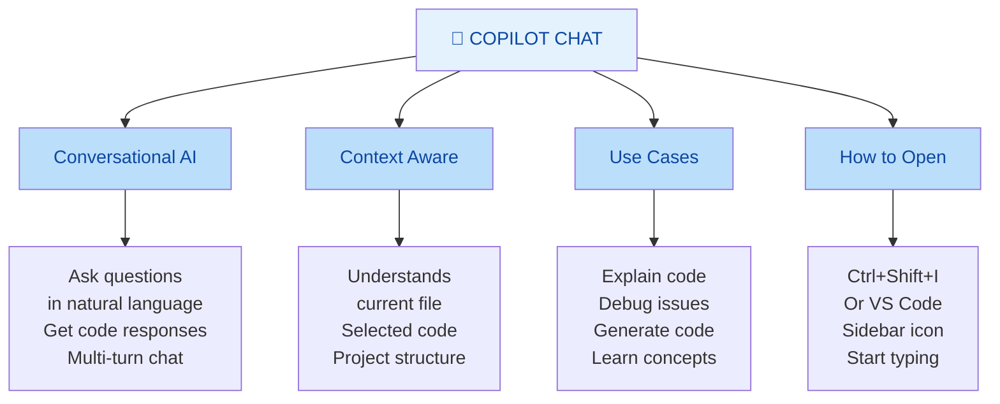

### Chat Examples

```
You: "Explain this function to me"
Copilot: [Explains the code in detail]

You: "How would I optimize this?"
Copilot: [Suggests improvements, shows refactored version]

You: "Write a test for this"
Copilot: [Generates test cases]

You: "What's a good way to validate emails in Python?"
Copilot: [Explains options, shows regex or library approach]

You: "Debug why this fails"
Copilot: [Analyzes error, suggests fixes]

You: "Explain how to use the requests library"
Copilot: [Provides tutorial with examples]
```

---

## 6. Quick Cheatsheet

### Common Use Patterns

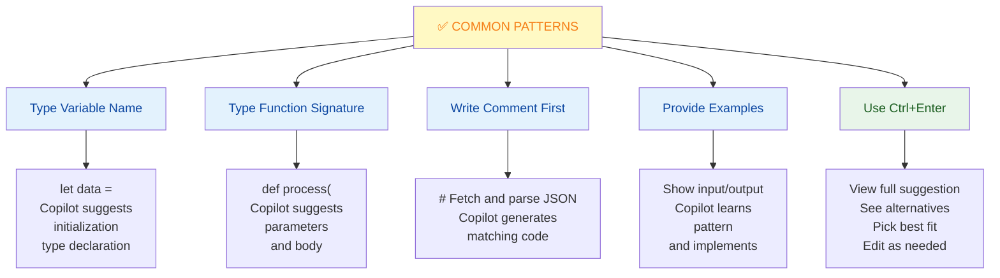

### Keyboard Shortcuts Cheat Sheet

| Action | Shortcut |
|--------|----------|
| Accept suggestion | Tab |
| Reject suggestion | Esc |
| Next suggestion | Alt+] |
| Previous suggestion | Alt+[ |
| Open suggestions panel | Ctrl+Enter |
| Open Copilot Chat | Ctrl+Shift+I |
| Trigger suggestion | Alt+\ |
| Dismiss inline | Esc |

### Settings to Optimize

```yaml
VS Code Copilot Settings:

# Enable/disable
editor.inlineSuggest.enabled: true

# Appearance
github.copilot.inlineSuggest.count: 3
github.copilot.inlineSuggest.showLines: 5

# Delay before showing (ms)
github.copilot.inlineSuggest.delay: 100

# Remove purple highlights (optional)
editor.quickSuggestionsDelay: 30

# Disable for specific languages
[python]
editor.inlineSuggest.enabled: false
```

---

## 7. Real-World Scenarios

### Scenario 1: Writing Tests Quickly

**Goal:** Generate comprehensive test suite for user validation function

```python
class TestUserValidation(unittest.TestCase):
    def test_valid_user(self):
        # Copilot generates
        user = User("john@example.com", "password123", "John")
        self.assertTrue(user.is_valid())
    
    def test_invalid_email(self):
        # Copilot adds edge cases
        user = User("invalid-email", "password123", "John")
        self.assertFalse(user.is_valid())
    
    def test_short_password(self):
        user = User("john@example.com", "pass", "John")
        self.assertFalse(user.is_valid())
    
    def test_missing_fields(self):
        user = User("", "", "")
        self.assertFalse(user.is_valid())
    
    # Copilot fills in more edge cases automatically
```

**Time saved:** Manual test writing: 30 minutes → Copilot-assisted: 5 minutes

---

### Scenario 2: Learning New Library

**Goal:** Learn how to use `requests` library for API calls

```python
# Ask Copilot Chat:
# "How do I make a GET request with requests library?"

# Chat provides:
import requests

response = requests.get('https://api.example.com/data')
data = response.json()

# "How do I add headers?"
# Chat shows:
headers = {'Authorization': 'Bearer token'}
response = requests.get(url, headers=headers)

# "How do I handle errors?"
# Chat explains and shows try/except patterns

try:
    response = requests.get(url, timeout=5)
    response.raise_for_status()
except requests.RequestException as e:
    print(f"Error: {e}")
```

**Benefit:** Avoid switching between editor and documentation

---

### Scenario 3: Quick Script Generation

**Goal:** Generate data processing script from description

```python
# Write comment describing need
# Read CSV, filter by date, calculate averages
# Export results to JSON

import csv
import json
from datetime import datetime
from collections import defaultdict

def process_data(input_file: str, output_file: str):
    """Process CSV data and export aggregated results"""
    results = defaultdict(list)
    
    with open(input_file, 'r') as f:
        reader = csv.DictReader(f)
        for row in reader:
            date = datetime.strptime(row['date'], '%Y-%m-%d')
            if date.year >= 2024:
                category = row['category']
                results[category].append(float(row['value']))
    
    # Calculate averages
    aggregated = {
        cat: sum(vals) / len(vals) 
        for cat, vals in results.items()
    }
    
    with open(output_file, 'w') as f:
        json.dump(aggregated, f, indent=2)

# Tab through suggestions, refine as needed
```

**Result:** Working script in 2 minutes vs 20 minutes manual

---

## 8. Best Practices

### GitHub Copilot Best Practices

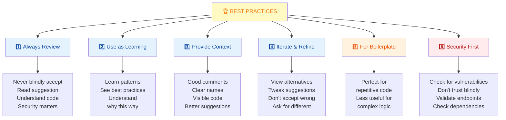

### Anti-Patterns to Avoid

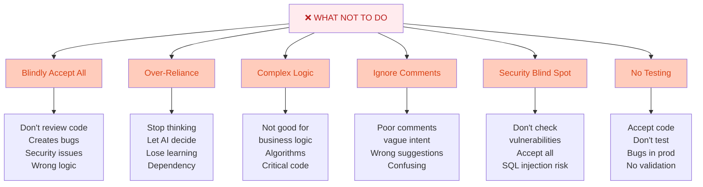

---

## 9. Summary & Key Takeaways

### What You Should Know

✅ **Copilot is AI coding assistant** - Suggests code from context and comments  
✅ **Requires subscription** - $20/month or included in Copilot Business  
✅ **Works in your editor** - VS Code, JetBrains, Neovim  
✅ **Always review suggestions** - Don't blindly accept  
✅ **Use comments for intent** - Better prompts = better code  
✅ **Great for boilerplate** - Less useful for complex logic  
✅ **Chat for learning** - Ask questions, get explanations  
✅ **Security-first** - Check generated code for vulnerabilities  

### Best Use Cases

| Task | Copilot Fit | Why |
|------|------------|-----|
| **Boilerplate code** | ✅ Excellent | Repetitive, well-known patterns |
| **Test generation** | ✅ Great | Can generate comprehensive tests |
| **Documentation** | ✅ Good | Docstrings, README sections |
| **API usage** | ✅ Good | Shows common library patterns |
| **Business logic** | ⚠️ Fair | May need revision, not always correct |
| **Algorithms** | ❌ Poor | Needs careful verification |
| **Critical code** | ❌ Avoid | Always review thoroughly |
| **Learning** | ✅ Excellent | See patterns, understand concepts |

---

## 10. Interview & Exam Prep

### Common Interview Questions

**Q1: What is GitHub Copilot and how does it work?**
> GitHub Copilot is an AI-powered code completion tool trained on billions of lines of code. It uses OpenAI's Codex model to suggest code based on comments, current code context, and file context. You can accept or reject suggestions as you type.

**Q2: What are the benefits of using GitHub Copilot?**
> Copilot speeds up coding by 40-55%, helps with boilerplate code, teaches coding patterns, generates tests, and provides documentation examples. It reduces context switching and keeps you in your editor. It's like having a knowledgeable pair programmer.

**Q3: Should you blindly accept Copilot suggestions?**
> No, never. Always review suggestions for correctness, security vulnerabilities, and logical errors. Copilot can make mistakes. It's a helper tool, not a replacement for thinking. Always test generated code before shipping.

**Q4: How do you get better suggestions from Copilot?**
> Write clear comments describing what you want, use meaningful variable names, provide context through visible code, and show examples of input/output. The more context Copilot has, the better its suggestions. Iterate and view alternatives.

**Q5: What are good use cases for Copilot?**
> Best for: boilerplate code, test generation, documentation, API usage examples. Less suitable for: complex business logic, critical algorithms, security-sensitive code. Always verify the output regardless of task.

**Q6: How is Copilot different from Stack Overflow searches?**
> Copilot is in-editor, context-aware, and faster. It doesn't require switching contexts. Stack Overflow shows you examples to read and adapt; Copilot generates code specifically for your context. Copilot is more integrated but less thorough than reading full examples.

**Q7: What's the difference between Copilot and Copilot Chat?**
> Copilot autocompletes as you type (inline suggestions). Chat is a conversational interface where you ask questions in natural language and get multi-turn responses. Chat is better for learning and explaining; inline is better for quick code generation.

**Q8: Are there privacy concerns with using Copilot?**
> GitHub stores code snippets to improve the model (unless you opt out). For private repos, you can disable telemetry. Code from your files is analyzed to provide suggestions. Review GitHub's privacy policy; many enterprises handle this with Copilot Business settings.

### Practice Scenarios

**Scenario A:** You need to generate a comprehensive test suite quickly. How would you use Copilot?
- Write the function clearly with good comments
- Then write one test case to show the pattern
- Use Copilot Chat to ask "Generate unit tests for this"
- Review each test, accept/modify as needed
- Verify all tests pass

**Scenario B:** Copilot suggested code that looks wrong. What should you do?
- Don't accept it
- Press Ctrl+Enter to see alternatives
- Use Copilot Chat to ask about the approach
- Research the correct way
- Write correct version yourself
- Test thoroughly before committing

**Scenario C:** You're learning a new library. How can Copilot help?
- Start coding with descriptive comments
- Let Copilot show common patterns
- Use Chat: "Explain how to use this library"
- Look at generated examples
- Adapt for your specific needs
- Verify functionality with tests

---

## 11. Troubleshooting Common Issues

### Issue: Copilot Suggestions Not Appearing

**Problem:** No code suggestions showing up

**Solutions:**

```bash
1. Verify Extension Installed
   VS Code: Extensions → GitHub Copilot
   Check it's enabled
   Look for checkmark

2. Check Authentication
   Command Palette: GitHub Copilot: Sign In
   Re-authenticate if needed
   Check GitHub account has Copilot access

3. Restart VS Code
   Close completely
   Reopen
   Often fixes auth issues

4. Check Internet Connection
   Copilot requires online connection
   Check network connection
   Try different network if possible

5. Verify Settings
   Check not disabled in settings
   Settings → Extensions → Copilot
   Ensure enabled: true

6. Check Subscription
   GitHub account → Settings → Copilot
   Verify subscription active
   Check not expired
```

### Issue: Poor Quality Suggestions

**Problem:** Suggestions are incorrect or unhelpful

**Solutions:**

```bash
1. Improve Comments
   Be more specific
   Say exactly what you want
   Show examples

2. Provide More Context
   Keep related code visible
   Open similar files
   Good variable names

3. Use Chat Instead
   Ask Copilot Chat to explain approach
   Get better understanding
   Try inline again with context

4. Check Alternatives
   Press Ctrl+Enter
   View 3+ suggestions
   Pick best, don't accept first

5. Edit Suggestions
   Don't accept wrong answer
   Copilot suggests, you refine
   Your edits teach it

6. Try Different Language
   Some languages are better trained
   Python/JS: Excellent
   Newer languages: Good
```

### Issue: Slow Performance

**Problem:** Editor laggy when Copilot is active

**Solutions:**

```bash
1. Disable Inline Suggestions
   Settings: inlineSuggest.enabled: false
   Re-enable when needed

2. Increase Debounce Delay
   Settings: Copilot.inlineSuggest.delay
   Set to 500ms or higher
   Fewer requests = faster

3. Limit Suggestions
   github.copilot.inlineSuggest.count: 1
   Show only 1 suggestion
   Less processing

4. Check System Resources
   Close other applications
   Free up RAM
   Monitor CPU usage

5. Restart Extension
   Command Palette: Reload Window
   Or restart VS Code
   Clear any memory leaks

6. Check Network
   Slow internet = slow suggestions
   Test connection speed
   Try different network
```

### Issue: Security Concerns

**Problem:** Concerned about code privacy

**Solutions:**

```bash
1. Disable Telemetry (VS Code)
   Settings → Copilot: Telemetry
   Set to off
   Or use private mode

2. Understand Privacy
   GitHub uses code to improve models
   Private repos: Encrypted
   Can opt out in settings
   Review GitHub's privacy policy

3. Review All Code
   Don't blindly accept
   Check for vulnerabilities
   Use security scanning tools
   Run SAST tools on generated code

4. For Enterprise
   Use GitHub Copilot Business
   Enhanced privacy controls
   Better compliance options
   VPC endpoint support

5. Sensitive Data
   Don't work with secrets
   Don't paste API keys
   Don't use with passwords
   Be cautious with PII
```

---

## 12. Visual Summary

### GitHub Copilot Workflow

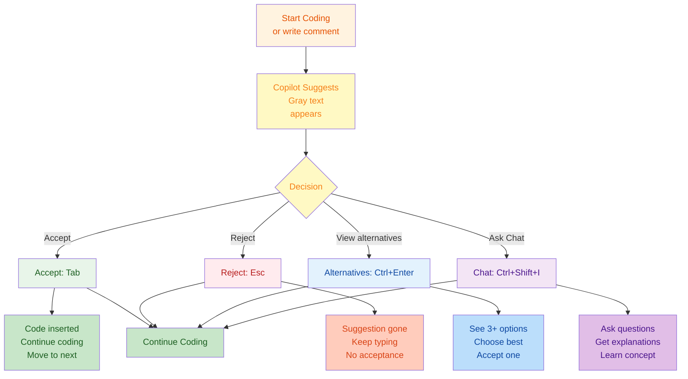

---

## 13. Copilot Pricing & Plans

### Subscription Options

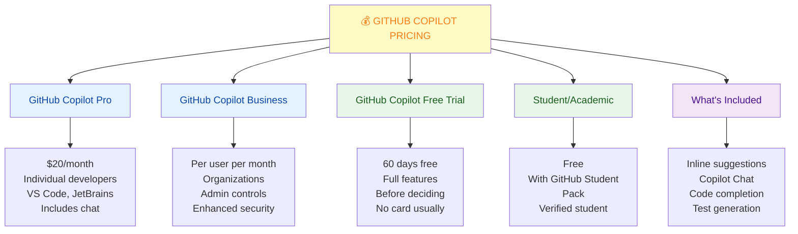

---

**Last Updated:** January 7, 2026  
**Difficulty Level:** Beginner to Intermediate  
**Prerequisites:** GitHub account, code editor (VS Code preferred), basic programming knowledge
