# GitHub Issues vs Pull Requests: Complete Comparison Guide

## Overview

GitHub Issues and Pull Requests are two complementary collaboration features that serve different purposes but work together in the development workflow. Issues are for discussions, tracking tasks, and reporting problems, while Pull Requests are for proposing and reviewing code changes. Understanding when and how to use each is essential for effective team collaboration.

### Why It Matters
- **Workflow coordination** - Organizing work across teams
- **Communication clarity** - Discussion vs code review
- **Task tracking** - Issues vs implementation tracking
- **Code quality** - Review mechanism for PRs
- **Project management** - Planning and tracking progress
- **Documentation** - Knowledge base for decisions and changes
- **Transparency** - Public visibility of work and decisions

### Main Use Cases
- Reporting bugs (issues) vs fixing bugs (pull requests)
- Planning features (issues) vs implementing features (pull requests)
- Asking questions (issues) vs proposing solutions (pull requests)
- Tracking work (issues) vs showing work (pull requests)
- Discussing decisions (issues) vs requesting approval (pull requests)

---

## 1. Core Concepts & Fundamentals

### What is a GitHub Issue?

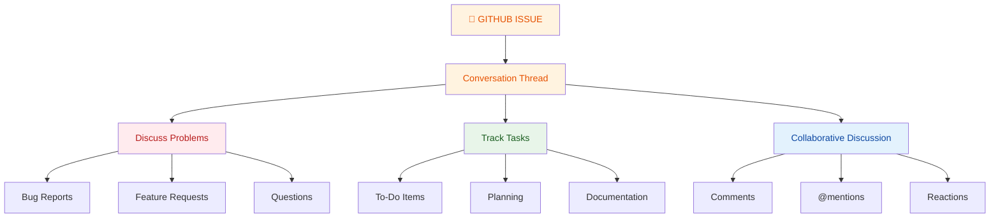

**Definition:** An Issue is a discussion thread for tracking bugs, feature requests, tasks, and questions. Issues are for planning, discussion, and tracking work without code changes.

**Characteristics:**
- ✅ Async discussion/collaboration
- ✅ Track bugs and feature requests
- ✅ Can be assigned to team members
- ✅ Support labels, milestones, projects
- ✅ No code changes required
- ✅ Easy to organize and search
- ⚠️ Not for code review
- ⚠️ Can proliferate without discipline

### What is a Pull Request?

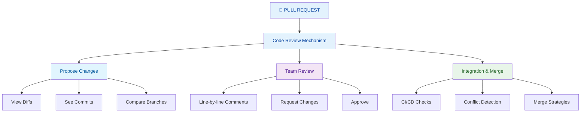

**Definition:** A Pull Request (PR) is a proposal to change code in a repository. It enables code review, discussion, and collaborative refinement before merging changes to the main branch.

**Characteristics:**
- ✅ Code-focused discussion
- ✅ Visual diff of all changes
- ✅ Line-by-line comments
- ✅ Automated testing/CI integration
- ✅ Approval workflow
- ✅ Clear before/after comparison
- ⚠️ More formal than issues
- ⚠️ Requires actual code changes

---

## 2. Visual Comparison: Issues vs Pull Requests

### The Lifecycle Difference

```mermaid
graph TB
    subgraph Issue["📋 ISSUE LIFECYCLE"]
        I1["Create Issue<br/>Report problem"]
        I2["Discuss & Plan<br/>Comments & reactions"]
        I3["Assign to Dev<br/>Track ownership"]
        I4["Add Labels<br/>Organize work"]
        I5["Close Issue<br/>When resolved"]
        
        I1 --> I2 --> I3 --> I4 --> I5
    end
    
    subgraph PR["🔄 PR LIFECYCLE"]
        P1["Create PR<br/>From feature branch"]
        P2["Automated Checks<br/>CI/CD runs"]
        P3["Code Review<br/>Comments & suggestions"]
        P4["Request Changes<br/>or Approve"]
        P5["Merge PR<br/>Changes applied"]
        
        P1 --> P2 --> P3 --> P4 --> P5
    end
    
    style Issue fill:#fff3e0,color:#e65100
    style PR fill:#e3f2fd,color:#0d47a1
    style I1 fill:#ffccbc,color:#d84315
    style I2 fill:#ffccbc,color:#d84315
    style I3 fill:#ffccbc,color:#d84315
    style I4 fill:#ffccbc,color:#d84315
    style I5 fill:#ffccbc,color:#d84315
    style P1 fill:#bbdefb,color:#0d47a1
    style P2 fill:#bbdefb,color:#0d47a1
    style P3 fill:#bbdefb,color:#0d47a1
    style P4 fill:#bbdefb,color:#0d47a1
    style P5 fill:#bbdefb,color:#0d47a1
```

### Side-by-Side Comparison

| Aspect | Issue | Pull Request |
|--------|-------|--------------|
| **Purpose** | Track work, discuss problems | Propose code changes |
| **Content** | Discussion, text, links | Code, commits, diffs |
| **Review** | Collaborative discussion | Formal code review |
| **Action** | Plan & organize | Merge & integrate |
| **Requires Code** | No | Yes |
| **Timeline** | Any duration | Should be quick |
| **Approval** | Optional | Often required |
| **CI/CD** | Not applicable | Automated checks |
| **Linked** | Can reference PRs | Should link to issues |
| **Examples** | Bug, feature request, task | Fix implementation, feature branch |
| **Typical Workflow** | Create → Discuss → Assign → Close | Create → Test → Review → Merge |
| **Scope** | Wide (problems, questions, tasks) | Narrow (specific code changes) |

### Relationship Diagram

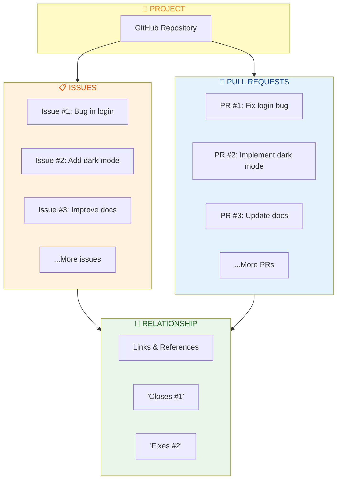

---

## 3. Issues in Depth

### Types of Issues

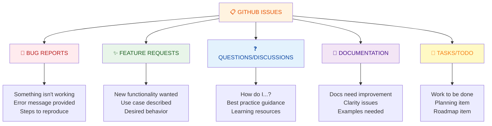

### Issue Anatomy

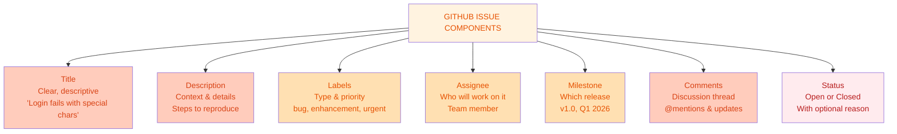

### Issue Management Best Practices

```bash
# Create a well-formatted issue
Title: [TYPE] Clear description of issue

Description:
## Description
What is the issue?

## Steps to reproduce
1. First step
2. Second step
3. Actual result

## Expected behavior
What should happen?

## Environment
- OS: macOS 14.2
- Node: v18.12.0
- Package version: 2.1.0

## Labels
- bug
- critical
- frontend

# Example: Bug Report
Title: [BUG] Login form validation fails with Unicode characters

Description:
## Description
Login validation rejects usernames containing emoji or non-Latin characters

## Steps to reproduce
1. Go to login page
2. Enter username with emoji: "user😀"
3. Click submit
4. See error: "Invalid username"

## Expected behavior
Unicode characters should be accepted in usernames

## Environment
- OS: Ubuntu 22.04
- Browser: Chrome 120.0
- App version: 2.3.1
```

---

## 4. Pull Requests in Depth

### Types of Pull Requests

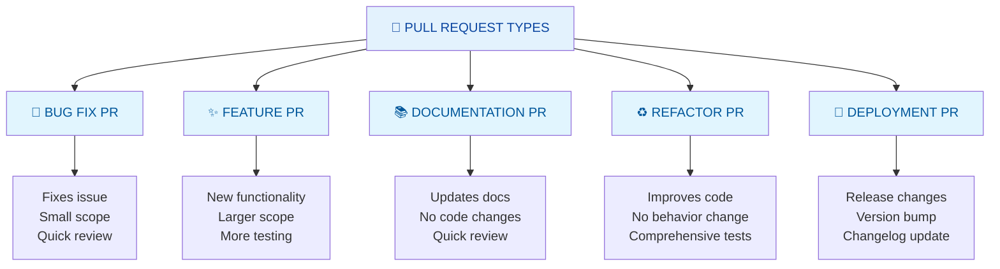

### Pull Request Anatomy

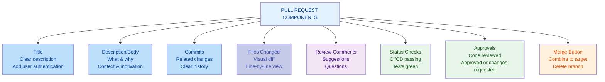

### PR Workflow Example

```bash
# 1. Create feature branch
git checkout -b fix/login-validation

# 2. Make changes and commit
git add .
git commit -m "Fix: Handle Unicode in login validation"

# 3. Push branch
git push origin fix/login-validation

# 4. Create PR on GitHub
# Title: Fix login validation for Unicode characters
# Description:
# ## What does this PR do?
# Fixes login form validation to accept Unicode characters including emoji.
# 
# Closes #1234
#
# ## How to test?
# 1. Navigate to login page
# 2. Enter username with emoji: "user😀"
# 3. Submit - should work without error
#
# ## Checklist
# - [x] Tests added/updated
# - [x] Documentation updated
# - [x] Changelog updated

# 5. Automated checks run
# - Tests run
# - Linting checks
# - Security scans

# 6. Wait for review
# Team members review and comment

# 7. Make requested changes
git commit -am "Address review feedback: Add input sanitization"
git push origin fix/login-validation

# 8. Merge PR
# Click merge button when approved
```

---

## 5. When to Use Issues

### Use Issues When:

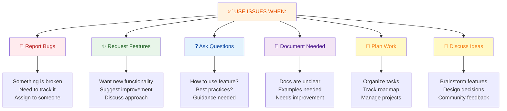

### Issue Template Best Practices

```markdown
# Bug Report Template

## Description
A clear and concise description of what the bug is.

## Steps to reproduce
1. Go to '...'
2. Click on '....'
3. Scroll down to '....'
4. See error

## Expected behavior
A clear and concise description of what you expected to happen.

## Screenshots
If applicable, add screenshots to help explain your problem.

## Environment
- OS: [e.g. iOS]
- Browser: [e.g. chrome, safari]
- Version: [e.g. 22]

## Additional context
Add any other context about the problem here.

---

# Feature Request Template

## Is your feature request related to a problem?
A clear and concise description of what the problem is.

## Describe the solution you'd like
A clear and concise description of what you want to happen.

## Describe alternatives you've considered
A clear and concise description of any alternative solutions or features.

## Additional context
Add any other context or screenshots about the feature request here.
```

---

## 6. When to Use Pull Requests

### Use Pull Requests When:

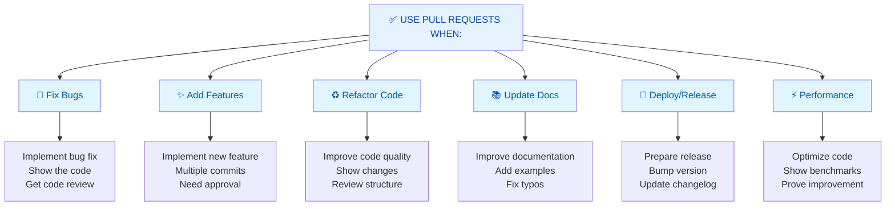

### PR Best Practices

```markdown
# Pull Request Description

## What type of change is this?
- [ ] Bug fix (non-breaking change which fixes an issue)
- [ ] New feature (non-breaking change which adds functionality)
- [ ] Breaking change (fix or feature that would cause existing functionality to not work as expected)
- [ ] This change requires a documentation update

## Related Issue
Fixes #(issue number)

## Description
Brief description of what this PR does and why.

## How Has This Been Tested?
Describe the tests that you ran to verify your changes.

- [ ] Test A
- [ ] Test B
- [ ] Test C

## Checklist:
- [ ] My code follows the style guidelines
- [ ] I have performed a self-review of my own code
- [ ] I have commented my code, particularly in hard-to-understand areas
- [ ] I have made corresponding changes to the documentation
- [ ] My changes generate no new warnings
- [ ] I have added tests that prove my fix is effective or that my feature works
- [ ] New and existing unit tests passed locally with my changes
```

---

## 7. Quick Cheatsheet

### Decision Tree

```
What do you need?
│
├─► Report problem / Discuss / Plan work?
│   └─► USE ISSUE
│       (Bug report, Feature request, Question, Task)
│
└─► Propose code changes / Implement fix?
    └─► USE PULL REQUEST
        (After creating related issue if needed)
```

### Common Operations

| Task | Issue | PR |
|------|-------|-----|
| **Report bug** | ✅ Create issue | ❌ |
| **Request feature** | ✅ Create issue | ❌ |
| **Implement feature** | ✅ Link to issue | ✅ Create PR |
| **Fix bug** | ✅ Link to issue | ✅ Create PR |
| **Discuss approach** | ✅ In issue | ⚠️ In PR (after) |
| **Get feedback** | ✅ Issue comments | ✅ PR review |
| **Merge code** | ❌ | ✅ PR merge |
| **Close work** | ✅ Close issue | ✅ Merge PR |

### Linking Issues and PRs

```bash
# In PR description, reference issue to auto-close it
Closes #123
Fixes #123
Resolves #123

# Example PR description
This PR implements the dark mode feature requested in #456.

Closes #456

Changes:
- Added theme switcher component
- Created dark theme variables
- Updated all components to support dark mode

Testing:
- Added theme switching tests
- Verified all components render correctly in dark mode
```

---

## 8. Real-World Scenarios

### Scenario 1: Bug Reporting & Fixing Workflow

**The Story:** A user discovers a bug in the login form

**Step 1: Create Issue (User or Developer)**

```
Title: [BUG] Login fails with special characters
Labels: bug, high-priority
Assigned to: @team-member

Description:
## Description
Login form validation rejects usernames with special characters or emoji.

## Steps to reproduce
1. Go to login page
2. Enter username "user@123" or "user😀"
3. Click submit
4. See error: "Invalid username format"

## Expected
Special characters should be allowed

## Environment
- OS: macOS
- Browser: Chrome 120
- App: v2.3.1
```

**Step 2: Discussion in Issue**

```
@dev1: I can confirm this bug. It's in the validation regex.

@dev2: Should we allow all Unicode or just specific chars?

@maintainer: Let's allow all Unicode for usernames. 
More inclusive and aligns with modern web standards.

@dev1: Got it. I'll implement the fix.
```

**Step 3: Implement Fix (Create PR)**

```
Title: Fix login validation to accept Unicode characters
Branch: fix/unicode-login-validation

Description:
## What
Fixes login validation regex to accept Unicode characters.

Closes #234

## Changes
- Updated validation regex in src/validators.js
- Added tests for Unicode characters
- Updated docs

## Testing
- [x] Unit tests pass
- [x] Manual testing with emoji and special chars
- [x] CI checks pass
```

**Step 4: Code Review**

```
Reviewer comments:
- Line 45: Consider trimming whitespace
- Add JSDoc comments
- Add test for edge cases

Developer response:
- Fixed whitespace trimming
- Added JSDoc
- Added edge case tests
```

**Step 5: Merge & Close**

```
PR approved and merged to main
Issue #234 automatically closes
Code deployed in next release
```

---

### Scenario 2: Feature Request & Implementation

**The Story:** Team wants to implement a new feature

**Step 1: Create Feature Request Issue**

```
Title: [FEATURE] Add dark mode theme support
Labels: enhancement, feature-request
Assigned to: @product-manager

Description:
## Feature Request
Users are requesting dark mode for better nighttime usage.

## Use Case
Many modern apps have dark mode to reduce eye strain.

## Acceptance Criteria
- [ ] Theme toggle visible in settings
- [ ] Dark mode colors are accessible (WCAG AA)
- [ ] Theme preference persists across sessions
- [ ] All pages support dark mode

## Design Notes
See attached mockups in project board.
```

**Step 2: Discussion & Planning**

```
@designer: I can prepare the design system for dark mode.

@backend: We'll need to store theme preference in user profile.

@frontend: I can implement the theme switcher component.

@maintainer: Great! Let's break this into smaller tasks:
- Task 1: Create dark theme design tokens
- Task 2: Implement theme switcher
- Task 3: Update components
- Task 4: Add persistence

Create separate issues for each.
```

**Step 3: Implementation PRs**

```
PR #1: Add dark theme design tokens
- Closes #300 (task 1)
- Adds CSS variables for dark mode

PR #2: Implement theme switcher component
- Closes #301 (task 2)
- New ThemeSwitcher component

PR #3: Update components for dark mode
- Closes #302 (task 3)
- All components updated

PR #4: Add theme persistence
- Closes #303 (task 4)
- Save/load theme from localStorage
```

**Step 4: Testing & Integration**

```
All PRs reviewed, approved, and merged.
Original issue #299 marked as complete.
Feature released in v3.0.0.
```

---

### Scenario 3: Question & Documentation

**The Story:** User has a question about API usage

**Step 1: Create Question Issue**

```
Title: How to implement custom authentication?
Labels: question, documentation

Description:
## Question
I want to use a custom authentication provider instead of the default.
Is this supported?

## Context
I need to integrate with our company's LDAP system.

## What I've tried
Looked through docs but couldn't find examples.
```

**Step 2: Discussion in Issue**

```
@maintainer: Great question! This is definitely supported.

Here's how:
1. Implement AuthProvider interface
2. Pass to createApp config
3. Hook will use your provider

Let me create an example PR documenting this.
```

**Step 3: Documentation PR**

```
Title: Add custom authentication provider example
Labels: documentation

Files:
- docs/authentication.md: Added custom provider section
- examples/custom-auth-provider.js: New example file
- examples/ldap-provider.js: LDAP integration example

Closes #456 (question issue)
```

**Step 4: Close**

```
PR merged to docs
Issue closed with link to PR and docs
User can now see solution
```

---

## 9. Best Practices

### Issue Best Practices

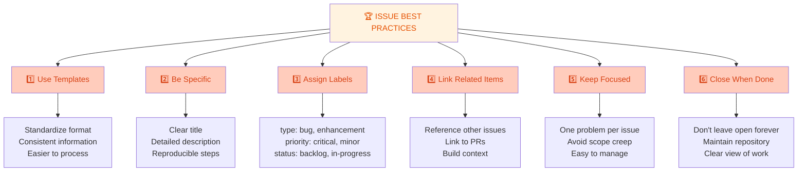

### PR Best Practices

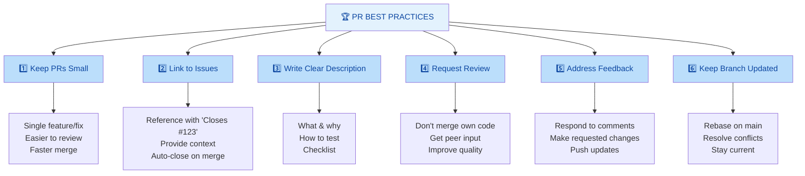

---

## 10. Summary & Key Takeaways

### What You Should Know

✅ **Issues** = Discussion, tracking, planning (no code changes)  
✅ **Pull Requests** = Code review, implementation, merge (with code)  
✅ **Issues come first**, then PRs to implement  
✅ **Link issues and PRs** for traceability  
✅ **Issues track what**, PRs show how  
✅ **Use templates** for consistency  
✅ **Keep both organized** with labels and milestones  

### Quick Comparison Matrix

| Need | Use |
|------|-----|
| Report problem | Issue |
| Discuss approach | Issue |
| Request feature | Issue |
| Ask question | Issue |
| Implement fix | PR |
| Propose code | PR |
| Get code review | PR |
| Merge changes | PR |

---

## 11. Interview & Exam Prep

### Common Interview Questions

**Q1: What's the difference between a GitHub Issue and a Pull Request?**
> An Issue is for discussion, tracking bugs, feature requests, and planning work. It's where you report problems and discuss solutions without code changes. A Pull Request is for proposing specific code changes. It includes diffs, commits, and is used for code review and merging changes to the codebase.

**Q2: When should you create an Issue vs a Pull Request?**
> Create an Issue when you need to report a bug, request a feature, ask a question, or plan work. Create a Pull Request when you have actual code changes to propose, implement a feature, or fix a bug. Typically, you create an Issue first, discuss it, then create a PR to implement the solution.

**Q3: How do Issues and Pull Requests work together?**
> Issues track what needs to be done (problems, features, tasks). Pull Requests implement the solution. A PR should reference the related Issue with "Closes #123" to create a link. When the PR is merged, the linked Issue can be automatically closed, showing the complete workflow from problem to solution.

**Q4: What should be in a good Issue description?**
> A good Issue includes: clear title, detailed description of the problem, steps to reproduce (for bugs), expected behavior, actual behavior, and environment details (OS, browser version, app version). Using templates ensures consistency. For feature requests, include use case and acceptance criteria.

**Q5: What should be in a good Pull Request description?**
> A good PR includes: descriptive title, explanation of what and why, link to related Issue ("Closes #123"), list of changes, testing instructions, checklist of completed tasks, and any breaking changes or dependencies. The description should be clear enough that reviewers understand the change without reading all the code.

**Q6: Can you close a PR without merging?**
> Yes. You can close a PR without merging if the approach isn't right, it's outdated, or it was opened by mistake. When you close an Issue linked with "Closes #123", closing the PR without merging won't auto-close the Issue. You'd need to manually close the Issue or change the link.

**Q7: What's the purpose of linking an Issue to a PR?**
> Linking (with "Closes #123") creates traceability between the problem and solution. It allows reviewers to see the context. When the PR is merged, GitHub automatically closes the linked Issue, providing a clear workflow. It also helps in project tracking and understanding why specific changes were made.

**Q8: How do you organize many Issues in a large project?**
> Use labels for categorization (type, priority, area), milestones for releases, projects for workflow, and assignees for ownership. Templates ensure consistency. Keep Issues focused on single problems. Close resolved Issues promptly. Use issue search and filters to find what you need.

### Practice Scenarios

**Scenario A:** You find a bug but don't know how to fix it. What do you do?
- Answer: Create an Issue with bug report details. Let team discuss. Someone will create a PR to fix it.

**Scenario B:** Your PR has been waiting for review for a week. What do you do?
- Answer: @mention reviewers, update PR with latest main, offer to discuss in sync meeting, or close if no longer needed.

**Scenario C:** An Issue was created 6 months ago and never addressed. What should you do?
- Answer: Assess if still relevant. If yes, create PR to fix. If no, close with explanation. Keep repository clean.

---

## 12. Troubleshooting Common Issues

### Issue: PR References Wrong Issue

**Problem:** PR says "Closes #456" but should be "Closes #123"

**Solution:**
```bash
# Edit PR description on GitHub
# Change "Closes #456" to "Closes #123"
# Save changes

# When PR is merged:
# - Issue #123 will auto-close
# - Issue #456 will stay open
```

### Issue: Issue Has No Related PR

**Problem:** Issue is resolved but no PR references it

**Solution:**
```bash
# Option 1: Create PR and link it
git checkout -b fix/issue-123
# Make changes
git push
# Create PR with "Closes #123"

# Option 2: Manually close Issue
# Comment: "Fixed in PR #789" or commit hash
# Close the Issue

# Option 3: If Issue resolved externally
# Comment with explanation
# Close the Issue
```

### Issue: Too Many Unrelated Issues

**Problem:** Issue tracker has 500 open Issues, hard to find relevant ones

**Solution:**
```bash
# Use labels and filters
# Search: label:bug is:open priority:critical

# Create project board for organization
# Organize by status: Backlog, In Progress, Review, Done

# Set up automation
# Auto-close stale Issues after 90 days
# Add labels automatically

# Weekly triage
# Review open Issues
# Close duplicates
# Update priorities
```

### Issue: PR Description Unclear

**Problem:** Reviewers confused about what PR does

**Solution:**
```bash
# Edit PR description to include:
# 1. What problem it solves / feature it adds
# 2. How it solves it (approach)
# 3. How to test it
# 4. Related Issue link
# 5. Checklist of items done

# Add inline comments for complex code
# Respond to reviewer questions
# Update description based on feedback
```

---

## 13. Visual Summary

### Complete Issues vs PRs Flow

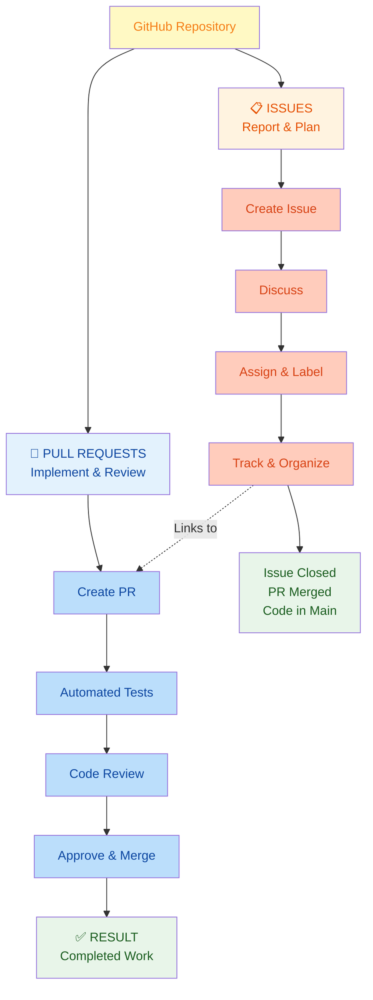

---

**Last Updated:** January 6, 2026  
**Difficulty Level:** Beginner to Intermediate  
**Prerequisites:** GitHub account, understanding of Git basics, repository familiarity
