# GitHub Notifications: Management & Best Practices Guide

## Overview

GitHub notifications keep you informed about repository activity—mentions, comments, pull request reviews, issue updates, and more. Understanding how to manage notifications effectively prevents overwhelm and ensures you never miss important updates.

### Why It Matters
- **Stay informed** - Get alerted to important activity
- **Prevent overwhelm** - Configure only what matters to you
- **Improve response time** - See urgent items quickly
- **Maintain focus** - Reduce notification noise
- **Team collaboration** - Know what team members are doing
- **Security alerts** - Get informed of vulnerabilities
- **Repository tracking** - Follow projects you care about

### Main Use Cases
- Staying updated on assigned work
- Monitoring pull request reviews
- Tracking mentions and comments
- Managing security alerts
- Following open-source projects
- Team communication
- Repository maintenance

---

## 1. Core Concepts & Fundamentals

### What Are GitHub Notifications?

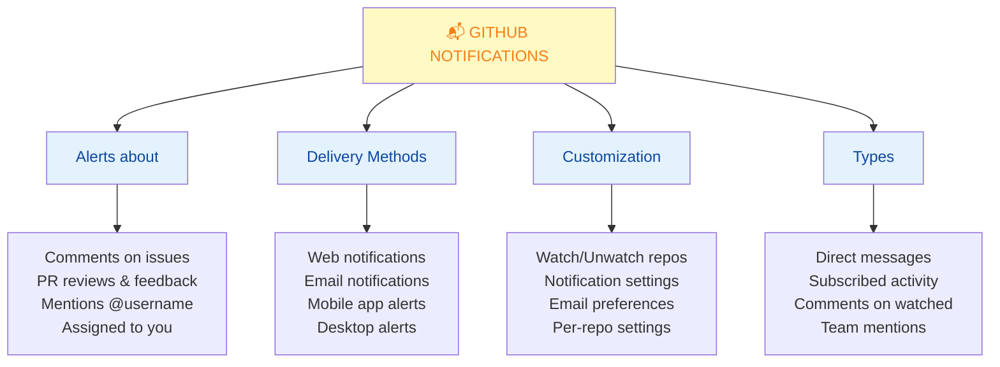

### Notification Types

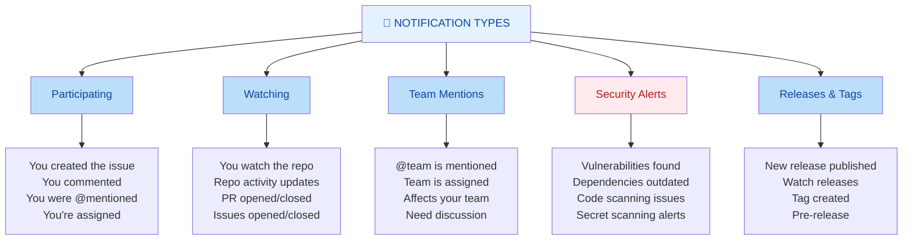

### Notification Reasons

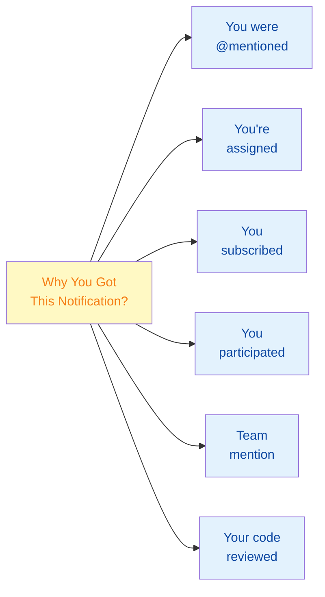

---

## 2. Notification Delivery Methods

### Where Notifications Appear

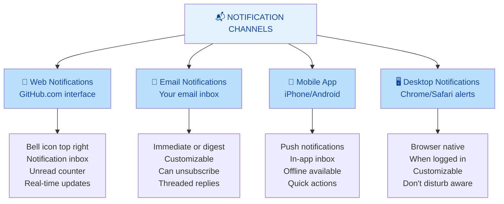

### Web vs Email Notifications

| Feature | Web | Email |
|---------|-----|-------|
| **Real-time** | ✅ Instant | ⏱️ Depends on setting |
| **Unified Inbox** | ✅ All in one place | ❌ Scattered in email |
| **Threading** | ❌ Limited | ✅ Great threading |
| **Offline** | ❌ Need browser | ✅ Check anytime |
| **Archive** | ✅ Easy | ⚠️ Relies on email |
| **Mobile** | ⚠️ Responsive | ⚠️ Hard to manage |
| **Digest Mode** | ❌ No | ✅ Yes |
| **Keyboard Shortcuts** | ✅ Yes | ❌ No |

---

## 3. Notification Settings & Configuration

### Global Notification Settings

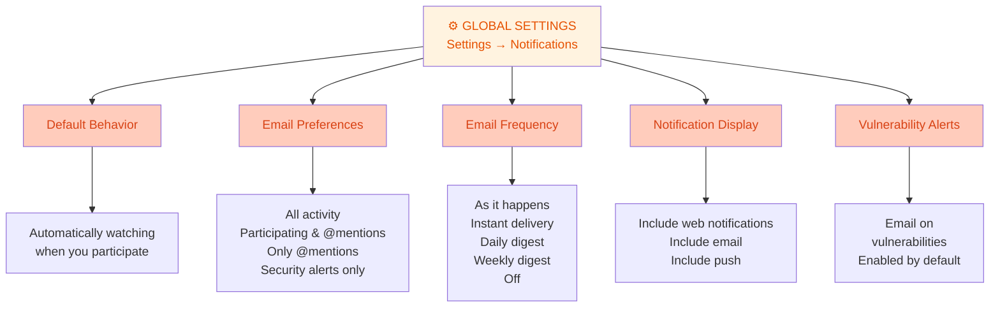

### Notification Settings Page

```
Settings → Notifications

┌─ Default Notifications Behavior ─────┐
│ Automatically watch repositories:     │
│ ☑ On when I participate               │
│                                       │
│ Default notifications for new issues: │
│ ◉ All Activity                        │
│ ○ Participating and @mentions         │
│ ○ @mentions only                      │
│ ○ Ignore                              │
└───────────────────────────────────────┘

┌─ Email Notification Settings ────────┐
│ Choose what email notifications      │
│ you'd like to receive:                │
│                                       │
│ ◉ All Activity                        │
│ ○ Participating and @mentions         │
│ ○ @mentions only                      │
│ ○ Ignore                              │
│                                       │
│ Custom routing:                       │
│ Default: Primary Email                │
│ [Include account alerts]              │
│ [Receive push notifications]          │
└───────────────────────────────────────┘

┌─ Subscriptions ──────────────────────┐
│ ☑ All activity email notifications   │
│ ☑ Pull request reviews               │
│ ☑ Discussions                        │
│ ☑ Security alerts                    │
│ ☑ Sponsors updates                   │
└───────────────────────────────────────┘
```

### Per-Repository Watch Settings

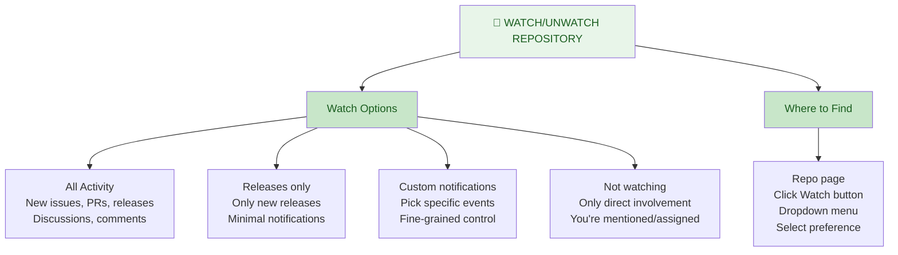

### Custom Notification Settings

```
Repository → Settings → Notifications

┌─ Customize Notifications ────────────────┐
│ Decide what you're notified about         │
│                                          │
│ Pulls:                                   │
│ ☑ Pull request reviews requested         │
│ ☑ Pull request reviews submitted         │
│ ☑ Pull requests opened                   │
│ ☑ Pull requests closed                   │
│                                          │
│ Issues:                                  │
│ ☑ Issues opened                          │
│ ☑ Issues closed                          │
│ ☑ Comments on issues                     │
│                                          │
│ Discussions:                             │
│ ☑ New discussions                        │
│ ☑ Comments on discussions                │
│                                          │
│ Pushes:                                  │
│ ☑ Pushes to repository                   │
│                                          │
│ Releases:                                │
│ ☑ New releases                           │
│ ☑ Pre-releases                           │
│                                          │
│ Security alerts:                         │
│ ☑ Vulnerability alerts                   │
│ ☑ Secret scanning alerts                 │
└──────────────────────────────────────────┘
```

---

## 4. Managing Notification Overload

### The Notification Problem

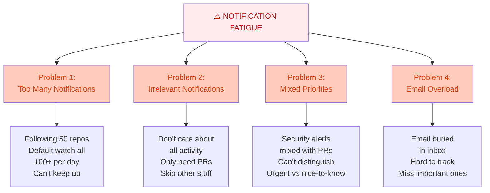

### Solution: Smart Configuration

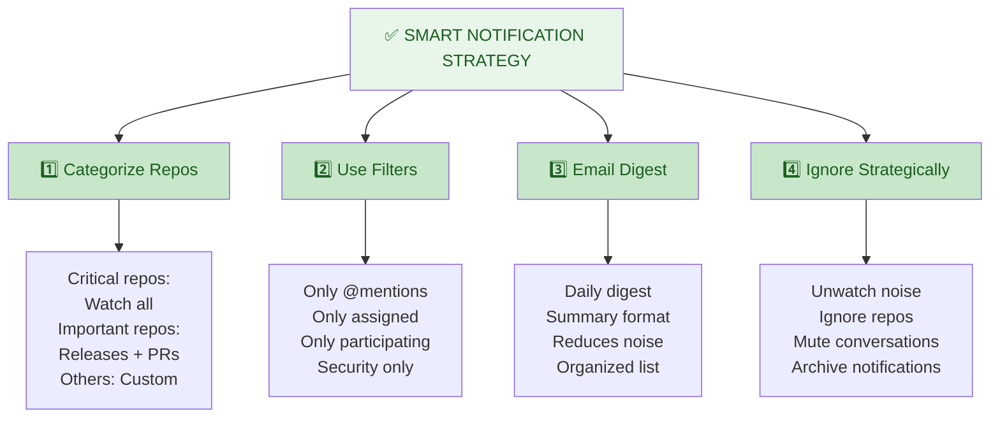

### Best Practices for Notification Management

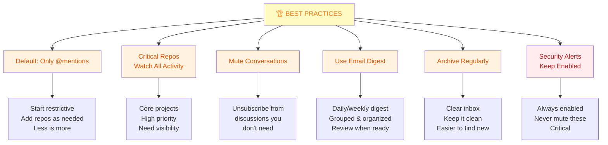

---

## 5. Muting & Unsubscribing

### How to Mute a Conversation

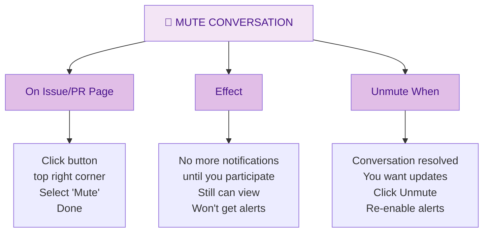

### Unwatch vs Mute

| Action | Effect | When to Use |
|--------|--------|-------------|
| **Unwatch Repo** | Stop all notifications except direct mentions/assigned | Following too many repos |
| **Mute Conversation** | Stop notifications for one issue/PR temporarily | Don't need updates on this thread |
| **Ignore Notifications** | Different from above—completely suppress | Long-term; must unignore later |
| **Unsubscribe from Email** | Stop email but keep web notifications | Email only overload |
| **Mark as Done** | Archive notification from inbox | Reviewed and done |

### Keyboard Shortcuts for Notifications

```bash
# Web Notifications Inbox Shortcuts
j, k              # Move up/down in list
e                 # Mark as done / Archive
m                 # Mute notification
o                 # Open in new tab
/                 # Focus search box
?                 # Show keyboard shortcuts

# Issue/PR Page Shortcuts
i                 # Unsubscribe from notifications
```

---

## 6. Email Notifications Strategy

### Email Notification Types

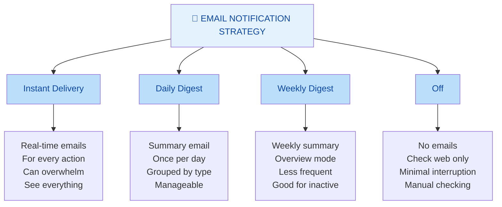

### Email Notification Best Practices

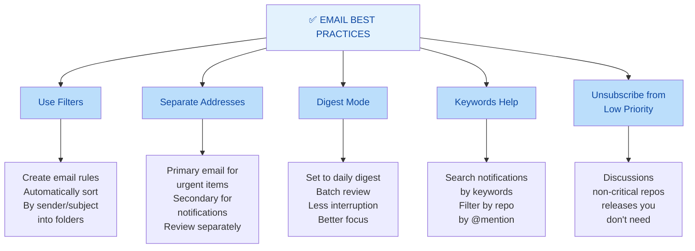

### Email Filtering Example (Gmail)

```
Filters for GitHub Notifications:

1. Critical Security Alerts
   From: notifications@github.com
   Subject: (vulnerability OR "security alert")
   Action: Never mark as spam, add label "GitHub Security"

2. Pull Requests
   From: notifications@github.com
   Subject: (pull request OR "review request")
   Action: Add label "GitHub PRs"

3. Assigned to Me
   From: notifications@github.com
   Subject: "Assigned to you"
   Action: Add label "GitHub Assigned", star

4. Team Mentions
   From: notifications@github.com
   Subject: "team mentioned"
   Action: Add label "GitHub Team", never mark spam

5. Discussions (Low Priority)
   From: notifications@github.com
   Subject: "discussion"
   Action: Add label "GitHub Discussions", auto-archive
```

---

## 7. Quick Cheatsheet

### Notification Decision Tree

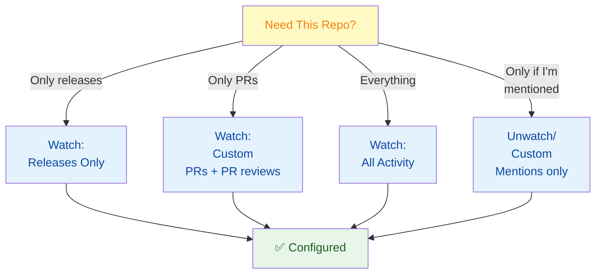

### Common Notification Settings

| Scenario | Email | Web | Watch |
|----------|-------|-----|-------|
| **Daily Job** | Daily digest | Check 2x/day | Critical repos: All |
| **Freelancer** | Instant | Check when online | Per-project: Custom |
| **Maintainer** | Instant | Always on | Main repo: All |
| **Contributor** | @mentions only | Participating | Custom selection |
| **Researcher** | Off | Digest | Releases only |

### Keyboard Shortcuts Cheat Sheet

```bash
# On Notification Inbox Page
j                 → Next notification
k                 → Previous notification
m                 → Mark as done
e                 → Mark as done (alternative)
/                 → Focus search
?                 → Show help

# On Issue/PR Discussion
p                 → Mark as participating
i                 → Toggle subscription

# Multi-line Shortcuts
Shift + j         → Bulk next
Shift + k         → Bulk previous
Shift + m         → Bulk mark done
```

---

## 8. Real-World Scenarios

### Scenario 1: Developer Managing Multiple Projects

**Situation:** Working on 5 projects, following 20+ repos, overwhelmed with notifications

**Initial State:**
- 200+ notifications per week
- Can't prioritize
- Missing important items
- Email inbox full

**Solution Applied:**

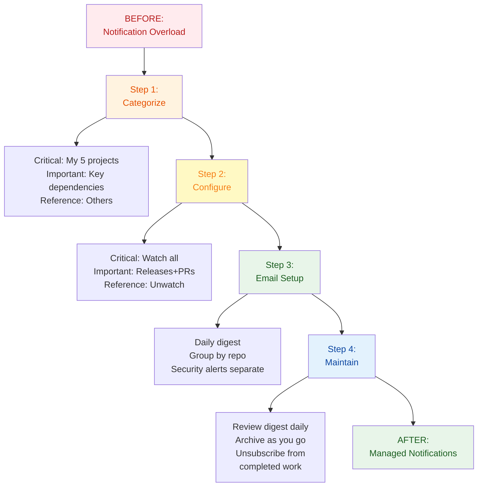

**Settings Applied:**
```
Global: @mentions only (default)

Critical Repos (5):
- Watch: All Activity
- Email: Instant

Important Repos (8):
- Watch: Releases + PRs
- Email: Daily digest

Reference Repos (7):
- Unwatch
- Custom: Security alerts only

Email Summary:
- Frequency: Daily
- Grouping: By repository
- Time: 9 AM daily
```

**Result:** 20 notifications per day (manageable), no important items missed

---

### Scenario 2: Open Source Maintainer

**Situation:** Maintaining popular package, 50+ issues/PRs weekly

**Configuration:**

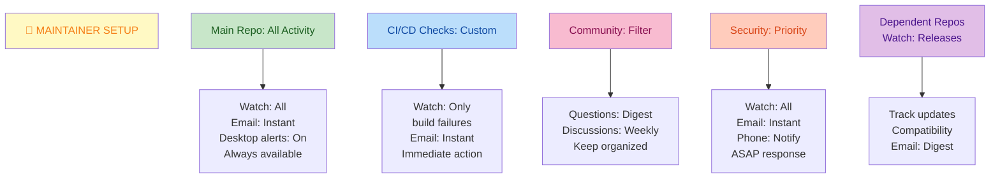

**Email Rules:**
```
1. From: notifications@github.com
   Subject: (security OR vulnerability)
   → Label: URGENT
   → Alert immediately

2. From: notifications@github.com
   Subject: (pull request OR code review)
   → Label: PRs
   → Instant notification

3. From: notifications@github.com
   Subject: (discussion OR question)
   → Label: Community
   → Daily digest, 5 PM

4. From: notifications@github.com
   Subject: (failed OR error)
   → Label: CI/CD
   → Instant notification
```

---

### Scenario 3: Student Contributor

**Situation:** Contributing to 2-3 projects, learning, not full-time

**Approach:**

```
Primary Project (Contributing):
- Watch: Releases + PRs
- Email: Instant (small project)

Learning Projects (2):
- Watch: Custom
- Email: Daily digest
- Interest: Releases & discussions

Reference Projects:
- Unwatch
- Custom: Security alerts

Overall Strategy:
- Check inbox 2x daily
- Archive old notifications
- Active in assigned PRs only
- Read discussions as digest
```

---

## 9. Best Practices

### Notification Management Best Practices

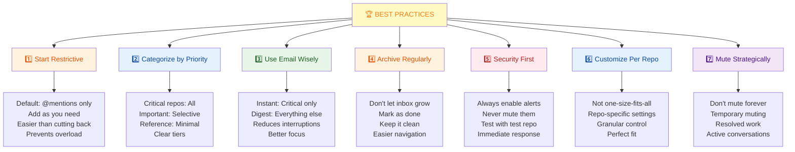

### Anti-Patterns to Avoid

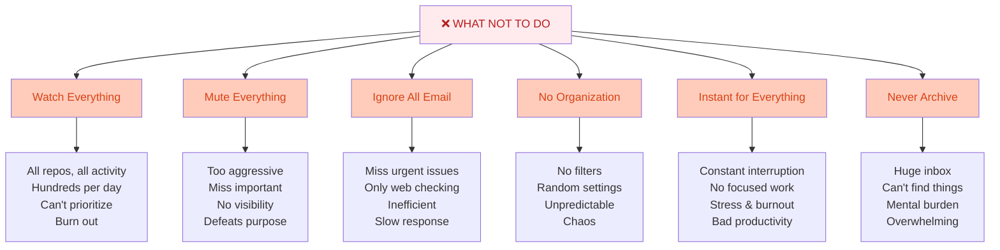

---

## 10. Summary & Key Takeaways

### What You Should Know

✅ **Notification types** - Participating, watching, team mentions, security alerts  
✅ **Delivery methods** - Web, email, mobile, desktop  
✅ **Configuration** - Global settings, per-repo settings, custom filters  
✅ **Management** - Mute conversations, unwatch repos, archive notifications  
✅ **Email strategy** - Digest mode better than instant for most  
✅ **Start restrictive** - Only @mentions by default, add repos as needed  
✅ **Categorize** - Critical, important, reference repos with different settings  
✅ **Security first** - Always keep security alerts enabled  

### Critical Settings Checklist

| Setting | Recommendation | Why |
|---------|-----------------|-----|
| Default Behavior | Only @mentions | Prevents overload |
| Email Frequency | Daily digest | Batched, less disruptive |
| Security Alerts | Always enabled | Critical for safety |
| Web Notifications | For critical repos | Real-time for urgent |
| Per-repo Custom | Yes | Different repos need different settings |

---

## 11. Interview & Exam Prep

### Common Interview Questions

**Q1: How would you handle notification overload?**
> Start with restrictive default settings (@mentions only), then explicitly subscribe to critical repos. Use email digest mode to batch notifications. Categorize repos by priority and apply different notification levels accordingly. Regularly archive processed notifications to keep inbox clean and actionable.

**Q2: What's the difference between watching and participating notifications?**
> Participating notifications fire when you're directly involved (assigned, mentioned, or commented). Watching notifications fire for repository activity when you've enabled watching. You can customize what triggers notifications independently for each.

**Q3: Should you commit .env files and how does this relate to notifications?**
> Never commit .env files—they contain secrets. GitHub's secret scanning will alert you (security notification) if you do. This is why understanding notifications is important: security alerts need to be visible and actionable. Always enable security alert notifications.

**Q4: What's the best email notification strategy?**
> Use daily or weekly digest mode for most repositories instead of instant delivery. This reduces interruptions and keeps you focused. Reserve instant delivery for truly critical repositories. Use filters in your email client to further organize by urgency and project.

**Q5: When should you mute a conversation vs unwatch a repository?**
> Mute a conversation when you're temporarily uninterested in one specific thread but still care about the repository. Unwatch a repository when you no longer need updates from it at all. Muting is temporary; unwatching is long-term.

**Q6: Why is starting with restrictive notification settings better?**
> Starting restrictive prevents notification fatigue early. Adding notifications as you recognize their value is better than trying to unsubscribe from everything later. Keeps you focused on what matters. Easier to onboard and scale notification consumption.

**Q7: How do you handle security alerts in your notification workflow?**
> Security alerts should always be enabled and have separate, higher-priority treatment. Set them to instant email delivery. Use email filters to mark them distinctly. Never mute or archive without addressing. Consider adding phone notifications for critical projects.

**Q8: What's the role of digests in notification management?**
> Digests batch notifications into fewer, more organized emails. They reduce interruption frequency while keeping you informed. Daily digests work for most developers. Weekly for less critical repos. Digests let you process information efficiently in dedicated time blocks.

### Practice Scenarios

**Scenario A:** You're added to 3 new projects at work. How do you configure notifications?
- Configure critical project: All activity, instant email
- Configure important projects: Releases + PRs, daily digest
- Don't immediately watch everything; subscribe as you identify what matters

**Scenario B:** You have 500 unread notifications. How do you recover?
- Use "Mark all as done" in notification settings (bulk archive)
- Reconfigure settings to prevent recurrence
- Focus forward, not backward
- Start with restrictive settings and build up

**Scenario C:** A security vulnerability is reported but you didn't see the notification. What happened?
- Security alerts may have been disabled
- Could be in email spam/filters
- Desktop notifications might be off
- Check notification settings → Vulnerability alerts section

---

## 12. Troubleshooting Common Issues

### Issue: Missing Important Notifications

**Problem:** Key notifications aren't reaching you

**Possible Causes & Solutions:**

```bash
1. Email Filter Problem
   - Check spam folder
   - Check email filters/rules
   - Add notifications@github.com to safe senders
   - Solution: Whitelist GitHub domain

2. Notification Settings Wrong
   - Check Settings → Notifications
   - Verify email frequency not "Off"
   - Check repo-specific settings
   - Solution: Enable notifications

3. Muted Conversation
   - You muted the issue/PR
   - Temporary until you participate
   - Solution: Find notification → Click Unmute

4. Not Watching Repository
   - Repo might be unwatched
   - Only get direct mentions
   - Solution: Watch repo with appropriate setting

# Check notification settings
Settings → Notifications → Check all toggles
```

### Issue: Too Many Notifications

**Problem:** Drowning in notifications, can't keep up

**Solutions:**

```bash
1. Switch to Email Digest
   Settings → Notifications
   Email → Change to Daily or Weekly digest

2. Unwatch Low-Priority Repos
   Repository → Watch → Custom
   Choose specific events only

3. Use Mute for Active Projects
   On issue/PR: Click ... → Mute
   Temporary relief from noisy conversations

4. Set Repository-Specific Settings
   Repository → Watch dropdown
   Select appropriate level per repo

5. Create Email Filters
   Gmail/Outlook rules
   Auto-organize into folders
   Review in batches

6. Archive Regularly
   Notification inbox → Mark as done
   Keep inbox focused on actionable items
```

### Issue: Not Getting Email Notifications

**Problem:** Web notifications work but emails not arriving

**Debugging Steps:**

```bash
1. Verify Email in Settings
   Settings → Emails
   Check "Receive email notifications" is enabled

2. Check Email Frequency
   Settings → Notifications
   Email frequency not set to "Off"

3. Check Spam Folder
   Look in email spam/junk
   Whitelist notifications@github.com

4. Verify Repository Watching
   Repository → Watch
   Make sure watching (not ignored)

5. Test with Test Repository
   Watch public test repo
   Make a test commit/comment
   Check if email arrives

6. Check Email Provider Filters
   Gmail: Check All Mail, Filters
   Outlook: Check rules
   Other: Check spam settings
```

### Issue: Desktop Notifications Not Appearing

**Problem:** Browser notifications not showing

**Solutions:**

```bash
1. Check Browser Permissions
   Browser Settings → Notifications
   github.com should be "Allow"
   Not "Block" or "Ask"

2. Enable in GitHub Settings
   Settings → Notifications
   ☑ Include web notifications
   ☑ Desktop notifications enabled

3. Check Browser DND Mode
   Disable "Do Not Disturb"
   Close pager/fullscreen
   Notifications need space

4. Test Notification
   Repository → Add comment
   Or check settings test button
   Should see desktop notification

5. Check OS Notification Settings
   macOS: System Preferences → Notifications
   Windows: Settings → System → Notifications
   Linux: Check notification daemon

6. Clear Browser Cache
   Clear Site Data for github.com
   Re-login
   Reconnect notifications
```

---

## 13. Visual Summary

### Notification Management Workflow

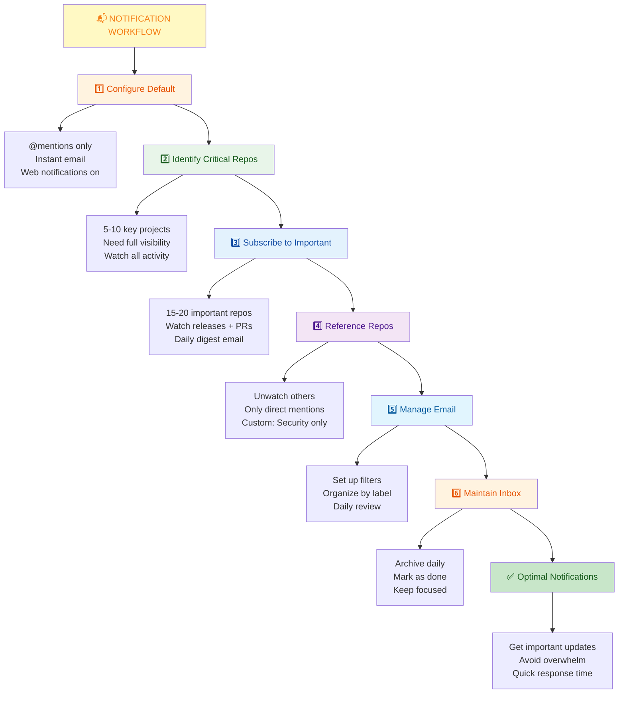

---

**Last Updated:** January 7, 2026  
**Difficulty Level:** Beginner to Intermediate  
**Prerequisites:** GitHub account, repository knowledge, email familiarity
