# GitHub Projects & Organizations: Team Management Guide

## Overview

GitHub Projects and Organizations are tools for managing collaborative work at scale. Organizations provide team structure, access control, and shared settings. GitHub Projects (formerly called Projects) offers task management, kanban boards, and automation for tracking work. Together, they enable teams to organize repositories, manage workflows, and collaborate efficiently.

### Why It Matters
- **Team structure** - Organize developers and responsibilities
- **Access control** - Manage permissions and security
- **Task management** - Track issues, PRs, and progress
- **Workflow automation** - Automate repetitive tasks
- **Visibility** - See what the team is working on
- **Accountability** - Track who's doing what
- **Planning** - Organize sprints and milestones
- **Scaling** - Manage multiple projects and teams

### Main Use Cases
- Creating teams and managing access
- Organizing multiple repositories
- Planning sprints and releases
- Tracking issues and PRs
- Automating workflow processes
- Setting organization policies
- Managing billing and licenses
- Collaborating across teams

---

## 1. Core Concepts & Fundamentals

### Organizations vs Personal Accounts

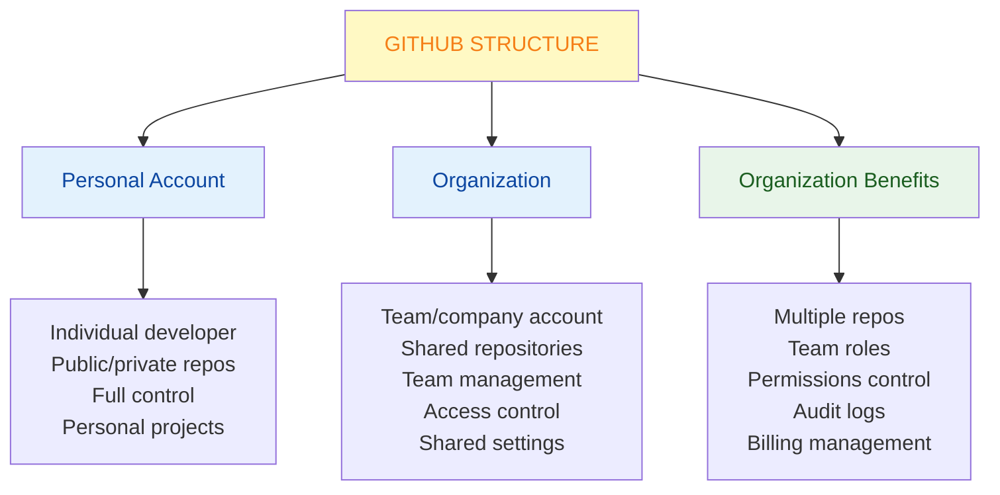

### GitHub Organizations Hierarchy

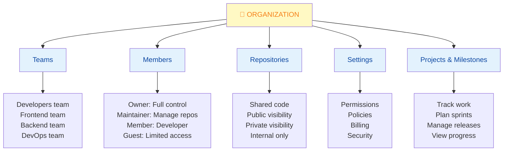

### GitHub Projects Overview

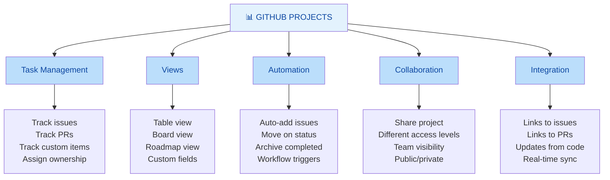

---

## 2. Creating & Managing Organizations

### Creating an Organization

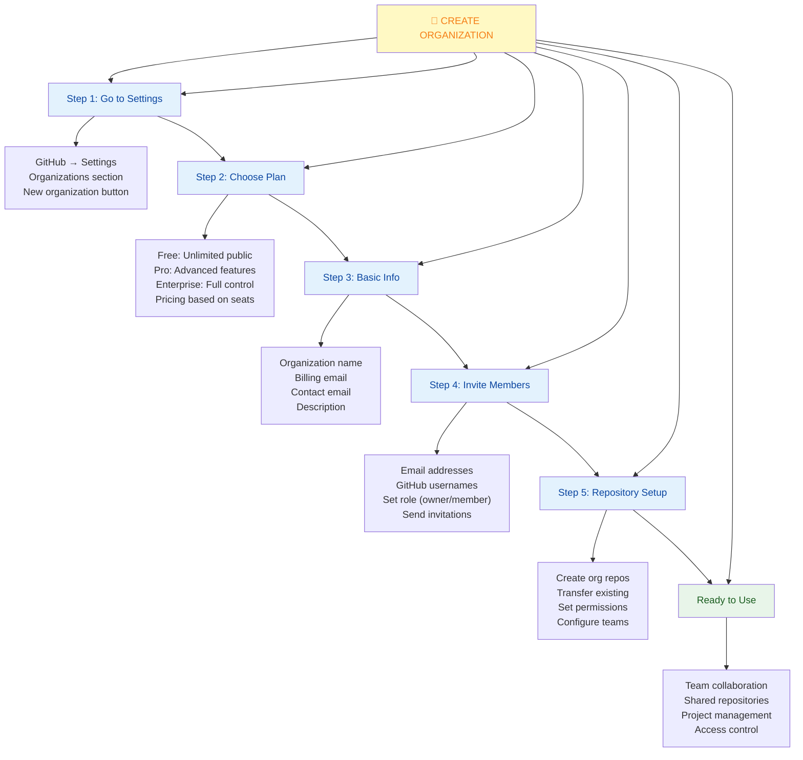

### Organization Settings Overview

```
Organization Settings:

┌─ General ─────────────────────────────────────┐
│ Organization name                             │
│ Organization type (company, open source, etc) │
│ Description & website                         │
│ Profile picture                               │
│ Public/private visibility                     │
└───────────────────────────────────────────────┘

┌─ Members ─────────────────────────────────────┐
│ Add members                                   │
│ Manage roles (owner, member)                  │
│ Two-factor authentication required            │
│ Export members list                           │
└───────────────────────────────────────────────┘

┌─ Teams ───────────────────────────────────────┐
│ Create teams                                  │
│ Assign members to teams                       │
│ Set team permissions                          │
│ Manage team visibility                        │
└───────────────────────────────────────────────┘

┌─ Repository ──────────────────────────────────┐
│ Add repositories                              │
│ Transfer repositories                         │
│ Default permissions                           │
│ Force fork deletion                           │
└───────────────────────────────────────────────┘

┌─ Billing ─────────────────────────────────────┐
│ Manage payment method                         │
│ View invoices                                 │
│ Manage licenses                               │
│ Billing contacts                              │
└───────────────────────────────────────────────┘

┌─ Security ────────────────────────────────────┐
│ Two-factor authentication required            │
│ SAML single sign-on                           │
│ IP whitelist                                  │
│ Audit log                                     │
└───────────────────────────────────────────────┘
```

---

## 3. Teams & Permissions

### Team Structure

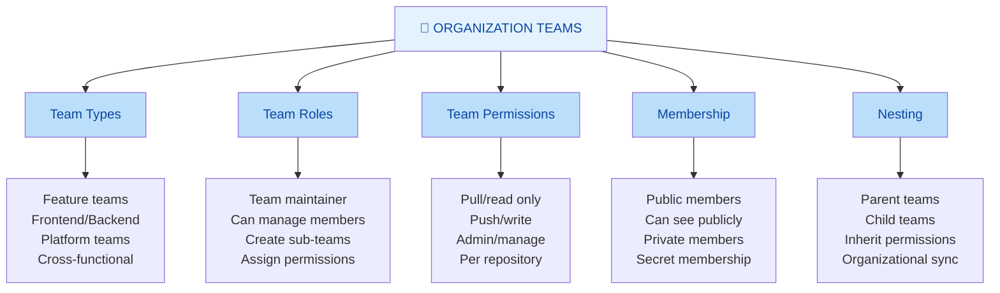

### Role-Based Access Control

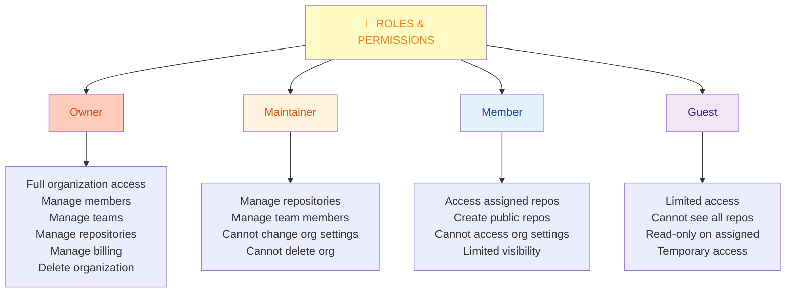

### Repository Permissions per Team

```
┌─ Repository Access Levels ──────────────────┐
│                                             │
│ Pull (Read):                                │
│  - View & clone                             │
│  - Open issues/discussions                  │
│  - No push access                           │
│                                             │
│ Push (Write):                               │
│  - Pull + push branches                     │
│  - Review/merge PRs                         │
│  - Create releases                          │
│  - Cannot delete repo                       │
│                                             │
│ Admin:                                      │
│  - Full repo control                        │
│  - Change settings                          │
│  - Manage collaborators                     │
│  - Delete repo                              │
│  - Manage protection rules                  │
│                                             │
│ Triage:                                     │
│  - Manage issues/PRs                        │
│  - Cannot push                              │
│  - Close/reopen issues                      │
│  - Assign labels                            │
│                                             │
│ Maintain:                                   │
│  - Manage without delete                    │
│  - Manage PRs/issues                        │
│  - Manage wiki/pages                        │
│  - Cannot delete repo                       │
│                                             │
└─────────────────────────────────────────────┘
```

---

## 4. GitHub Projects - New Version

### Creating a Project

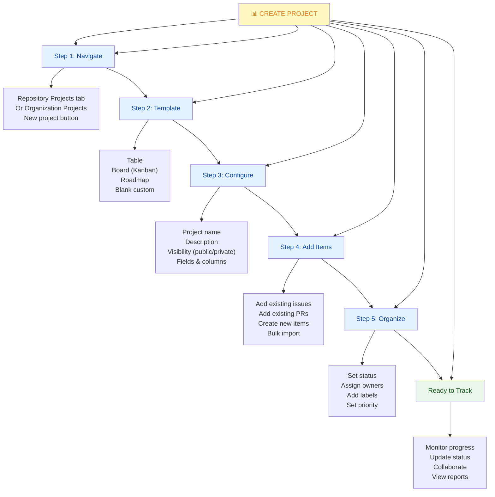

### Project Views

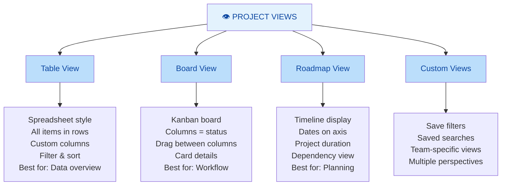

### Project Automation

```yaml
# GitHub Projects can automate:

When issue is opened:
  → Automatically add to project
  → Set status to "Todo"
  → Add "triage" label

When PR is ready for review:
  → Move to "In Review" column
  → Assign to reviewer
  → Add "needs-review" label

When PR is merged:
  → Move to "Done" column
  → Archive item
  → Notify team

When issue is closed:
  → Remove from project
  → Archive card
  → Update milestone progress

When status changes:
  → Update PR status
  → Change labels
  → Notify assignee
  → Update linked items
```

---

## 5. Organization Workflows & Best Practices

### Team Workflow Setup

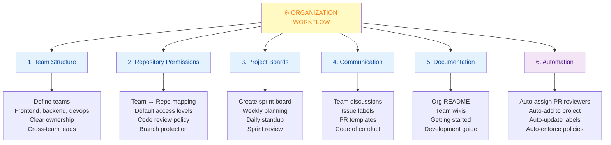

### Best Practices for Organizations

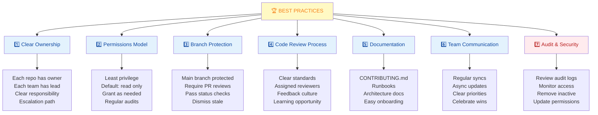

---

## 6. Quick Cheatsheet

### Organization Setup Checklist

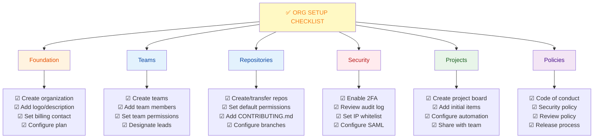

### GitHub Projects Features

| Feature | Description | Use Case |
|---------|-------------|----------|
| **Table View** | Spreadsheet-like organization | See all items at once |
| **Board View** | Kanban columns | Workflow visualization |
| **Roadmap View** | Timeline with dates | Release planning |
| **Custom Fields** | Add metadata | Priority, effort, owner |
| **Automation** | Auto-update status | Reduce manual work |
| **Filtering** | Search & filter | Find relevant items |
| **Sorting** | Organize items | By priority, date, etc |
| **Templates** | Save field configs | Consistency |

### Common Commands

```bash
# Via GitHub CLI (gh)

# Create organization (must be owner)
gh org create

# List org members
gh org members list

# Invite member
gh org invite-member USERNAME

# Create team
gh team create TEAM_NAME

# Add to team
gh team add-member TEAM_NAME USERNAME

# List projects
gh project list

# Create project
gh project create --title "Project Name"
```

---

## 7. Real-World Scenarios

### Scenario 1: Setting Up Organization for Growing Team

**Situation:** Company growing from 5 to 20 developers, need structure

**Before:** Chaos
- All repos in personal accounts
- No clear permissions
- Everyone can access everything
- No tracking of work
- Merge conflicts and confusion

**After:** Well-organized
```
MyCompany Organization
├── Backend Team
│   ├── api repo (pull/push)
│   ├── database repo (push)
│   └── services repo (push)
├── Frontend Team
│   ├── web repo (push)
│   ├── mobile repo (push)
│   └── shared-ui repo (pull)
├── DevOps Team
│   ├── infrastructure repo (admin)
│   ├── deployment repo (push)
│   └── monitoring repo (push)
└── Projects
    ├── Q1 Roadmap
    ├── Sprint Board
    └── Hiring Dashboard
```

**Implementation Steps:**
1. Create organization
2. Create teams (Backend, Frontend, DevOps)
3. Transfer/create repositories
4. Set team permissions per repo
5. Create project board for sprint
6. Add branch protection to main
7. Setup automated code review
8. Configure audit logging

**Result:** 
- Clear ownership
- Managed permissions
- Work tracking
- Team coordination

---

### Scenario 2: Managing Sprint with Projects

**Situation:** Sprint planning and tracking

```
Project Board: Sprint 2026-01-Q1

Views:
├── Board (Kanban)
│   ├── Backlog (15 items)
│   ├── Ready (5 items)
│   ├── In Progress (8 items)
│   ├── In Review (3 items)
│   └── Done (12 items)
│
├── Roadmap
│   ├── Q1 Milestones
│   ├── Feature timeline
│   └── Release schedule
│
└── Table (Full view)
    ├── All items
    ├── Assigned to: John, Jane, etc
    ├── Priority: Critical, High, Medium
    └── Status: All above

Automation:
- New issue added → Auto-add to project
- Mark "Ready" → Notify team
- Assign PR → Move to "In Review"
- Merge PR → Move to "Done" & archive
- Comment "won't fix" → Move to "Declined"
```

**Daily Standup:**
- Use project board as reference
- What's in progress?
- What's blocked?
- What's ready next?

---

### Scenario 3: Code Review Policy with Teams

**Situation:** Enforce code quality across organization

```
Policy:
1. All PRs require review
2. Two from specific teams
3. Backend PRs: 2 backend team members
4. Frontend PRs: 2 frontend team members
5. Cross-team: 1 from each

Implementation:
├── Branch Protection Rule
│   ├── Require pull request reviews: 2
│   ├── Require status checks: tests pass
│   ├── Require branches up to date
│   └── Dismiss stale reviews
│
├── Code Owners File
│   ├── /backend/* → @company/backend
│   ├── /frontend/* → @company/frontend
│   ├── /infra/* → @company/devops
│   └── *.json → @company/backend
│
└── CONTRIBUTING.md
    ├── Review expectations
    ├── Code standards
    ├── Testing requirements
    └── Release process
```

**Result:** 
- Consistent quality
- Knowledge sharing
- Team awareness
- Fewer bugs

---

## 8. Best Practices & Anti-Patterns

### GitHub Organizations Best Practices

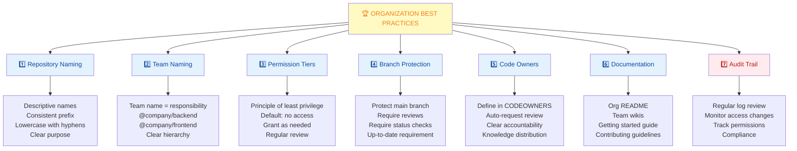

### Anti-Patterns to Avoid

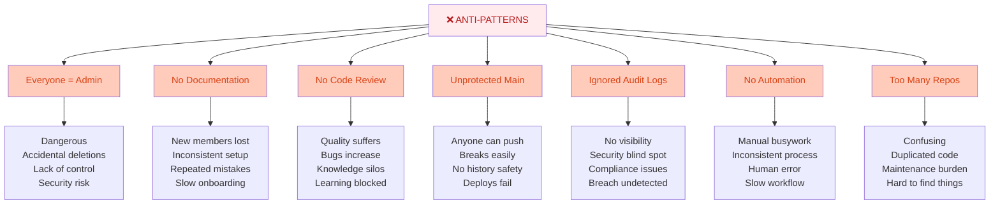

---

## 9. Summary & Key Takeaways

### What You Should Know

✅ **Organizations structure teams** - Manage multiple repos and members  
✅ **Role-based access** - Owner, maintainer, member, guest roles  
✅ **Teams group developers** - By function or feature  
✅ **Projects track work** - Issues, PRs, custom items  
✅ **Projects have views** - Table, board, roadmap  
✅ **Automation reduces manual work** - Auto-add, auto-status, auto-archive  
✅ **Branch protection enforces quality** - Reviews, checks, up-to-date  
✅ **Audit logs provide visibility** - Security, compliance, accountability  

### Quick Comparison: Personal vs Organization

| Feature | Personal | Organization |
|---------|----------|--------------|
| **Repositories** | Single owner | Shared |
| **Team management** | N/A | Full featured |
| **Access control** | Simple | Role-based |
| **Projects** | Basic | Advanced |
| **Audit log** | Limited | Detailed |
| **Billing** | Per user | Per org |
| **SAML/SSO** | No | Yes |
| **For teams** | ❌ Not ideal | ✅ Perfect |

---

## 10. Interview & Exam Prep

### Common Interview Questions

**Q1: What's the difference between a personal account and an organization?**
> Personal accounts are for individuals, organizations are for teams/companies. Organizations allow multiple repositories, team management, role-based access control, shared settings, audit logging, and centralized billing. Organizations are essential for team collaboration.

**Q2: Explain the role hierarchy in GitHub organizations.**
> Owner has full control over organization settings, members, and billing. Maintainers can manage repositories and team members but not org settings. Members have basic access to assigned repositories. Guests have limited temporary access. Permission flows hierarchically.

**Q3: How would you structure teams for a company with frontend, backend, and DevOps groups?**
> Create three teams: @company/frontend, @company/backend, @company/devops. Assign members to appropriate teams. Grant each team permissions on their relevant repositories (frontend team has push on web repo, pull on API repo, etc). This provides clear ownership and least-privilege access.

**Q4: What are GitHub Projects and what problems do they solve?**
> GitHub Projects are task management boards that track issues, PRs, and custom items. They solve the problem of scattered work—everything's in one place. Kanban boards visualize workflow, automation reduces manual updates, and integration with issues/PRs keeps data in sync.

**Q5: Explain different project views and when to use each.**
> Table view is best for overview of all items (spreadsheet-like). Board view (Kanban) is best for workflow visualization with columns as statuses. Roadmap view is best for planning with timeline visibility. Use table for data review, board for daily work, roadmap for releases.

**Q6: What's the purpose of branch protection rules?**
> Branch protection enforces quality by requiring pull request reviews before merge, ensuring status checks pass, requiring branches are up-to-date with main, and allowing dismissal of stale reviews. Prevents accidental pushes, enforces review, catches bugs early.

**Q7: How would you implement an audit trail in your organization?**
> Enable and regularly review the organization audit log (Settings → Audit Log). Monitor member additions/removals, permission changes, repository transfers, team changes. Keep records for compliance. Set up alerts for sensitive actions. Create audit reports.

**Q8: What's the principle of least privilege and how to apply it?**
> Give each member the minimum permissions they need. Default: no access. Grant read on public repos, write on assigned repos, admin only if needed. Review quarterly. Removes risk of accidental damage. Separates concerns. Follows security best practices.

### Practice Scenarios

**Scenario A:** Your organization is 50 people, chaos in access control. How would you restructure?
- Audit current permissions and document
- Create team structure (by function)
- Move members to teams
- Assign team permissions per repo
- Set branch protection rules
- Enable audit logging
- Document in CONTRIBUTING.md
- Monthly permission reviews

**Scenario B:** You need to enforce code review before merging. How?
- Repository → Settings → Branches
- Add branch protection rule for main
- Require pull request reviews: 2
- Add CODEOWNERS file
- Auto-request appropriate reviewers
- Require status checks pass
- Require up-to-date before merge
- Train team on process

**Scenario C:** Team of 10 developers, need to track sprint work. How?
- Create GitHub Project
- Add issues/PRs to project
- Create views: Board (workflow), Roadmap (timeline)
- Assign items to team members
- Set automation: issue → "Todo", PR → "In Review", merge → "Done"
- Daily standup using board view
- Sprint review using table view
- Measure velocity from closed items

---

## 11. Troubleshooting Common Issues

### Issue: Permission Denied for Team Member

**Problem:** Team member can't access a repository

**Solutions:**

```bash
1. Verify Team Membership
   Organization → Teams
   Check member in correct team
   Add if missing

2. Check Team Permissions
   Team Settings → Repository Access
   Ensure team has access to repo
   Check access level (pull/push/admin)

3. Check Personal Access
   Repository → Collaborators
   Not overridden individually
   Team permission should apply

4. Check Outside Collaborators
   Might have limited access
   Change to full member

5. Verify GitHub Account
   Correct GitHub username?
   Capitalization matters
   Check for typos

6. Review Audit Log
   Settings → Audit Log
   See if access was revoked
   Check recent changes

# Example: Add team to repository
Organization → Teams → [Team Name]
Repositories tab → Add Repository
Select repository, choose access level
```

### Issue: Can't Create Project or Access It

**Problem:** Project creation fails or can't see project

**Solutions:**

```bash
1. Check Permissions
   Must be org member (at least)
   Owner access for org projects
   May vary for repo projects

2. Verify Project Visibility
   Private projects: only members
   Public projects: visible to all
   Check settings for correct visibility

3. Confirm Organization Plan
   Projects available on most plans
   Check organization billing
   May need upgrade for advanced features

4. Check Project Access Settings
   Project → Access
   Ensure user has access
   May need to invite specifically

5. Browser Cache
   Clear cache and refresh
   Try incognito window
   Try different browser

6. Try Different Org
   Can create in organization?
   Can create in repository?
   Permissions might differ

# If still failing:
Check GitHub Status: https://www.githubstatus.com
Contact GitHub Support
```

### Issue: Audit Log Shows Unexpected Changes

**Problem:** Permissions or settings changed without authorization

**Solutions:**

```bash
1. Review Recent Audit Log
   Settings → Audit Log
   Filter by action type
   Sort by most recent
   Check for unauthorized changes

2. Identify User
   Who made the change?
   Were they authorized?
   Check their access level

3. Verify Intent
   Was it accidental?
   Was it authorized but not communicated?
   Talk to the person

4. Secure Account
   If unauthorized: change passwords
   Enable 2FA if not enabled
   Review connected applications
   Remove suspicious access

5. Implement Controls
   Restrict to minimum members
   Owner approval for changes
   Only specific people can...
   Require 2FA for admins

6. Document Policy
   Create access change policy
   Approval process
   Notification requirements
   Audit frequency

# Export audit log for investigation
Settings → Audit Log
Export as CSV
Review offline
Keep for records
```

### Issue: Team Members Can't See Each Other

**Problem:** Team members aren't aware of each other

**Solutions:**

```bash
1. Check Team Privacy
   Team → Settings → Privacy
   Private: members only see listed
   Public: members visible to all
   Change to match need

2. Set Member Visibility
   Each member's profile
   Can be public or private
   Controls what others see

3. Use Discussion
   Team → Discussions
   Create team space
   Share updates
   Improve visibility

4. Team Mention
   @team-name in issues/PRs
   Notifies all members
   Visible participation

5. Update Team Page
   Organization → Teams → [Team]
   Add description
   List members
   Show what team does

6. Team Sync Meeting
   Regular team calls
   Build relationships
   Align on priorities
```

---

## 12. Visual Summary

### Organization Setup Flow

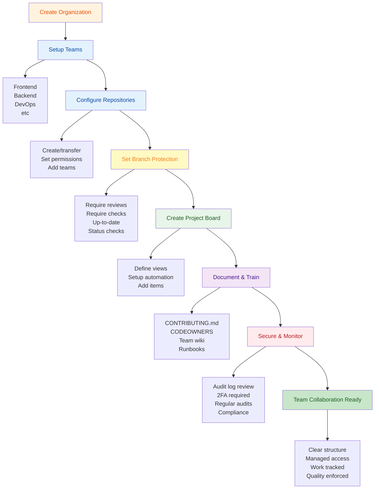

---

## 13. Organizations Checklist & Planning

### Pre-Launch Checklist

```yaml
Organization Planning:

□ Structure
  □ Team names and responsibilities
  □ Repository organization
  □ Code ownership model
  □ Permission tiers

□ Members
  □ List of initial members
  □ Team assignments
  □ Role assignments
  □ Contact information

□ Repositories
  □ Existing repos to transfer
  □ New repos to create
  □ Default branch name
  □ Naming convention

□ Policies
  □ Code review process
  □ Commit message format
  □ Branch naming convention
  □ Release process

□ Security
  □ 2FA requirement
  □ Branch protection rules
  □ CODEOWNERS file
  □ Security policy

□ Documentation
  □ README for organization
  □ CONTRIBUTING guidelines
  □ Code of conduct
  □ Development setup guide

□ Automation
  □ GitHub Actions workflows
  □ Automatic reviewers
  □ Status check requirements
  □ Project automation

□ Communication
  □ Team channels
  □ Regular syncs
  □ Notifications setup
  □ Escalation path

□ Monitoring
  □ Audit log review process
  □ Permission audits schedule
  □ Performance metrics
  □ Issue tracking
```

---

**Last Updated:** January 7, 2026  
**Difficulty Level:** Intermediate to Advanced  
**Prerequisites:** GitHub account, team collaboration experience, repository knowledge
