# GitHub: Push, Pull, and Pull Requests Guide

## Overview
Understanding the difference between push, pull, and pull requests is fundamental to working with GitHub in collaborative projects.

---

## 1. Push vs Pull Request - Key Differences

### Visual Comparison

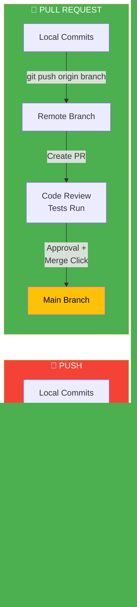

### **Push**
- **Type:** Git command
- **What it does:** Uploads your local commits directly to a remote branch
- **Access requirement:** Requires write access to the branch
- **Review process:** No built-in review
- **When merged:** Automatic (once pushed)
- **Typical use:** Your own branches or direct commits

### **Pull Request (PR)**
- **Type:** GitHub feature (not a Git command)
- **What it does:** Proposes changes for review before merging
- **Access requirement:** Anyone can create (if fork permissions allowed)
- **Review process:** Enables code review, discussion, and checks
- **When merged:** Requires explicit approval + merge
- **Typical use:** Contributing to shared/main branches

---

## 2. When to Use Push and Pull

### **git push** - Upload Local Changes

**When to push:**
- After making commits locally and you're ready to share them
- Before creating a pull request (push your feature branch first)
- To keep your remote branch up-to-date with your work
- Whenever you want others to see your changes

```bash
git push origin feature-branch
```

### **git pull** - Download Remote Changes

**When to pull:**
- Before starting work (to get the latest changes from teammates)
- Before pushing (to avoid conflicts)
- After a PR is merged (to sync with main)
- Regularly during collaborative work to stay current

```bash
git pull origin main
```

---

## 3. Git Workflow Architecture

### Local vs Remote Repository

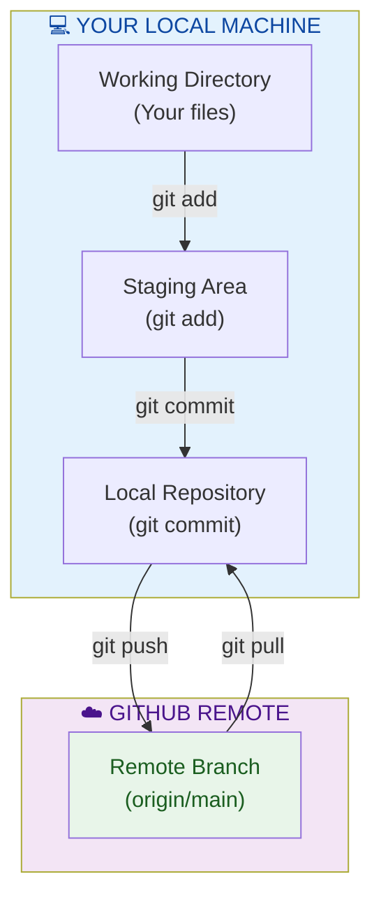

### Step-by-Step:

```mermaid
graph LR
    A["1️⃣ git pull<br/>origin main"] 
    B["2️⃣ Create &<br/>Edit Files<br/>Feature Branch"]
    C["3️⃣ git add &<br/>git commit"]
    D["4️⃣ git push origin<br/>feature-branch"]
    E["5️⃣ Open Pull<br/>Request"]
    F["6️⃣ Code Review &<br/>Tests"]
    G["7️⃣ Merge to<br/>Main"]
    H["8️⃣ git pull origin<br/>main"]
    
    A --> B --> C --> D --> E --> F --> G --> H
    
    style A fill:#e1f5fe,color:#01579b
    style B fill:#f3e5f5,color:#4a148c
    style C fill:#fff3e0,color:#e65100
    style D fill:#fce4ec,color:#880e4f
    style E fill:#e8f5e9,color:#1b5e20
    style F fill:#f3e5f5,color:#4a148c
    style G fill:#e8f5e9,color:#1b5e20
    style H fill:#e1f5fe,color:#01579b
```

1. **Pull** → Get latest code from remote
   ```bash
   git pull origin main
   ```

2. Create a feature branch and make changes locally
   ```bash
   git checkout -b feature-branch
   # Make changes...
   git add .
   git commit -m "Your changes"
   ```

3. **Push** → Upload your branch to remote
   ```bash
   git push origin feature-branch
   ```

4. Open a Pull Request on GitHub
   - Go to your repository
   - Click "New Pull Request"
   - Select your feature branch and main
   - Add title and description
   - Click "Create Pull Request"

5. **Pull** → After PR is merged, sync your main branch
   ```bash
   git pull origin main
   ```

---

## 4. How Pull Requests Update Main Branch

### The Complete PR Flow

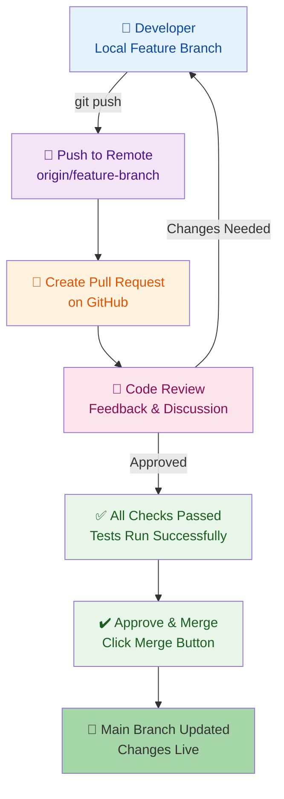

### Branch Separation & Safety

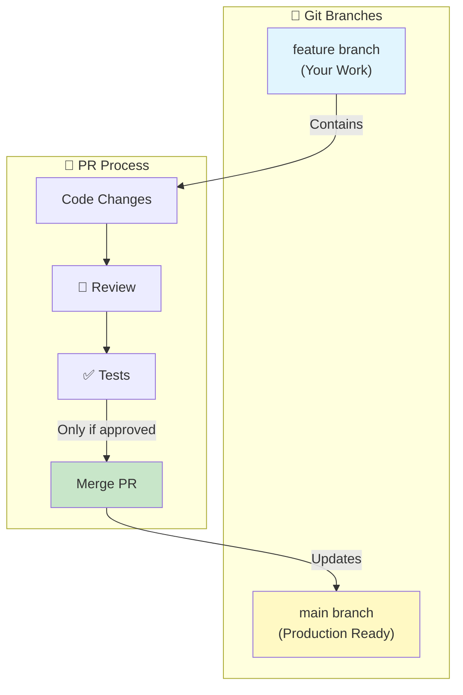

### Why Not Push Directly to Main?

In collaborative projects, **pushing directly to main is restricted** via branch protection rules. You must use a PR instead because:

- ✅ Allows code review before changes reach main
- ✅ Prevents bad code from breaking the project
- ✅ Creates discussion and accountability
- ✅ Runs automated tests before merging
- ✅ Creates audit trail of changes

### Branching Strategy Comparison

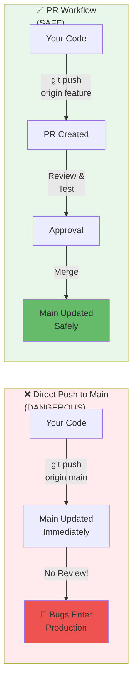

### Key Point:

**The PR merge (not a direct push) is what updates main.**

The PR itself is a gatekeeper that ensures only reviewed, approved code reaches main.

---

## 5. Quick Reference Summary

| Operation | Command | Purpose |
|-----------|---------|---------|
| **Push** | `git push origin branch` | Upload local commits to remote |
| **Pull** | `git pull origin branch` | Download and merge remote changes |
| **Create PR** | Via GitHub UI | Propose changes for review |
| **Merge PR** | Click "Merge" on GitHub | Update main with reviewed code |

---

## Key Takeaways

1. **Push:** "Here's my work" (upload local → remote)
2. **Pull:** "Give me the latest" (download remote → local)
3. **Pull Request:** "Please review and merge my changes" (gatekeeper for main branch)

Push and pull are the two fundamental Git operations for syncing between your local repository and GitHub.

---

## 6. Quick Cheatsheet

### Essential Commands

```bash
# PULL - Get latest changes from remote
git pull origin main
git pull origin feature-branch

# PUSH - Upload your commits to remote
git push origin feature-branch
git push origin main

# CREATE & COMMIT
git checkout -b new-feature                    # Create new branch
git add .                                      # Stage changes
git commit -m "Your message"                   # Commit changes
git push origin new-feature                    # Push to remote

# SYNC BEFORE WORKING
git pull origin main                           # Get latest from main
git merge main                                 # Merge main into your branch

# AFTER PR MERGE
git checkout main                              # Switch to main
git pull origin main                           # Get merged changes
git branch -d feature-branch                   # Delete old branch (optional)
```

### Decision Tree: Push vs Pull Request?

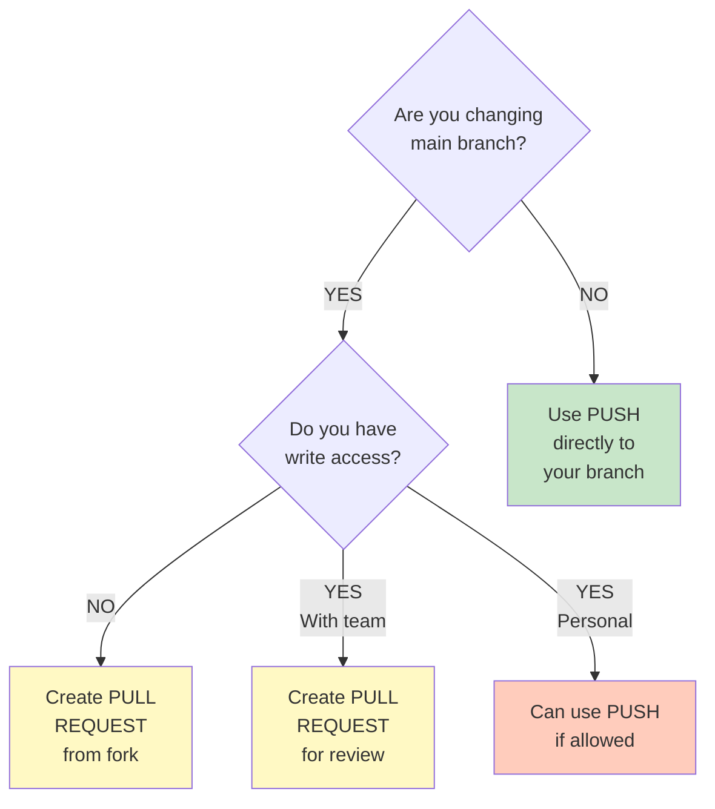

### Common Scenarios Cheatsheet

| Scenario | What To Do | Command |
|----------|-----------|---------|
| **Starting new work** | Pull latest main | `git pull origin main` |
| **Made local changes** | Push to your branch | `git push origin feature-branch` |
| **Ready for merge** | Create PR on GitHub | UI: "New Pull Request" |
| **PR approved** | Merge on GitHub | UI: "Merge Pull Request" |
| **PR rejected** | Fix locally, push again | `git push origin feature-branch` |
| **After PR merged** | Sync your main | `git pull origin main` |
| **Conflict in PR** | Resolve locally, push | `git push origin feature-branch` |
| **Need teammate's code** | Pull their branch | `git pull origin teammate-branch` |

---

## 7. Compare & Contrast: Real-World Scenarios

### Scenario 1: Solo Personal Project (You're the Only Developer)

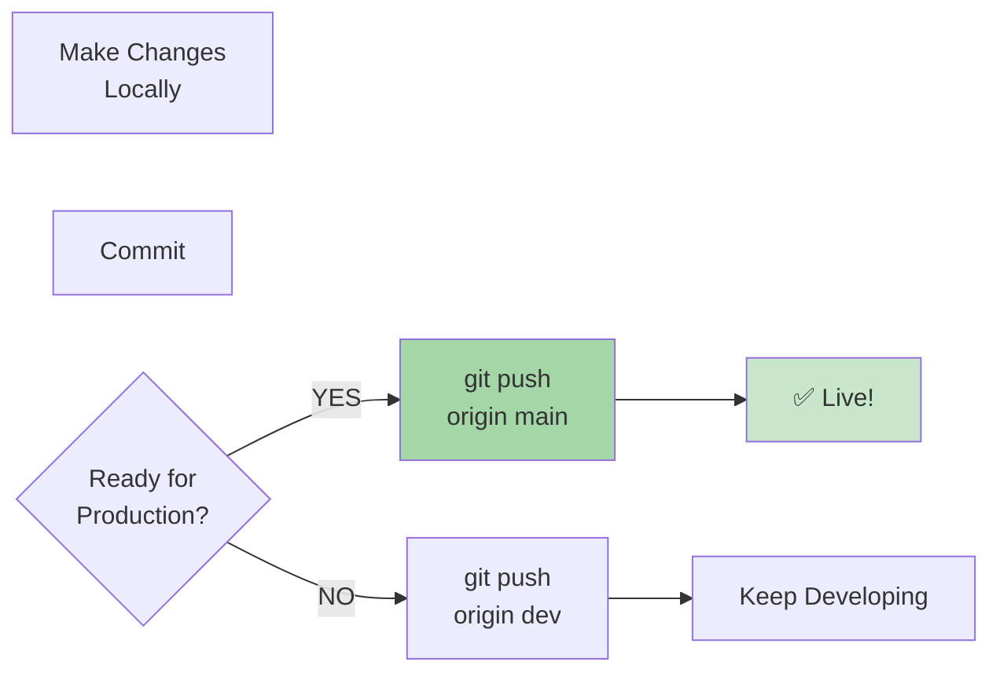

**Best Practice:**
- ✅ **Can use direct PUSH** to main (no review needed)
- ✅ Use branches for experimental work
- ✅ Keep main as stable, deployable code
- ⚠️ Still good habit to use feature branches + PRs for learning

---

### Scenario 2: Team Project with Code Review

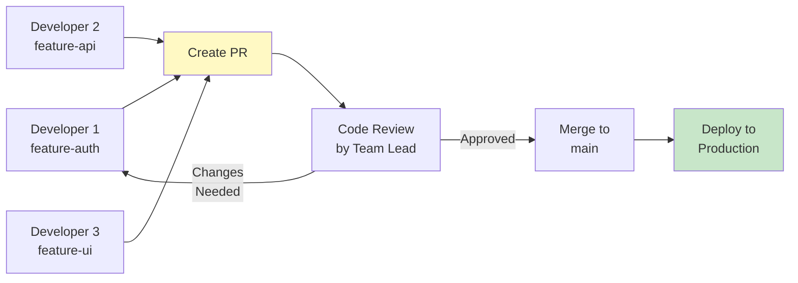

**Best Practice:**
- ✅ **ALWAYS use Pull Requests**
- ✅ Require at least 1 approval before merge
- ✅ Branch protection rules on main
- ✅ Automated tests must pass
- ✅ Prevents conflicts & bad code

---

### Scenario 3: Open Source Contribution (You Don't Have Direct Access)

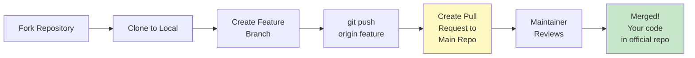

**Best Practice:**
- ✅ **Can't push directly** (no write access)
- ✅ **MUST use Pull Requests**
- ✅ Follow project's contribution guidelines
- ✅ Be ready for feedback from maintainers
- ✅ Maintainer decides when/if to merge

---

### Scenario 4: Feature Branch with Parallel Development

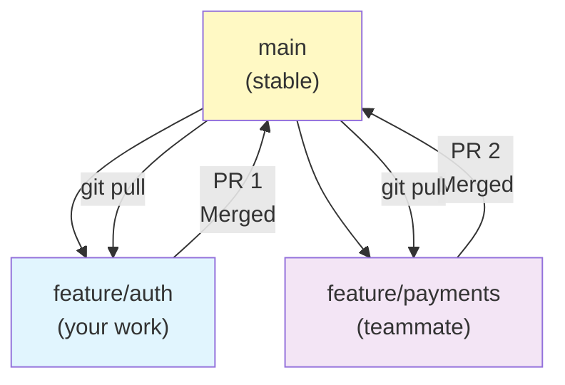

**Best Practice:**
- ✅ Each feature gets its own branch
- ✅ **All changes go through PR**
- ✅ Pull latest main before pushing
- ✅ Helps prevent merge conflicts
- ✅ Keeps work organized & trackable

---

### Decision Guide for Exams/Interviews

| Question | Answer | Remember |
|----------|--------|----------|
| "When should I use push?" | To upload your local commits to remote | Push = Upload |
| "When should I use pull?" | Before starting work or to sync changes | Pull = Download |
| "What's the difference?" | Push uploads, Pull downloads | Opposite operations |
| "Why use PR instead of push?" | Code review, tests, gatekeeper for main | Safety & Quality |
| "Can you push to main?" | Only if you have write access & no protection | Not always allowed |
| "Who decides to merge a PR?" | Maintainer/team lead approves then merges | Not automatic |
| "Is PR a Git command?" | No, it's a GitHub feature | Git ≠ GitHub |
| "What happens after PR merge?" | main branch is updated with your changes | Then git pull to sync |
| "What if PR is rejected?" | Fix issues locally, push again to branch | Keeps same PR updated |
| "Workflow for team?" | Branch → Push → PR → Review → Merge → Pull | Always this order |

---

**Created:** January 6, 2026
**Status:** Learning Reference Guide
