# GitHub Repository: Commits, Branching & GitHub Flow

## Overview
A GitHub repository is the foundation of collaborative development. Understanding commits, branches, and the GitHub Flow workflow is essential for effective version control and team collaboration.

---

## 1. GitHub Repository Fundamentals

### What is a Repository?

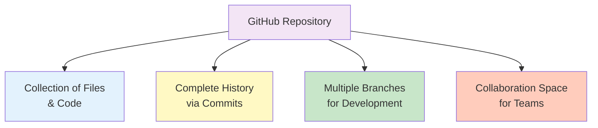

### Repository Structure

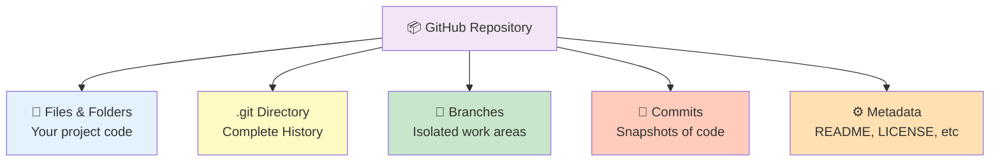

---

## 2. Understanding Commits

### What is a Commit?

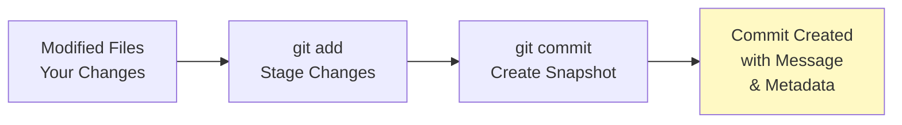

**Definition:** A commit is a snapshot of your code at a specific point in time with a descriptive message.

**Each Commit Contains:**
- ✅ **What changed** - Specific file modifications
- ✅ **When** - Timestamp of creation
- ✅ **Who** - Author information
- ✅ **Why** - Commit message describing changes
- ✅ **Hash ID** - Unique identifier (SHA-1)
- ✅ **Reference** - Points to previous commit(s)

### Commit Anatomy

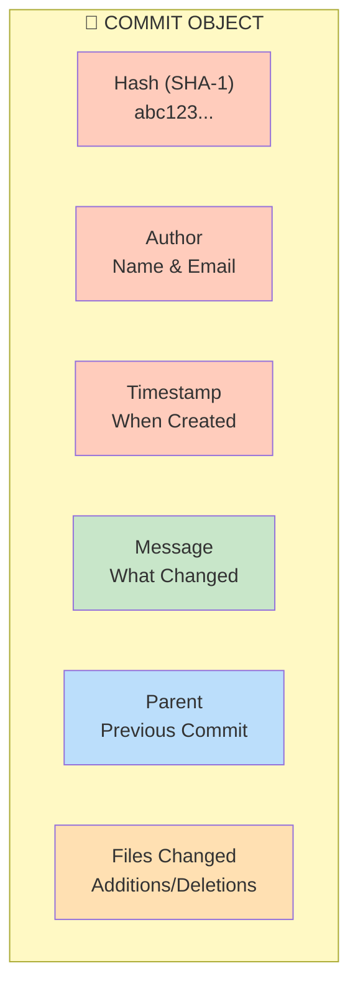

### Commit Timeline & History

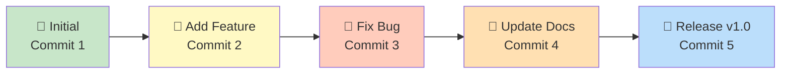

### Commit Types & Best Practices

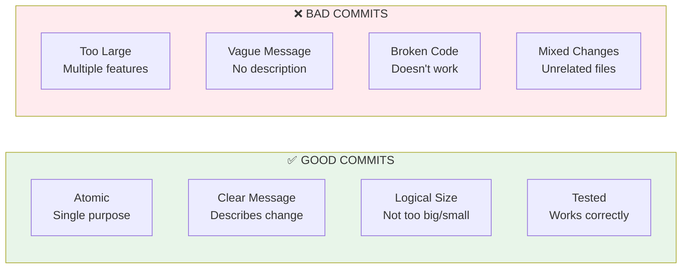

### Commit Message Best Practices

```bash
# ✅ GOOD FORMAT
git commit -m "Add user authentication feature"
git commit -m "Fix login button styling issue"
git commit -m "Update README with setup instructions"

# ❌ BAD FORMAT
git commit -m "update"
git commit -m "fixed stuff"
git commit -m "various changes"

# ✅ DETAILED FORMAT
git commit -m "Add user authentication

- Implement login form
- Add password validation
- Create user session management
- Update security protocol"
```

---

## 3. Understanding Branches

### What is a Branch?

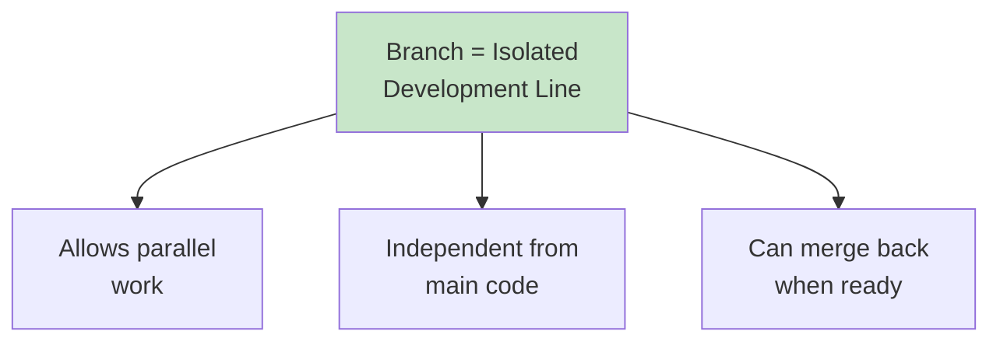

**Definition:** A branch is an independent line of development that diverges from the main codebase.

### Branch Structure Visualization

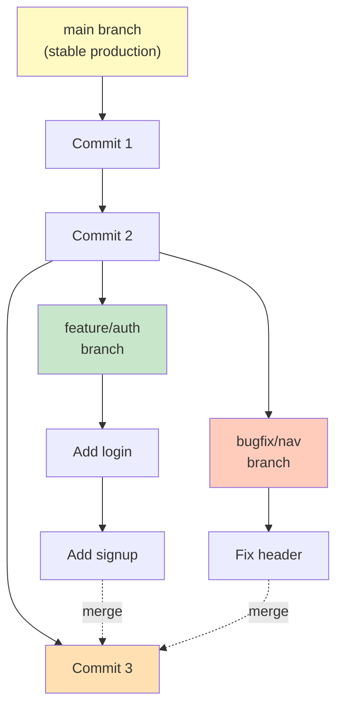

### Common Branch Types

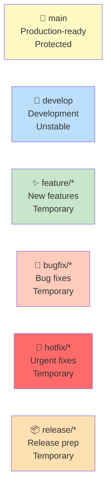

### Branch Operations

```bash
# Create a branch
git branch feature/login              # Create locally
git push origin feature/login         # Push to GitHub

# Switch to branch
git checkout feature/login
git checkout -b feature/login         # Create & switch

# List branches
git branch                            # Local branches
git branch -a                         # All branches
git branch -r                         # Remote branches

# Delete branch
git branch -d feature/login           # After merged
git push origin --delete feature/login # Delete remote
```

---

## 4. GitHub Flow - Complete Workflow

### What is GitHub Flow?

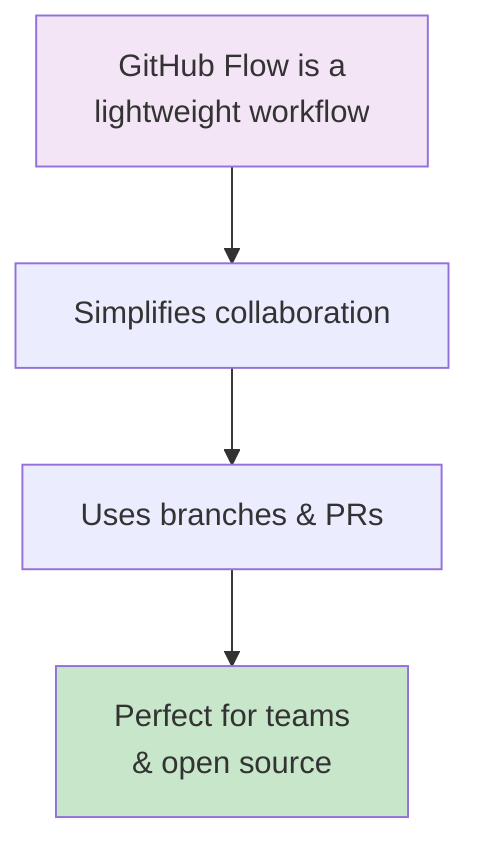

**Definition:** GitHub Flow is a simple, collaborative workflow that uses branches, pull requests, and merging.

### The 6-Step GitHub Flow

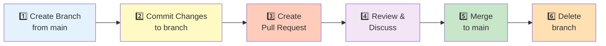

### Detailed GitHub Flow Diagram

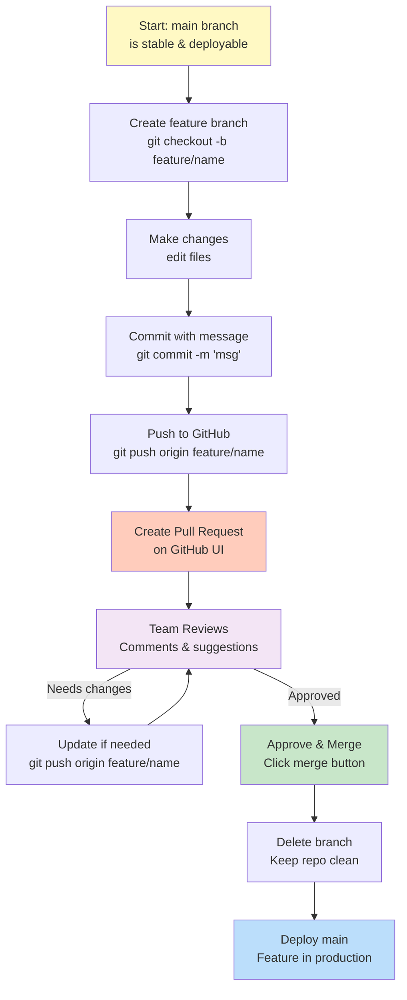

### GitHub Flow vs Other Workflows

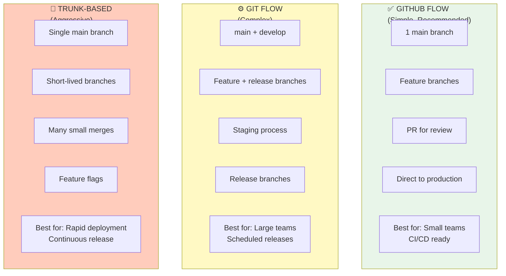

---

## 5. Commit → Branch → Pull Request Flow

### Complete Visual Flow

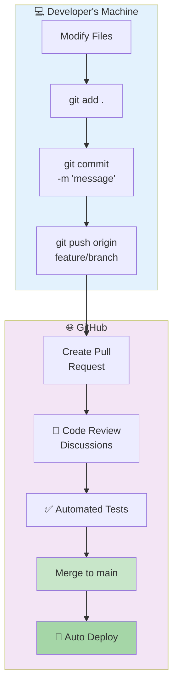

---

## 6. Quick Cheatsheet

### Essential Commit Commands

```bash
# MAKING COMMITS
git status                           # See what changed
git diff                            # See changes in detail
git add <file>                      # Stage specific file
git add .                           # Stage all changes
git commit -m "Clear message"       # Create commit
git commit -am "msg"                # Stage + commit (tracked files)

# VIEWING COMMITS
git log                             # View all commits
git log --oneline                   # Short commit list
git log --graph --all --decorate    # Visual history
git show <commit-hash>              # See commit details
git diff HEAD~1 HEAD                # Compare last 2 commits

# FIXING COMMITS
git commit --amend                  # Fix last commit
git revert <commit-hash>            # Undo commit safely
git reset --soft HEAD~1             # Undo & keep changes
git reset --hard HEAD~1             # Undo & discard changes
```

### Essential Branch Commands

```bash
# CREATING & SWITCHING
git branch                          # List local branches
git branch -a                       # List all branches
git branch feature/name             # Create new branch
git checkout feature/name           # Switch to branch
git checkout -b feature/name        # Create & switch
git switch feature/name             # Switch (newer syntax)

# PUSHING & PULLING
git push origin feature/name        # Push branch to GitHub
git pull origin feature/name        # Get latest remote branch
git fetch origin                    # Get all remote changes

# DELETING
git branch -d feature/name          # Delete local branch
git branch -D feature/name          # Force delete local
git push origin --delete feature/name # Delete remote branch

# MERGING
git merge feature/name              # Merge branch locally
git rebase main                     # Rebase on main
git merge --no-ff feature/name      # Merge with merge commit
```

### GitHub Flow Step-by-Step Commands

```bash
# 1. CREATE BRANCH
git checkout -b feature/login

# 2. MAKE CHANGES & COMMITS
nano login.js                       # Edit file
git add login.js
git commit -m "Add login form validation"
git add tests/login.test.js
git commit -m "Add tests for login"

# 3. PUSH TO GITHUB
git push origin feature/login

# 4. (On GitHub UI) Create Pull Request

# 5. (On GitHub) Review gets approved

# 6. MERGE TO MAIN
# Click "Merge" on GitHub UI
# OR locally:
git checkout main
git pull origin main
git merge feature/login

# 7. DELETE BRANCH
git branch -d feature/login
git push origin --delete feature/login
```

---

## 7. Real-World Scenarios

### Scenario 1: Solo Developer

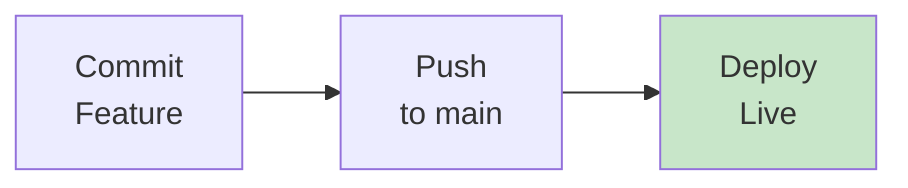

**Workflow:**
```bash
git add .
git commit -m "Add new feature"
git push origin main
# Deployed automatically
```

---

### Scenario 2: Two Developers on Same Feature

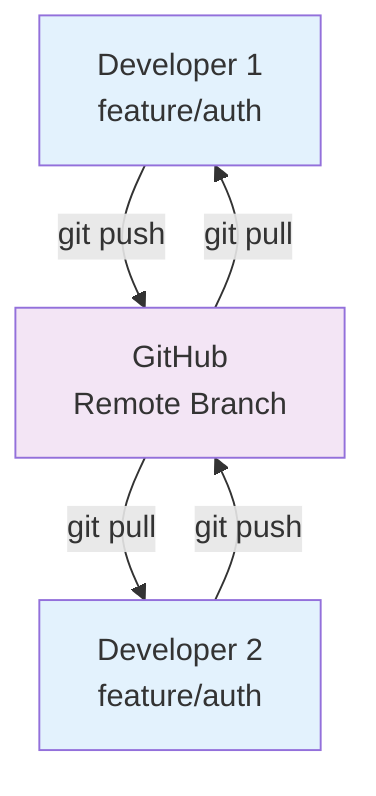

**Workflow:**
```bash
# Developer 1
git checkout -b feature/auth
git add auth.js
git commit -m "Add login"
git push origin feature/auth

# Developer 2
git checkout feature/auth
git pull origin feature/auth    # Get D1's changes
git add auth.test.js
git commit -m "Add tests"
git push origin feature/auth
```

---

### Scenario 3: Multiple Features in Parallel

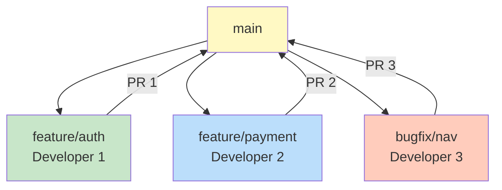

**Workflow:**
- Each dev: creates own branch from main
- Each dev: commits independently
- Each dev: creates separate PR
- Reviews happen in parallel
- Merges happen sequentially (pulling latest main)

---

### Scenario 4: Hotfix in Production

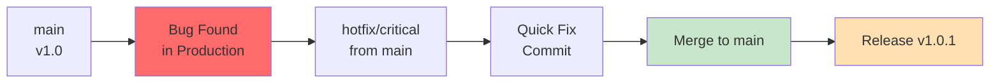

**Workflow:**
```bash
git checkout -b hotfix/critical-bug
# Make quick fix
git add .
git commit -m "Fix critical production bug"
git push origin hotfix/critical-bug
# Create PR, merge immediately to main
# Release patch version
```

---

## 8. Commits & Branches Best Practices

### Commit Best Practices

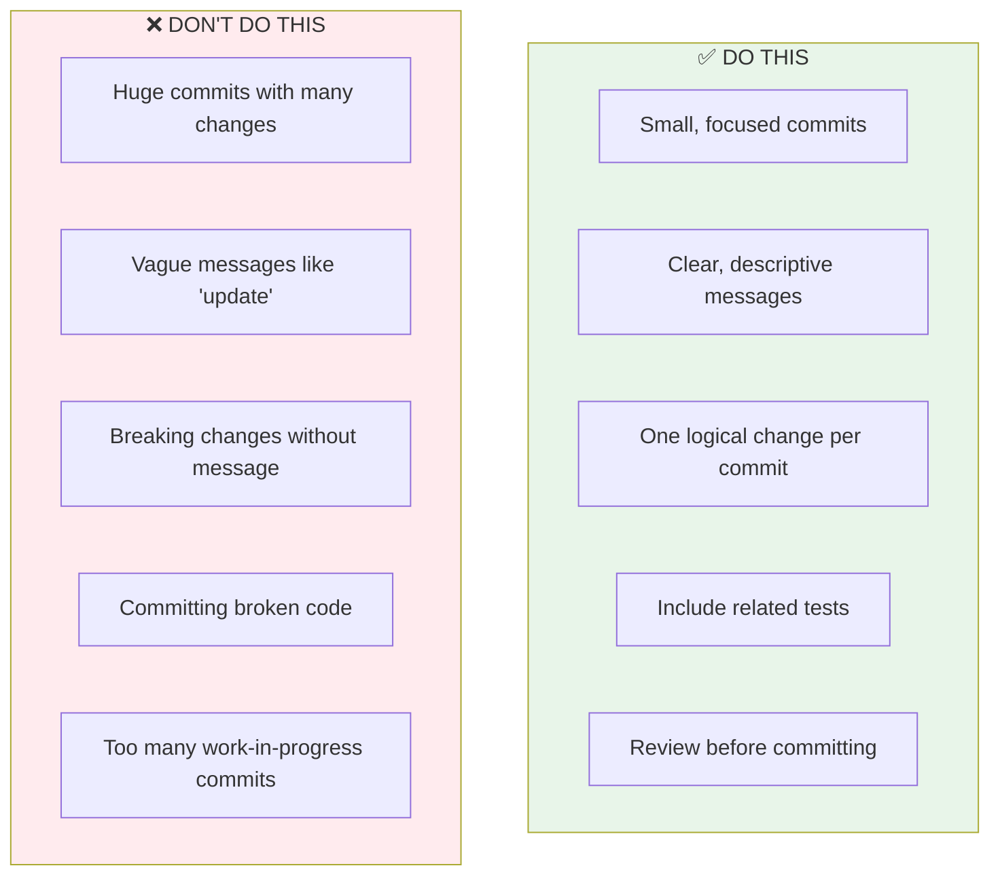

### Branch Naming Conventions

```bash
# Feature branches
feature/user-authentication
feature/payment-integration
feature/dark-mode

# Bug fixes
bugfix/login-redirect
bugfix/memory-leak
fix/typo-in-docs

# Hotfixes
hotfix/security-patch
hotfix/production-down

# Release branches
release/v1.2.0
release/2.0

# Best practices:
# ✅ Lowercase with hyphens
# ✅ Descriptive names
# ✅ Include issue number: feature/auth-#123
# ❌ Don't use: master-fix, final, temp, asdf
```

---

## 9. Commit Message Format

### Conventional Commits

```bash
# Format
<type>(<scope>): <subject>
<blank line>
<body>
<blank line>
<footer>

# Examples
feat(auth): add login functionality
fix(nav): resolve header alignment issue
docs(readme): update installation steps
test(api): add endpoint validation tests
refactor(db): optimize query performance
chore(deps): update dependencies
```

### Types

```
feat     - New feature
fix      - Bug fix
docs     - Documentation changes
style    - Code style (no logic change)
refactor - Code restructuring
test     - Test addition/modification
chore    - Build, dependencies, etc.
perf     - Performance improvements
ci       - CI/CD configuration
```

---

## 10. Common Workflows with Examples

### Workflow 1: Feature Development

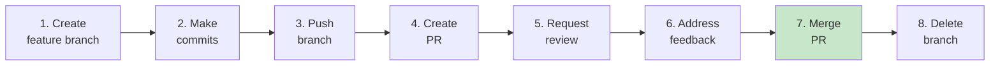

### Workflow 2: Bug Fix

```mermaid
graph LR
    A["Create issue<br/>documenting bug"]
    B["Create bugfix<br/>branch"]
    C["Reproduce<br/>issue"]
    D["Write test<br/>that fails"]
    E["Fix code<br/>test passes"]
    F["Create PR<br/>reference issue"]
    G["Review &<br/>merge"]
    
    A --> B --> C --> D --> E --> F --> G
    
    style G fill:#c8e6c9
```

### Workflow 3: Code Review Process

```mermaid
graph TB
    A["Author creates PR"]
    B["Request reviewers"]
    C["Reviewers examine code"]
    D["Leave comments<br/>& suggestions"]
    E["Author responds<br/>& makes changes"]
    F{"Changes<br/>approved?"}
    F -->|"No"| E
    F -->|"Yes"| G["Merge PR"]
    
    A --> B --> C --> D --> E --> F --> G
```

---

## 11. Interview & Exam Questions

### Understanding Commits

| Q | A | Key Point |
|---|---|-----------|
| **What's a commit?** | Snapshot of code with message & metadata | Tracks change history |
| **What's in a commit?** | Files changed, author, timestamp, message, parent | Unique hash ID |
| **Why good messages?** | Track history, understand changes, debugging | "Why" not "what" |
| **Can you undo commits?** | Yes, revert or reset (depends on situation) | Revert is safer |
| **Should every change be one commit?** | No, logically related only | Don't mix unrelated changes |

### Understanding Branches

| Q | A | Key Point |
|---|---|-----------|
| **What's a branch?** | Independent development line from main | Isolated changes |
| **Why use branches?** | Parallel work, avoid conflicts, code safety | Isolation |
| **When to branch?** | Always for new features/fixes | Never push to main directly |
| **Delete after merge?** | Yes, keeps repo clean | Save storage/clarity |
| **What's main branch?** | Production-ready, protected code | Always stable |

### GitHub Flow Questions

| Q | A | Key Point |
|---|---|-----------|
| **What's GitHub Flow?** | Lightweight workflow: branch → commit → PR → merge | Simple & effective |
| **Why PRs in GitHub Flow?** | Code review, discussion, quality gate | Safety before merge |
| **All code through PR?** | Yes, even solo projects | Best practice |
| **Can hotfix skip PR?** | No, still use PR (just urgent review) | Maintain standards |
| **Merge commit vs rebase?** | Depends on team preference | Affects history appearance |

### Scenario Questions

| Q | A | Key Point |
|---|---|-----------|
| **Commit message best?** | "Add user authentication" vs "update" | Be specific |
| **Branch name best?** | "feature/login" vs "test" | Follow convention |
| **How often commit?** | Logical units, multiple times per feature | Not one huge commit |
| **When PR approval?** | After tests pass & reviewer approves | Both required |
| **Delete branch when?** | After merge to main | Clean up |

---

## 12. Summary: Commit → Branch → PR → Main

```mermaid
graph TB
    A["Start"] 
    B["Create Branch<br/>git checkout -b feature/x"]
    C["Make Changes<br/>Edit files"]
    D["Commit with message<br/>git commit -m 'msg'"]
    E{"More changes<br/>needed?"}
    E -->|Yes| C
    E -->|No| F["Push to GitHub<br/>git push origin feature/x"]
    F --> G["Create Pull Request<br/>on GitHub"]
    G --> H["Code Review<br/>by team"]
    I{"Approved?"}
    I -->|No| J["Address feedback<br/>Make new commits"]
    J --> F
    I -->|Yes| K["Merge to main<br/>Click merge"]
    K --> L["Delete branch"]
    L --> M["Main updated<br/>Ready to deploy"]
    
    A --> B --> C --> D --> E
    H --> I
    
    style M fill:#c8e6c9
    style K fill:#ffccbc
    style G fill:#fff9c4
```

---

## Key Takeaways

1. **Commit** = Snapshot with message & metadata
2. **Branch** = Isolated development line
3. **GitHub Flow** = Simple workflow using branches & PRs
4. **Main Branch** = Always stable, production-ready
5. **Feature Branch** = Where you do actual work
6. **Pull Request** = Quality gate before merging
7. **Atomic Commits** = One logical change per commit
8. **Clear Messages** = Help future maintainers understand
9. **Always Branch** = Never commit directly to main
10. **Delete After Merge** = Keep repository clean

---

## Quick Decision Tree

```mermaid
graph TD
    A{"What do you<br/>need to do?"}
    
    A -->|"Start new work"| B["Create branch<br/>feature/name"]
    
    A -->|"Save changes"| C["Commit with<br/>clear message"]
    
    A -->|"Share with team"| D["Push branch<br/>& Create PR"]
    
    A -->|"Get feedback"| E["Request review<br/>on GitHub"]
    
    A -->|"Merge ready"| F["Merge PR<br/>to main"]
    
    A -->|"Clean up"| G["Delete branch"]
    
    style B fill:#c8e6c9
    style C fill:#fff9c4
    style D fill:#ffccbc
    style E fill:#f3e5f5
    style F fill:#ffe0b2
    style G fill:#bbdefb
```

---

**Created:** January 6, 2026
**Status:** Learning Reference Guide
