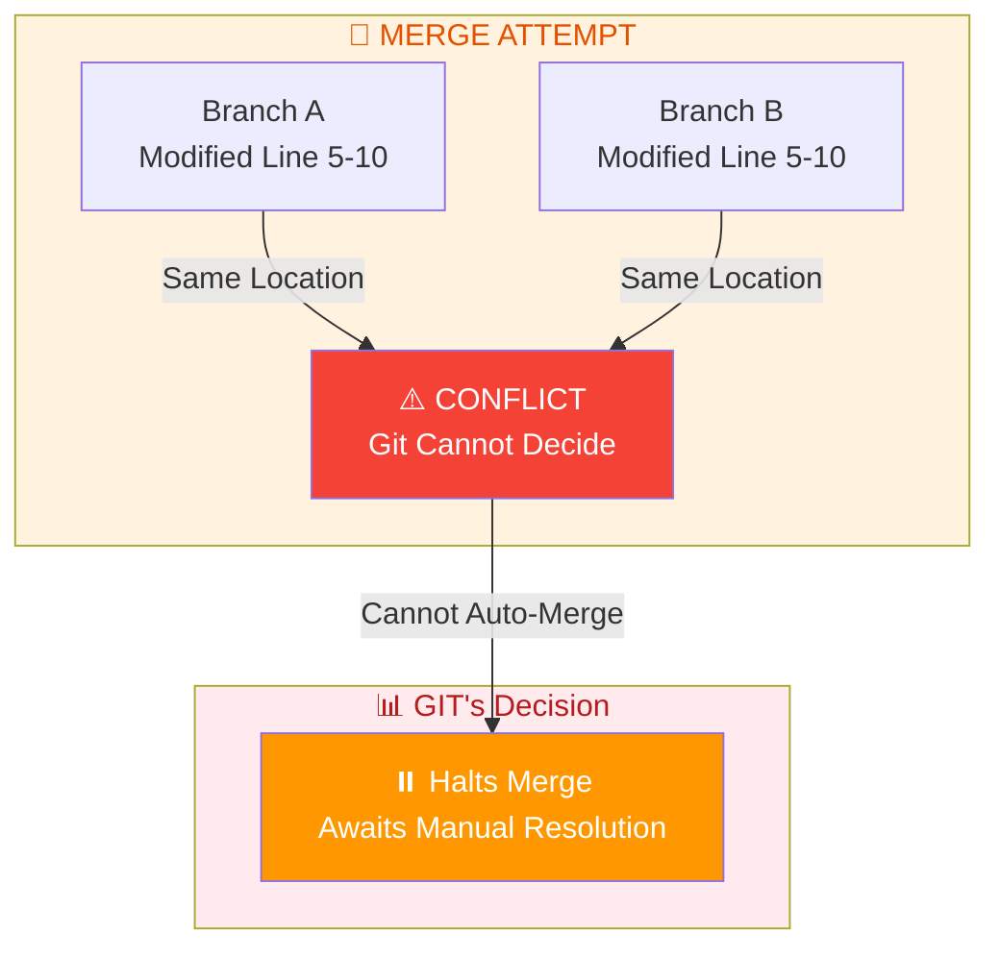
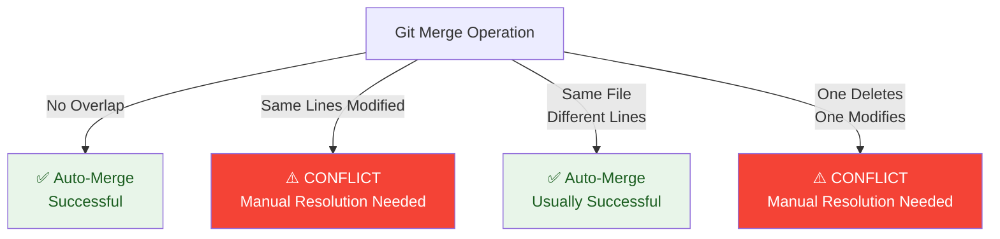
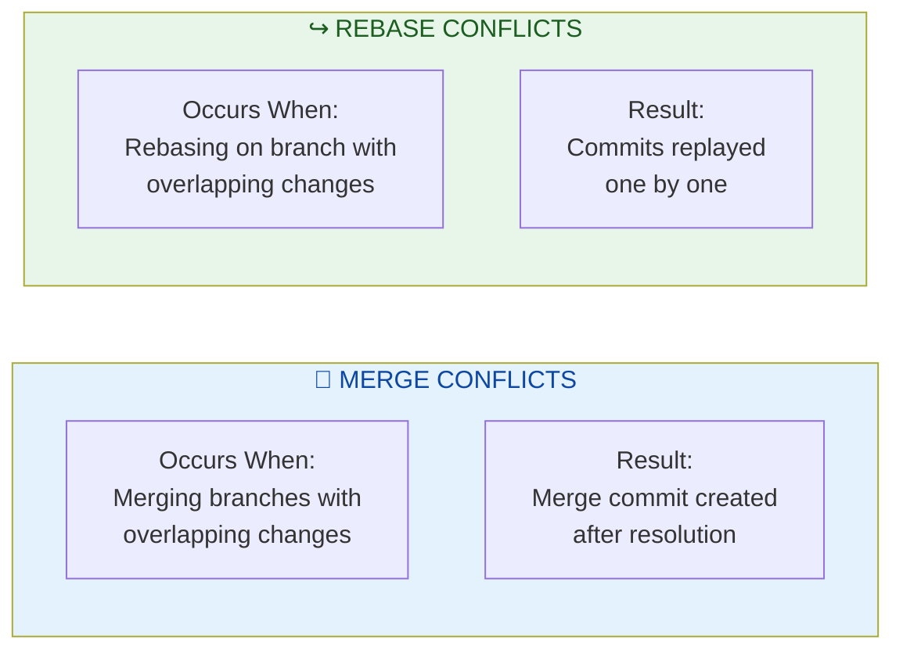
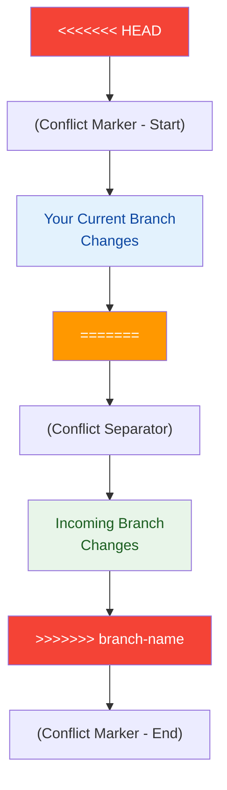
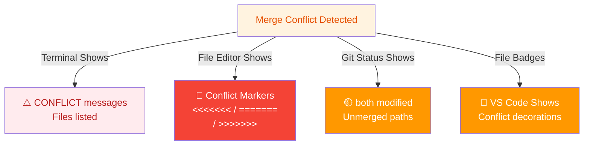
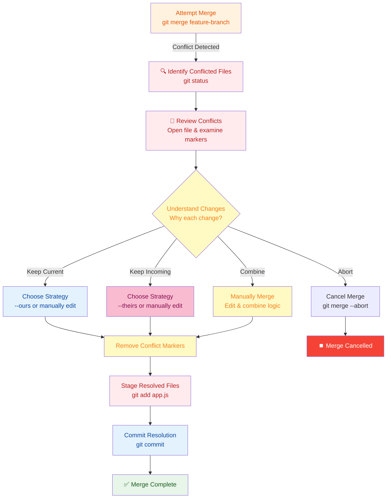
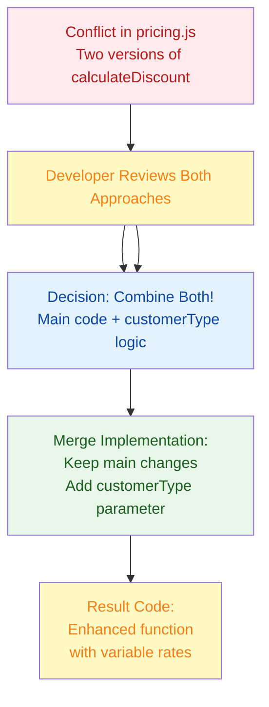
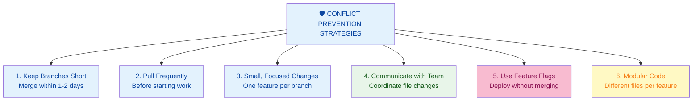
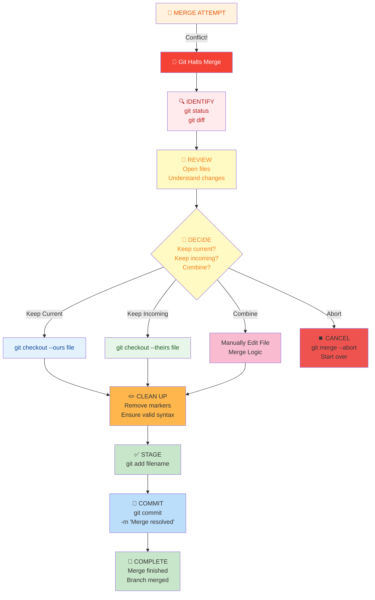

# Merge Conflicts & Resolution: Complete Guide

## Overview

A merge conflict occurs when Git cannot automatically merge changes from two different branches because they modified the same lines in the same file. Understanding how to identify, prevent, and resolve conflicts is essential for collaborative development.

### Why It Matters
- **Collaboration challenge** - Multiple developers working on the same code
- **Data integrity** - Ensuring changes don't overwrite each other unintentionally
- **Workflow efficiency** - Resolving conflicts quickly without losing work
- **Team communication** - Understanding what changed and why

### Main Use Cases
- Multiple developers editing the same file simultaneously
- Long-running feature branches being merged into main
- Cherry-picking commits across branches
- Rebasing branches with overlapping changes
- Pulling updates while having local uncommitted changes

---

## 1. Core Concepts & Fundamentals

### What is a Merge Conflict?



**Definition:** A conflict happens when:
- Two branches modify the **same lines** in the same file
- Git cannot determine which version to keep
- Manual intervention is required to resolve

### When Conflicts Occur



### Conflict Types

| Type | Description | Resolution |
|------|-------------|-----------|
| **Content Conflict** | Both branches modified same lines | Choose/combine changes |
| **Deletion Conflict** | One branch deletes, other modifies | Decide: keep or delete |
| **Rename Conflict** | Both branches rename file differently | Choose new filename |
| **Binary Conflict** | Image/binary file modified by both | Choose one version |

### Merge vs Rebase Conflicts



---

## 2. Anatomy of a Conflict Marker

### Conflict Markers Explained

When a conflict occurs, Git marks the conflicted sections in your file:

```
<<<<<<< HEAD
Your changes from current branch
(Main branch or current branch)
=======
Changes from the branch being merged
(Feature branch or incoming changes)
>>>>>>> feature-branch-name
```

### Real Example

```javascript
// Before merge
function calculateTotal(items) {
    return items.reduce((sum, item) => sum + item.price, 0);
}

// After conflict markers appear:
<<<<<<< HEAD
function calculateTotal(items) {
    // Current branch: Added tax calculation
    const subtotal = items.reduce((sum, item) => sum + item.price, 0);
    return subtotal * 1.08; // 8% tax
}
=======
function calculateTotal(items) {
    // Feature branch: Added discount logic
    const subtotal = items.reduce((sum, item) => sum + item.price, 0);
    return subtotal * 0.9; // 10% discount
}
>>>>>>> add-discount-feature
```

### Conflict Marker Components



---

## 3. How to Detect Merge Conflicts

### Detecting Conflicts During Merge

**When You Try to Merge:**
```bash
git merge feature-branch
```

**Git Output (Conflict Detection):**
```
Auto-merging app.js
CONFLICT (content): Merge conflict in app.js
CONFLICT (content): Merge conflict in config.js
Automatic merge failed; fix conflicts and then commit the result.
```

### Checking Conflict Status

```bash
# See which files have conflicts
git status

# Output:
# On branch main
# You have unmerged paths.
#   (fix conflicts and run "git commit")
#
# Unmerged paths:
#   both modified:   app.js
#   both modified:   config.js
```

### Visual Indicators



---

## 4. Detailed Resolution Strategies

### Strategy 1: Keep Current Branch (HEAD)

**When to use:** Your changes are correct, discard incoming changes

```bash
# Option 1: Manually resolve (remove conflict markers, keep HEAD section)
# Edit file: delete incoming changes, keep only HEAD section

# Option 2: Use git command
git checkout --ours app.js
git add app.js

# Complete the merge
git commit -m "Merge resolved: keeping our changes"
```

**In File:**
```javascript
// BEFORE (with conflict markers)
<<<<<<< HEAD
function calculateTotal(items) {
    const subtotal = items.reduce((sum, item) => sum + item.price, 0);
    return subtotal * 1.08; // 8% tax
}
=======
function calculateTotal(items) {
    const subtotal = items.reduce((sum, item) => sum + item.price, 0);
    return subtotal * 0.9; // 10% discount
}
>>>>>>> add-discount-feature

// AFTER (keep ours/HEAD)
function calculateTotal(items) {
    const subtotal = items.reduce((sum, item) => sum + item.price, 0);
    return subtotal * 1.08; // 8% tax
}
```

### Strategy 2: Keep Incoming Branch

**When to use:** Incoming changes are better, discard current branch changes

```bash
# Option 1: Manually resolve (remove conflict markers, keep incoming section)
# Edit file: delete HEAD section, keep incoming section

# Option 2: Use git command
git checkout --theirs app.js
git add app.js

# Complete the merge
git commit -m "Merge resolved: accepting their changes"
```

### Strategy 3: Combine Both Changes

**When to use:** Both changes are valid and should coexist

```javascript
// BEFORE (with conflict)
<<<<<<< HEAD
function calculateTotal(items) {
    const subtotal = items.reduce((sum, item) => sum + item.price, 0);
    return subtotal * 1.08; // 8% tax
}
=======
function calculateTotal(items) {
    const subtotal = items.reduce((sum, item) => sum + item.price, 0);
    return subtotal * 0.9; // 10% discount
}
>>>>>>> add-discount-feature

// AFTER (combined logic)
function calculateTotal(items, applyDiscount = false, taxRate = 0.08) {
    let subtotal = items.reduce((sum, item) => sum + item.price, 0);
    
    // Apply discount if requested
    if (applyDiscount) {
        subtotal *= 0.9; // 10% discount
    }
    
    // Apply tax
    subtotal *= (1 + taxRate);
    
    return subtotal;
}
```

**Then commit:**
```bash
git add app.js
git commit -m "Merge: combined tax and discount calculations"
```

### Strategy 4: Abort Merge

**When to use:** Not ready to resolve now, want to start over

```bash
# Cancel the merge process entirely
git merge --abort

# Back to state before merge attempt
git status
# On branch main
# nothing to commit, working tree clean
```

---

## 5. Step-by-Step Resolution Process

### Complete Merge Conflict Resolution Workflow



---

## 6. Quick Cheatsheet

### Common Conflict Scenarios

| Scenario | Command | Purpose |
|----------|---------|---------|
| **View Conflict Status** | `git status` | See which files have conflicts |
| **View All Conflicts** | `git diff --name-only --diff-filter=U` | List only unmerged files |
| **Keep Your Changes** | `git checkout --ours file.js` | Accept current branch version |
| **Keep Their Changes** | `git checkout --theirs file.js` | Accept incoming branch version |
| **Manually Edit** | Edit file, remove markers | Combine or choose manually |
| **Stage Resolution** | `git add file.js` | Mark conflict as resolved |
| **Commit Merge** | `git commit -m "msg"` | Complete the merge |
| **Abort Merge** | `git merge --abort` | Undo merge, start over |
| **Undo Merge Commit** | `git reset --hard HEAD~1` | Undo completed merge |

### Resolution Decision Tree

```
Start: Merge Conflict Detected
│
├─► Is the conflict important? 
│   ├─► NO → Abort (git merge --abort)
│   └─► YES → Continue
│
├─► Should we keep our changes?
│   ├─► YES → git checkout --ours file.js
│   └─► NO → Continue
│
├─► Should we keep their changes?
│   ├─► YES → git checkout --theirs file.js
│   └─► NO → Combine
│
├─► Manually edit to combine logic
│   └─► git add file.js
│
└─► Complete merge → git commit -m "Merge resolved"
```

### Essential Commands

```bash
# Start a merge
git merge branch-name

# When conflicts occur - check status
git status

# See detailed differences
git diff

# View conflict in specific file
cat file-with-conflict.js

# Keep your version (current branch)
git checkout --ours filename

# Keep incoming version
git checkout --theirs filename

# After manually resolving, mark as resolved
git add filename

# Complete the merge
git commit -m "Merge: resolved conflicts in filename"

# Or abort if needed
git merge --abort

# If merge is already committed and you want to undo
git revert -m 1 <merge-commit-hash>
```

---

## 7. Real-World Scenarios

### Scenario 1: Feature Branch Merge Conflict

**Situation:** Two developers working on the same function

**Setup:**
```
main branch: calculateDiscount() - uses fixed 10% rate
feature/advanced-pricing: calculateDiscount() - uses variable rates

Both modified lines 15-25 of pricing.js
```

**The Conflict:**
```javascript
<<<<<<< HEAD (main)
function calculateDiscount(total) {
    return total * 0.9; // Fixed 10% discount
}
=======  (feature/advanced-pricing)
function calculateDiscount(total, customerType) {
    const rates = {
        gold: 0.2,
        silver: 0.15,
        bronze: 0.1
    };
    return total * (1 - rates[customerType] || 0.1);
}
>>>>>>> feature/advanced-pricing
```

**Resolution Process:**


**Resolved Code:**
```javascript
function calculateDiscount(total, customerType = 'bronze') {
    const rates = {
        gold: 0.2,
        silver: 0.15,
        bronze: 0.1
    };
    return total * (1 - rates[customerType] || 0.1);
}
```

**Commands:**
```bash
# Developer attempts merge
git merge feature/advanced-pricing

# Conflict detected
# → Opens pricing.js to resolve manually
# → Combines both function signatures and logic
# → Removes conflict markers

# Stage and commit
git add pricing.js
git commit -m "Merge feature/advanced-pricing: Enhanced discount logic with customer types"
```

---

### Scenario 2: Configuration File Conflict

**Situation:** Different teams modify config.json

**Setup:**
```
Team A (main): Updated database host
Team B (feature/monitoring): Updated logging level
Same config file, different sections overlapped
```

**The Conflict:**
```json
{
  "database": {
<<<<<<< HEAD
    "host": "prod-db-new.aws.com",
    "port": 5432,
    "poolSize": 20
=======
    "host": "prod-db.aws.com",
    "port": 5432,
    "poolSize": 10
>>>>>>> feature/monitoring
  },
  "logging": {
    "level": "info"
  }
}
```

**Resolution - Combine Both:**
```json
{
  "database": {
    "host": "prod-db-new.aws.com",
    "port": 5432,
    "poolSize": 20
  },
  "logging": {
    "level": "info"
  }
}
```

**Commands:**
```bash
git merge feature/monitoring
# Conflict in config.json

# Manually edit to keep new host but consider pool size
git add config.json
git commit -m "Merge feature/monitoring: Updated host and logging config"
```

---

### Scenario 3: Rebase Conflict

**Situation:** Rebasing feature branch onto updated main

**Setup:**
```
Main: Updated utils.js line 30-35
Feature branch: Also modified utils.js line 30-35
Attempting: git rebase main
```

**The Conflict:**
```
CONFLICT (content): Merge conflict in utils.js
error: could not apply abc1234... Add new validation logic
hint: Resolve all conflicts manually, mark them as resolved with
hint: "git add/rm <conflicted_files>", then run "git rebase --continue".
```

**Resolution Process:**
```bash
# Conflict occurs during rebase
# Manually edit utils.js, resolve conflicts

# After editing:
git add utils.js

# Continue rebasing (not commit!)
git rebase --continue

# If need to stop
git rebase --abort
```

---

### Scenario 4: Deletion vs Modification Conflict

**Situation:** One branch deletes file, other modifies it

**Setup:**
```
Main: Deleted old-auth.js (file no longer needed)
Feature: Modified old-auth.js (added new feature)
Result: Deletion/Modification Conflict
```

**Git's Message:**
```
CONFLICT (delete/modify): old-auth.js deleted in HEAD and modified in feature/new-auth.
```

**Resolution Options:**

**Option A: Keep the deletion (remove the file)**
```bash
git rm old-auth.js
git add old-auth.js
git commit -m "Merge: confirmed deletion of old-auth.js"
```

**Option B: Keep the file**
```bash
git add old-auth.js
git commit -m "Merge: kept old-auth.js with new modifications"
```

---

## 8. Best Practices & Prevention

### Preventing Conflicts (80% Solution)



### Before Merging

```bash
# Update your branch with latest main
git fetch origin
git rebase origin/main

# OR merge main into your branch (alternative)
git merge origin/main

# This catches conflicts early, before creating PR
```

### Git Workflow Best Practices

| Practice | Benefit |
|----------|---------|
| **Small PRs** | Easier review, fewer conflicts |
| **Frequent syncing** | Reduces drift between branches |
| **Clear commit messages** | Easier to understand when conflicts occur |
| **One feature per branch** | Minimizes scope of changes |
| **Code review before merge** | Catch issues early |
| **PR checks/CI** | Ensure merged code works |
| **Merge strategy choice** | Use squash for clean history |

### Red Flags (Conflict Indicators)

```
⚠️ Many files modified
⚠️ Hundreds of lines changed
⚠️ Branch exists for > 1 week without syncing
⚠️ Multiple developers on same file
⚠️ Same area of code edited by different PRs
⚠️ Release/main branch not synced across team
```

### Handling Complex Conflicts

```bash
# For complex merges, use a visual merge tool
# Configure your merge tool
git config merge.tool vimdiff
git config merge.tool vscode

# When conflict occurs, open visual tool
git mergetool

# Or use VS Code's built-in conflict resolution UI
# (Provides Accept Current, Accept Incoming, Accept Both buttons)
```

---

## 9. Summary & Key Takeaways

### What You Should Know

✅ **Conflicts = Normal** - Happen in collaborative development, not a failure  
✅ **Conflict Markers** - Understand `<<<<< | ===== | >>>>>` notation  
✅ **Three Strategies** - Keep yours, keep theirs, or combine  
✅ **Git Commands** - `checkout --ours/--theirs`, `add`, `commit`  
✅ **Prevention > Resolution** - Short branches prevent most conflicts  
✅ **Rebase vs Merge** - Both can cause conflicts, different resolution flow  
✅ **Testing Required** - After merge, test that code still works  

### When to Use Each Resolution

| Choose Approach | When |
|---|---|
| **--ours** | Your changes are correct, incoming is outdated |
| **--theirs** | Incoming changes are better/newer |
| **Combine** | Both changes are valid and complementary |
| **Abort** | Merge was mistake, try different approach |

---

## 10. Interview & Exam Prep

### Common Interview Questions

**Q1: Explain what a merge conflict is**
> A merge conflict occurs when Git cannot automatically merge two branches because they modified the same lines in the same file. Git marks the conflicting sections with conflict markers (`<<<<<<<`, `=======`, `>>>>>>>`), and a developer must manually resolve which changes to keep.

**Q2: How do you resolve a merge conflict?**
> 1. Run `git status` to see conflicted files
> 2. Open each file and locate conflict markers
> 3. Choose to keep current changes (`--ours`), incoming changes (`--theirs`), or combine both
> 4. Remove conflict markers and finalize the code
> 5. Run `git add filename` to mark as resolved
> 6. Run `git commit` to complete the merge

**Q3: What's the difference between `git checkout --ours` and `git checkout --theirs`?**
> `--ours` keeps the changes from the current branch (HEAD), while `--theirs` keeps changes from the branch being merged. The terminology is reversed during rebase: `--ours` is the branch being rebased onto, `--theirs` is the rebasing branch.

**Q4: How can you prevent merge conflicts?**
> Keep branches short-lived (1-2 days), sync frequently with main, use small focused commits, communicate with teammates about file changes, and consider using feature flags instead of long branches.

**Q5: Can you merge after aborting a merge?**
> Yes, `git merge --abort` cancels the merge and returns to the state before the merge attempt. You can then try merging again, potentially with a different strategy.

**Q6: What do you do if a merge is already committed and you want to undo it?**
> Use `git revert -m 1 <commit-hash>` to create a new commit that undoes the merge. The `-m 1` flag indicates you want to keep the first parent (main branch).

### Practice Scenarios

**Scenario A:** You attempt a merge, get 3 conflicted files. First file you should fix?
- Answer: Identify which files are dependencies - fix those first to understand context

**Scenario B:** Teammate says "I'll handle the conflicts" but doesn't. What do you do?
- Answer: Communicate to sync on changes, understand both perspectives, resolve collaboratively

**Scenario C:** How do you decide between squash merge vs regular merge?
- Answer: Regular merge preserves history; squash creates cleaner history but loses commit details - choose based on team standards

---

## 11. Troubleshooting Common Issues

### Issue: Can't Remember Which Branch Is Which

**Problem:** During conflict resolution, unsure what `HEAD` represents vs incoming branch

**Solution:**
```bash
# Before starting merge, know what you're doing
git status  # Shows current branch (HEAD)

# During merge, check branch names in conflict markers
# <<<<<<< HEAD - This is your current branch
# >>>>>>> feature-branch - This is incoming branch
```

### Issue: Accidentally Resolved Conflict Wrong

**Solution:**
```bash
# If you haven't committed yet
git reset HEAD filename  # Unstage
git checkout filename   # Revert file to conflict state

# OR if already committed, use reflog
git reflog
git reset --hard <commit-before-merge>
```

### Issue: Merge Tool Not Working

**Solution:**
```bash
# Try VS Code's built-in resolver (no config needed)
# Open file → See conflict resolution UI

# Or configure git to use system merge tool
git config --global merge.tool meld
git config --global mergetool.prompt false
```

---

## 12. Visual Summary

### Complete Conflict Resolution Flow



---

**Last Updated:** January 6, 2026  
**Difficulty Level:** Beginner to Intermediate  
**Prerequisites:** Understanding of Git basics, branches, and commits
