# Open Source Community: Contributing & Integration Guide

## Overview

Open source communities are collaborative ecosystems where developers build, maintain, and improve software together. Contributing to open source offers learning opportunities, career growth, and community impact. Understanding how to work with open source projects—both as a contributor and maintainer—is essential for modern developers.

### Why It Matters
- **Learn from experts** - Read and understand production code
- **Career growth** - Build portfolio, gain experience, networking
- **Give back** - Contribute to tools you use
- **Community impact** - Help thousands of developers
- **Collaboration skills** - Work with distributed teams
- **Problem-solving** - Real-world technical challenges
- **Networking** - Connect with developers worldwide
- **Improve tools** - Fix bugs, add features in software you use

### Main Use Cases
- Contributing to projects you use (bug fixes, features)
- Starting your own open source project
- Building community around projects
- Learning from established codebases
- Earning recognition in developer community
- Collaborating globally with strangers
- Improving software quality
- Creating open source libraries for others

---

## 1. Core Concepts & Fundamentals

### Open Source Ecosystem

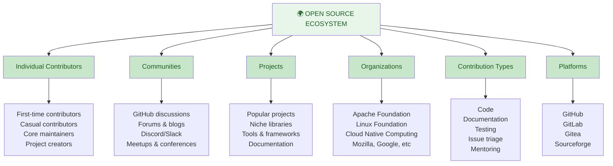

### Types of Open Source Licenses

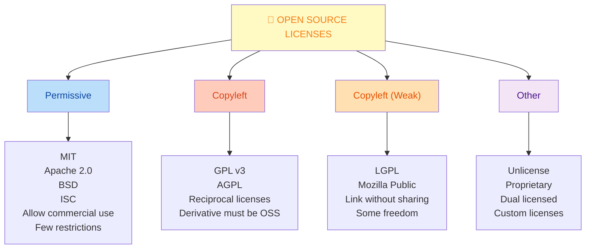

### Contributing Journey

```mermaid
graph LR
    A["👤 CONTRIBUTOR JOURNEY"]
    
    A --> B["User"]
    B --> |"Use tool"| C["Encounter issue"]
    C --> |"Report bug"| D["First PR"]
    D --> |"More contributions"| E["Regular contributor"]
    E --> |"Deep involvement"| F["Maintainer"]
    F --> |"Lead project"| G["Project creator"]
    
    style A fill:#fff9c4,color:#f57f17
    style B fill:#e3f2fd,color:#0d47a1
    style C fill:#ffe0b2,color:#e65100
    style D fill:#fff3e0,color:#e65100
    style E fill:#e8f5e9,color:#1b5e20
    style F fill:#c8e6c9,color:#1b5e20
    style G fill:#81c784,color:#1b5e20
```

---

## 2. Getting Started with Open Source

### Choosing Your First Project

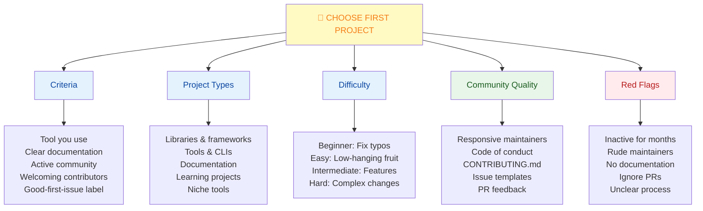

### First Contribution Checklist

```yaml
Before You Contribute:

□ Exploration
  □ Read project README
  □ Review CONTRIBUTING.md
  □ Check LICENSE
  □ Understand project goals
  □ Read code of conduct

□ Setup
  □ Fork repository
  □ Clone to local machine
  □ Install dependencies
  □ Run tests locally
  □ Build documentation

□ Understanding
  □ Read architecture docs
  □ Understand file structure
  □ Know testing approach
  □ Know code style
  □ Find good-first-issue

□ Communication
  □ Comment on issue
  □ Introduce yourself
  □ Ask for guidance
  □ Check if someone's working on it
  □ Get feedback early

□ Development
  □ Create feature branch
  □ Make focused changes
  □ Write/update tests
  □ Follow code style
  □ Keep commits clean

□ Submission
  □ Push to fork
  □ Create descriptive PR
  □ Reference issue
  □ Fill PR template
  □ Be patient for feedback
```

---

## 3. Contributing to Open Source Projects

### Contribution Process

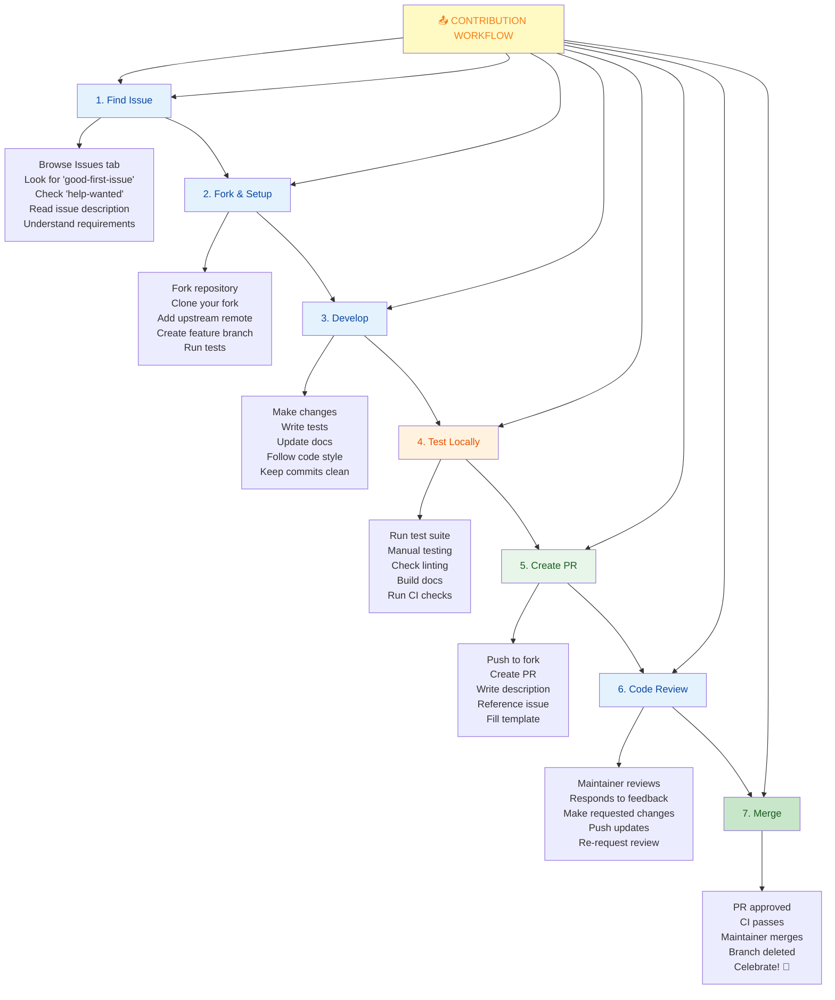

### Working with Upstream

```bash
# Setup after fork
git clone https://github.com/YOUR-USERNAME/project.git
cd project

# Add upstream remote
git remote add upstream https://github.com/ORIGINAL-OWNER/project.git

# Fetch latest from upstream
git fetch upstream

# Create feature branch from main
git checkout -b fix/issue-123 upstream/main

# After upstream changes, sync
git fetch upstream
git rebase upstream/main

# Before PR, squash commits if needed
git rebase -i upstream/main

# Push to your fork
git push origin fix/issue-123

# Then create PR from GitHub web interface
```

### Pull Request Best Practices

```yaml
Great PR Checklist:

Title:
  ✓ Clear and concise
  ✓ Starts with action verb (Fix, Add, Improve)
  ✓ References issue (Fix #123)
  ✓ Example: "Fix: Handle null pointer in UserService"

Description:
  ✓ Explain problem being solved
  ✓ Describe solution approach
  ✓ List changes made
  ✓ Include testing done
  ✓ Note any breaking changes

Code Quality:
  ✓ Follows project code style
  ✓ No console.logs or debug code
  ✓ Meaningful variable names
  ✓ Comments where unclear
  ✓ No unnecessary changes

Testing:
  ✓ Added tests for new code
  ✓ All tests pass locally
  ✓ Updated existing tests if needed
  ✓ Test edge cases
  ✓ Coverage maintained

Documentation:
  ✓ Updated README if relevant
  ✓ Added code comments
  ✓ Updated changelog
  ✓ Examples if applicable
  ✓ API docs if public

Commits:
  ✓ Logical, focused commits
  ✓ Clear commit messages
  ✓ No "WIP" commits
  ✓ No merge commits
  ✓ Reasonable number (not 50)

Response to Feedback:
  ✓ Address all comments
  ✓ Ask for clarification
  ✓ Make requested changes
  ✓ Re-request review
  ✓ Stay professional
```

---

## 4. Types of Contributions

### Beyond Code

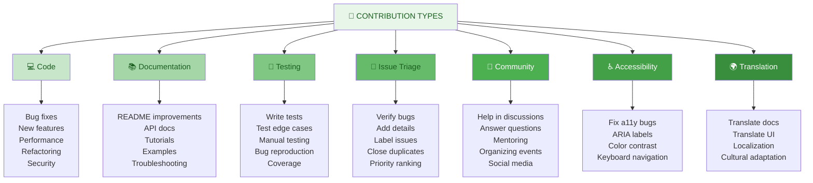

### Documentation Contributions

```yaml
Documentation is highly valuable:

Types:
  • README improvements
    - Better getting started
    - Clear examples
    - Project overview
    
  • API documentation
    - Missing docs
    - Clarify confusing sections
    - Add examples
    
  • Tutorials & guides
    - Common use cases
    - Best practices
    - How-to articles
    
  • Examples & demos
    - Runnable code samples
    - Real-world scenarios
    - Integration examples
    
  • Troubleshooting
    - Common errors
    - Solutions
    - FAQ section

Benefits:
  • Lower barrier than code
  • High impact for users
  • Often overlooked
  • Learn about project deeply
  • Helps maintainers
```

---

## 5. Open Source Best Practices

### For Contributors

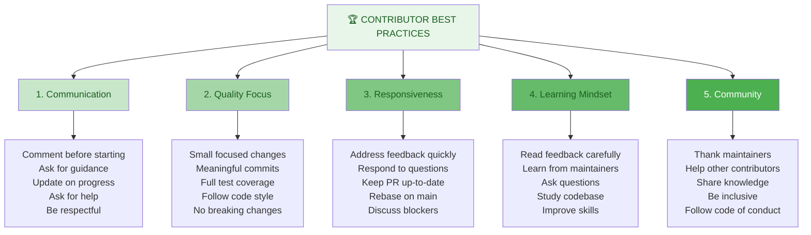

### For Maintainers

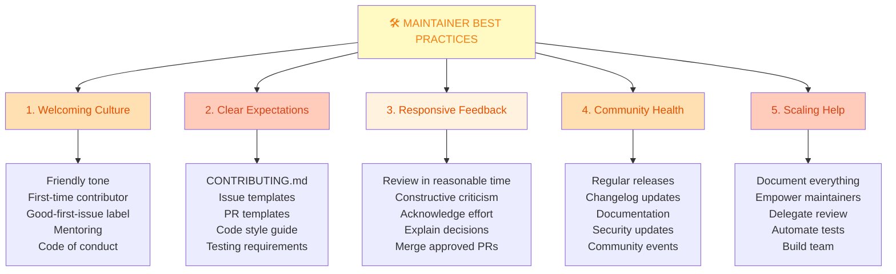

---

## 6. Building Your Own Open Source Project

### Starting a Project

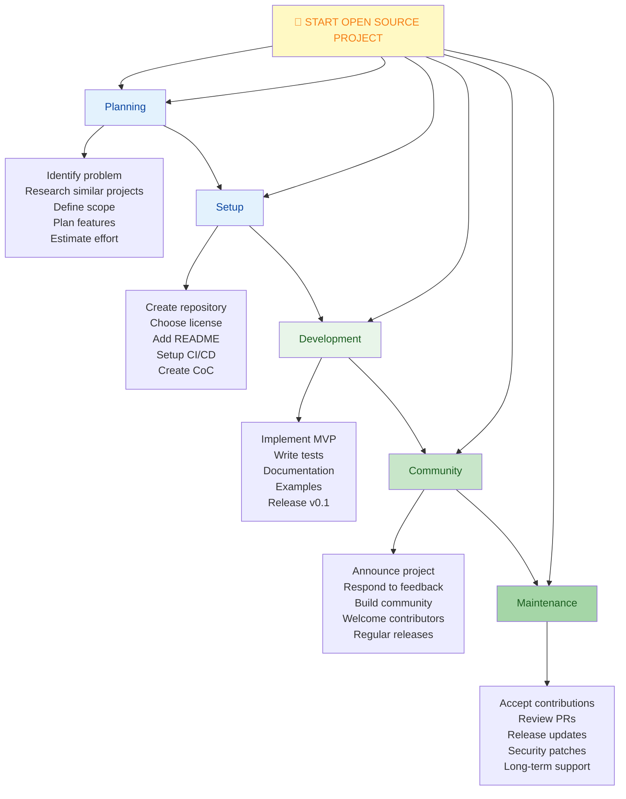

### Essential Files

```yaml
Critical Project Files:

LICENSE:
  Purpose: Define terms of use
  Choose: MIT, Apache 2.0, GPL (most common)
  Position: Root directory
  Size: 5-50 lines (usually)

README.md:
  Sections:
    - Project title & tagline
    - What it does (1-2 sentences)
    - Why use it
    - Features (bullet list)
    - Installation (copy-paste working)
    - Quick start (working example)
    - Documentation link
    - Contributing info
    - License

CONTRIBUTING.md:
  Content:
    - How to contribute
    - Development setup
    - Running tests
    - Code style guide
    - Commit conventions
    - PR process
    - Communication channels
    - Code of conduct reference

.github/ISSUE_TEMPLATE/:
  Files:
    - bug_report.md
    - feature_request.md
    - question.md
    - custom templates

.github/PULL_REQUEST_TEMPLATE.md:
  Includes:
    - What this PR does
    - Related issue
    - Testing checklist
    - Breaking changes
    - Screenshot (if UI)

CODE_OF_CONDUCT.md:
  Defines:
    - Expected behavior
    - Unacceptable behavior
    - Reporting process
    - Enforcement
    - Reference (Contributor Covenant)

CHANGELOG.md:
  Records:
    - Version releases
    - New features
    - Bug fixes
    - Breaking changes
    - Contributors

SECURITY.md:
  Covers:
    - Reporting vulnerabilities
    - Security policy
    - Disclosure timeline
    - Supported versions
```

---

## 7. Community Engagement

### Finding & Joining Communities

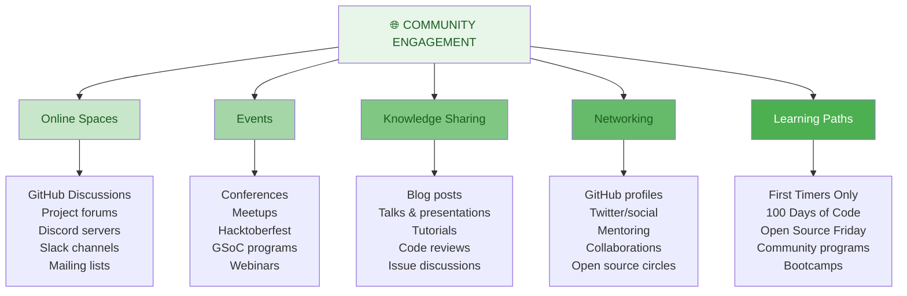

### Hacktoberfest & Programs

```yaml
Popular Open Source Programs:

Hacktoberfest (October):
  • Hosted by DigitalOcean
  • Make 4 PRs in October
  • Earn limited edition t-shirt
  • Supports all open source
  • Great for beginners

Google Summer of Code (GSoC):
  • Students paid to contribute
  • 3-month projects
  • Mentorship
  • Various organizations
  • Stipend provided

Google Season of Docs:
  • Documentation focused
  • Technical writers & developers
  • 3-month program
  • Improve OSS documentation

Linux Foundation Programs:
  • CommunityBridge
  • Fellowship programs
  • Internships
  • Events & training

First Timers Only:
  • Website: firsttimersonly.com
  • Beginner-friendly issues
  • Mentoring provided
  • All experience levels

100 Days of Code:
  • Personal challenge
  • Commit 1 hour daily
  • Share progress
  • Build habits
```

---

## 8. Benefits of Open Source Contribution

### Career & Learning Benefits

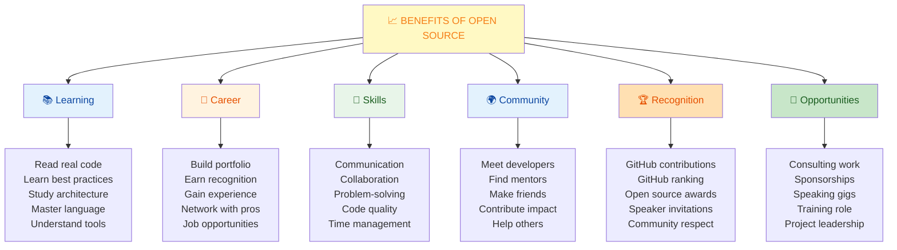

### Business & Practical Benefits

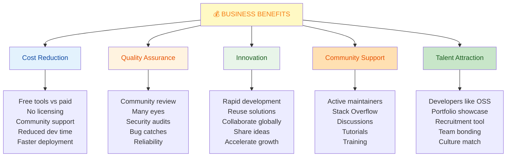

---

## 9. Quick Cheatsheet

### GitHub CLI for Open Source

```bash
# Fork and clone in one step
gh repo fork OWNER/repo --clone

# List issues
gh issue list --label "good-first-issue"

# Create branch from issue
gh issue develop ISSUE_NUMBER

# Create PR
gh pr create --title "Fix: Issue title" \
             --body "Fixes #ISSUE_NUMBER"

# Check PR status
gh pr status

# Review PRs
gh pr review PR_NUMBER --approve

# Add to project
gh issue edit ISSUE_NUMBER --add-project "Project Name"

# Watch for notifications
gh notification list

# Export contribution stats
gh api repos/OWNER/REPO/stats/contributors
```

### Contribution Tracking

```bash
# View your contribution graph
https://github.com/YOUR-USERNAME/

# See your contribution stats
https://github.com/YOUR-USERNAME?tab=contributions

# Use contribution tracking tools
Website: contributions.rocks
  Shows: Total contributions, commit stats

Website: profile-readme-stats.vercel.app
  Shows: Language statistics, top repos

# Add to profile README
```

### Writing Good Issue Reports

```markdown
# Bug Report Template

## Description
One sentence describing the bug

## Steps to Reproduce
1. First step
2. Second step
3. Reproduces bug

## Expected Behavior
What should happen

## Actual Behavior
What actually happens

## Environment
- OS: [Windows/Mac/Linux]
- Version: [version number]
- Browser: [if applicable]

## Logs
```
Paste error logs/stack trace
```

## Screenshots
[If applicable]

---

# Feature Request Template

## Problem
The problem this solves

## Proposed Solution
How to solve it

## Alternatives Considered
Other approaches

## Additional Context
Any other context
```

---

## 10. Interview & Exam Prep

### Common Interview Questions

**Q1: Why should developers contribute to open source?**
> Open source contributions provide learning opportunities from production code, help build a portfolio and gain recognition, develop collaboration skills, and contribute positively to the community. Many companies value open source experience in hiring decisions.

**Q2: What's the difference between a maintainer and a contributor?**
> Contributors submit code, documentation, or other work to projects they don't maintain. Maintainers manage the project—reviewing PRs, making decisions, managing releases, and overseeing community. Maintainers have administrative access and responsibility.

**Q3: Explain the open source contribution workflow.**
> Find an issue that interests you, fork the repository, create a feature branch, make changes with tests, push to your fork, create a PR with clear description, respond to code review feedback, and once approved, the maintainer merges. Keep communication open throughout.

**Q4: What makes a good open source project to contribute to?**
> Good projects have welcoming communities, clear documentation (README, CONTRIBUTING.md), good-first-issue labels, responsive maintainers, clear goals, and reasonable scope. They actively merge PRs and help contributors. Avoid inactive or hostile projects.

**Q5: How do you handle rejection of your PR?**
> Read feedback carefully and professionally. Ask for clarification if unclear. If disagreed with, explain your reasoning respectfully. If maintainer decides no, accept their decision—it's their project. Learn from the experience and apply lessons to future PRs.

**Q6: What's the importance of issue discussion before coding?**
> Discussing before coding prevents wasted effort. You learn maintainer preferences, understand the problem better, avoid duplicate work, and get early feedback. Many complex PRs fail because contributors didn't discuss first. Always comment on issues to claim them.

**Q7: Describe your largest open source contribution experience.**
> [Personal story structure]: "I found a project X that I use. I identified issue Y. I discussed with maintainers first. I implemented solution with tests. Got feedback on Z. Made changes. PR merged. Learned ABC from the experience." Emphasis on collaboration and learning.

**Q8: How would you maintain an open source project with limited time?**
> Document everything to reduce support burden. Automate with CI/CD and bots. Delegate to trusted maintainers. Set expectations clearly about support. Use discussion templates. Prioritize issues. Release infrequently but reliably. Welcome community help.

### Practice Scenarios

**Scenario A:** You want to start contributing. What's your action plan?

Steps:
1. Choose a tool you use regularly
2. Read project's CONTRIBUTING.md
3. Look for good-first-issue label
4. Fork, setup locally, run tests
5. Comment on issue expressing interest
6. Create PR with thorough description
7. Respond to feedback professionally
8. Continue with more contributions

**Scenario B:** Your PR is rejected. How do you respond?

Actions:
1. Read feedback thoroughly
2. Thank maintainer for review
3. Ask for clarification if needed
4. Understand their reasoning
5. Ask if there's an alternative approach
6. If still interested, iterate or move on
7. Don't take it personally
8. Apply learning to future PRs

**Scenario C:** You want to maintain your own project. What do you do?

Setup:
1. Create repository with clear README
2. Add LICENSE (MIT/Apache typical)
3. Create CONTRIBUTING.md
4. Add issue templates
5. Add PR template
6. Write tests and setup CI
7. Document development setup
8. Welcome first contributors
9. Respond quickly to feedback
10. Keep changelog updated

---

## 11. Troubleshooting Common Issues

### Issue: Not Sure Where to Start

**Problem:** Overwhelmed by large codebases, don't know where to start

**Solutions:**

```bash
1. Read in This Order
   • README.md - Project overview
   • CONTRIBUTING.md - How to contribute
   • Installation guide - Get it running
   • Architecture doc - How it works
   • Issue list - What needs work

2. Find Beginner Issues
   GitHub search:
   language:LANGUAGE is:open label:"good-first-issue"
   
   Websites:
   - firsttimersonly.com
   - goodfirstissue.dev
   - codetriage.com
   - up-for-grabs.net

3. Start Small
   • Fix typos
   • Add examples
   • Improve docs
   • Fix easy bugs
   • Add comments

4. Ask for Help
   • Comment on issue
   • Ask in discussions
   • Join Discord/Slack
   • Ask specific questions
   • Show your attempt

5. Run Locally
   • Clone repo
   • Install dependencies
   • Run tests
   • Make small change
   • Verify tests pass
```

### Issue: Feedback on PR is Overwhelming

**Problem:** Maintainer requests many changes, feels discouraging

**Solutions:**

```bash
1. Take a Break
   • Step away if frustrated
   • Don't respond emotionally
   • Sleep on it overnight
   • Come back fresh

2. Understand Feedback
   • Read completely first
   • Look for patterns
   • Note specific requests
   • Identify questions

3. Clarify if Needed
   • Comment with question
   • Ask for example
   • Request explanation
   • Propose alternative

4. Break Into Steps
   • Address one change at time
   • Commit incrementally
   • Request review between changes
   • Don't push everything at once

5. Learn from It
   • This improves your code
   • You're learning standards
   • Feedback is investment
   • They care about quality
   • Apply to future PRs

6. Know When to Stop
   • Scope creep is real
   • Don't take on unrelated fixes
   • Ask if changes are blocking
   • Can be done in follow-up
```

### Issue: Your Project Isn't Getting Contributors

**Problem:** Started open source project but no one contributes

**Solutions:**

```bash
1. Improve Documentation
   • Clear README
   • Installation steps (copy-paste)
   • Quick start example
   • Contributing guide
   • Development setup

2. Add Good-First-Issue Labels
   • Label small tasks
   • Include "help wanted"
   • Write clear descriptions
   • Link to documentation
   • Offer guidance

3. Be Welcoming
   • Respond quickly to issues
   • Thank contributors
   • Merge PRs promptly
   • Constructive feedback
   • Celebrate wins

4. Make it Easy
   • Setup via npm/pip (one command)
   • Pre-commit hooks
   • Docker support
   • CI that passes
   • Clear error messages

5. Increase Visibility
   • Share on Twitter/social
   • Post on Reddit
   • Write blog post
   • Submit to directories
   • Give talks

6. Support Community
   • Help answer questions
   • Feature contributors
   • Mention in changelog
   • Provide mentorship
   • Create discussion space

7. Keep Momentum
   • Regular releases
   • Fix bugs quickly
   • Respond to feedback
   • Work in public
   • Show active development
```

### Issue: Scope Creep on Your Project

**Problem:** Project grew too large, hard to maintain alone

**Solutions:**

```bash
1. Define Scope
   • Document project goals
   • List out-of-scope items
   • Close unrelated issues
   • Politely decline PRs
   • Reference scope document

2. Delegate
   • Recruit co-maintainers
   • Give limited permissions
   • Clear decision authority
   • Weekly sync meetings
   • Document processes

3. Stabilize
   • Bug fixes only for 1 release
   • Freeze features temporarily
   • Fix quality issues
   • Improve documentation
   • Build test suite

4. Plan Roadmap
   • Define next major features
   • Prioritize issues
   • Version future releases
   • Communicate timeline
   • Take feedback

5. Set Expectations
   • Response time SLA
   • Release schedule
   • Support policy
   • Contribution guide
   • Be transparent

6. Automate Everything
   • CI/CD pipeline
   • Automated testing
   • Dependabot updates
   • Issue automation
   • Release automation
```

---

## 12. Visual Summary

### Open Source Contribution Ecosystem

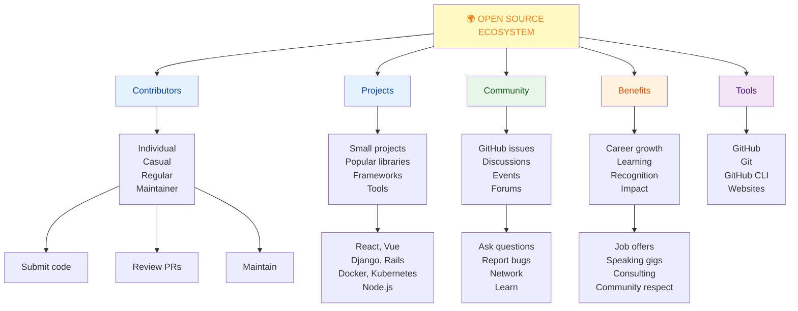

---

## 13. Open Source Resources & Directory

### Finding Open Source Projects

```yaml
Discovery Websites:

GitHub.com/explore
  - Trending repositories
  - By language & time period
  - Collections & topics

FirstTimersOnly.com
  - Curated for beginners
  - Issues welcome first-timers
  - Clear descriptions

GoodFirstIssue.dev
  - Aggregates good-first-issue
  - Filter by language
  - Shows difficulty level

CodeTriage.com
  - Needs help maintaining
  - Track your contributions
  - Get email suggestions

UpForGrabs.net
  - Explicitly looking for help
  - Clear contribution path
  - Active projects

FreeCodeCamp.org
  - Open source guides
  - How-to articles
  - Project recommendations

OpenSourceGuides.org
  - Starting project guide
  - Writing documentation
  - Building community
  - Leadership & governance
```

### Essential Open Source Projects to Study

```yaml
Great Learning Projects:

By Category:

Frontend:
  - React (JavaScript, learning)
  - Vue (JavaScript, approachable)
  - Next.js (Full-stack framework)

Backend:
  - Django (Python, well-documented)
  - Rails (Ruby, excellent docs)
  - Node.js (JavaScript runtime)

Tools:
  - VS Code (Electron, large but organized)
  - Docker (Go, infrastructure)
  - Kubernetes (Go, complex architecture)

Libraries:
  - lodash (JavaScript utilities)
  - numpy (Python data science)
  - express (Node.js framework)

Documentation:
  - MDN Web Docs (Mozilla)
  - Python Docs
  - Django Documentation

Why study:
  - See best practices
  - Learn code organization
  - Understand testing approaches
  - Study documentation
  - See active communities
```

### Key Licensing Information

```yaml
Quick License Guide:

MIT License:
  Permission: Commercial, modify, distribute
  Restriction: Must include license/copyright
  Use case: Most permissive
  Examples: React, Node.js, Rails

Apache 2.0:
  Permission: Commercial, modify, distribute
  Restriction: Include license, document changes
  Use case: Patent protection
  Examples: Android, Kubernetes

GPL v3:
  Permission: Modify, distribute
  Restriction: Derivative must be GPL
  Use case: Keep software free
  Examples: Linux, GIMP

BSD:
  Permission: Similar to MIT
  Restriction: Include license
  Use case: Academic/research
  Examples: Django, Flask

Check: choosealicense.com for detailed comparison
```

### Organizations & Foundations

```yaml
Major Open Source Organizations:

Linux Foundation:
  - Manages Linux kernel
  - Cloud Native Computing Foundation
  - Training & certification
  - Website: linuxfoundation.org

Apache Software Foundation:
  - 200+ projects (Kafka, Spark, Hadoop)
  - Legal structure, community
  - Website: apache.org

Mozilla Foundation:
  - Firefox, Thunderbird
  - Internet standards advocacy
  - Website: mozilla.org

Cloud Native Computing Foundation (CNCF):
  - Kubernetes, Docker, Prometheus
  - Modern infrastructure tools
  - Website: cncf.io

Python Software Foundation:
  - Python language
  - PyPI ecosystem
  - Website: python.org

JS Foundation (OpenJS Foundation):
  - Node.js, jQuery, webpack
  - JavaScript ecosystem
  - Website: openjsf.org
```

---

**Last Updated:** January 7, 2026  
**Difficulty Level:** Beginner to Advanced  
**Prerequisites:** Git knowledge, GitHub account, programming experience
