# Remote Tracking Branches: Understanding Your Remote Repository State Guide

## Overview

Remote tracking branches are read-only references to the state of branches on your remote repositories. They track what you last knew about remote branches and automatically update when you fetch or pull. They're the bridge between your local work and the shared remote repository.

### Why Remote Tracking Branches Matter

Remote tracking branches solve a critical problem: how do you know what exists on the remote without constantly connecting to it? They cache the remote repository's state locally, enabling you to work offline, reference remote changes, and coordinate with your team effectively. They're essential for understanding what's been pushed, what's waiting to be merged, and maintaining synchronization with collaborators.

**Key Benefits:**
- **Offline reference**: Know remote state without network connection
- **Merge base identification**: Find correct common ancestor for merging
- **Pull request readiness**: Understand upstream changes before merging
- **Conflict prevention**: Spot diverged branches before attempting merge
- **Team coordination**: Track what others have pushed
- **Branch comparison**: Easily compare local vs remote progress
- **Rebase foundation**: Rebase against remote tracking branches safely

### Main Use Cases

1. **Understanding remote state**: See what branches exist on remote and their current commits
2. **Preparing to pull**: Check if remote has changes before pulling
3. **Creating pull requests**: Base PRs on understanding of remote history
4. **Synchronizing with team**: Know when to fetch to stay current
5. **Branch cleanup**: Identify deleted remote branches
6. **Comparing branches**: `git log origin/main..main` to see unpushed commits
7. **Rebasing strategy**: Rebase local onto remote before pushing
8. **Tracking multiple remotes**: Coordinate with multiple repositories
9. **Feature branch management**: Track which features are on remote
10. **Merge strategy decisions**: Decide merge vs rebase based on remote state

---

## 1. Remote Tracking Branches: Core Concepts

### What Are Remote Tracking Branches?

Remote tracking branches are local references that represent the state of branches in your remote repositories. They're named `<remote>/<branch>` (e.g., `origin/main`, `upstream/develop`). You cannot directly commit to them—they update automatically when you fetch changes from the remote.

```
Local Repository
├── Local Branches
│   ├── main (local work)
│   ├── feature/auth
│   └── bugfix/nav
│
└── Remote Tracking Branches (read-only)
    ├── origin/main (what remote has)
    ├── origin/feature/auth
    ├── upstream/main
    └── upstream/develop
```

### Local vs Remote vs Remote-Tracking: Diagram

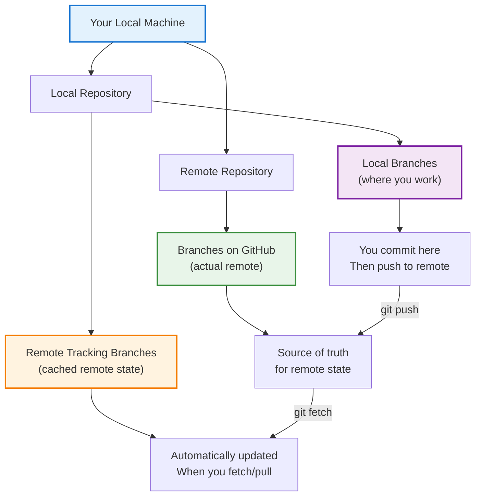

### Automatic Update Mechanism

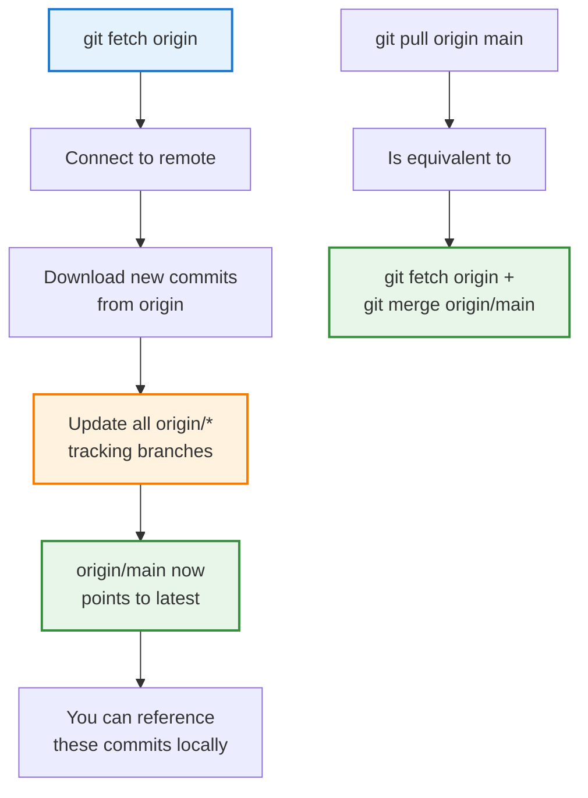

### Naming Convention

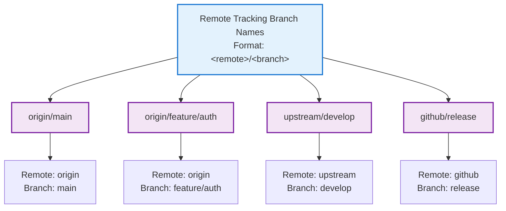

### Key Properties

| Property | Value | Example |
|----------|-------|---------|
| Format | `<remote>/<branch>` | `origin/main` |
| Writable | No (read-only) | Cannot commit directly |
| Updates | Automatically on fetch/pull | Updates when you `git fetch` |
| Visibility | `git branch -r` | Lists all remote tracking branches |
| Deletion | Can delete locally | `git branch -dr origin/branch` |
| Remote counterpart | Updates from remote | Points to actual remote branch |

---

## 2. Viewing Remote Tracking Branches

### List All Remote Tracking Branches

```bash
# List remote tracking branches only
git branch -r

# Output:
# origin/HEAD -> origin/main
# origin/main
# origin/feature/auth
# upstream/develop

# List all branches (local and remote)
git branch -a

# List with remote URLs
git branch -r -v

# Filter branches
git branch -r | grep "feature"
```

### Understand Current Branch Tracking

```bash
# See which remote branch your current branch tracks
git branch -vv

# Output shows tracking relationship:
# main                 a1b2c3d [origin/main: ahead 2] Commit message
# feature/auth         x9y8z7w [origin/feature/auth] Latest feature work

# Check tracking for specific branch
git rev-parse --abbrev-ref main@{u}  # Returns: origin/main
```

### View Remote Tracking Branch Details

```bash
# See what's in a remote tracking branch
git show origin/main

# Compare local vs remote tracking branch
git log main..origin/main  # Commits in origin/main not in local main

# See commits ahead/behind
git rev-list --left-right --count main...origin/main
# Output: 3    5  (local 3 ahead, remote 5 ahead)
```

### Visual Representation

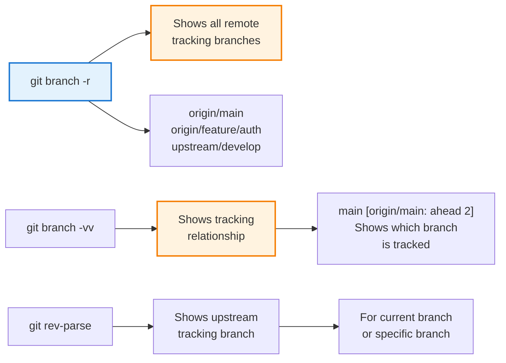

---

## 3. Creating and Setting Up Remote Tracking Branches

### Automatic Tracking on Clone

```bash
# When you clone a repo, Git automatically creates tracking branches
git clone https://github.com/user/repo.git

# This automatically creates:
# - Local: main (tracks origin/main)
# - Remote tracking: origin/main, origin/develop, etc.

# Verify tracking relationship
git branch -vv
# main [origin/main] Latest commit
```

### Manual Tracking Setup

```bash
# Create local branch tracking remote branch
git checkout --track origin/feature/new-feature
# Shorthand (Git auto-creates tracking):
git checkout feature/new-feature

# Create with custom local branch name
git checkout --track -b my-feature origin/feature/new-feature

# After creation, verify tracking
git branch -vv
```

### Set Upstream for Existing Branch

```bash
# Add tracking to existing local branch
git branch -u origin/main

# Or set upstream when pushing
git push -u origin feature/auth
# Sets local feature/auth to track origin/feature/auth

# Remove tracking relationship
git branch --unset-upstream
```

### Tracking Multiple Remotes

```bash
# Add second remote
git remote add upstream https://github.com/original/repo.git

# Fetch from upstream
git fetch upstream

# Creates remote tracking branches:
# - upstream/main
# - upstream/develop

# Create local branch tracking upstream
git checkout --track upstream/main -b upstream-main
```

### Setup Flow Diagram

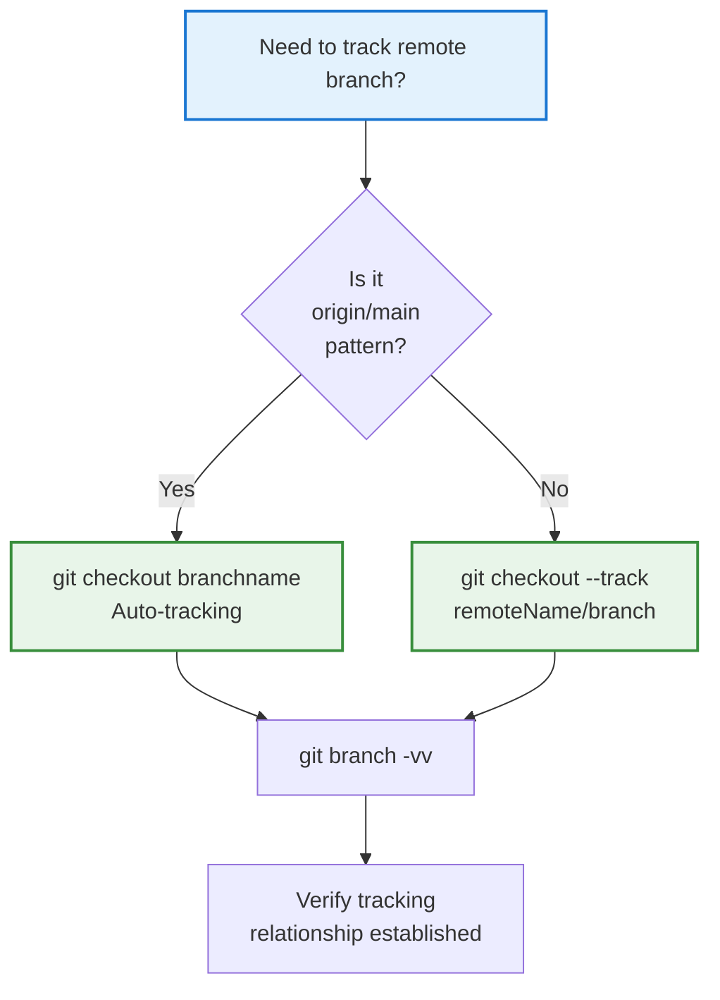

---

## 4. Fetching vs Pulling: Understanding the Difference

### Fetch: Update Without Merging

Fetch downloads changes from remote and updates remote tracking branches, but does NOT merge changes into your local branch.

```bash
# Fetch from origin
git fetch origin

# What happens:
# 1. Connects to origin
# 2. Downloads new commits
# 3. Updates origin/main, origin/feature/*, etc.
# 4. Your local branches unchanged
# 5. You can review changes before merging

# Fetch from all remotes
git fetch --all

# Fetch specific branch
git fetch origin main
```

### Pull: Fetch + Merge

Pull combines fetch and merge—it downloads changes AND integrates them into your local branch.

```bash
# Pull from tracked upstream
git pull

# Equivalent to:
# git fetch origin
# git merge origin/main

# Pull with rebase instead of merge
git pull --rebase

# Equivalent to:
# git fetch origin
# git rebase origin/main
```

### Comparison Diagram

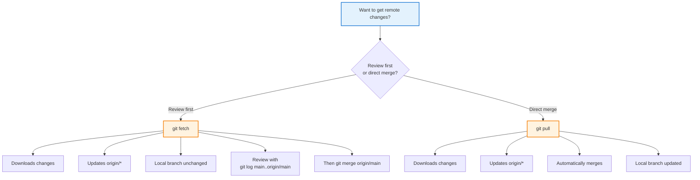

### Step-by-Step Execution

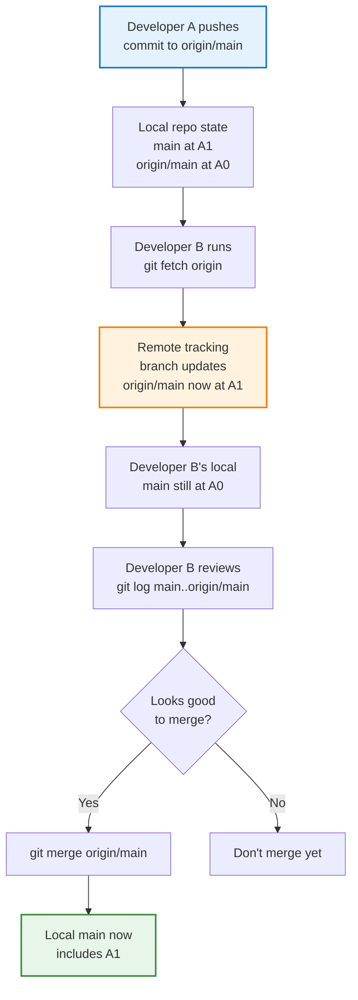

---

## 5. Tracking Relationships and Upstream Branches

### What Is an Upstream Branch?

An upstream branch (or tracking branch) is the remote tracking branch associated with your local branch. When you push or pull, Git uses this relationship to determine which remote branch to use.

```bash
# Check current branch's upstream
git branch -vv

# Output example:
# main          [origin/main: ahead 2, behind 1] Add feature
# feature/auth  [origin/feature/auth] Complete auth

# Set upstream for current branch
git branch -u origin/main

# Set upstream when creating branch
git checkout -b feature/new --track origin/feature/new

# Remove upstream relationship
git branch --unset-upstream
```

### Implicit vs Explicit Push/Pull

```bash
# Without tracking relationship
git push origin main  # Must specify remote and branch
git pull origin main  # Must specify remote and branch

# With tracking relationship set
git push              # Knows to push to origin/main
git pull              # Knows to pull from origin/main

# View default tracking
git branch -vv        # Shows upstream in brackets
```

### Default Tracking on Clone

```bash
# When cloning, Git automatically sets:
git clone https://github.com/user/repo.git

# Result:
# Local branch 'main' automatically tracks 'origin/main'
# Because remote's HEAD points to main

# For other branches, you must explicitly track:
git checkout develop  # Git creates local develop
# tracking origin/develop only if it exists on remote
```

### Multiple Tracking Scenarios

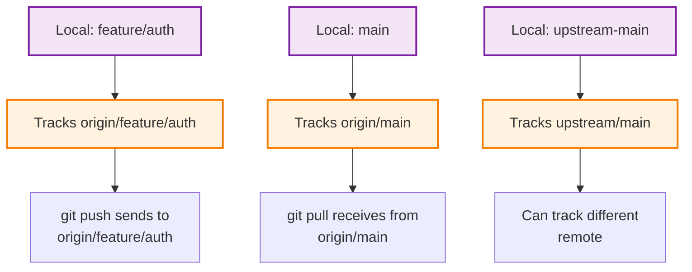

---

## 6. Working with Remote Tracking Branches: Practical Operations

### Comparing Local and Remote

```bash
# See commits in local but not in remote
git log origin/main..main

# See commits in remote but not in local
git log main..origin/main

# See commits in either but not both (symmetric difference)
git log main...origin/main

# Count commits ahead/behind
git rev-list --left-right --count main...origin/main
# Output: 3    5  (3 commits ahead, 5 commits behind)

# Show status concisely
git status
# On branch main
# Your branch is ahead of 'origin/main' by 2 commits
# Your branch is behind 'origin/main' by 1 commit
```

### Merging from Remote Tracking Branch

```bash
# Merge origin/main into local feature branch
git checkout feature/auth
git merge origin/main
# Brings all commits from origin/main into feature/auth

# Safe pattern: fetch first, then merge
git fetch origin
git merge origin/main

# Or in one step with tracking
git pull  # If feature/auth tracks origin/feature/auth
```

### Rebasing onto Remote Tracking Branch

```bash
# Rebase current branch on origin/main
git rebase origin/main

# Flow:
# 1. Finds common ancestor (merge base)
# 2. Takes your commits
# 3. Reapplies them on top of origin/main
# 4. Local branch now linear with remote

# Rebase with auto-stash (saves uncommitted work)
git rebase --autostash origin/main

# Interactive rebase against remote
git rebase -i origin/main
```

### Resetting to Remote State

```bash
# Reset your branch to match remote exactly
git reset --hard origin/main

# Use with caution: loses local commits!

# Safer: reset to remote and keep local changes
git reset --soft origin/main

# Soft reset: keeps changes staged
# Can then git commit to create new commits
```

### Operation Decision Tree

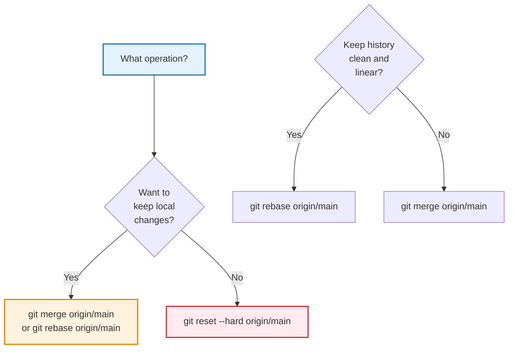

---

## 7. Deleting and Cleaning Up Remote Tracking Branches

### When Remote Branch is Deleted

When someone deletes a branch on the remote, your remote tracking branch still exists locally until you clean it up.

```bash
# See stale remote tracking branches
git branch -r

# Shows:
# origin/main
# origin/feature/auth (deleted on remote)
# origin/old-feature   (deleted on remote)

# Delete specific remote tracking branch
git branch -dr origin/feature/auth

# Clean up all stale remote tracking branches
git fetch --prune

# Or prune without fetching
git remote prune origin

# See what will be pruned first
git fetch --dry-run --prune
```

### Automatic Cleanup Configuration

```bash
# Configure Git to auto-prune on fetch
git config --global fetch.prune true

# Now every fetch automatically removes stale branches
git fetch origin
# Automatically cleans up deleted remote branches

# Configure per-repository
git config fetch.prune true

# View current setting
git config fetch.prune
```

### Cleanup Workflow

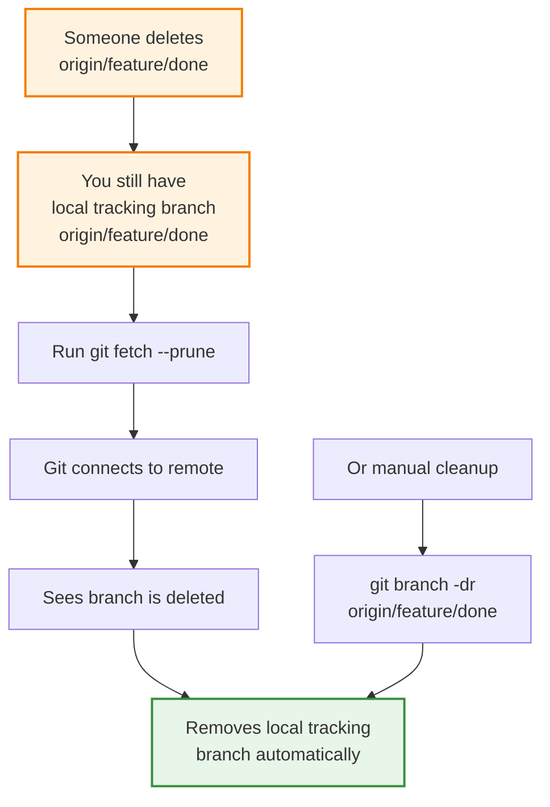

---

## 8. Remote Tracking in Team Workflows

### Feature Branch Workflow

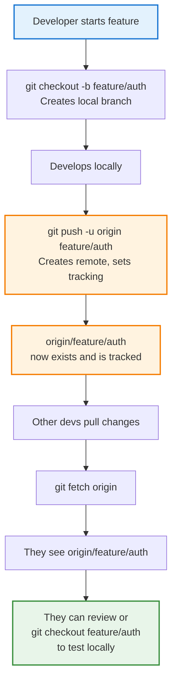

### Keeping Sync with Upstream

```bash
# In a fork, add upstream remote
git remote add upstream https://github.com/original/repo.git

# Fetch latest from upstream
git fetch upstream

# Creates remote tracking: upstream/main, upstream/develop

# Rebase your work on upstream
git rebase upstream/main

# Or merge if you prefer
git merge upstream/main

# Keep in sync regularly to avoid divergence
```

### Code Review with Remote Tracking

```bash
# Reviewer sees PR from contributor
# Contributor has pushed: origin/feature/new-endpoint

# Reviewer fetches and tests
git fetch origin
git checkout feature/new-endpoint
# Testing...

# If needs changes
git log origin/main..HEAD  # See contributor's commits
git diff origin/main      # See all changes

# After feedback integrated
git fetch origin  # Gets updated feature/new-endpoint
git log origin/main..  # Review final changes
```

---

## 9. Real-World Scenario 1: Syncing Fork with Original Repository

**Situation:** You forked a popular open-source project. The original has new commits. You need to sync your fork without losing your changes.

**Initial State:**
```
Your Fork (GitHub)
├── main (at commit A)
└── feature/improvement (at commit B2)

Original Repo (GitHub)
├── main (at commit A3)  ← Behind!
└── develop (at commit D1)
```

**Solution Steps:**

```bash
# 1. Add upstream remote
git remote add upstream https://github.com/original/opensource.git

# 2. Fetch from upstream
git fetch upstream
# Creates: upstream/main, upstream/develop, etc.

# 3. Check status
git branch -vv
# main       [origin/main] at A
# feature/improvement [origin/feature/improvement] at B2

# 4. Update main from upstream
git checkout main
git rebase upstream/main  # Or: git merge upstream/main
# main now at A3

# 5. Push updated main back to your fork
git push origin main

# 6. Rebase your feature on new main
git checkout feature/improvement
git rebase main
# Or resolve any conflicts if they exist

# 7. Push updated feature
git push origin feature/improvement --force-with-lease
```

**Outcome:**
```
After sync:
Your Fork (GitHub)
├── main (matches upstream/main at A3)
└── feature/improvement (rebased on updated main)

Your Local Repo
├── main [origin/main: even]
└── feature/improvement rebased successfully
```

---

## 10. Real-World Scenario 2: Coordinating Multiple Feature Branches

**Situation:** Team of 3 developers. Feature A depends on Feature B. You need to coordinate work while Feature B is still in review.

**Team Setup:**
```
Developer A: Working on feature/auth
Developer B: Working on feature/database-migration
Developer C: Working on feature/api-endpoints (depends on A and B)

Remote:
origin/main
origin/feature/auth (being reviewed)
origin/feature/database-migration (being reviewed)
```

**Coordination Process:**

```bash
# Developer C: Create feature branch based on others' work
git fetch origin
git checkout -b feature/api-endpoints

# Base on origin/feature/auth (not yet merged to main)
git rebase origin/feature/auth
# Brings in both main's history and A's new commits

# Add feature/database changes too
git merge origin/feature/database-migration

# Continue development
# Make commits to feature/api-endpoints

# Track development
git branch -vv
# feature/api-endpoints [origin/main: ahead 47 commits]
# Shows we have 47 commits ahead of main

# Monitor when dependencies merge
git fetch origin
git log origin/main..HEAD  # Still tracking against main

# When feature/auth merges to main
# Developer C can clean up and rebase
git fetch origin
git rebase origin/main  # Rebase on actual main now
```

**Result:**
- Feature C properly based on A and B's work
- Once A and B merge, C automatically includes their changes
- Merge conflict detection happens early
- Team coordination visualized through remote tracking

---

## 11. Real-World Scenario 3: Handling Diverged Branches

**Situation:** You've been working on a branch locally. Meanwhile, the same branch got updated on remote with different commits. Branches are now diverged.

**Initial State:**
```
Local main:          A1 - A2 - A3 - L1 - L2
                         /
origin/main:        A1 - A2 - R1 - R2 - R3
```

**Detection:**

```bash
# Check status
git status
# On branch main
# Your branch and 'origin/main' have diverged
# Your branch is ahead by 2 commits, behind by 3 commits

# View divergence
git log --oneline --graph --all
# Shows visual divergence

git log main...origin/main
# L1, L2 in main but not origin
# R1, R2, R3 in origin but not main
```

**Resolution Options:**

**Option 1: Rebase (Linear History)**
```bash
# Rebase your commits on top of remote
git rebase origin/main

# Result:
# A1 - A2 - R1 - R2 - R3 - L1 - L2

# Advantages: Clean linear history
# Disadvantages: Rewrites history (only safe if not pushed)
```

**Option 2: Merge (Preserve History)**
```bash
# Merge remote into local
git merge origin/main

# Result: Creates merge commit
# A1 - A2 - R1 - R2 - R3 - (merge)
#      \________________L1 - L2

# Advantages: Preserves all history
# Disadvantages: Non-linear history, merge commit
```

**Option 3: Force Reset (Discard Local)**
```bash
# Reset to remote state, discard local
git reset --hard origin/main

# Only if local commits are unimportant!
```

**Full Scenario Resolution:**

```bash
# Developer notices divergence
git fetch origin  # Update origin/main
git status        # See divergence

# Chooses rebase for cleaner history
git rebase origin/main

# If conflicts occur
# Edit files to resolve
git add resolved-file.js
git rebase --continue

# Check result
git log origin/main..  # Should be empty if fully rebased

# Force push (only if branch not shared!)
git push --force-with-lease origin main
```

---

## 12. Interview Prep & Practice Questions

### Question 1: What Are Remote Tracking Branches?

**Q:** Explain what remote tracking branches are and why they're important.

**A:** Remote tracking branches are local read-only references to the state of branches on your remote repositories. They follow the naming convention `<remote>/<branch>` (e.g., `origin/main`). They're important because:
- They represent what the remote repository looked like when you last fetched
- They enable you to work offline while still knowing remote state
- They provide a merge base for comparing local vs remote commits
- They automatically update when you fetch/pull

Example: `origin/main` represents the main branch's state on the origin remote as of your last fetch.

---

### Question 2: Fetch vs Pull

**Q:** Explain the difference between `git fetch` and `git pull`. When would you use each?

**A:** 
- **git fetch**: Downloads changes from remote and updates remote tracking branches, but doesn't merge. Use when you want to review changes before integrating.
- **git pull**: Fetches changes AND automatically merges them into your current branch. Use when you trust the changes and want direct integration.

**Example:**
```bash
# Fetch: Review first
git fetch origin
git log main..origin/main  # See what changed
git merge origin/main      # Then merge

# Pull: Direct integration
git pull  # Fetch + merge in one step
```

---

### Question 3: What Is Upstream/Tracking Branch?

**Q:** What's the relationship between a local branch and its upstream branch?

**A:** An upstream (or tracking) branch is the remote tracking branch that a local branch is configured to track. When you set an upstream:
- `git push` automatically pushes to that upstream
- `git pull` automatically pulls from that upstream
- `git status` shows ahead/behind counts
- `git branch -vv` displays the relationship

**Setup:**
```bash
git branch -u origin/main  # Set main's upstream to origin/main
git branch -vv             # See tracking: main [origin/main: ahead 2]
```

---

### Question 4: How Do You Handle Stale Remote Tracking Branches?

**Q:** Colleagues delete remote branches regularly. How do you clean up stale remote tracking branches on your machine?

**A:** When a remote branch is deleted, the local remote tracking branch persists. Clean it up with:

```bash
# Option 1: Prune on fetch
git fetch --prune

# Option 2: Standalone prune
git remote prune origin

# Option 3: Auto-prune on every fetch
git config --global fetch.prune true

# Manual deletion of specific branch
git branch -dr origin/branch-name
```

---

### Question 5: Diverged Branches

**Q:** Your local branch and its remote tracking branch have diverged (each has commits the other doesn't). How do you handle this?

**A:** You have three options:

1. **Rebase** (clean history, only if not yet pushed):
```bash
git rebase origin/main  # Reapply local commits on remote
```

2. **Merge** (preserves history):
```bash
git merge origin/main   # Create merge commit
```

3. **Reset** (discard local commits):
```bash
git reset --hard origin/main
```

Choice depends on whether you want to keep local commits and preferences for history shape.

---

### Question 6: Tracking Multiple Remotes

**Q:** You're working on a fork and need to keep in sync with the original repository. How would you set this up?

**A:**
```bash
# Add upstream remote
git remote add upstream https://github.com/original/repo.git

# Fetch from both
git fetch upstream   # Creates upstream/main, upstream/develop
git fetch origin     # Updates origin/main, origin/feature/*

# Sync your main with upstream
git checkout main
git rebase upstream/main

# Push back to your fork
git push origin main
```

This creates remote tracking branches for both `origin` and `upstream`, allowing you to track both repositories.

---

### Question 7: Comparing Branches

**Q:** How do you compare your local branch with its remote tracking branch to see what's different?

**A:**
```bash
# See commits in local but not remote
git log origin/main..main

# See commits in remote but not local
git log main..origin/main

# See all commits in either but not both
git log main...origin/main

# See file changes
git diff origin/main

# Summary count
git rev-list --left-right --count main...origin/main
# Output: 3    5  (3 ahead, 5 behind)
```

---

### Question 8: Safe Remote Tracking Operations

**Q:** What's a safe pattern for fetching, reviewing, and integrating remote changes?

**A:** Safe workflow:
```bash
# 1. Fetch without modifying local branches
git fetch origin

# 2. Review what changed
git log main..origin/main        # See commits
git diff main origin/main        # See file changes
git log --stat origin/main       # See changed files

# 3. Then safely merge
git merge origin/main
# Or rebase if you prefer

# Alternative with pull:
git pull --no-ff origin main     # Merge with commit message
# Or
git pull --rebase origin main    # Rebase instead
```

---

## 13. Troubleshooting Remote Tracking Branches

### Issue: Remote Tracking Branch Doesn't Exist After Fetch

**Problem:** You expected to see `origin/feature/new` after fetching, but it's not there.

**Causes & Solutions:**

```bash
# 1. Check if branch exists on remote
git branch -r | grep feature/new

# 2. Explicit fetch specific branch
git fetch origin feature/new

# 3. Fetch all remotes
git fetch --all

# 4. Check remote URL is correct
git remote -v
# If wrong, fix it:
git remote set-url origin https://correct-url.git

# 5. Verify network connectivity
git ls-remote origin  # Lists all remote branches
```

---

### Issue: Tracking Relationship Not Set

**Problem:** `git push` and `git pull` fail with errors about no upstream.

**Solution:**

```bash
# Set upstream manually
git branch -u origin/main

# Or push with upstream setting
git push -u origin feature/auth

# Verify it's set
git branch -vv

# Check with command
git rev-parse --abbrev-ref main@{u}
# Should return: origin/main
```

---

### Issue: Stale Remote Tracking Branches Clutter Output

**Problem:** `git branch -r` shows many deleted branches; confusing.

**Solution:**

```bash
# See which are stale
git branch -r -v | grep '\[gone\]'

# Clean up all stale branches
git fetch --prune

# Set auto-prune for future
git config --global fetch.prune true
```

---

### Issue: Can't Rebase Due to Divergence

**Problem:** Try to rebase but get "error: could not apply..."

**Solutions:**

```bash
# 1. Check actual divergence
git log main...origin/main

# 2. Try merge instead
git merge origin/main  # Safer if rebase fails

# 3. Reset to remote and reapply
git reset --soft origin/main  # Keep changes staged
git commit -m "Reapplied on updated base"

# 4. Interactive rebase to handle conflicts manually
git rebase -i origin/main
# Edit conflict sections manually
```

---

### Issue: Accidentally Pushed to Wrong Remote Branch

**Problem:** Pushed to `origin/main` instead of `origin/feature/auth`.

**Prevention & Recovery:**

```bash
# Prevention: Set correct upstream
git branch -u origin/feature/auth

# Recovery: Push correction
git push origin main --force-with-lease
# Revert the unwanted push

# Then push correct commits
git push origin feature/auth
```

---

### Troubleshooting Decision Tree

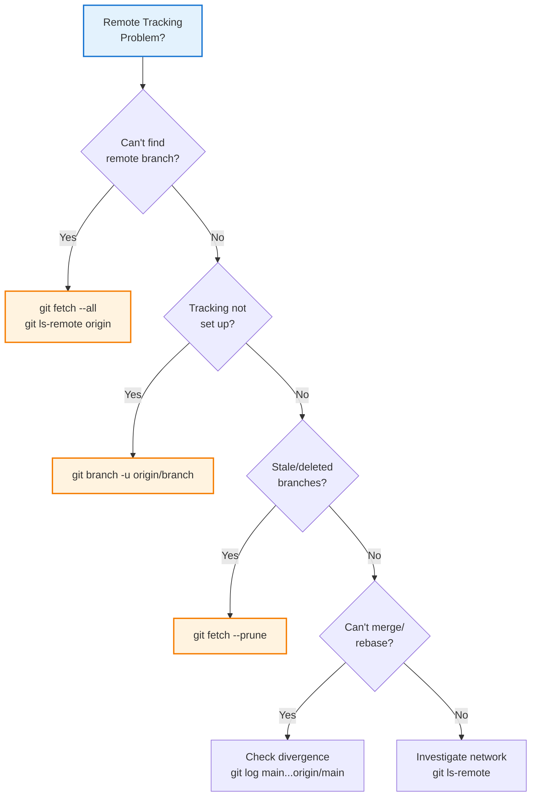

---

## 14. Quick Reference & Best Practices

### Essential Commands Cheatsheet

```bash
# View remote tracking branches
git branch -r                          # List all remote tracking
git branch -r -v                       # List with commit info
git branch -a                          # All branches (local + remote)

# View tracking relationship
git branch -vv                         # Show tracking details
git rev-parse --abbrev-ref main@{u}   # Get upstream of current

# Fetch (update remote tracking)
git fetch                              # Fetch from default remote
git fetch --all                        # Fetch from all remotes
git fetch --prune                      # Fetch and clean stale

# Set up tracking
git checkout --track origin/main       # Auto-tracking
git branch -u origin/main              # Set upstream current branch
git push -u origin feature/auth        # Push and set tracking

# Compare with remote
git log origin/main..main              # Local commits not in remote
git log main..origin/main              # Remote commits not in local
git diff origin/main                   # Diff against remote tracking

# Merge/rebase from remote tracking
git merge origin/main                  # Merge remote into local
git rebase origin/main                 # Rebase local on remote

# Clean up
git branch -dr origin/deleted          # Remove specific tracking branch
git remote prune origin                # Remove all stale tracking branches

# Multiple remotes
git remote add upstream <url>          # Add upstream remote
git fetch upstream                     # Fetch from upstream
```

### Best Practices

```mermaid
graph TB
    A["Remote Tracking<br/>Best Practices"] --> B["✅ Fetch before important ops"]
    A --> C["✅ Verify changes before merge"]
    A --> D["✅ Keep tracking updated"]
    A --> E["✅ Use descriptive branch names"]
    A --> F["✅ Coordinate with team"]
    
    G["❌ Anti-Patterns"] --> G1["Don't push without tracking setup"]
    G --> G2["Don't merge blindly without review"]
    G --> G3["Don't let stale branches pile up"]
    G --> G4["Don't force push to shared branches"]
    
    style B fill:#E8F5E9,stroke:#388E3C,stroke-width:2px
    style C fill:#E8F5E9,stroke:#388E3C,stroke-width:2px
    style D fill:#E8F5E9,stroke:#388E3C,stroke-width:2px
    style E fill:#E8F5E9,stroke:#388E3C,stroke-width:2px
    style F fill:#E8F5E9,stroke:#388E3C,stroke-width:2px
    style G1 fill:#FFEBEE,stroke:#D32F2F,stroke-width:2px
    style G2 fill:#FFEBEE,stroke:#D32F2F,stroke-width:2px
    style G3 fill:#FFEBEE,stroke:#D32F2F,stroke-width:2px
    style G4 fill:#FFEBEE,stroke:#D32F2F,stroke-width:2px
```

### Team Workflow Checklist

- [ ] Add upstream remote for forks: `git remote add upstream`
- [ ] Set tracking when creating branches: `git push -u origin`
- [ ] Fetch before important operations: `git fetch --all`
- [ ] Review changes before merging: `git log main..origin/main`
- [ ] Keep branches clean: `git fetch --prune`
- [ ] Configure auto-prune: `git config fetch.prune true`
- [ ] Communicate branch deletion with team
- [ ] Use descriptive branch names for clarity
- [ ] Check ahead/behind status before push: `git status`
- [ ] Test on remote tracking branch before final push

### Performance Tips

| Operation | Optimization |
|-----------|--------------|
| Large repos | Use shallow clone: `git clone --depth=1` |
| Frequent fetches | Enable `fetch.prune = true` |
| Multiple remotes | Fetch selectively: `git fetch origin` |
| Slow networks | Use `--single-branch` on clone |
| Local testing | Test against `origin/branch` first |

---

## 15. Additional Resources & References

### Official Documentation
- [Git Remote Documentation](https://git-scm.com/docs/git-remote)
- [Git Branch Tracking](https://git-scm.com/book/en/v2/Git-Branching-Remote-Branches)
- [Git Fetch Documentation](https://git-scm.com/docs/git-fetch)

### Related Guides
- Pull requests and remote branches
- Git workflow strategies
- Branching models
- Collaborative Git practices

### Common Workflows

**Fork-Based Workflow:**
- Clone fork, add upstream, keep in sync with upstream/main
- Feature branches track origin/feature/*, not upstream

**Feature Branch Workflow:**
- Create branches from main, track origin/feature/*
- Keep updated with git fetch --all

**Gitflow Workflow:**
- Track origin/develop and origin/main
- Feature branches from develop, release from main

---

## 16. Summary & Key Takeaways

### Core Concepts

Remote tracking branches are the synchronization layer between your local work and shared remote repositories. They enable you to:
- **Work offline** while knowing remote state
- **Coordinate with teammates** by tracking their changes
- **Make informed decisions** about merging and rebasing
- **Safely review** changes before integrating

### Key Skills

1. **View tracking**: `git branch -r -vv`
2. **Set up tracking**: `git branch -u origin/main` or `git push -u`
3. **Fetch updates**: `git fetch --all` or `git fetch --prune`
4. **Compare changes**: `git log main..origin/main`
5. **Integrate safely**: Fetch → review → merge/rebase

### Workflow Pattern

```
Fetch → Review → Merge/Rebase → Push → Repeat
```

**Best Practice:** Always fetch before push. Always review before merge. Always keep tracking relationships current.

---

*Last Updated: January 2026 | Comprehensive Remote Tracking Branches Guide*
