# Maintaining Repositories: Files, Templates & Folder Structure Guide

## Overview

A well-organized repository is the foundation of successful software projects. Understanding which files to include, how to structure directories, and what templates to use helps teams collaborate effectively, onboard new members, and maintain code quality. Repository organization reflects project maturity and professionalism.

### Why It Matters
- **Project organization** - Clear structure helps developers navigate
- **Onboarding** - New members understand project quickly
- **Documentation** - Guidance on setup, contribution, licensing
- **Code quality** - Standards and best practices enforced
- **Professional appearance** - Shows mature project management
- **Team collaboration** - Clear expectations and workflows
- **Dependency management** - Track and manage external libraries

### Main Use Cases
- Creating new repositories with proper structure
- Adding documentation for better collaboration
- Establishing coding standards and guidelines
- Setting up CI/CD and automation
- Managing dependencies and versions
- Implementing security best practices
- Facilitating open-source contributions

---

## 1. Core Concepts & Fundamentals

### Repository Structure Overview

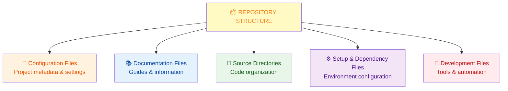

### Why Repository Structure Matters

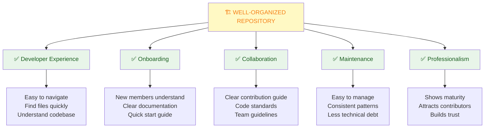

---

## 2. Essential Repository Files

### README - The First File Users See

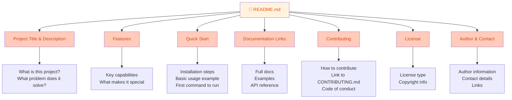

### README Template Example

```markdown
# Project Name

Brief description of what your project does.

## Features

- Feature 1
- Feature 2
- Feature 3

## Installation

```bash
npm install project-name
# or
pip install project-name
# or
git clone https://github.com/user/project.git
```

## Quick Start

```bash
# Basic usage example
const project = require('project-name');
project.doSomething();
```

## Documentation

- [Full Documentation](docs/README.md)
- [API Reference](docs/api.md)
- [Examples](examples/)

## Contributing

See [CONTRIBUTING.md](CONTRIBUTING.md) for guidelines.

## License

[MIT](LICENSE)

## Author

Your Name - [@twitter](https://twitter.com/yourhandle)
```

### Essential Files Checklist

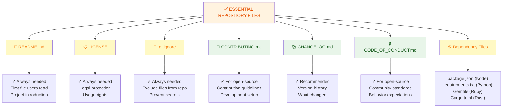

### Important Repository Files Explained

| File | Purpose | Example Location |
|------|---------|------------------|
| **README.md** | Project overview & quick start | Root directory |
| **LICENSE** | Legal usage terms | Root directory |
| **.gitignore** | Files to exclude from Git | Root directory |
| **CONTRIBUTING.md** | How to contribute | Root directory |
| **CHANGELOG.md** | Version history & changes | Root directory |
| **CODE_OF_CONDUCT.md** | Community standards | Root directory |
| **package.json** | Dependencies (Node.js) | Root directory |
| **requirements.txt** | Dependencies (Python) | Root directory |
| **.github/workflows/** | CI/CD automation | .github folder |
| **docs/README.md** | Detailed documentation | docs folder |
| **.editorconfig** | Editor settings | Root directory |
| **.env.example** | Environment variable template | Root directory |

---

## 3. Repository Templates

### GitHub Repository Templates

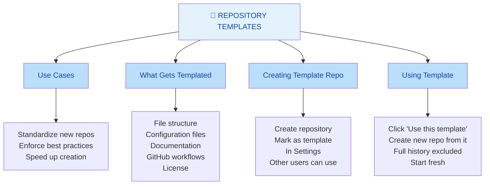

### Example: Python Project Template

```
my-python-template/
├── README.md
├── LICENSE
├── .gitignore
├── .editorconfig
├── CONTRIBUTING.md
├── CODE_OF_CONDUCT.md
├── CHANGELOG.md
├── requirements.txt
├── requirements-dev.txt
├── setup.py
├── pyproject.toml
├── tox.ini
├── .github/
│   ├── workflows/
│   │   ├── tests.yml
│   │   └── linting.yml
│   └── ISSUE_TEMPLATE/
│       ├── bug_report.md
│       └── feature_request.md
├── docs/
│   ├── README.md
│   ├── installation.md
│   ├── usage.md
│   └── api.md
├── src/
│   └── my_project/
│       ├── __init__.py
│       └── main.py
├── tests/
│   ├── __init__.py
│   └── test_main.py
└── .pre-commit-config.yaml
```

### Template Best Practices

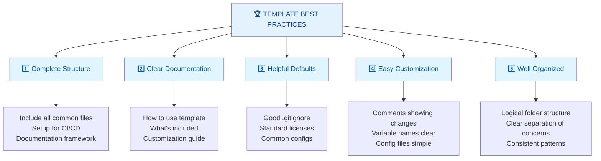

---

## 4. Important Folders & Their Significance

### Standard Directory Structure

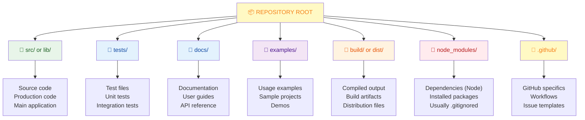

### Folder Deep Dive

#### src/ or lib/ - Source Code

```
src/
├── components/          (Reusable components)
│   ├── Button.js
│   ├── Modal.js
│   └── Header.js
├── pages/              (Page components)
│   ├── Home.js
│   ├── About.js
│   └── Contact.js
├── utils/              (Utility functions)
│   ├── helpers.js
│   └── validators.js
├── styles/             (Style files)
│   ├── global.css
│   └── variables.css
├── hooks/              (React hooks)
│   └── useAuth.js
├── services/           (API services)
│   └── api.js
├── constants/          (Constants)
│   └── config.js
└── index.js            (Entry point)
```

**Significance:**
- ✅ Contains production code
- ✅ Main application logic
- ✅ Should be organized by feature or type
- ✅ Clean, maintainable structure

#### tests/ - Test Files

```
tests/
├── unit/               (Unit tests)
│   ├── utils.test.js
│   └── helpers.test.js
├── integration/        (Integration tests)
│   ├── auth.test.js
│   └── api.test.js
├── e2e/               (End-to-end tests)
│   ├── user-flow.test.js
│   └── checkout.test.js
├── fixtures/          (Test data)
│   └── mock-data.js
└── setup.js           (Test configuration)
```

**Significance:**
- ✅ Ensures code quality
- ✅ Prevents regressions
- ✅ Documents expected behavior
- ✅ Builds confidence in changes

#### .github/ - GitHub Specific Files

```
.github/
├── workflows/              (CI/CD automation)
│   ├── tests.yml
│   ├── lint.yml
│   ├── deploy.yml
│   └── security.yml
├── ISSUE_TEMPLATE/         (Issue templates)
│   ├── bug_report.md
│   ├── feature_request.md
│   └── question.md
├── PULL_REQUEST_TEMPLATE.md (PR template)
└── dependabot.yml          (Dependency updates)
```

**Significance:**
- ✅ Automates testing & deployment
- ✅ Standardizes issues & PRs
- ✅ Manages dependencies
- ✅ Enforces quality standards

#### docs/ - Documentation

```
docs/
├── README.md                   (Documentation index)
├── getting-started.md          (Setup guide)
├── installation.md             (Installation instructions)
├── usage.md                    (How to use)
├── api/                        (API documentation)
│   ├── endpoints.md
│   └── authentication.md
├── guides/                     (How-to guides)
│   ├── create-plugin.md
│   └── extend-functionality.md
├── troubleshooting.md          (Common issues)
├── faq.md                      (Frequently asked questions)
└── screenshots/                (Visual documentation)
    ├── feature-1.png
    └── feature-2.png
```

**Significance:**
- ✅ User & developer guidance
- ✅ Reduces support questions
- ✅ Improves adoption
- ✅ Professional presentation

#### node_modules/ - Dependencies (Node.js)

```
node_modules/
├── express/
├── react/
├── lodash/
├── axios/
└── ... (hundreds of packages)

.gitignore includes:
node_modules/
```

**Significance:**
- ✅ Contains external libraries
- ✅ Should NOT be committed to Git
- ✅ Listed in package.json
- ✅ Installed with `npm install`

#### build/ or dist/ - Build Artifacts

```
dist/
├── js/
│   ├── bundle.js
│   └── bundle.min.js
├── css/
│   ├── styles.css
│   └── styles.min.css
├── html/
│   └── index.html
└── assets/
    ├── images/
    └── fonts/

.gitignore includes:
build/
dist/
```

**Significance:**
- ✅ Compiled/bundled output
- ✅ Generated by build tools
- ✅ Should NOT be committed
- ✅ Rebuilt on deployment

#### examples/ - Example Code

```
examples/
├── basic-usage.js
├── advanced-features.js
├── with-authentication.js
├── custom-config.js
└── integration-example.js
```

**Significance:**
- ✅ Shows how to use library
- ✅ Real-world use cases
- ✅ Learning resource
- ✅ Helps onboarding

---

## 5. Critical Configuration Files

### .gitignore - What NOT to Commit

```mermaid
graph TB
    A[".gitignore File"]
    
    A --> B["Dependencies"]
    B --> B1["node_modules/"]
    B --> B2["venv/ (Python)"]
    B --> B3["vendor/ (PHP)"]
    
    A --> C["Build Outputs"]
    C --> C1["dist/"]
    C --> C2["build/"]
    C --> C3["*.o, *.a"]
    
    A --> D["Environment Files"]
    D --> D1[".env (secrets)"]
    D --> D2["config.local.js"]
    D --> D3["*.pem (keys)"]
    
    A --> E["IDE/Editor Files"]
    E --> E1[".vscode/"]
    E --> E2[".idea/"]
    E --> E3["*.swp"]
    
    A --> F["System Files"]
    F --> F1[".DS_Store (macOS)"]
    F --> F2["Thumbs.db (Windows)"]
    
    A --> G["Logs & Temp"]
    G --> G1["*.log"]
    G --> G2["/tmp/"]
    G --> G3["*.tmp"]
    
    style A fill:#fff3e0,color:#e65100
    style B fill:#ffccbc,color:#d84315
    style C fill:#ffccbc,color:#d84315
    style D fill:#ffebee,color:#b71c1c
    style E fill:#ffccbc,color:#d84315
    style F fill:#ffccbc,color:#d84315
    style G fill:#ffccbc,color:#d84315
```

### .gitignore Template Example

```bash
# Dependencies
node_modules/
npm-debug.log
yarn-error.log
package-lock.json
yarn.lock

# Build outputs
dist/
build/
*.o
*.a
*.so
*.dylib

# Environment variables (NEVER COMMIT SECRETS!)
.env
.env.local
.env.*.local
.env.secret

# IDE/Editor
.vscode/
.idea/
*.swp
*.swo
*.sublime-project
*.sublime-workspace

# OS Files
.DS_Store
Thumbs.db
.DS_Store?

# Logs
logs/
*.log
npm-debug.log*
yarn-debug.log*
yarn-error.log*

# Temporary files
/tmp/
*.tmp
*.temp
```

### .editorconfig - Consistent Formatting

```ini
# EditorConfig helps maintain consistent coding styles across different IDEs

root = true

# All files
[*]
indent_style = space
indent_size = 2
end_of_line = lf
charset = utf-8
trim_trailing_whitespace = true
insert_final_newline = true

# Python files
[*.py]
indent_size = 4

# Markdown files
[*.md]
trim_trailing_whitespace = false
```

**Significance:**
- ✅ Consistent code formatting
- ✅ Works across all IDEs
- ✅ Reduces git diffs
- ✅ Better collaboration

### .env.example - Environment Template

```bash
# .env.example (committed to repo - NO SECRETS!)
# Copy this file to .env and fill in real values

DATABASE_URL=postgresql://localhost:5432/myapp
API_SECRET=your-secret-key-here
STRIPE_API_KEY=sk_test_xxx
JWT_SECRET=your-jwt-secret
DEBUG=false
NODE_ENV=development
MAIL_SERVER=smtp.example.com
MAIL_PORT=587
```

**Significance:**
- ✅ Shows what variables needed
- ✅ Helps new developers setup
- ✅ No secrets exposed
- ✅ Safe to commit

---

## 6. Documentation Files

### CONTRIBUTING.md - How to Contribute

```markdown
# Contributing to Project Name

Thank you for wanting to contribute!

## Getting Started

1. Fork the repository
2. Clone your fork: `git clone https://github.com/yourname/project.git`
3. Create a branch: `git checkout -b feature/your-feature`
4. Install dependencies: `npm install`

## Development Setup

```bash
npm install
npm run dev
npm test
```

## Making Changes

1. Make your changes
2. Write or update tests
3. Run `npm test` to ensure tests pass
4. Commit with clear message: `git commit -am "Add feature: ..."`
5. Push to your fork: `git push origin feature/your-feature`

## Submitting Pull Request

1. Go to GitHub and create a PR
2. Fill in the PR template
3. Link any related issues
4. Wait for review
5. Address feedback

## Code Style

- Use 2-space indentation
- Follow ESLint rules
- Add JSDoc comments
- Keep functions small and focused

## Running Tests

```bash
npm test           # Run all tests
npm run test:watch # Watch mode
npm run coverage   # Coverage report
```

## Code of Conduct

Please read [CODE_OF_CONDUCT.md](CODE_OF_CONDUCT.md)
```

### CHANGELOG.md - Version History

```markdown
# Changelog

All notable changes to this project will be documented in this file.

## [2.1.0] - 2026-01-07

### Added
- Dark mode theme support
- User profile customization
- API rate limiting

### Fixed
- Login validation bug with special characters
- Memory leak in background worker

### Changed
- Updated authentication library to v3.0
- Improved performance by 20%

## [2.0.0] - 2025-12-01

### Added
- New dashboard
- Real-time notifications

### Breaking Changes
- Removed deprecated API endpoints
- Changed config file format

## [1.0.0] - 2025-06-15

### Added
- Initial release
- Core features
```

---

## 7. Quick Cheatsheet

### New Repository Checklist

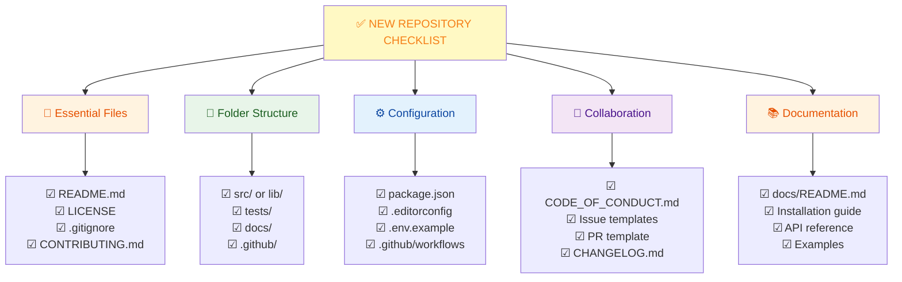

### File Organization by Language

#### JavaScript/Node.js

```
my-app/
├── README.md
├── package.json
├── .gitignore
├── .editorconfig
├── src/
│   ├── index.js
│   ├── components/
│   ├── services/
│   └── utils/
├── tests/
├── docs/
└── .github/
```

#### Python

```
my-project/
├── README.md
├── requirements.txt
├── setup.py
├── .gitignore
├── .editorconfig
├── src/
│   └── my_project/
│       ├── __init__.py
│       └── main.py
├── tests/
├── docs/
└── .github/
```

#### React

```
my-react-app/
├── README.md
├── package.json
├── .gitignore
├── public/
├── src/
│   ├── components/
│   ├── pages/
│   ├── hooks/
│   ├── styles/
│   └── App.js
├── tests/
├── docs/
└── .github/
```

---

## 8. Real-World Scenarios

### Scenario 1: Starting Open-Source Project

**Goal:** Create professional open-source repository

**Steps:**

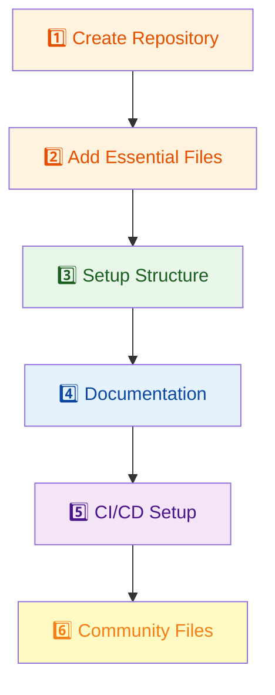

**File List:**
```
project/
├── README.md               (Professional intro)
├── LICENSE                 (MIT/Apache/GPL)
├── .gitignore              (Standard template)
├── CONTRIBUTING.md         (Contribution guide)
├── CODE_OF_CONDUCT.md      (Community standards)
├── CHANGELOG.md            (Version history)
├── package.json            (Dependencies)
├── .editorconfig           (Code style)
├── .github/
│   ├── workflows/
│   │   ├── tests.yml       (Run tests)
│   │   ├── lint.yml        (Code quality)
│   │   └── publish.yml     (Auto-publish)
│   └── ISSUE_TEMPLATE/
│       ├── bug_report.md
│       └── feature_request.md
├── src/
│   └── index.js            (Main code)
├── tests/
│   └── *.test.js           (Test suite)
├── docs/
│   ├── README.md
│   ├── installation.md
│   ├── usage.md
│   └── api.md
└── examples/
    └── basic.js            (Usage example)
```

---

### Scenario 2: Enterprise Project Structure

**Goal:** Well-organized team project with standards

**File Structure:**

```
enterprise-app/
├── README.md
├── CONTRIBUTING.md
├── LICENSE
├── .gitignore
├── .editorconfig
├── .prettierrc
├── .eslintrc
├── package.json
├── tsconfig.json
├── jest.config.js
├── src/
│   ├── app/
│   ├── components/
│   ├── pages/
│   ├── hooks/
│   ├── services/
│   ├── utils/
│   ├── types/
│   ├── styles/
│   └── index.tsx
├── tests/
│   ├── unit/
│   ├── integration/
│   └── e2e/
├── public/
│   ├── index.html
│   └── assets/
├── docs/
│   ├── README.md
│   ├── architecture.md
│   ├── coding-standards.md
│   ├── deployment.md
│   └── api/
├── scripts/
│   ├── setup.sh
│   ├── deploy.sh
│   └── migrate.sh
├── .github/
│   ├── workflows/
│   │   ├── ci.yml
│   │   ├── security.yml
│   │   ├── performance.yml
│   │   └── deploy.yml
│   └── ISSUE_TEMPLATE/
├── config/
│   ├── development.js
│   ├── production.js
│   └── staging.js
├── .env.example
├── docker-compose.yml
├── Dockerfile
├── build/              (.gitignored)
└── node_modules/       (.gitignored)
```

---

### Scenario 3: Adding Proper Documentation

**Current State:** Minimal documentation

**Improvement Plan:**

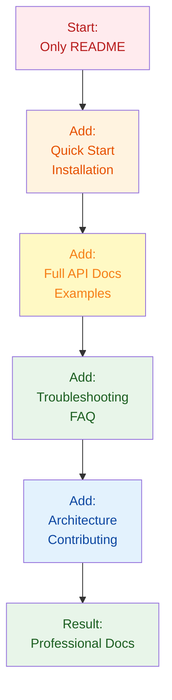

**New docs/ Structure:**

```
docs/
├── README.md                (Doc index)
├── QUICK_START.md           (First steps)
├── INSTALLATION.md          (Detailed setup)
├── USAGE.md                 (How to use)
├── API.md                   (API reference)
├── EXAMPLES.md              (Real examples)
├── ARCHITECTURE.md          (System design)
├── DEPLOYMENT.md            (Production setup)
├── TROUBLESHOOTING.md       (Common issues)
├── FAQ.md                   (Q&A)
├── CONTRIBUTING.md          (Development)
└── screenshots/             (Visual guides)
```

---

## 9. Best Practices

### Repository Organization Best Practices

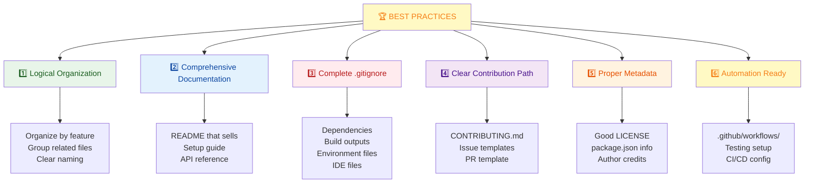

### What NOT to Include

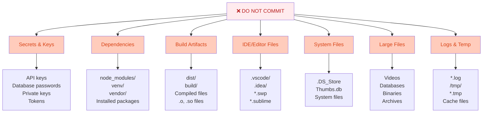

---

## 10. Summary & Key Takeaways

### What You Should Know

✅ **README.md** - Most important file, first thing users see  
✅ **LICENSE** - Legal requirement for all projects  
✅ **.gitignore** - Critical to keep secrets and build artifacts out  
✅ **docs/** - Comprehensive documentation helps adoption  
✅ **.github/** - Automate testing and workflows  
✅ **src/** - Well-organized source code  
✅ **tests/** - Quality assurance and confidence  
✅ **Folder structure** - Reflects project maturity  

### Essential Files Quick Reference

| File | Must Have | Purpose |
|------|-----------|---------|
| README.md | ✅ | Project overview |
| LICENSE | ✅ | Legal terms |
| .gitignore | ✅ | Exclude files |
| CONTRIBUTING.md | ⚠️ | Contribution guide |
| .github/workflows | ⚠️ | CI/CD automation |
| docs/README.md | ⚠️ | Full documentation |
| package.json | ✅ | Dependencies |
| .editorconfig | ⚠️ | Code style |

---

## 11. Interview & Exam Prep

### Common Interview Questions

**Q1: What files are essential in every repository?**
> README.md (project overview), LICENSE (legal terms), and .gitignore (what not to commit) are absolutely essential. Additionally, package.json or equivalent dependency file is needed. For quality projects, add CONTRIBUTING.md for contribution guidelines.

**Q2: What should .gitignore contain?**
> Dependencies (node_modules, venv), build outputs (dist, build), environment files (.env), IDE files (.vscode, .idea), system files (.DS_Store), logs, and large binaries. The rule is: don't commit anything that's generated, contains secrets, or is user-specific.

**Q3: Why is documentation important in a repository?**
> Documentation reduces onboarding time, answers common questions, prevents support load, attracts contributors, and shows project maturity. A README with quick start means users can understand and use the project immediately. Comprehensive docs enable self-service.

**Q4: What are repository templates and why use them?**
> Templates standardize new repositories with best practices pre-configured. They ensure consistency across projects, enforce standards, speed up project creation, and reduce setup mistakes. GitHub's template feature lets you mark a repo as template and create new repos from it.

**Q5: Should you commit node_modules?**
> No, never commit node_modules. It's huge (thousands of files), not needed (listed in package.json), and causes conflicts. Anyone running `npm install` gets their own copy. Use .gitignore to exclude it and only commit package.json and package-lock.json.

**Q6: What does .editorconfig do?**
> It enforces consistent code formatting (indentation, line endings, charset) across different IDEs and editors. Developers using VS Code, JetBrains, or other editors automatically apply the same formatting rules, reducing diffs and conflicts caused by formatting differences.

**Q7: Why is .env.example needed?**
> .env.example shows which environment variables are needed without exposing secrets. New developers copy it to .env, fill in real values, and have proper setup. It's safe to commit since it contains no secrets, unlike .env which is in .gitignore.

**Q8: How should you organize source code in src/ folder?**
> Organize by feature or responsibility: components/, services/, utils/, hooks/, pages/, styles/, etc. Keep related code together. Use meaningful folder names. Avoid deeply nested structures. Follow your project's conventions consistently.

### Practice Scenarios

**Scenario A:** New developer asks "Where do I put this new feature?"
- Answer: Show them the src/ folder structure. Explain the organization pattern. Point to similar features.

**Scenario B:** Someone committed a database password to the repository.
- Answer: Rotate the password immediately. Use git filter-branch or BFG to remove from history. Add to .gitignore. Use .env for secrets.

**Scenario C:** Project is disorganized with files everywhere.
- Answer: Create proper folder structure. Move files accordingly. Update README. Document the structure for future developers.

---

## 12. Troubleshooting Common Issues

### Issue: Sensitive File Accidentally Committed

**Problem:** .env file or database credentials in git history

**Solution:**
```bash
# 1. Rotate all exposed credentials immediately

# 2. Remove from git history (careful operation)
git filter-branch --tree-filter 'rm -f .env' HEAD

# OR use BFG (simpler):
bfg --delete-files .env

# 3. Force push (requires care)
git push origin main --force-with-lease

# 4. Add to .gitignore
echo ".env" >> .gitignore
git add .gitignore
git commit -m "Add .env to gitignore"

# 5. Inform team/users of exposure
```

### Issue: .gitignore Not Working

**Problem:** Files that should be ignored still appear in git

**Cause:** File was already tracked before .gitignore added

**Solution:**
```bash
# 1. Remove from git (not local)
git rm --cached node_modules/
git rm --cached .env

# 2. Update .gitignore with entries

# 3. Commit changes
git add .gitignore
git commit -m "Fix: properly ignore files"

# 4. Verify
git status  # Should not show ignored files
```

### Issue: Repository Too Large

**Problem:** Clone takes forever, operations slow

**Cause:** Large build artifacts or binaries committed

**Solution:**
```bash
# 1. Identify large files
git rev-list --all --objects | sort -k2 | tail -20

# 2. Remove large files from history
git filter-branch --tree-filter 'rm -f build/ dist/' HEAD

# 3. Add to .gitignore
echo "build/" >> .gitignore
echo "dist/" >> .gitignore

# 4. Garbage collection
git gc --aggressive

# 5. Force push
git push origin main --force-with-lease
```

### Issue: Inconsistent Code Formatting

**Problem:** PR has different indentation than codebase

**Solution:**
```bash
# 1. Add .editorconfig
# (Configure for your language)

# 2. Add prettier or linter
npm install --save-dev prettier eslint

# 3. Configure in package.json
# Add format script

# 4. Run formatter
npm run format

# 5. Consider pre-commit hooks
npm install --save-dev husky lint-staged
```

---

## 13. Visual Summary

### Complete Repository Setup Flow

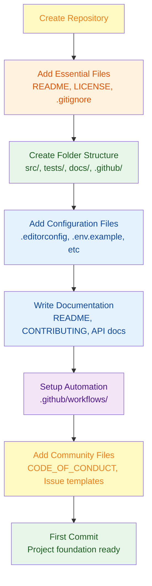

---

**Last Updated:** January 7, 2026  
**Difficulty Level:** Beginner to Intermediate  
**Prerequisites:** GitHub account, Git basics, repository familiarity
